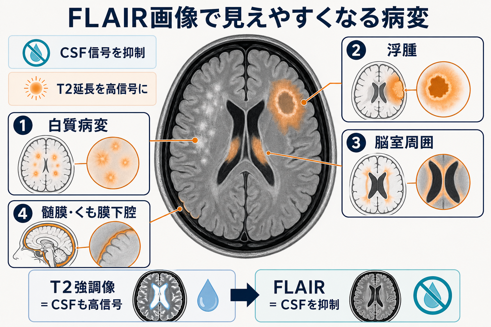
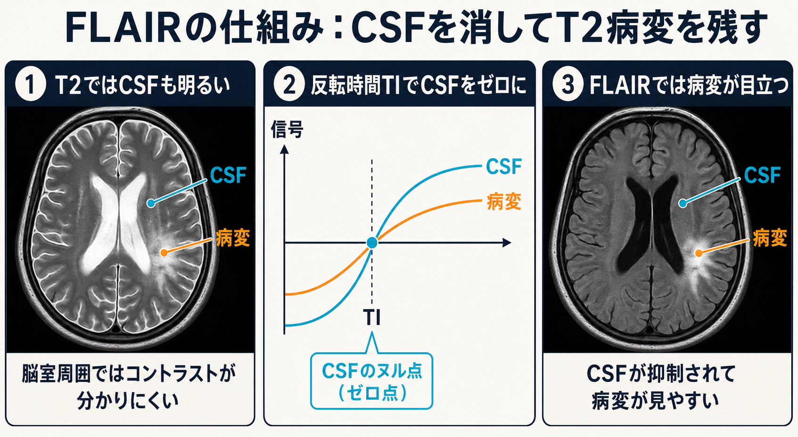

# FLAIR画像はどのような病変検出に役立つのか

## 要点

- FLAIRは *fluid-attenuated inversion recovery* の略で、反転回復法により脳脊髄液（CSF）の信号を抑制した、強いT2強調に近いMRI画像である[1]。
- CSFが暗くなるため、脳室周囲、皮質近傍、脳溝近くなど「水の明るさ」に埋もれやすい病変が見えやすくなる[2]。
- とくに白質病変、多発性硬化症の病変、脳室周囲病変、梗塞・炎症・腫瘍周囲のT2/FLAIR高信号、くも膜下腔や髄膜の異常信号の検出に役立つ[2][3][4][7]。
- ただし、FLAIR高信号は「病名」ではなく、水分増加、脱髄、浮腫、グリオーシス、炎症、血液成分、造影剤漏出など複数の機序を反映しうる[5][8]。

## この記事で答える問い

FLAIR画像は、単に「T2画像の一種」ではない。この記事では、なぜCSFを抑制すると病変が見やすくなるのか、どの部位・病変で有用性が高いのか、そしてFLAIR高信号を読むときにどこで誤解が生じやすいのかを整理する。

## まず結論

FLAIR画像が最も得意にするのは、**CSFに接する場所のT2延長病変を、CSFの明るさから切り離して見ること**である。通常のT2強調像ではCSFも病変も高信号になりやすいため、脳室周囲や脳溝近くの病変は背景の水信号に紛れやすい。FLAIRではCSFを暗くすることで、白質病変、脳室周囲病変、皮質近傍病変、浮腫、髄膜・くも膜下腔の異常信号が相対的に目立つ[1][2]。

## 背景

MRIでは、組織のT1緩和、T2緩和、プロトン密度、拡散、磁化率、造影効果などを組み合わせて画像コントラストを作る。T2強調像は水分の多い病変を明るく示す点で有用だが、CSFも強く高信号になる。そのため、脳室周囲の小病変や脳表近くの病変では、病変とCSFの境界が読みにくくなる。

FLAIRはこの問題に対する実用的な解である。強いT2強調を保ちつつCSF信号を抑制するため、従来のT2強調像で見えにくかった皮質下・脳室周囲病変の検出感度を高めると説明されてきた[2]。現在では、脳MRIの標準的な撮像プロトコルに広く組み込まれている[1]。

## 基本概念

FLAIRの「fluid-attenuated」は、水様成分、特にCSFの信号を弱めるという意味である。画像の見え方としては、灰白質と白質の関係はT2強調像に近いが、CSFは暗くなる[1]。このため、脳室、脳溝、基底槽などの液体腔に隣接する異常高信号を拾いやすい。

白質病変は、T2強調像やFLAIRで高信号として表現されることが多い。白質は[[髄鞘はなぜ神経伝導を速くするのか|髄鞘]]化された軸索束を多く含み、虚血、脱髄、炎症、加齢性小血管病変などで水分量や組織構造が変わると、T2/FLAIR高信号として見える[3]。ただし、FLAIR高信号だけで原因を一意に決めることはできない。

## 仕組み

FLAIRは反転回復系列である。まず180度反転パルスで縦磁化を反転させ、一定時間（TI: inversion time）待つ。CSFの縦磁化がゼロ付近を通過するタイミングで読み出しを行うと、CSF由来の信号が抑制される[1]。その上で長いTR・TEを用いることで、T2延長を示す病変は高信号として残りやすい。

直感的には、FLAIRは「水を全部消す」画像ではない。自由水に近いCSFを抑制し、組織内でT2延長を起こしている病変を残す画像である。このため、脳室内や脳溝のCSFは暗くなる一方で、白質病変、浮腫、炎症、梗塞周囲の変化などは高信号として残る。

## 図解

FLAIRの読影上の要点は、次の対応で考えると理解しやすい。

| 観察したいもの | FLAIRで見やすくなる理由 | 注意点 |
|---|---|---|
| 脳室周囲白質病変 | 脳室内CSFが暗くなり、周囲白質の高信号が浮き上がる | 加齢性変化、小血管病、脱髄など鑑別が広い |
| 皮質近傍・脳溝近くの病変 | 脳溝内CSFの高信号が抑えられる | CSF流、酸素投与、アーチファクトでも高信号が出ることがある |
| 浮腫・腫瘍周囲変化 | T2延長を伴う組織変化が高信号になる | FLAIR高信号は浮腫だけでなく浸潤やグリオーシスも含みうる[5] |
| 髄膜・くも膜下腔の異常 | CSF背景が暗くなり、異常な高信号や造影効果が目立つ | 急性くも膜下出血では万能ではなく、CTや他系列と統合する[4] |

## 臨床・研究との接続

### 白質病変と脳室周囲病変

FLAIRは、白質病変の評価で特に重要である。NCBI Bookshelfの白質病変レビューでは、白質高信号はT2強調像とFLAIRでよく見え、FLAIRはCSF信号を消すことで脳室縁近くの白質病変評価に重要だと説明されている[3]。

多発性硬化症では、病変の空間的・時間的多発性を評価するためにMRIが中心的役割を持つ。2021年のMAGNIMS-CMSC-NAIMS合意では、3D-FLAIRが脳MRIの中核シーケンスとして重視され、診断精度や新規病変検出に有用とされている[7]。この文脈では、FLAIRは単に病変を見つけるだけでなく、疾患活動性のモニタリングにも関わる。

### 浮腫・腫瘍周囲変化

脳腫瘍や炎症性病変では、病変周囲のT2/FLAIR高信号が浮腫、腫瘍浸潤、治療後変化、グリオーシスなどを反映することがある。たとえば髄膜腫の系統的レビューでは、T2/FLAIR高信号で定義される腫瘍周囲変化が、必ずしも可逆的な浮腫だけではなく、長期に残る変化を含みうることが指摘されている[5]。したがって、FLAIRは病変範囲の把握に役立つが、組織学的意味づけには造影T1、拡散強調像、灌流画像、臨床経過などの統合が必要である。

### 髄膜・くも膜下腔病変

FLAIRは、くも膜下腔や髄膜病変の評価にも使われる。急性くも膜下出血では、正常CSFに比べて高信号の血液成分がFLAIRで見えやすいことが早期研究で示された[4]。一方、別の研究では、くも膜下出血検出においてFLAIRは有用だが、T2*系など他系列より常に優れるわけではないと報告されている[6]。したがって、救急診療ではCT、腰椎穿刺、T2*またはSWIなどと組み合わせて判断する。

造影後FLAIRは、[[血液脳関門はなぜ必要なのか|血液脳関門]]または血液CSF関門の破綻に伴う造影剤漏出を、CSF高信号として捉える場合がある。系統的レビューでは、造影後T2-FLAIRにおけるCSF enhancementが、BBB/血液CSF関門障害の神経画像マーカーとして議論されている[8]。髄膜炎や癌性髄膜症などでは、造影T1強調像だけでなく造影FLAIRが補助的情報を与えることがある。

## よくある誤解

### 「FLAIR高信号 = 浮腫」ではない

FLAIR高信号は、T2延長やCSF抑制後に残る相対的高信号を示す画像所見であり、病理名ではない。浮腫、脱髄、虚血性変化、炎症、腫瘍浸潤、グリオーシス、出血成分、造影剤漏出などが重なりうる[3][5][8]。

### 「FLAIRはT2より常に優れている」わけではない

FLAIRはCSF近傍病変に強いが、後頭蓋窩や脳幹ではアーチファクト、撮像条件、病変の種類によって他系列が重要になる。くも膜下出血でも、FLAIRは有用だが、T2*やSWI、CT、臨床経過と組み合わせる必要がある[6]。

### 「CSFが暗くないFLAIRは必ず異常」ではない

FLAIRでCSFが高信号に見える背景には、出血、蛋白増加、感染、造影剤漏出だけでなく、酸素投与、拍動・流れ、磁場不均一、撮像アーチファクトなども関与しうる。異常所見かどうかは、分布、左右差、他系列、撮像条件、臨床状況から判断する。

## 関連ノート

- [[髄鞘はなぜ神経伝導を速くするのか]]
- [[血液脳関門はなぜ必要なのか]]
- [[脳内ネットワークとは何か]]

### 関連ノート候補

- MRI画像の基本系列：T1強調像・T2強調像・FLAIR・拡散強調像
- 脳脊髄液とは何か
- 白質病変は何を反映するのか
- 多発性硬化症のMRI所見
- くも膜下出血の画像診断
- 造影MRIと血液脳関門

### MOC更新候補

- `content/00_MOC/`配下の脳画像・神経計測関連MOCに本記事を追加する。
- 並列ジョブとの競合を避けるため、この作業ではMOCファイル本体は更新しない。

## 理解チェック

1. 通常のT2強調像で、脳室周囲病変が見えにくくなる理由は何か。
2. FLAIRでCSF信号を抑制しても、白質病変や浮腫が高信号として残るのはなぜか。
3. FLAIR高信号を「浮腫」と即断してはいけない理由を、少なくとも2つ挙げよ。
4. くも膜下腔のFLAIR高信号を見たとき、どのような正常変異・アーチファクト・他系列確認を考えるべきか。

## 参考文献

[1] Radiopaedia. Fluid attenuated inversion recovery. https://radiopaedia.org/articles/fluid-attenuated-inversion-recovery

[2] Kates R, Atkinson D, Brant-Zawadzki M. Fluid-attenuated inversion recovery (FLAIR): clinical prospectus of current and future applications. *Top Magn Reson Imaging*. 1996;8(6):389-396. https://pubmed.ncbi.nlm.nih.gov/9402679/

[3] Sharma R, Sekhon S, Lui F, Cascella M. White Matter Lesions. *StatPearls*. Updated 2024. https://www.ncbi.nlm.nih.gov/sites/books/NBK562167/

[4] Noguchi K, Ogawa T, Inugami A, et al. Acute subarachnoid hemorrhage: MR imaging with fluid-attenuated inversion recovery pulse sequences. *Radiology*. 1995;196(3):773-777. https://doi.org/10.1148/radiology.196.3.7644642

[5] Laajava J, Korja M. Peritumoral T2/FLAIR hyperintense MRI findings of meningiomas are not necessarily edema and may persist permanently: a systematic review. *Neurosurg Rev*. 2023;46:193. https://doi.org/10.1007/s10143-023-02094-1

[6] Mitchell P, Wilkinson ID, Hoggard N, et al. Detection of subarachnoid haemorrhage with magnetic resonance imaging. *J Neurol Neurosurg Psychiatry*. 2001;70(2):205-211. https://doi.org/10.1136/jnnp.70.2.205

[7] Wattjes MP, Ciccarelli O, Reich DS, et al. 2021 MAGNIMS-CMSC-NAIMS consensus recommendations on the use of MRI in patients with multiple sclerosis. *Lancet Neurol*. 2021;20(8):653-670. https://doi.org/10.1016/S1474-4422(21)00095-8

[8] Freeze WM, van der Thiel M, de Bresser J, et al. CSF enhancement on post-contrast fluid-attenuated inversion recovery images; a systematic review. *NeuroImage: Clinical*. 2020;28:102456. https://doi.org/10.1016/j.nicl.2020.102456

## 未解決問題

- FLAIR高信号を、浮腫、脱髄、グリオーシス、腫瘍浸潤にどこまで定量的に分解できるか。
- 3D-FLAIR、DIR、FLAIR*、SWI、拡散・灌流画像を組み合わせたとき、白質病変の病因推定はどこまで改善するか。
- 造影後FLAIRのCSF enhancementを、BBB/血液CSF関門障害の臨床バイオマーカーとして標準化できるか。
