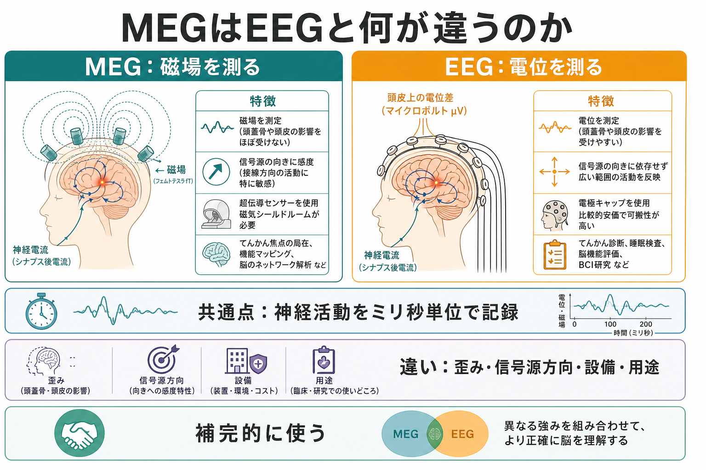
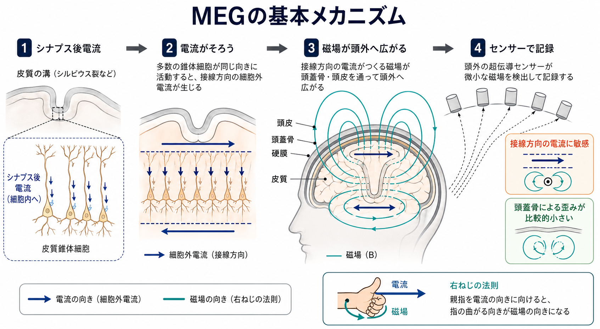
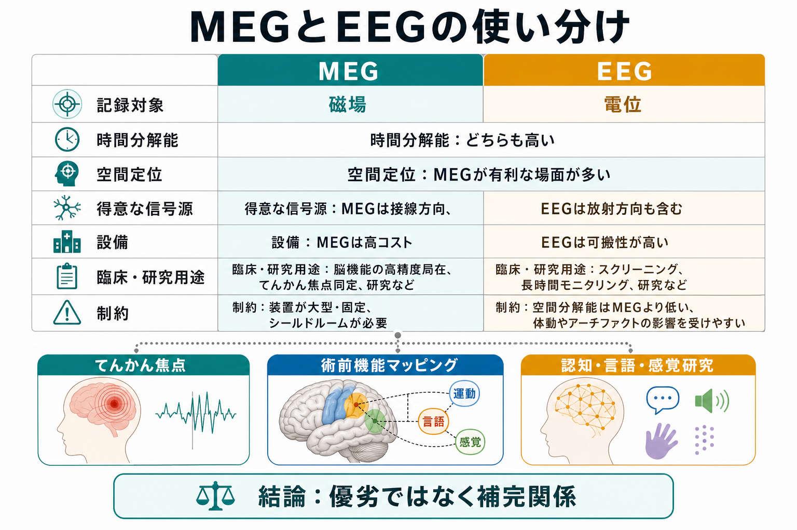

# MEGはEEGと何が違うのか

## 要点

- MEG（magnetoencephalography, 脳磁図）は、神経活動に伴う微弱な**磁場**を頭外で測る。EEG（electroencephalography, 脳波）は、頭皮上の**電位差**を測る。
- どちらも神経活動そのものに近い電磁気的信号をミリ秒単位で記録できるため、[[構造MRIは脳の何を測っているのか]]のような形態画像や、血流・代謝を介する機能画像とは時間スケールが異なる[1][2]。
- MEGは頭蓋骨・頭皮の電気伝導率の影響を比較的受けにくく、条件がよければ信号源推定で有利になりやすい。一方で、放射方向の電流には鈍く、装置が高価で大型という制約がある[3][6][7]。
- EEGは安価で可搬性が高く、臨床・研究で広く使える。MEGとEEGは優劣ではなく、異なる見え方を持つ補完的な方法として考えるのがよい[3][5]。

## この記事で答える問い

1. MEGは何を測っていて、EEGと何が同じなのか。
2. MEGが「空間定位に強い」と言われる理由は何か。
3. MEGが万能ではないのはどこか。
4. 臨床や研究では、MEGとEEGをどう使い分けるのか。

## まず結論

MEGとEEGは、同じ神経活動を別の物理量として見ている。皮質錐体細胞のシナプス後電流が十分にそろうと、頭皮上には電位分布が、頭外には磁場分布が現れる。EEGはその電位分布を電極で測り、MEGは磁場分布を高感度センサーで測る[1][4]。

違いの核心は、**頭部組織をどう通ってくるか**と、**どの向きの電流に敏感か**である。EEGの電位は頭蓋骨・頭皮・脳脊髄液などの導電性に強く影響される。MEGの磁場はそれらの影響を比較的受けにくいが、主に脳溝内の接線方向の電流に敏感で、脳回頂部に多い放射方向の電流には弱い[3][6]。

## 背景

脳活動の計測には、構造をみるMRI、白質線維の方向性を推定する[[拡散強調画像DWIは何を反映しているのか]]、時間変化をみる電気生理計測などがある。MEGとEEGは、このうち電気生理計測に属し、神経集団の活動がいつ起きたかを非常に細かく追える。

MEGの古典的総説では、MEGは10 fTから1 pT程度の非常に弱い磁場を測る非侵襲的手法として整理されている[1]。そのため、実験室内の電源、金属、車両、エレベーター、筋活動などのノイズに対して弱く、磁気シールドルームやノイズ除去処理が必要になる[3]。

## 基本概念

### MEGが測るもの

MEGが直接測るのは「脳の画像」ではなく、頭外に現れる磁場である。神経活動のうち、皮質錐体細胞の樹状突起に生じるシナプス後電流が空間的にそろうと、電流双極子として近似できる信号源ができる。この電流が磁場を生み、頭外のセンサー配列で検出される[1][2]。

### EEGが測るもの

EEGが測るのは頭皮上の電位差である。EEGも神経活動をミリ秒単位で測れるが、電位は脳、脳脊髄液、頭蓋骨、頭皮を通るときに広がり、頭部モデルや参照電極の扱いが解釈に関わる。近年の高密度EEGと信号源推定では、EEGも単なる波形記録ではなく、時空間的な脳機能イメージングとして扱える[5]。

### 共通点

MEGとEEGはいずれも、個々のニューロンの発火そのものではなく、多数の神経細胞の同期したシナプス後活動を主に反映する。fMRIのような血流応答を介する方法に比べ、時間分解能は高いが、観測信号から脳内信号源を推定するには逆問題を解く必要がある[2][4]。

## 仕組み

MEGの信号は、皮質表面に並ぶ錐体細胞の電流が同じ向きにそろったときに強くなる。脳溝の壁に沿う接線方向の電流は、頭外へ届く磁場を作りやすい。一方、脳回の頂部から頭皮方向へ向かう放射方向の電流は、理想化された球状頭部モデルでは頭外磁場をほとんど作らない[1][6]。

この性質はMEGの長所にも制約にもなる。長所として、頭蓋骨の導電率をどれだけ正確にモデル化できるかに左右されにくい。制約として、MEGだけでは見えにくい信号源方向がある。Ahlforsらのシミュレーションでは、MEGは多くの皮質位置で特定の向きに対する感度が極端に低く、EEGより信号源方向への依存が大きいことが示されている[6]。

## 図解

| 観点 | MEG | EEG |
|---|---|---|
| 記録対象 | 頭外磁場 | 頭皮電位 |
| 時間分解能 | 高い。ミリ秒単位 | 高い。ミリ秒単位 |
| 空間定位 | 頭部導電率の影響が比較的小さく、有利な場面が多い | 高密度記録と適切な頭部モデルで改善するが、導電率モデルに敏感 |
| 得意な信号源 | 主に接線方向の皮質電流 | 放射方向も含む幅広い電流方向 |
| 実施環境 | 磁気シールド、専用装置、固定環境が必要 | 比較的低コスト、可搬性が高い |
| 臨床応用 | てんかん焦点推定、術前機能マッピングなど | てんかん診断、睡眠、意識障害、長時間モニタリングなど |
| 主な制約 | 高コスト、深部・放射方向信号に弱い、動きに弱い | 体積伝導、参照、筋電・眼電などのアーチファクト |

## 臨床・研究との接続

臨床MEGで確立している用途は限られており、主にてんかん外科の焦点推定と、脳外科前の感覚・運動・言語などの機能マッピングである。IFCNの臨床MEGガイドラインは、MEGとEEGを密接に関連する補完的手法として位置づけ、可能な場合は併せて解釈することを推奨している[3]。ACMEGSのガイドラインも、術前機能マッピングにおける磁気誘発反応の記録・解析の最低基準を示している[8]。

研究では、MEGは神経振動、感覚誘発反応、認知課題中の時系列変化、機能的結合、脳ネットワークのダイナミクスを調べるために使われる[2]。ただし、MEG信号の局在推定は「どこが活動したか」を直接読む作業ではない。センサー空間の磁場分布から、頭部モデル、信号源モデル、ノイズモデル、事前仮定を使って脳内活動を推定する。

## よくある誤解

### 誤解1: MEGはEEGの上位互換である

MEGはEEGより優れている、という単純な理解は正確ではない。MEGは頭蓋骨による歪みを受けにくい一方、放射方向の電流や深部信号には弱い。EEGは空間定位で不利な場面があるが、装置の可搬性、長時間記録、臨床普及度では大きな利点がある[3][5][6]。

### 誤解2: MEGなら活動部位がそのまま見える

MEGで見えるのは頭外磁場であって、脳内活動そのものではない。活動部位を推定するには逆問題を解く必要があり、推定結果は頭部モデル、センサー配置、ノイズ除去、信号源モデルに依存する[4]。人骨ファントムを用いた研究では、条件下でMEGの平均局在誤差がEEGより小さい結果が示されたが、これはモデル誤差や実験条件に依存する知見として読む必要がある[7]。

### 誤解3: MEGは深部脳活動も同じ精度で測れる

MEGは皮質表面、特に比較的浅い皮質信号に強い。海馬、視床、脳幹などの深部構造の活動は、信号が弱く、信号源推定の不確実性も大きくなりやすい。深部活動を議論するときは、MRI、fMRI、PET、頭蓋内EEGなど別手法との整合性が重要になる。

## 関連ノート

既存ノート:

- [[構造MRIは脳の何を測っているのか]]
- [[T1強調画像とT2強調画像は何が違うのか]]
- [[拡散強調画像DWIは何を反映しているのか]]
- [[FLAIR画像はどのような病変検出に役立つのか]]
- [[トラクトグラフィーとは何か]]

今後の作成候補:

- 脳波EEGは何を測っているのか
- てんかん焦点推定とは何か
- 神経振動とは何か
- 信号源推定とは何か
- fMRIと電気生理計測は何が違うのか

MOC更新候補:

- content/00_MOC 配下の脳画像・神経計測または脳・神経科学系MOCに、本記事へのリンクを追加する。

## 理解チェック

1. MEGとEEGは、それぞれどの物理量を測るか。
2. MEGが頭蓋骨の影響を比較的受けにくいと言われるのはなぜか。
3. MEGが苦手にしやすい信号源方向はどれか。
4. MEGとEEGを補完的に使うべき理由を、臨床応用の例とともに説明できるか。

## 参考文献

[1] Hämäläinen, M., Hari, R., Ilmoniemi, R. J., Knuutila, J., & Lounasmaa, O. V. (1993). Magnetoencephalography: theory, instrumentation, and applications to noninvasive studies of the working human brain. *Reviews of Modern Physics, 65*(2), 413-497. https://doi.org/10.1103/RevModPhys.65.413

[2] Baillet, S. (2017). Magnetoencephalography for brain electrophysiology and imaging. *Nature Neuroscience, 20*, 327-339. https://doi.org/10.1038/nn.4504

[3] Hari, R., Baillet, S., Barnes, G., Burgess, R., Forss, N., Gross, J., Hämäläinen, M., Jensen, O., Kakigi, R., Mauguière, F., Nakasato, N., Puce, A., Romani, G. L., Schnitzler, A., & Taulu, S. (2018). IFCN-endorsed practical guidelines for clinical magnetoencephalography (MEG). *Clinical Neurophysiology, 129*(8), 1720-1747. https://doi.org/10.1016/j.clinph.2018.03.042

[4] Baillet, S., Mosher, J. C., & Leahy, R. M. (2001). Electromagnetic brain mapping. *IEEE Signal Processing Magazine, 18*(6), 14-30. https://doi.org/10.1109/79.962275

[5] Michel, C. M., & Murray, M. M. (2012). Towards the utilization of EEG as a brain imaging tool. *NeuroImage, 61*(2), 371-385. https://doi.org/10.1016/j.neuroimage.2011.12.039

[6] Ahlfors, S. P., Han, J., Belliveau, J. W., & Hämäläinen, M. S. (2010). Sensitivity of MEG and EEG to source orientation. *Brain Topography, 23*(3), 227-232. https://doi.org/10.1007/s10548-010-0154-x

[7] Leahy, R. M., Mosher, J. C., Spencer, M. E., Huang, M. X., & Lewine, J. D. (1998). A study of dipole localization accuracy for MEG and EEG using a human skull phantom. *Electroencephalography and Clinical Neurophysiology, 107*(2), 159-173. https://doi.org/10.1016/S0013-4694(98)00057-1

[8] Burgess, R. C., Funke, M. E., Bowyer, S. M., Lewine, J. D., Kirsch, H. E., & Bagić, A. I. (2011). American Clinical Magnetoencephalography Society Clinical Practice Guideline 2: presurgical functional brain mapping using magnetic evoked fields. *Journal of Clinical Neurophysiology, 28*(4), 355-361. https://doi.org/10.1097/WNP.0b013e3182272ffe

## 未解決問題

- MEGの深部信号推定をどこまで信頼できるかは、課題、センサー、頭部モデル、解析法によって変わる。
- 光ポンピング磁力計など新しいMEGセンサー技術が、従来のSQUID型MEGの制約をどこまで変えるかは発展途上である。
- 臨床現場でMEGをどの患者群にどの程度使うべきかは、費用、アクセス、既存検査との増分価値を含めて検討が続いている。
