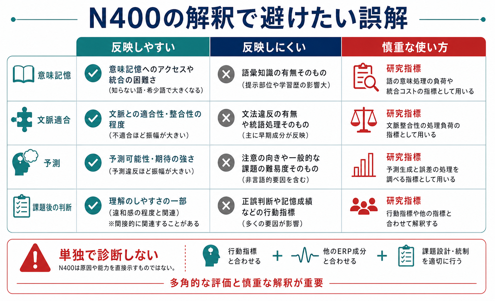
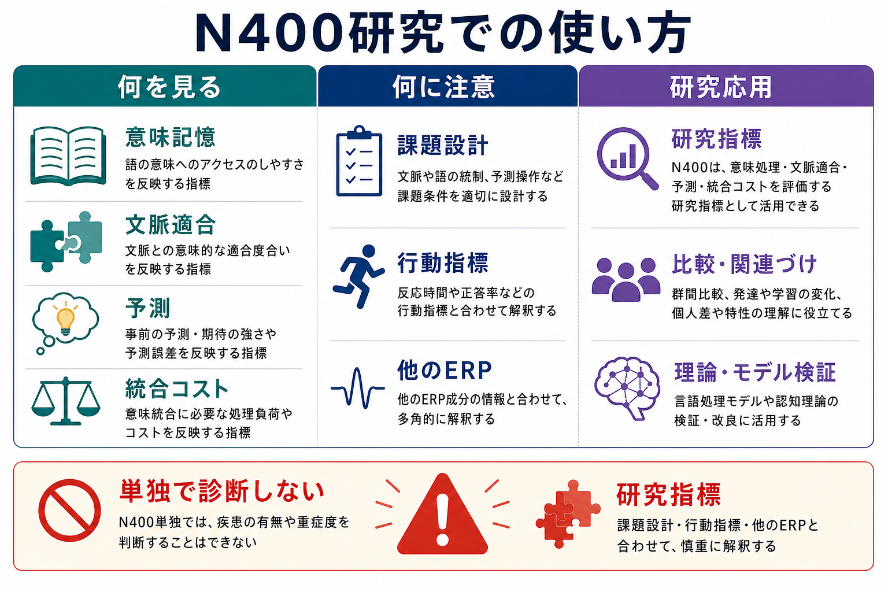

# N400とは何を反映しているのか

## 要点

- N400は、単語、絵、音、顔、行為などの刺激が、先行文脈や意味記憶とどれくらい合うかに敏感な事象関連電位（ERP）成分である[1][3]。
- 典型的には刺激提示後およそ300-500 msに現れる陰性電位で、意味的に予測しにくい語、文脈に合わない語、意味記憶から取り出しにくい語で振幅が大きくなりやすい[2][3]。
- ただし、N400を「意味エラー検出器」や「文の意味統合だけの指標」と見るのは狭すぎる。現在は、意味記憶へのアクセス、文脈による促進、予測、統合コストが重なる指標として慎重に読まれる[3][4][7]。
- 臨床・精神医学研究でも使われるが、N400単独で疾患や能力を診断するものではない。課題設計、行動指標、他のERP成分、症状評価と合わせて解釈する必要がある[8]。

## この記事で答える問い

1. N400は、何を測っていると考えればよいのか。
2. N400は「意味の統合」「意味記憶へのアクセス」「予測」のどれを反映するのか。
3. 言語理解研究や臨床研究で、N400をどう使えば過剰解釈を避けられるのか。

## まず結論

N400は、「入力された刺激の意味が、直前の文脈と意味記憶の中でどれくらい扱いやすいか」を反映するERP成分として理解するのがよい。たとえば「彼女はパンにバターを塗った」の最後の語は文脈に合うため、N400は相対的に小さくなりやすい。一方、「彼女はパンに靴下を塗った」のように意味的に合いにくい語では、N400が大きくなりやすい[1][2]。

ただし、ここでいう「扱いやすさ」は一つの処理だけではない。意味記憶から語の意味を取り出しやすいこと、先行文脈が候補語をどれだけ準備していたか、入力語を現在の解釈へ組み込めるか、課題が何を要求しているかが混ざる。したがって、N400は「意味処理の入口に近い神経指標」ではあるが、「意味理解が完了したかどうか」や「診断名」を直接読むメーターではない。

## 背景

N400は、KutasとHillyardが意味的に不自然な文末語に対して報告した陰性成分として知られる[1]。その後、文末語の予測可能性や意味的連想がN400振幅を変えることが示され、言語理解の時間経過をミリ秒単位で調べる代表的な指標になった[2]。

ERPは、頭皮上の電位変化を多数試行で平均し、刺激提示から何ms後にどのような波形変化が生じるかを見る方法である。時間分解能が高いため、[[fMRIは神経活動を直接測っているのか|fMRI]]や[[構造MRIは脳の何を測っているのか|構造MRI]]とは違い、意味処理がいつ起こるかを追いやすい。一方で、頭皮電位から発生源を一意に決めることは難しく、波形だけから特定の脳部位や単一処理を断定することはできない。

## 基本概念

### N400の典型的な特徴

N400は、刺激提示後およそ300-500 msに現れる陰性方向のERP成分である。名称の「400」は、ピークが400 ms前後に出やすいことに由来する。ただし、実際の潜時や分布は、刺激様式、課題、被験者、解析法によって変わる。

振幅は、次のような要因で変化しやすい。

| 要因 | N400が大きくなりやすい条件 | 解釈 |
|---|---|---|
| 文脈適合性 | 文脈に合わない語 | 現在の解釈へ入れにくい |
| 予測可能性 | cloze確率が低い語 | 文脈から準備されにくい |
| 意味的連想 | 先行語と連想が弱い語 | 意味記憶の活性化が弱い |
| 語彙特性 | 低頻度語、未知語、疑似語 | 語の意味へアクセスしにくい |
| 刺激様式 | 絵、音、顔、行為などの不一致 | 言語以外の意味処理にも関わる |

KutasとFedermeierの総説は、N400が書き言葉・話し言葉・手話・疑似語だけでなく、絵、写真、動画、音、数学記号などにも誘発されることを整理している[3]。この点から、N400は「言語専用」ではなく、より広い意味処理の神経指標と考えられる。

### ERP成分としての読み方

ERP成分は、特定の処理だけを純粋に切り出したものではない。N400も、文脈、刺激の物理特性、注意、課題要求、語彙頻度、反応準備などの影響を受ける。したがって、実験では統制条件を作り、「条件Aと条件Bの差分」としてN400効果を見る。

これは[[神経同期とは何か|神経同期]]や[[ガンマ振動は認知機能にどう関わるのか|ガンマ振動]]の解釈と似ている。ある信号が認知機能と関係するからといって、その信号だけで機能全体や個人の状態を読めるわけではない。

## 仕組み

### 1. 意味記憶へのアクセス

一つの有力な見方は、N400が意味記憶から語や概念の意味を取り出す容易さを反映するというものである[4][7]。たとえば「医者 - 看護師」のように意味的に近い語が続くと、後続語の意味表象が事前に活性化され、N400が小さくなりやすい。

この見方では、N400は「後から文に統合する苦労」だけではなく、語の意味へたどり着く段階の処理負荷を反映する。低頻度語や予期しにくい語でN400が大きくなりやすいこととも整合的である。

### 2. 文脈への統合

古典的には、N400は入力語を先行文脈へ意味的に統合する難しさを反映すると考えられてきた[1][2]。文脈に合わない語は、現在作っている文や状況モデルに入れにくいため、N400が大きくなる。

ただし、統合だけで説明すると、単語間の意味的連想、語彙頻度、非言語刺激でのN400を説明しにくい場合がある。Lauらは、N400の発生源や意味ネットワークの知見を踏まえ、統合説と語彙・意味アクセス説のどちらか一方に単純化しない必要を論じている[4]。

### 3. 予測と事前活性化

文脈が強い場合、脳は次に来そうな語を確率的に予測している可能性がある。DeLongらは、文脈から予測される名詞だけでなく、その前の英語冠詞にもERP効果が出ることを報告し、単語の事前活性化を支持する証拠として議論した[5]。

一方で、この冠詞効果は大規模な直接追試では明確には再現されず、名詞に対する予測可能性効果は再現されたが、読者が常に語の音韻形まで強く事前活性化しているとは言いにくいことが示された[6]。このため、N400を「予測誤差そのもの」と呼ぶより、文脈が意味処理をどれだけ準備・促進したかを含む指標として扱う方が慎重である。

### 4. 検索と統合を分けるモデル

BrouwerらのRetrieval-Integration（RI）アカウントでは、N400は意味記憶からの検索、P600はその意味を進行中の解釈へ統合する過程により近いと整理される[7]。この見方は、意味的に変だが構文的にはよくできた文で、N400ではなくP600が強く出るような「意味的錯覚」現象を説明するために提案された。

重要なのは、N400とP600を固定的なラベルにしないことである。N400が小さいから深い理解が成立したとは限らず、N400が大きいから誤り検出が完了したとも限らない。波形は、課題中の処理過程を分解するための手がかりである。

## 図解

図1は、N400が反映しやすいものと、反映しにくいものを分けた比較表である。N400は意味記憶、文脈適合、予測、理解のしやすさと関係するが、語彙知識の有無、文法違反、注意の向き、行動成績そのものを単独で表すわけではない。

図2は、研究でN400を使うときの位置づけである。N400は意味処理の研究指標として有用だが、課題設計、行動指標、他のERP成分、理論モデルと合わせて読む必要がある。

## 臨床・研究との接続

N400は、言語理解、意味記憶、読字、発達、加齢、精神疾患、神経疾患の研究で使われる。たとえば統合失調症研究では、意味プライミングや文脈利用の異常を調べるためにN400が使われてきた。Wangらのメタ分析は、統合失調症患者で意味処理の段階に応じたN400効果の違いが報告されていることを整理している[8]。

ただし、医療・精神医学への応用では特に慎重さが必要である。N400は、個人の診断名や治療方針を単独で決める検査ではない。教育・研究目的では、症状評価、課題成績、薬物治療、病期、知能、言語能力、注意、記録条件などを統制したうえで、群レベルの意味処理特性を読む指標として位置づけるのが妥当である。

計算論的には、N400は意味表象、文脈ベクトル、予測確率、検索コスト、統合コストを結ぶ観測量として扱える。[[神経回路とは何か|神経回路]]のレベルで見ると、単一部位の反応ではなく、側頭葉、前頭葉、頭頂葉を含む分散的な意味ネットワークの活動が頭皮電位として現れていると考える方が自然である[4]。

## よくある誤解

### 誤解1: N400は意味エラーだけで出る

N400は意味的に不自然な語で大きくなりやすいが、エラーだけに反応するわけではない。予測しにくいが文としては正しい語、低頻度語、意味的連想が弱い語でも変化する[2][3]。

### 誤解2: N400が小さいほど正しく理解している

N400が小さいことは、処理が促進されていることを示す場合が多い。しかし、促進は文脈、連想、反復、語頻度、課題戦略でも起こる。深い理解や正しい判断を直接保証するわけではない。

### 誤解3: N400は予測誤差そのものである

予測可能性はN400を強く変えるが、N400を予測誤差だけに還元するのは過剰である。大規模追試の結果も、語の意味レベルの予測効果と、語形までの事前活性化を分けて考える必要を示している[6]。

### 誤解4: N400で疾患診断ができる

N400は精神疾患や神経疾患の研究で有用だが、診断単独指標ではない。個別診断ではなく、群レベルの意味処理、文脈利用、認知機能障害の機序仮説を検討するための研究指標である[8]。

## 関連ノート

- [[fMRIは神経活動を直接測っているのか]]
- [[構造MRIは脳の何を測っているのか]]
- [[神経回路とは何か]]
- [[神経同期とは何か]]
- [[ガンマ振動は認知機能にどう関わるのか]]

## 関連ノート候補

- 脳波EEGは何を測っているのか
- ERPとは何か
- P300とは何を反映しているのか
- P600とは何を反映しているのか
- 意味記憶とは何か
- 言語理解の予測処理とは何か
- 統合失調症の意味処理障害とは何か

## MOC更新候補

- [[MOC｜脳・神経科学]] の「fMRI・EEG・MEG・PET」付近に追加候補。
- [[MOC｜認知科学・心理学]] の「言語理解」「意味記憶」「予測処理」付近に追加候補。
- [[MOC｜計算論的精神医学]] の「予測処理と精神病症」付近に、臨床研究との接続ノートとして追加候補。

## 理解チェック

1. N400が大きくなる代表的な条件を、文脈適合性、予測可能性、意味記憶の観点から説明できるか。
2. N400を「意味統合だけの指標」と見なすと、どのような現象を説明しにくいか。
3. N400を臨床研究で使うとき、なぜ単独診断指標として扱えないのか。
4. N400とP600を分けて考えると、言語理解のどの段階を分解しやすくなるか。

## 参考文献

[1] Kutas, M., & Hillyard, S. A. (1980). Reading senseless sentences: Brain potentials reflect semantic incongruity. *Science*, 207(4427), 203-205. https://doi.org/10.1126/science.7350657

[2] Kutas, M., & Hillyard, S. A. (1984). Brain potentials during reading reflect word expectancy and semantic association. *Nature*, 307, 161-163. https://doi.org/10.1038/307161a0

[3] Kutas, M., & Federmeier, K. D. (2011). Thirty years and counting: Finding meaning in the N400 component of the event-related brain potential (ERP). *Annual Review of Psychology*, 62, 621-647. https://doi.org/10.1146/annurev.psych.093008.131123

[4] Lau, E. F., Phillips, C., & Poeppel, D. (2008). A cortical network for semantics: (De)constructing the N400. *Nature Reviews Neuroscience*, 9, 920-933. https://doi.org/10.1038/nrn2532

[5] DeLong, K. A., Urbach, T. P., & Kutas, M. (2005). Probabilistic word pre-activation during language comprehension inferred from electrical brain activity. *Nature Neuroscience*, 8, 1117-1121. https://doi.org/10.1038/nn1504

[6] Nieuwland, M. S., et al. (2018). Large-scale replication study reveals a limit on probabilistic prediction in language comprehension. *eLife*, 7, e33468. https://doi.org/10.7554/eLife.33468

[7] Brouwer, H., Crocker, M. W., Venhuizen, N. J., & Hoeks, J. C. J. (2017). A neurocomputational model of the N400 and the P600 in language processing. *Cognitive Science*, 41(S6), 1318-1352. https://doi.org/10.1111/cogs.12461

[8] Wang, K., Cheung, E. F. C., Gong, Q.-Y., & Chan, R. C. K. (2011). Semantic processing disturbance in patients with schizophrenia: A meta-analysis of the N400 component. *PLOS ONE*, 6(10), e25435. https://doi.org/10.1371/journal.pone.0025435

## 未解決問題

- N400を、意味記憶へのアクセス、予測、統合コストにどこまで分解できるのか。
- 大規模言語モデルの予測確率や埋め込み表現は、自然文理解中のN400をどの程度説明できるのか。
- 個人差、発達、加齢、精神疾患におけるN400変化を、診断ではなく機序理解や層別化にどう接続できるのか。
