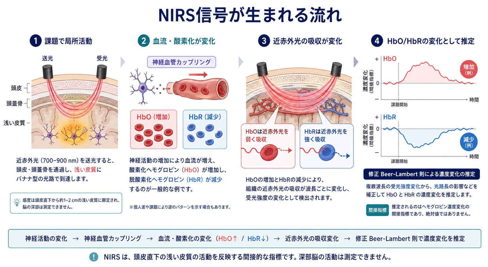

# NIRSは精神医学研究でどう使われるのか

## 要点

- NIRS、特に機能的近赤外分光法 fNIRS は、頭皮上の送光・受光プローブから近赤外光を入れ、前頭葉などの浅い大脳皮質で生じる酸素化ヘモグロビンと脱酸素化ヘモグロビンの変化を推定する方法である[1][2]。
- 精神医学研究では、言語流暢性課題、ワーキングメモリ課題、情動課題、社会認知課題などを行っている間の前頭前野・側頭領域の血行動態反応を測るために使われる[3][4]。
- 利点は、非侵襲、比較的低負担、静音、携帯性、座位や会話に近い状況で測りやすいことにある。これは [[課題fMRIでは何を比較しているのか|課題fMRI]] や [[PETは脳の何を測るのか|PET]] と異なる強みである[1][8]。
- 限界は、深部脳を測れない、空間分解能が低い、頭皮血流・体動・髪・課題成績の影響を受ける、個人診断に直結させにくい、という点である[4][7]。
- したがって NIRS は、精神疾患の「診断器」ではなく、前頭葉機能、課題反応、症状・機能・治療反応との関連を調べる補助的な研究・臨床検査ツールとして読むのがよい。

## この記事で答える問い

1. NIRS は脳の何を測っているのか。
2. なぜ精神医学研究では前頭葉課題と組み合わせられることが多いのか。
3. うつ病、双極症、統合失調症などの研究では、どのような使い方がされているのか。
4. NIRS の結果を、どこまで臨床的に解釈してよいのか。

## まず結論

NIRS は、精神医学において「前頭葉が弱い」「疾患Aである」と直接判定する道具ではない。実際に測っているのは、近赤外光の吸収変化から推定された HbO / HbR の時間変化であり、それを課題条件、行動成績、症状尺度、薬物、年齢、性別、体動などと合わせて解釈する必要がある[2][7]。

それでも NIRS は有用である。精神医学では、患者が MRI 装置内で横になり、騒音や狭い空間に耐えながら課題を行うこと自体が負担になる場合がある。NIRS は座位で、会話や発話を含む課題を比較的自然に実施できるため、前頭葉課題中の血行動態反応を繰り返し測る研究に向いている[3][8]。

## 背景

精神医学では、診断名だけでは説明しきれない認知機能、情動制御、社会機能、意欲、疲労、睡眠、治療反応の違いを扱う。これらは問診や尺度で評価できるが、脳機能の側面を研究するには、課題中の神経・血行動態反応を測る方法も必要になる。

NIRS はこの文脈で発展してきた。1990年代以降、ヒト大脳皮質の機能的活動に伴う酸素化・血流変化を近赤外光で測る fNIRS 研究が広がり、心理学、発達研究、社会神経科学、臨床神経科学に応用されてきた[1]。精神医学では、統合失調症、気分障害、ADHD、加齢関連変化などで、課題中の前頭前野反応を調べる研究が蓄積されている[3]。

日本では「光トポグラフィー」と呼ばれる臨床検査としても知られ、抑うつ症状の鑑別診断補助という文脈で研究・実装が進んできた[4][6]。ただし、ここでいう補助とは、診察、経過、症状、生活機能、他の検査を置き換えるものではない。

## 基本概念

### NIRS と fNIRS

NIRS は near-infrared spectroscopy の略で、近赤外光を用いて組織内の吸収変化を測る方法である。脳機能研究で使われる場合は、課題や刺激に伴う変化を時間的に追うため、functional NIRS、つまり fNIRS と呼ばれることが多い。

精神医学研究でよく見る指標は、酸素化ヘモグロビンの変化 HbO、脱酸素化ヘモグロビンの変化 HbR、総ヘモグロビン tHb である。多くの課題では、活動に伴って局所血流が増え、HbO が増え、HbR が減るという典型的な反応が期待される。ただし、これは神経活動そのものではなく、神経血管カップリングを介した間接指標である[1][2]。

### 前頭葉機能評価

精神医学で NIRS が前頭葉、とくに前頭前野の評価に使われやすいのは、前頭前野が認知制御、発話、ワーキングメモリ、意思決定、情動調整、社会認知と関係し、かつ頭皮から比較的測りやすい浅い皮質領域だからである。前頭前野の働きは [[前頭頭頂ネットワークは認知制御をどう支えるのか|前頭頭頂ネットワーク]] とも関係する。

ただし「前頭葉の活動が低い」といっても、それだけで疾患名や心理状態を一意に決めることはできない。課題をどれだけ実行できたか、発話量が少なかったのか、薬物の影響があるのか、眠気・不安・緊張があったのかを合わせて検討する必要がある[7]。

## 仕組み

NIRS では、頭皮上の送光プローブから近赤外光を入れ、数 cm 離れた受光プローブで戻ってきた光を検出する。近赤外光は頭皮、頭蓋骨、脳表に近い皮質を散乱しながら進むため、光路は単純な直線ではなく、しばしば「バナナ型」と説明される[6]。

複数の波長で得られた光強度の変化から、修正 Beer-Lambert 則を用いて HbO と HbR の濃度変化を推定する[2]。この推定は便利だが、散乱、光路長、表在組織の影響、部分体積効果、チャンネル配置の違いに依存する。したがって、絶対的な脳活動量を測っているというより、特定の配置・課題・前処理のもとで得られた相対的な血行動態変化を読んでいる。

数式として単純化すると、観測される光減衰変化 \(\Delta A\) は、吸光係数 \(\varepsilon\)、濃度変化 \(\Delta c\)、光路長 \(L\)、光路長補正係数 \(DPF\) によって概念的に表せる。

$$
\Delta A \approx \varepsilon \cdot \Delta c \cdot L \cdot DPF
$$

実際の解析では、複数波長の光強度、装置特性、チャンネル品質、フィルタリング、体動補正、短距離チャンネルによる表在信号の補正などが関係する。fNIRS 論文を読むときは、信号が「脳由来」と主張されているかだけでなく、どのように頭皮血流や体動の影響を処理したかを見る必要がある[7]。

## 図解

NIRS の読み方は、次の順番で整理するとわかりやすい。

| 見る点 | 読み方 | 注意点 |
|---|---|---|
| 課題 | 言語流暢性、n-back、情動課題など | 課題成績や発話量が違うと信号差の解釈が変わる |
| 領域 | 前頭前野、側頭領域など | 深部脳や全脳を網羅する方法ではない |
| 指標 | HbO、HbR、tHb | HbO のほうが感度高く報告されやすいが、単独では不十分 |
| 比較 | 患者群対対照群、治療前後、症状相関 | 群差は個人診断を意味しない |
| 前処理 | 体動補正、フィルタ、短距離チャンネル | 前処理の違いで結果が変わりうる |

## 臨床・研究との接続

### 言語流暢性課題

精神医学 NIRS 研究で代表的なのは、言語流暢性課題中の前頭前野・側頭領域反応である。被験者は一定時間内に、指定された音やカテゴリに当てはまる単語をできるだけ多く発話する。課題は発話、検索、ワーキングメモリ、抑制、注意を含むため、前頭葉機能を比較的短時間で誘発しやすい[5][6]。

系統的レビューとメタ解析では、多くの研究で精神疾患群における VFT 中 HbO 変化の低下が報告され、とくに大うつ病と統合失調症では前頭側頭領域の低反応が示されやすい一方、その局在や特異性には課題・解析・サンプルの影響があるとされる[5]。

### うつ病・双極症・統合失調症

うつ病、双極症、統合失調症では、VFT 中の前頭前野反応の大きさや時間波形に違いがあるという研究がある。日本の研究では、単極性うつ病では反応が小さい、双極性うつ状態では反応が遅れる、統合失調症では課題中反応低下と課題後の再上昇がみられる、といったパターンが報告されてきた[4]。

ただし、このような群レベルの特徴を、そのまま目の前の一人の診断に当てはめることはできない。精神疾患の診断は、症状の時間経過、機能障害、鑑別診断、身体疾患・薬物・睡眠・発達歴などを含む臨床判断である。NIRS はその判断を補助しうるが、置き換えるものではない。

### 治療反応・縦断研究

NIRS は反復測定しやすいため、治療前後、症状変化、リハビリテーション、認知訓練、薬物変更、心理社会的介入の前後を追う研究にも向いている。統合失調症研究では、前頭前野反応が社会機能、認知機能、臨床転帰、治療反応の候補バイオマーカーになりうるかが検討されてきた[6]。

ここで重要なのは、バイオマーカー候補と臨床で確立した検査を区別することである。候補指標は、再現性、標準化、多施設検証、交絡因子の制御、臨床上の意思決定への有用性を満たしてはじめて、実用的な検査に近づく。

## 利点

### 低負担で測れる

NIRS は非侵襲で、放射線被曝がなく、装置が比較的小型で静かである。MRI のような強磁場や大きな騒音を避けやすく、座位で測定できる。このため、小児、高齢者、臨床群、発話課題、対人相互作用課題、自然な姿勢に近い研究で使いやすい[8]。

### 時間分解能が比較的高い

fMRI の BOLD 信号と同じく血行動態反応を測るが、NIRS はサンプリング頻度を比較的高く設定できる。ミリ秒単位の神経発火を測る [[ガンマ振動は認知機能にどう関わるのか|神経振動]] 研究とは異なるが、課題開始から数秒単位で立ち上がる HbO / HbR 波形を追いやすい。

### 反復測定と現場研究に向く

携帯型・ワイヤレス型 fNIRS の発展により、研究室外や比較的自然な状況での測定も可能になっている[8]。精神医学では、疲労、会話、社会的相互作用、リハビリ、外来フォローなど、従来の大型脳画像装置では扱いにくい状況に接近できる点が強みである。

## 限界

### 深部脳は測れない

NIRS が主に感度をもつのは、頭皮直下の浅い皮質である。海馬、扁桃体、線条体、視床、基底核など、精神医学で重要な深部構造は直接測りにくい。深部構造を含む全脳ネットワークを知りたい場合は、[[脳画像とは何を見ているのか|脳画像]] 全体の目的に応じて、fMRI、MRI、PET、EEG などとの使い分けが必要になる。

### 表在信号の混入

頭皮血流、血圧、心拍、呼吸、皮膚温、発汗、姿勢、プローブ圧、髪の量などは NIRS 信号に影響する。短距離チャンネルや生理指標を併用し、前処理を明示することが望ましい[7]。

### 課題成績と動機づけの影響

精神医学研究では、患者群と対照群で発話量、反応時間、疲労、眠気、緊張、理解度が異なることがある。課題中の HbO 反応が小さいとしても、それが前頭前野機能の低下なのか、課題に取り組めなかった結果なのか、薬物や症状の影響なのかを区別する必要がある。

### 標準化と再現性

プローブ配置、チャンネル定義、前処理、統計モデル、多重比較補正、除外基準が研究ごとに異なると、結果の比較が難しくなる。fNIRS 研究の報告ガイドラインでは、装置、波長、サンプリング、チャンネル配置、課題、前処理、統計、データ品質を詳しく報告することが推奨されている[7]。

## よくある誤解

### 「NIRS は前頭葉の活動を直接測る」

直接測っているのは近赤外光の強度変化であり、そこから HbO / HbR の変化を推定している。神経活動はその背後にある仮定であり、NIRS 信号は血行動態を介した間接指標である[1][2]。

### 「NIRS でうつ病か双極症か統合失調症かが決まる」

NIRS には鑑別診断補助として研究・臨床応用されてきた歴史があるが、単独で診断を確定する検査ではない[4][6]。診断は臨床面接、経過、症状、身体疾患・薬物の影響、心理社会的文脈を含む総合判断である。

### 「HbO が上がればよい脳活動で、下がれば悪い脳活動」

HbO の上昇や低下は、課題、ベースライン、領域、解析、個人差によって意味が変わる。活動の「良し悪し」ではなく、ある条件下での血行動態反応として読む必要がある。

### 「NIRS は fMRI の簡易版である」

NIRS と fMRI はどちらも血行動態に関係するが、測定原理、空間カバレッジ、姿勢、課題の自由度、感度のある組織が違う。NIRS は全脳高分解能地図ではなく、浅い皮質の課題反応を現場に近い状況で測る方法として位置づけると理解しやすい。

## 関連ノート

- [[脳画像とは何を見ているのか]]
- [[課題fMRIでは何を比較しているのか]]
- [[PETは脳の何を測るのか]]
- [[機能的結合解析とは何か]]
- [[前頭頭頂ネットワークは認知制御をどう支えるのか]]

### 今後の作成候補

- fNIRSとは何か
- 光トポグラフィー検査とは何か
- 言語流暢性課題とは何か
- 神経血管カップリングとは何か
- 精神医学におけるバイオマーカーとは何か

### MOC更新候補

- `content/00_MOC/MOC｜脳・神経科学.md`
- `content/00_MOC/MOC｜精神医学.md`

## 理解チェック

1. NIRS が推定している HbO / HbR は、なぜ神経活動そのものではなく間接指標といえるのか。
2. 精神医学研究で NIRS と言語流暢性課題がよく組み合わされる理由は何か。
3. NIRS の結果を個人診断に直結させると、どのような問題が生じるか。
4. 頭皮血流や体動の影響を減らすために、研究報告ではどのような情報が必要か。

## 参考文献

[1] Ferrari, M., & Quaresima, V. (2012). A brief review on the history of human functional near-infrared spectroscopy (fNIRS) development and fields of application. *NeuroImage*, 63(2), 921-935. https://doi.org/10.1016/j.neuroimage.2012.03.049

[2] Kocsis, L., Herman, P., & Eke, A. (2006). The modified Beer-Lambert law revisited. *Physics in Medicine and Biology*, 51(5), N91-N98. https://doi.org/10.1088/0031-9155/51/5/N02

[3] Ehlis, A.-C., Schneider, S., Dresler, T., & Fallgatter, A. J. (2014). Application of functional near-infrared spectroscopy in psychiatry. *NeuroImage*, 85, 478-488. https://doi.org/10.1016/j.neuroimage.2013.03.067

[4] Fukuda, M. (2010). Near-infrared spectroscopy in psychiatry. *Equilibrium Research*, 69(1), 1-15. https://doi.org/10.3757/jser.69.1

[5] Yeung, M. K., & Lin, J. (2021). Probing depression, schizophrenia, and other psychiatric disorders using fNIRS and the verbal fluency test: A systematic review and meta-analysis. *Journal of Psychiatric Research*, 140, 416-435. https://doi.org/10.1016/j.jpsychires.2021.06.015

[6] Koike, S., Nishimura, Y., Takizawa, R., Yahata, N., & Kasai, K. (2013). Near-infrared spectroscopy in schizophrenia: A possible biomarker for predicting clinical outcome and treatment response. *Frontiers in Psychiatry*, 4, 145. https://doi.org/10.3389/fpsyt.2013.00145

[7] Yücel, M. A., Lühmann, A. v., Scholkmann, F., Gervain, J., Dan, I., Ayaz, H., Boas, D., Cooper, R. J., Culver, J., Elwell, C. E., et al. (2021). Best practices for fNIRS publications. *Neurophotonics*, 8(1), 012101. https://doi.org/10.1117/1.NPh.8.1.012101

[8] Quaresima, V., & Ferrari, M. (2019). Functional near-infrared spectroscopy (fNIRS) for assessing cerebral cortex function during human behavior in natural/social situations: A concise review. *Organizational Research Methods*, 22(1), 46-68. https://doi.org/10.1177/1094428116658959
