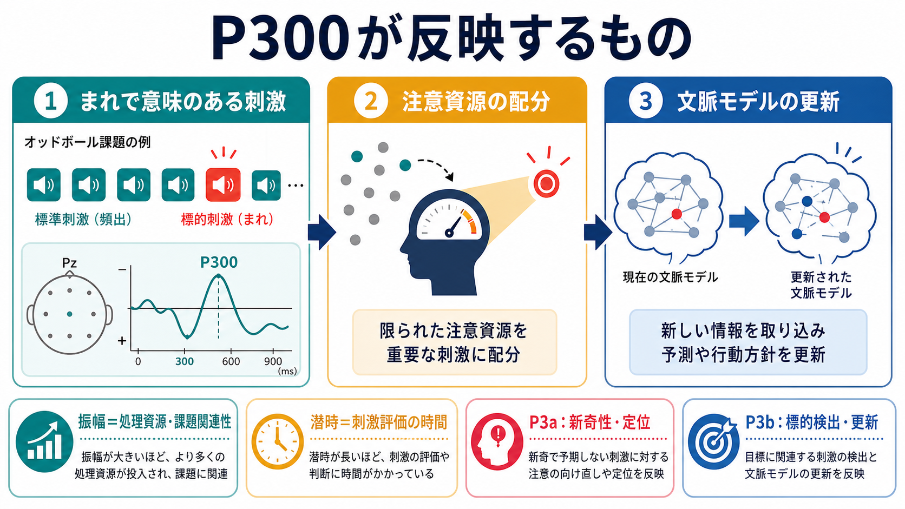
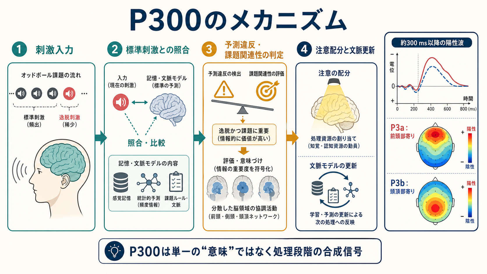
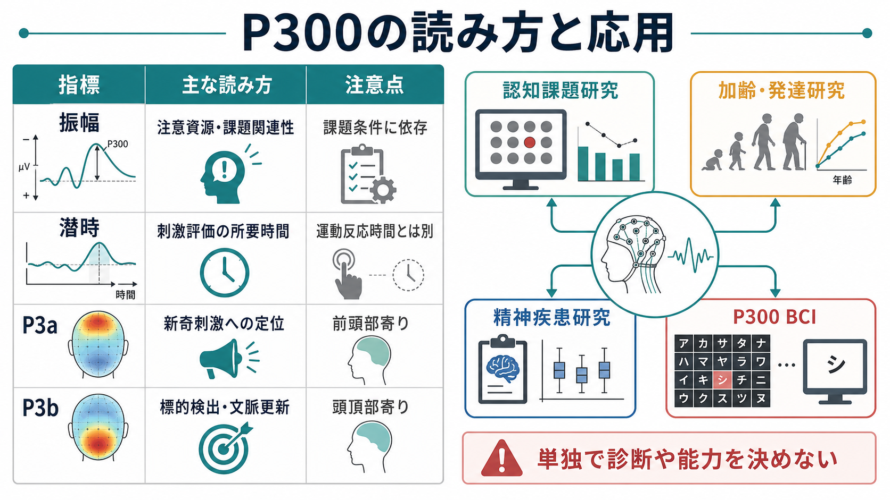

# P300とは何を反映しているのか

## 要点

- P300は、刺激呈示からおよそ300 ms以降に現れる陽性の事象関連電位（ERP）成分で、典型的にはオッドボール課題でまれな標的刺激に対して大きく出る。
- 振幅は「どれだけ注意資源が配分されたか」「その刺激が課題上どれだけ重要か」「どれだけ予期や文脈から外れたか」に影響される。
- 潜時は、単純な運動反応時間ではなく、刺激を評価し分類するまでの時間を反映しやすい。
- P300を単一の心理機能に対応させるより、P3aとP3bを含む、注意の再定位、標的検出、文脈更新、反応方針の調整が重なった成分として読む方がよい。
- 臨床・研究では認知処理の指標として有用だが、単独で診断や能力判定に使うものではない。

## この記事で答える問い

P300は、古典的には「まれで予測しにくい刺激」に対して増大するERPとして発見された。では、P300は本当に「驚き」だけを反映しているのか。それとも、注意、文脈更新、意思決定、記憶更新、反応選択などを含む、より広い認知処理の指標なのか。

この記事では、P300を「脳が重要な刺激を検出し、現在の文脈モデルを更新し、次の行動に備える過程の合成信号」として整理する。

## まず結論

P300は「注意が向いた証拠」でも「意思決定そのもの」でも「驚きそのもの」でもない。より正確には、**課題に関連する刺激が、現在の予測・文脈・反応方針に照らして評価され、その結果として処理資源が配分される過程**を反映するERP成分である。

古典的な文脈更新説では、P300は環境についての内的モデルを改訂する必要が生じたときに出る成分と説明された[2]。その後の統合理論では、P3aは新奇刺激による前頭部寄りの注意定位、P3bは標的検出や頭頂部寄りの文脈更新・記憶関連処理と結びつけられている[3]。ただしP3bについては、文脈更新だけでなく、反応要求、刺激-反応リンク、意思決定過程との関係を重視する見方もある[5]。

## 背景

P300研究の出発点は、刺激の不確実性が頭皮上の誘発電位を変化させるという古典研究にある。Suttonらは、予期しにくい音や光刺激に対して、およそ300 ms付近の陽性成分が大きくなることを報告した[1]。この発見は、脳波が単なる感覚入力の反応だけでなく、予測、注意、判断といった内的処理を反映しうることを示した。

典型的な測定では、標準刺激が高頻度で呈示され、その中に低頻度の標的刺激が混じるオッドボール課題が使われる。参加者が標的を数える、ボタンを押す、あるいは心の中で選択するよう求められると、標的刺激に対してP300が明瞭になる。これは[[MEGはEEGと何が違うのか|EEG]]やERPが、ミリ秒単位で認知処理の時間経過を追える方法であることをよく示している。

## 基本概念

P300を読むときは、少なくとも「振幅」「潜時」「頭皮分布」「課題条件」を分ける必要がある。

| 指標 | 主な読み方 | 注意点 |
|---|---|---|
| 振幅 | 注意資源、課題関連性、主観的まれさ、予測違反の大きさ | 感覚強度や課題難度だけでは決まらない |
| 潜時 | 刺激評価・分類にかかった時間 | ボタン押しの速さそのものではない |
| P3a | 新奇刺激への定位、注意の向け直し | 前頭部寄りに出やすい |
| P3b | 標的検出、文脈更新、反応方針の調整 | 頭頂部寄りに出やすく、課題要求に強く依存する |

臨床ERP測定のガイドラインでも、P300はMMNやN400と並んで、刺激条件、記録条件、ピーク同定、潜時・振幅の定義を慎重にそろえる必要がある成分として扱われる[4]。同じ「P300」という名前でも、刺激系列、標的頻度、反応要求、年齢、覚醒水準、薬物、ノイズ処理によって結果は変わる。

## 仕組み

P300を単純化すると、次の流れで理解できる。

1. 刺激が入力される。
2. その刺激が、直前までの標準刺激、課題ルール、記憶内の文脈モデルと照合される。
3. まれで、予測から外れ、かつ課題上意味がある刺激だと判定される。
4. 注意資源が配分され、刺激の意味づけ、反応方針、文脈モデルが更新される。

この過程で、P300振幅は「その刺激にどの程度の処理資源が投入されたか」を反映しやすい。一方、潜時は「刺激が何であるかを評価し終えるまでの時間」と関係しやすい[2][3]。そのため、P300潜時が長いからといって、ただちに運動反応が遅いとは限らない。

## 図解

上の図で重要なのは、P300を「300 msに出る一つの山」とだけ見ないことである。実際には、前頭部寄りのP3a、頭頂部寄りのP3b、課題要求に応じた反応関連過程が重なり、頭皮上では一つの広い陽性波として見えることがある。

P3aは、新奇で無視しにくい刺激に対して注意を向け直す過程と関連しやすい。P3bは、標的刺激を検出し、その刺激が現在の課題文脈で何を意味するかを確定する過程と関連しやすい[3]。ただし、P3bを純粋な「記憶更新」だけに還元できるかは議論があり、反応要求や刺激-反応結合の再活性化を重視するレビューもある[5]。

## 臨床・研究との接続

P300は、認知課題研究、加齢・発達研究、精神疾患研究、BCI研究で広く使われている。P300 BCIでは、ユーザーが選びたい文字や場所に注意を向けると、その行や列が点滅したときにP300が生じることを利用する。FarwellとDonchinの古典的研究は、P300を使って文字選択を行う「メンタル・プロステーシス」の原型を示した[6]。

精神疾患研究では、統合失調症におけるP300振幅低下が繰り返し報告されてきた。初回エピソード統合失調症を対象にしたメタ分析では、健常対照群と比べてP300振幅の低下と潜時延長が示され、課題難度が異質性の一因であることも報告された[7]。ただし、これは群平均の研究知見であり、個人の診断や治療方針をP300単独で決める根拠にはならない。

関連して、P300は[[前頭頭頂ネットワークは認知制御をどう支えるのか]]、[[中央実行ネットワークとは何か]]、[[アセチルコリンは注意や記憶にどう関わるのか]]のような注意・認知制御系の理解とも接続しやすい。一方、意味処理に関わるERP成分としてはN400があり、P300とは異なる認知過程を主に反映する。

## よくある誤解

### 誤解1：P300は「驚き」を測っている

まれな刺激や予測違反でP300は大きくなりやすいが、単なる驚きだけでは説明できない。刺激が課題に関連しているか、反応を要求するか、文脈モデルを更新する必要があるかが重要である[2][5]。

### 誤解2：P300が大きいほど認知能力が高い

P300振幅は処理資源や課題関連性を反映しうるが、常に「能力の高さ」を意味するわけではない。簡単すぎる課題、難しすぎる課題、注意の分散、疲労、年齢、薬物、ノイズ条件で変化する。

### 誤解3：P300潜時は反応時間そのもの

P300潜時は刺激評価の時間を反映しやすいが、運動準備やボタン押しの時間とは区別される。反応時間と相関する場合もあるが、同じものではない。

### 誤解4：P300だけで精神疾患を診断できる

群間差としてのP300異常は有用な研究指標だが、個人診断に直結しない。精神医学領域では、症状、経過、認知機能、生活機能、他の生物学的指標と合わせて慎重に解釈する必要がある。

## 関連ノート

- [[MEGはEEGと何が違うのか]]
- [[前頭頭頂ネットワークは認知制御をどう支えるのか]]
- [[中央実行ネットワークとは何か]]
- [[アセチルコリンは注意や記憶にどう関わるのか]]
- [[神経振動とは何か]]

今後の作成候補:

- N400とは何を反映しているのか
- 事象関連電位とは何か

MOC更新候補:

- `content/00_MOC/MOC｜脳・神経科学.md`
- `content/00_MOC/MOC｜基礎神経科学.md`
- `content/00_MOC/MOC｜認知科学・心理学.md`

## 理解チェック

1. P300振幅とP300潜時は、それぞれ何を反映しやすいか。
2. P3aとP3bは、どのような課題条件や頭皮分布で区別されるか。
3. 「P300は驚きだけを測る」という説明が不十分なのはなぜか。
4. P300を臨床研究で使うとき、なぜ単独診断に使ってはいけないのか。

## 未解決問題

- P3bを文脈更新、記憶更新、意思決定、刺激-反応リンクのどれとして最もよく説明できるかは、現在も議論が続いている。
- 頭皮上のP300は複数発生源と複数処理段階の合成であり、単一の脳部位や単一の心理機能に対応づけにくい。
- 個人レベルの臨床評価に使うには、課題標準化、信頼性、年齢・薬物・症状状態の統制がさらに必要である。

## 参考文献

[1] Sutton, S., Braren, M., Zubin, J., & John, E. R. (1965). Evoked-potential correlates of stimulus uncertainty. *Science*, 150(3700), 1187-1188. https://doi.org/10.1126/science.150.3700.1187

[2] Donchin, E., & Coles, M. G. H. (1988). Is the P300 component a manifestation of context updating? *Behavioral and Brain Sciences*, 11(3), 357-427. https://doi.org/10.1017/S0140525X00058027

[3] Polich, J. (2007). Updating P300: An integrative theory of P3a and P3b. *Clinical Neurophysiology*, 118(10), 2128-2148. https://doi.org/10.1016/j.clinph.2007.04.019

[4] Duncan, C. C., Barry, R. J., Connolly, J. F., Fischer, C., Michie, P. T., Näätänen, R., Polich, J., Reinvang, I., & Van Petten, C. (2009). Event-related potentials in clinical research: Guidelines for eliciting, recording, and quantifying mismatch negativity, P300, and N400. *Clinical Neurophysiology*, 120(11), 1883-1908. https://doi.org/10.1016/j.clinph.2009.07.045

[5] Verleger, R. (2020). Effects of relevance and response frequency on P3b amplitudes: Review of findings and comparison of hypotheses about the process reflected by P3b. *Psychophysiology*, 57(7), e13542. https://doi.org/10.1111/psyp.13542

[6] Farwell, L. A., & Donchin, E. (1988). Talking off the top of your head: Toward a mental prosthesis utilizing event-related brain potentials. *Electroencephalography and Clinical Neurophysiology*, 70(6), 510-523. https://doi.org/10.1016/0013-4694(88)90149-6

[7] Qiu, Y. Q., Tang, Y. X., Chan, R. C. K., Sun, X. Y., & He, J. (2014). P300 aberration in first-episode schizophrenia patients: A meta-analysis. *PLOS ONE*, 9(6), e97794. https://doi.org/10.1371/journal.pone.0097794
