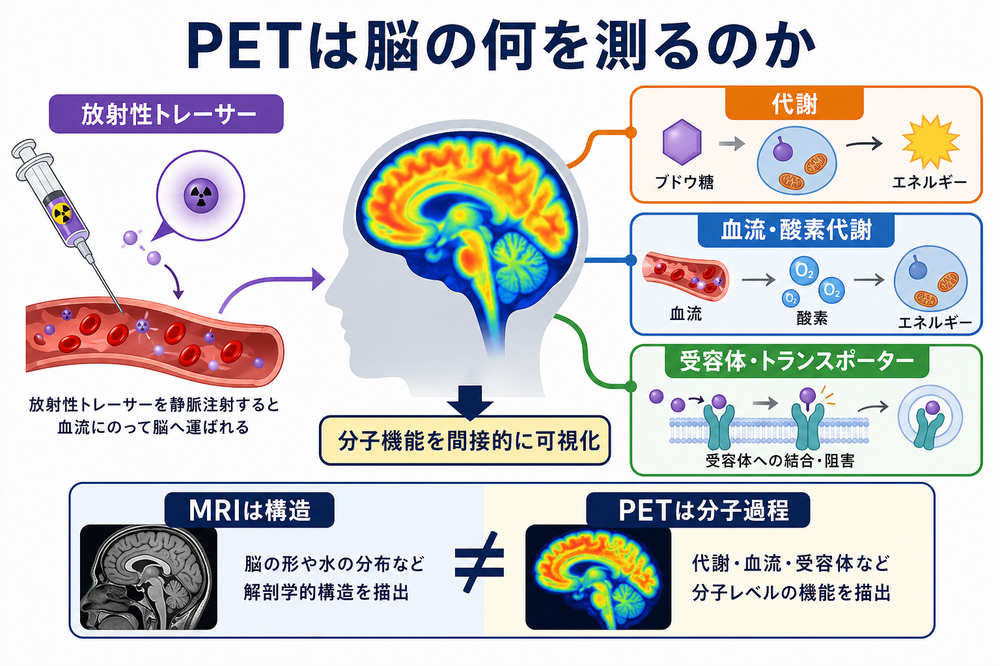
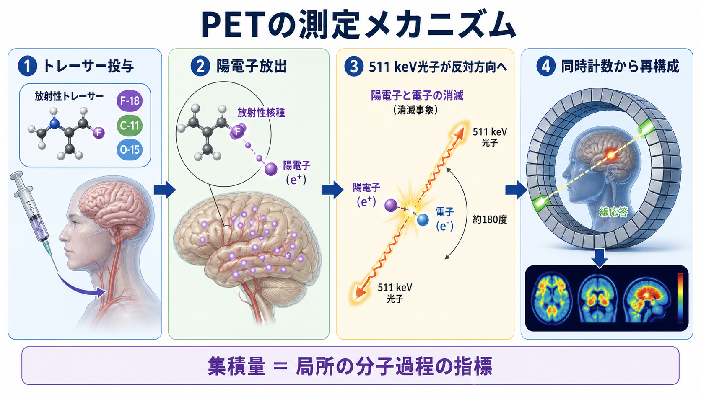
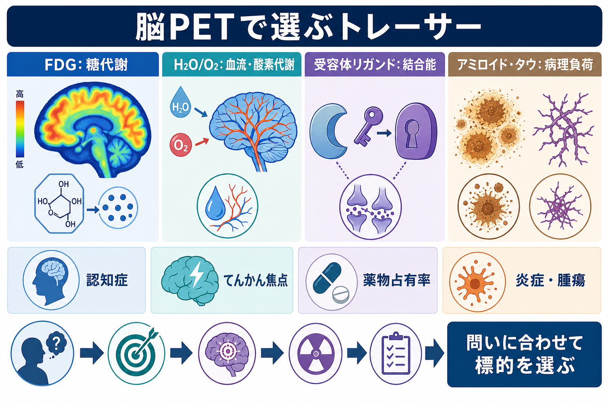

# PETは脳の何を測るのか

## 要点

- PET（positron emission tomography）は、放射性トレーサーが脳内にどの程度集積したかを測り、そこから糖代謝、血流、酸素代謝、受容体・トランスポーター結合、アミロイドやタウなどの病理負荷を推定する分子イメージングである。
- MRIが主に形態や組織コントラストを見るのに対し、PETは「どの分子過程が、どこで、どれくらい起きているか」を見る。したがって、[[構造MRIは脳の何を測っているのか]]とは測定対象が大きく異なる。
- PET画像の明るさは、神経活動そのものではなく、トレーサーの投与量、血流、代謝、結合、崩壊補正、再構成、正規化、解析モデルに依存する。
- FDG-PETは脳のグルコース利用を、受容体PETは[[受容体にはどのような種類があるのか|受容体]]やトランスポーターの利用可能性を、アミロイド・タウPETは特定の病理タンパク質の沈着を評価する。
- 臨床的には認知症、難治性てんかんの焦点探索、脳腫瘍、炎症性疾患、薬物占有率評価などに使われるが、PET単独で個別診断や治療方針を断定するものではない。

## この記事で答える問い

1. PETは脳の「活動」を直接見ているのか。
2. FDG、血流・酸素代謝、受容体リガンド、アミロイド・タウPETは何が違うのか。
3. PET画像を解釈するとき、どこに注意すべきか。
4. 研究と臨床でPETはどのように使い分けられるのか。

## まず結論

PETは、脳の電気活動そのものを直接測る装置ではない。PETが測る一次データは、陽電子放出核種で標識されたトレーサーから生じる消滅放射線であり、画像化されるのはトレーサー分布である[1]。その分布を、FDGならグルコース代謝、H2OやO2なら血流・酸素代謝、特定リガンドなら受容体結合やトランスポーター利用可能性、アミロイド・タウリガンドなら病理タンパク質負荷として読む。

したがって、PETの中心は「画像」ではなく「トレーサー設計」である。何を標識するかによって、同じPET装置でも測っている脳の側面は変わる[2]。

## 背景

脳画像は一枚の画像に見えても、測定している物理量は手法ごとに異なる。構造MRIは水素原子核の磁気共鳴信号から組織構造を推定し、fMRIは主に血液酸素化に伴うBOLD信号を利用する。一方、PETは体内に入れた放射性トレーサーの動態を利用する。

脳はエネルギー需要が高く、神経活動、シナプス入力、[[アストロサイトはシナプスと代謝をどう支えているのか|アストロサイト]]を含む代謝調節、局所血流が密接に結びついている。PETとMRIを含む機能的脳画像の信号は、この循環・代謝の変化を介して脳機能と接続される[4]。ただし、どの程度「神経発火」「シナプス活動」「代謝需要」を反映するかは、手法とトレーサーによって異なる。

## 基本概念

### PETはトレーサー分布を測る

PETで使うトレーサーは、炭素11、酸素15、窒素13、フッ素18などの陽電子放出核種で標識された分子である。トレーサーは静脈投与、吸入などで体内に入り、血流に乗って脳へ届く。そこで分子の性質に応じて、グルコース代謝経路、血流、受容体、トランスポーター、酵素、病理タンパク質などに関連した分布を作る[1][2]。

重要なのは、PETが「脳全体の活動量」を一種類の尺度で測るわけではない点である。FDG-PET、H2O-PET、D2受容体PET、アミロイドPETは、同じPETでも異なる生物学的問いに答える。

### よく使われる脳PETの標的

| トレーサーの種類 | 代表的に見るもの | 解釈の例 | 注意点 |
|---|---|---|---|
| FDG | グルコース利用 | 局所糖代謝、神経活動に関連する代謝需要 | 血糖、投与時の状態、炎症・腫瘍の高代謝の影響を受ける |
| H2O / O2 / CO | 血流、酸素消費、血液量 | 脳循環・酸素代謝 | 短半減期核種が多く、設備要件が高い |
| 受容体リガンド | 受容体・トランスポーター結合能 | ドパミン、セロトニン、アセチルコリン系などの分子標的 | 結合能は受容体密度、親和性、内因性リガンド競合の合成指標 |
| アミロイド・タウ | 病理タンパク質負荷 | アルツハイマー病関連病理の評価 | 症状、年齢、他検査と合わせて解釈する |
| TSPOなど | 神経炎症関連過程 | ミクログリア活性化の近似指標 | 標的特異性や遺伝的多型などの限界がある |

## 仕組み

### 1. 陽電子放出と同時計数

陽電子放出核種が崩壊すると陽電子が放出される。陽電子は周囲の電子と衝突して消滅し、ほぼ反対方向へ2本の511 keV光子を出す。PET装置はリング状の検出器で、この2本の光子がほぼ同時に到達した事象を検出する。2検出器を結ぶ線は「線応答」と呼ばれ、そこに放射性崩壊が起きた可能性が高いと推定される[1]。

この同時計数を大量に集め、減弱補正、散乱補正、崩壊補正、再構成を行うことで、脳内トレーサー分布の3次元画像が作られる。

### 2. FDG-PETは糖代謝を近似する

FDGはグルコース類似体であり、脳内に取り込まれたあとリン酸化され、通常のグルコースほど先へ代謝されにくいため組織内に相対的にとどまる。脳ではグルコース代謝が機能維持に重要で、FDG-PETは局所のグルコース消費を評価する代表的手法である[3]。

臨床では、認知症の鑑別補助、難治性てんかんの術前評価、脳腫瘍、脳炎、リンパ腫などで利用される。2024年のSNMMI/EANM手順標準は、FDG脳PETを神経・脳外科・精神医学的診療で高品質に実施・解釈するための指針として位置づけている[3]。

### 3. 血流・酸素代謝PETは「脳の仕事」を見る

H2O、O2、COなどのトレーサーを用いると、局所脳血流、酸素消費率、脳血液量などを推定できる。これらは神経活動と代謝需要の関係、脳虚血、神経血管カップリング、ベースライン活動の理解に重要である[4]。

ただし、血流の増加は神経活動の一側面を反映するが、神経細胞のスパイク数を直接数えているわけではない。入力活動、シナプス活動、グリア、血管反応、代謝状態が混ざった信号として解釈する必要がある。

### 4. 受容体PETは「結合できる標的」を見る

受容体PETでは、特定の受容体やトランスポーターに結合する放射性リガンドを使う。たとえばドパミンD2/D3受容体、セロトニントランスポーター、ムスカリン性アセチルコリン受容体などが標的になりうる。これは、[[ドパミンは報酬だけの物質なのか]]、[[セロトニンは気分だけに関わるのか]]、[[アセチルコリンは注意や記憶にどう関わるのか]]のような神経修飾系をヒト生体内で調べる手段になる。

ただし、画像の値は単純な「受容体数」ではない。可逆的に結合するリガンドでは、分布容積や結合能などの指標を使い、特異的結合、非特異的結合、血漿中濃度、遊離分画、内因性神経伝達物質との競合をモデル化する[5]。したがって、受容体PETは[[神経伝達物質はどのように放出されるのか|神経伝達物質の放出]]や[[神経伝達物質はどのように除去されるのか|除去]]を直接撮影するというより、結合可能な標的の状態を推定する方法である。

### 5. アミロイド・タウPETは病理負荷を評価する

アミロイドPETやタウPETは、アルツハイマー病に関連する病理タンパク質の脳内沈着を評価する。2025年のAlzheimer's Association/SNMMIの適正使用基準では、軽度認知障害の評価と予後、原因不明の認知症評価、疾患修飾療法の適格性判断など、結果が診療に影響する場面での利用が整理されている[6]。

一方で、認知機能低下のない人へのスクリーニング、法的・雇用・保険目的での非医療的利用などは慎重に扱うべきである[6]。PETは病理の一部を測る強力な検査だが、症状、神経心理検査、MRI、血液・髄液バイオマーカー、生活機能の情報と統合して解釈する必要がある。

## 図解

PETの問いは「どのトレーサーを使うか」で決まる。研究計画や臨床検査では、まず測りたい分子過程を決め、次にトレーサー、撮像時間、動脈採血の有無、参照領域、解析モデルを選ぶ。

## 臨床・研究との接続

### 認知症

FDG-PETは代謝低下パターンを通じて神経変性疾患の鑑別補助に使われる。アミロイド・タウPETは、アルツハイマー病関連病理の存在や分布を評価し、診断仮説や治療適格性の判断に関わることがある[3][6]。ただし、陽性所見は臨床症状の原因を自動的に証明するものではない。

### てんかん

薬剤抵抗性焦点てんかんでは、発作間欠期FDG-PETの低代謝領域がてんかん焦点や関連ネットワークを示す手がかりになる。構造MRI、脳波、発作症状、神経心理検査と統合して術前評価に用いられる[3]。

### 精神薬理・神経伝達研究

受容体PETは、薬物が標的受容体をどれくらい占有しているかを推定する薬物占有率研究に使われる。これは用量設定、薬効・副作用の理解、内因性神経伝達物質変化の推定に有用である[5]。ただし、結合能の変化は単一原因に還元しにくいため、薬理学的操作、血中濃度、行動指標と合わせて読む。

### 神経炎症・腫瘍

FDG-PETは炎症や腫瘍の高代謝を反映する場合がある[3]。TSPO-PETなどは[[ミクログリアは脳の免疫細胞として何をしているのか|ミクログリア]]関連の神経炎症研究で使われるが、標的特異性や個人差の限界を考慮する必要がある。

## よくある誤解

### 誤解1: PETは脳活動を直接測る

PETは神経細胞の電気活動を直接測っていない。測っているのはトレーサー由来の放射線であり、そこから代謝・血流・結合などを推定する。

### 誤解2: PETで明るい場所は「よく働いている」

明るさはトレーサーの集積を示す。FDGなら代謝が高い可能性があるが、腫瘍や炎症でも高くなりうる。受容体リガンドなら結合能が高いことを示す場合があるが、それは神経活動の強さとは別である。

### 誤解3: 受容体PETは受容体数だけを測る

受容体PETの結合能は、受容体密度だけでなく、リガンド親和性、非特異的結合、内因性リガンド、血流、解析モデルに左右される[5]。

### 誤解4: PETはMRIより常に優れている

PETとMRIは競合するというより相補的である。PETは分子過程に強く、MRIは構造、血管、組織性状、時空間分解能に強い。多くの研究・臨床場面では、PET/MRIやPET/CTのように複数情報を統合する。

### 誤解5: アミロイド陽性なら症状の原因が確定する

アミロイドやタウの陽性所見は重要な情報だが、年齢、症状、神経心理検査、他疾患、MRI所見、治療文脈を含めて判断する必要がある[6]。

## 関連ノート

- [[構造MRIは脳の何を測っているのか]]
- [[受容体にはどのような種類があるのか]]
- [[ドパミンは報酬だけの物質なのか]]
- [[セロトニンは気分だけに関わるのか]]
- [[アセチルコリンは注意や記憶にどう関わるのか]]
- [[血液脳関門はなぜ必要なのか]]
- [[アストロサイトはシナプスと代謝をどう支えているのか]]
- [[ミクログリアは脳の免疫細胞として何をしているのか]]

## MOC更新候補

- `content/00_MOC/MOC｜脳・神経科学.md`
- `content/00_MOC/MOC｜基礎神経科学.md`
- 将来的に「脳画像・神経計測」専用MOCが作られる場合、本記事をPET・分子イメージングの入口ノートとして配置する。

## 理解チェック

1. FDG-PETで高集積が見えたとき、それは何を反映し、何とは限らないか。
2. 受容体PETの「結合能」は、なぜ単純な受容体数と同じではないのか。
3. アミロイドPETやタウPETの結果を、なぜ症状や他検査と統合して解釈する必要があるのか。
4. PETと構造MRIは、脳の何をそれぞれ違う仕方で測っているのか。

## 未解決問題

- FDG-PETや血流PETの信号を、細胞種別・シナプス入力・スパイク出力・グリア代謝へどこまで分解できるか。
- 神経炎症PETで観察される信号を、ミクログリアの状態、アストロサイト、血液脳関門変化、末梢免疫の影響からどこまで切り分けられるか。
- アミロイド・タウPET、血液バイオマーカー、MRI、認知指標を、個人レベルの予後予測へどのように統合するか。
- 受容体PETの薬物占有率や内因性神経伝達推定を、臨床症状や行動変化とどの程度結びつけられるか。

## 参考文献

[1] National Institute of Biomedical Imaging and Bioengineering. Nuclear Medicine. https://www.nibib.nih.gov/science-education/science-topics/nuclear-medicine

[2] Phelps, M. E. (2000). Positron emission tomography provides molecular imaging of biological processes. *Proceedings of the National Academy of Sciences*, 97(16), 9226-9233. https://doi.org/10.1073/pnas.97.16.9226

[3] Arbizu, J., Morbelli, S., Minoshima, S., et al. (2024). SNMMI Procedure Standard/EANM Practice Guideline for Brain [18F]FDG PET Imaging, Version 2.0. *Journal of Nuclear Medicine*. https://doi.org/10.2967/jnumed.124.268754

[4] Raichle, M. E., & Mintun, M. A. (2006). Brain work and brain imaging. *Annual Review of Neuroscience*, 29, 449-476. https://doi.org/10.1146/annurev.neuro.29.051605.112819

[5] Innis, R. B., Cunningham, V. J., Delforge, J., et al. (2007). Consensus nomenclature for in vivo imaging of reversibly binding radioligands. *Journal of Cerebral Blood Flow & Metabolism*, 27, 1533-1539. https://doi.org/10.1038/sj.jcbfm.9600493

[6] Rabinovici, G. D., Knopman, D. S., Arbizu, J., et al. (2025). Updated Appropriate Use Criteria for Amyloid and Tau PET: A Report from the Alzheimer's Association and Society for Nuclear Medicine and Molecular Imaging Workgroup. *Journal of Nuclear Medicine*, 66(Suppl 2), S5-S31. https://doi.org/10.2967/jnumed.124.268756
