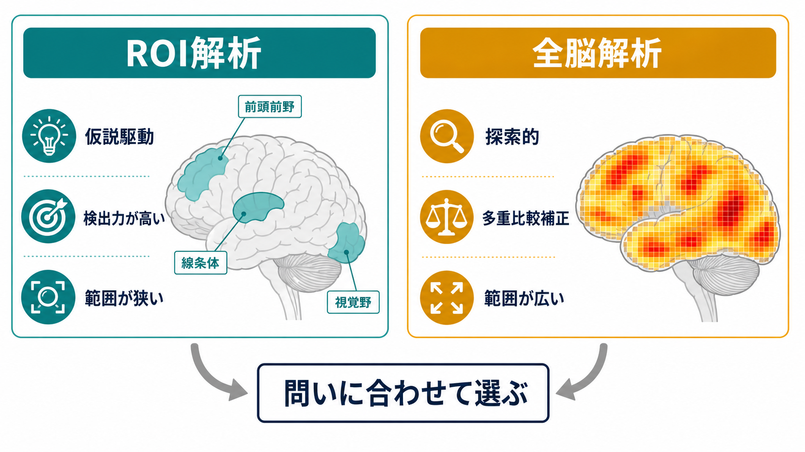
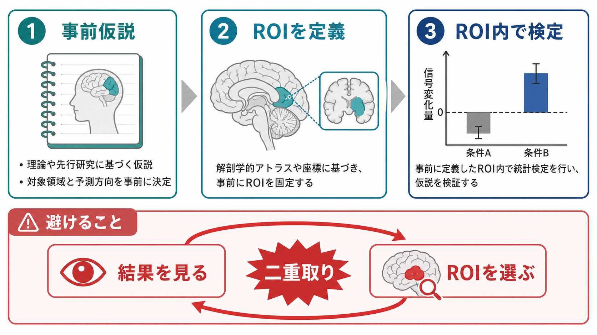

# ROI解析と全脳解析は何が違うのか

## 要点

- ROI解析は、事前に決めた関心領域だけを調べる仮説駆動型の解析である。
- 全脳解析は、脳全体の多数のボクセルや頂点を探索し、どこに効果があるかを広く調べる解析である。
- ROI解析は検定数を減らせるため検出力を保ちやすいが、ROIの選び方に強く依存する。
- 全脳解析は予想外の効果を見つけやすいが、多重比較補正が不可欠で、効果の局在解釈にも注意が必要である。
- 同じデータで「有意だった場所を選び、その場所の効果を検定する」と、二重取りにより推論が歪む。

## この記事で答える問い

[[課題fMRIでは何を比較しているのか]]や[[安静時fMRIは何を測っているのか]]を読むと、「どの脳領域で効果を見るのか」という問題が出てくる。この記事では、脳画像解析でよく使われる ROI 解析と全脳解析について、次の問いに答える。

- 何を「ROI」と呼ぶのか。
- ROI解析と全脳解析は、統計的に何が違うのか。
- どちらが「よい解析」なのか。
- 論文を読むとき、どこに注意すればよいのか。

## まず結論

ROI解析と全脳解析の違いは、「脳のどこを見るか」だけではない。より本質的には、**解析前に調べる場所を絞るのか、解析後に脳全体から候補を見つけるのか**という研究デザインの違いである。

強い先行仮説があり、たとえば「扁桃体の反応」「線条体の報酬関連信号」「一次視覚野の応答」のように対象領域を事前に決められるなら、ROI解析は合理的である。逆に、どこに効果が出るか分からない問い、広いネットワーク変化を探したい問い、予備的な仮説生成をしたい問いでは、全脳解析が向いている。

ただし、ROI解析は「狭いから常に正しい」わけではなく、全脳解析は「広いから常に客観的」なわけでもない。ROI解析ではROI定義の独立性、全脳解析では多重比較補正と空間的特異性が要点になる[1][2][3]。

## 背景

fMRI や構造 MRI では、脳を小さなボクセルや表面上の点に分け、各位置で信号や統計量を計算する。[[fMRIは神経活動を直接測っているのか]]で整理されるように、fMRIで扱う[[BOLD信号とは何か|BOLD信号]]は神経活動そのものではなく、血流・酸素化を介した間接指標である。したがって、解析では「どの条件差を、どの空間範囲で、どの統計基準で判断するか」が重要になる。

脳全体を調べると、数万から十数万規模の位置で検定を行うことになる。これは典型的な多重比較問題であり、偶然の偽陽性を抑えるために FWE、FDR、置換検定、ランダムフィールド理論などの補正が使われる[2][3][4]。ROI解析はこの探索範囲を狭めることで、検定数を減らし、既存理論に沿った問いを効率よく検証する発想である[1]。

## 基本概念

### ROI解析

ROI は region of interest、つまり関心領域を意味する。ROI解析では、全脳のすべての点を同じように調べるのではなく、事前に定義した領域内の信号、平均値、ピーク値、モデル係数、機能的結合などを取り出して解析する。

ROIの定義には、主に次の方法がある[1]。

- 解剖学的ROI: 脳アトラスや解剖学的境界に基づく。
- 機能的ROI: 独立したローカライザー課題や独立データで反応を示した領域に基づく。
- 座標ベースROI: 先行研究のピーク座標を中心に球状領域などを置く。

重要なのは、ROIが「結果を見てから都合よく決めた領域」ではなく、検証したい仮説から独立に定義されていることである。Poldrack は、ROI解析には強みがある一方で、ROI定義の仮定と限界を明示する必要があると整理している[1]。

### 全脳解析

全脳解析は、特定の領域に絞らず、脳全体のボクセルや皮質表面点に同じ統計モデルを適用する方法である。課題fMRIなら条件差、安静時fMRIなら機能的結合、構造MRIなら灰白質体積や皮質厚の差などを全脳的に調べる。

全脳解析の代表的な考え方は mass univariate analysis である。これは、各ボクセルに同じモデルを当てはめ、統計マップを作る方法である。広く探索できる一方、検定数が非常に多くなるため、未補正のしきい値だけで「有意」と判断すると偽陽性が増えやすい[2][4][5]。

## 仕組み

ROI解析と全脳解析は、同じデータに対して次のように異なる制約を置く。

| 観点 | ROI解析 | 全脳解析 |
|---|---|---|
| 基本姿勢 | 仮説駆動 | 探索的または広域検証 |
| 探索範囲 | 事前に限定した領域 | 脳全体 |
| 検定数 | 少ない | 多い |
| 強み | 検出力を保ちやすい | 予想外の効果を見つけやすい |
| 弱点 | ROI選択に依存する | 多重比較補正で検出力が下がりやすい |
| 主要な注意点 | ROI定義の独立性 | FWE/FDR/置換検定などの補正 |

ROI解析では、解析前に「ここを見る」と決めるため、統計的な探索範囲が狭くなる。これは、少数の明確な仮説を検証するには有利である。一方、ROIの外に重要な効果があっても見落とす可能性がある。

全脳解析では、脳全体に同じ物差しを当てるため、想定外の領域やネットワークを発見しやすい。しかし、各ボクセルで検定を行うため、しきい値の選び方、空間スムージング、クラスタ推論、補正方法の妥当性が結果を大きく左右する[2][3][5][6]。

特に避けるべきなのが、同じデータで「有意だった場所を探す」ことと「その場所の効果量や差を検定する」ことを重ねる手続きである。これは circular analysis、いわゆる double dipping と呼ばれ、選択と検定が独立でないため、効果量が過大評価されたり、推論が無効になったりする[7]。

## 図解

次の図は、研究目的から解析方針を選ぶときの見取り図である。

実務的には、次のように考えるとよい。

1. 先行研究や理論から領域が明確なら、ROI解析を第一候補にする。
2. どこに効果があるか分からないなら、全脳解析で探索する。
3. 探索で見つけた領域は、独立データ、交差検証、事前登録された追試、または独立ローカライザーで確認する。
4. ROI解析と全脳解析を併用する場合は、どの解析が主解析で、どの解析が探索的解析かを分けて報告する。

## 臨床・研究との接続

研究では、ROI解析は理論的に明確な回路や領域を検証する場面で使いやすい。たとえば、情動刺激に対する扁桃体反応、報酬課題における線条体反応、[[シードベース解析とは何か]]における特定シードからの[[機能的結合解析とは何か|機能的結合]]などである。

全脳解析は、精神疾患群と対照群の差、発達や老化に伴う広域変化、薬理介入や心理療法前後の変化など、効果の場所を限定しにくい研究で有用である。ただし、脳画像研究では低い統計的検出力、解析柔軟性、未補正統計、直接再現の不足が再現性問題につながりうることが指摘されている[8]。

臨床応用については慎重に読む必要がある。ROIや全脳解析で群平均の差が見つかっても、それだけで個人の診断や治療選択ができるとは限らない。脳画像所見は、症状、経過、心理社会的背景、認知機能、他の検査と統合して解釈される研究・教育上の知見として扱うべきである。

## よくある誤解

### ROI解析は恣意的で、全脳解析のほうが客観的である

全脳解析も、前処理、スムージング、モデル、しきい値、補正方法、クラスタ定義など多くの選択に依存する。ROI解析が恣意的になるのは、ROIの根拠が弱い場合や、結果を見てからROIを決めた場合である。事前仮説、独立ローカライザー、登録済み解析計画があれば、ROI解析はむしろ明確な検証になりうる。

### ROI解析なら多重比較補正は不要である

ROIが1つだけなら全脳解析ほどの多重比較負担はない。しかし、複数ROI、複数条件、複数指標、複数時点を調べるなら、その範囲で多重比較が生じる。ROI解析でも、解析単位と検定の家族を明示する必要がある。

### 全脳解析で有意なクラスタのピーク座標が、その心理機能の中枢である

クラスタ推論では、クラスタ全体として有意でも、クラスタ内のすべての点が同じ意味で有意とは限らない。大きなクラスタでは空間的特異性が低くなり、「どこかに効果がある」と言えても、特定のピークや下位領域に強い解釈を与えるには追加根拠が必要である[5]。

### 探索で見つけたROIを、そのまま次の仮説検定に使ってよい

同じデータ内で探索と検証を完結させると、二重取りのリスクが高い。探索で見つけたROIは仮説生成として扱い、独立したデータや独立した基準で検証するのが望ましい[7][8]。

## 関連ノート

- [[脳画像とは何を見ているのか]]
- [[fMRIは神経活動を直接測っているのか]]
- [[BOLD信号とは何か]]
- [[課題fMRIでは何を比較しているのか]]
- [[安静時fMRIは何を測っているのか]]
- [[シードベース解析とは何か]]
- [[機能的結合解析とは何か]]
- [[独立成分分析ICAはfMRIでどう使われるのか]]

### 関連ノート候補

- 多重比較補正は脳画像解析でなぜ重要なのか
- 脳アトラスとは何か
- 脳画像研究の再現性問題とは何か
- ボクセルベース形態計測VBMとは何か
- 統計的検出力とは何か
- 事前登録とは何か

### MOC更新候補

- `content/00_MOC/` 配下の脳画像・神経計測関連 MOC に、本記事へのリンクを追加する。
- 統計・研究法系 MOC がある場合、多重比較、二重取り、再現性問題の文脈から相互参照する。

## 理解チェック

1. ROI解析で「事前にROIを決める」ことは、なぜ統計的に重要なのか。
2. 全脳解析で未補正のしきい値だけを使うと、なぜ偽陽性が増えやすいのか。
3. 同じデータで有意領域を選び、その領域の効果量を報告すると、どのような問題が起こるか。
4. ある論文がROI解析と全脳解析を両方示しているとき、主解析と探索的解析をどう見分けるか。

## 参考文献

[1] Poldrack, R. A. (2007). Region of interest analysis for fMRI. *Social Cognitive and Affective Neuroscience*, 2(1), 67-70. https://doi.org/10.1093/scan/nsm006

[2] Nichols, T., & Hayasaka, S. (2003). Controlling the familywise error rate in functional neuroimaging: A comparative review. *Statistical Methods in Medical Research*, 12(5), 419-446. https://doi.org/10.1191/0962280203sm341ra

[3] Genovese, C. R., Lazar, N. A., & Nichols, T. (2002). Thresholding of statistical maps in functional neuroimaging using the false discovery rate. *NeuroImage*, 15(4), 870-878. https://doi.org/10.1006/nimg.2001.1037

[4] Nichols, T. E., & Holmes, A. P. (2002). Nonparametric permutation tests for functional neuroimaging: A primer with examples. *Human Brain Mapping*, 15(1), 1-25. https://doi.org/10.1002/hbm.1058

[5] Woo, C.-W., Krishnan, A., & Wager, T. D. (2014). Cluster-extent based thresholding in fMRI analyses: Pitfalls and recommendations. *NeuroImage*, 91, 412-419. https://doi.org/10.1016/j.neuroimage.2013.12.058

[6] Eklund, A., Nichols, T. E., & Knutsson, H. (2016). Cluster failure: Why fMRI inferences for spatial extent have inflated false-positive rates. *Proceedings of the National Academy of Sciences*, 113(28), 7900-7905. https://doi.org/10.1073/pnas.1602413113

[7] Kriegeskorte, N., Simmons, W. K., Bellgowan, P. S. F., & Baker, C. I. (2009). Circular analysis in systems neuroscience: The dangers of double dipping. *Nature Neuroscience*, 12, 535-540. https://doi.org/10.1038/nn.2303

[8] Poldrack, R. A., Baker, C. I., Durnez, J., Gorgolewski, K. J., Matthews, P. M., Munafò, M. R., Nichols, T. E., Poline, J.-B., Vul, E., & Yarkoni, T. (2017). Scanning the horizon: Towards transparent and reproducible neuroimaging research. *Nature Reviews Neuroscience*, 18, 115-126. https://doi.org/10.1038/nrn.2016.167
