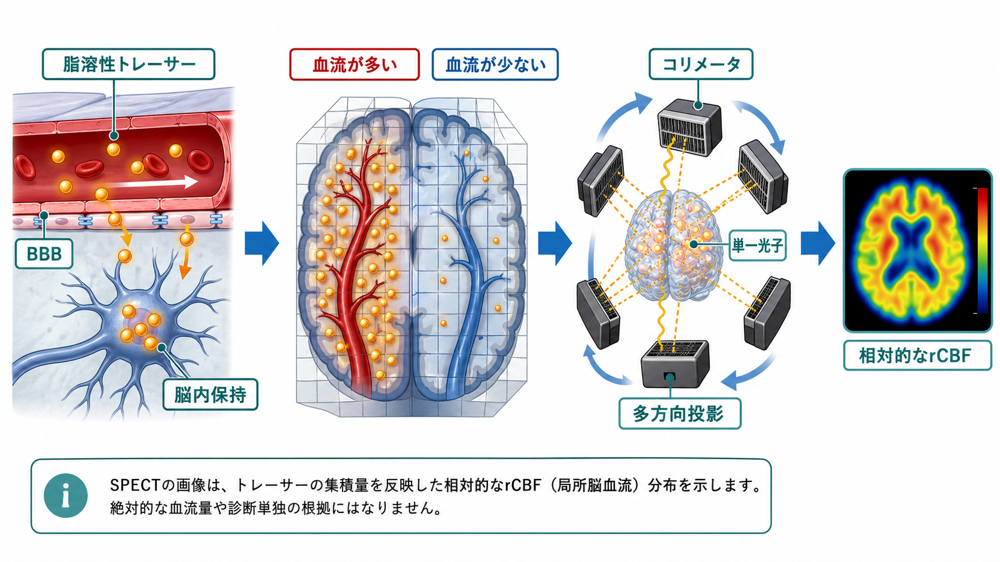
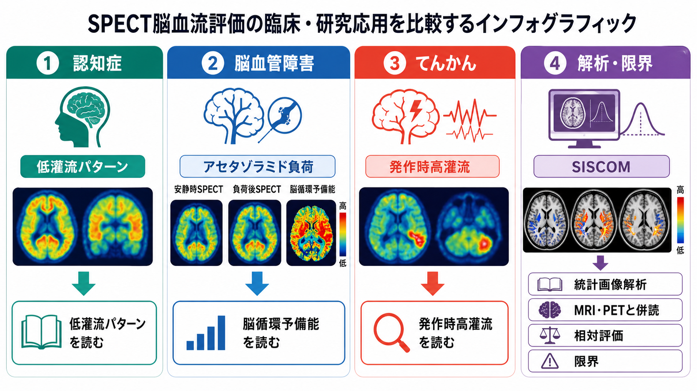

# SPECTは脳血流をどう評価するのか

## 要点

- SPECTは、脳血流そのものを直接撮影するのではなく、血流に乗って脳へ届き、一定時間保持される放射性トレーサーの分布を断層画像として推定する検査である[1][2]。
- 脳血流SPECTでよく使われるトレーサーには、`99mTc-HMPAO`、`99mTc-ECD`、日本で重要な`123I-IMP`などがあり、いずれも局所脳血流、血液脳関門通過、脳内保持、洗い出し、解析モデルの影響を受ける[1][3]。
- 多くの臨床場面では、SPECT画像は「高い・低い」という相対的な局所脳血流パターンとして読まれる。絶対値としてのCBFを出すには、入力関数、採血、動態画像、標準入力関数などを含む定量モデルが必要になる[3][4]。
- 認知症、慢性脳血管障害、てんかん焦点の評価などで使われるが、単独で診断を確定する検査ではなく、症状、神経心理検査、[[T1強調画像とT2強調画像は何が違うのか|MRI]]、FDG-PET、脳波などと併読する[2][5][6][7]。

## この記事で答える問い

SPECTは「血流を見る検査」と説明されることが多い。しかし、実際の画像は血液の流れそのものではなく、放射性トレーサーがどの領域にどれだけ集積したかを、ガンマ線検出器と画像再構成で推定したものである。このノートでは、SPECTがどのように局所脳血流を反映し、どこまでを臨床的に読めるのかを整理する。

## まず結論

SPECTによる脳血流評価の核心は、**「血流の多い脳領域にはトレーサーが多く届き、その集積分布を単一光子ガンマ線から再構成する」**という点にある。たとえば安静時に後部帯状皮質・楔前部・頭頂側頭連合野の低灌流が目立つ場合、アルツハイマー病に典型的な神経変性パターンと整合することがある[7]。発作時に局所高灌流を示す場合は、てんかん焦点の局在推定に役立つことがある[6]。アセタゾラミド負荷で血流増加が乏しい場合は、慢性脳血管障害における脳循環予備能の低下を示唆する[5]。

ただし、これは個別患者の診断を画像だけで断定するという意味ではない。SPECT信号は、トレーサーの種類、投与時の覚醒・感覚刺激、体動、再構成法、減弱補正、空間分解能、参照領域、統計画像解析の前処理に影響される。したがって、SPECTは「病名を直接写す画像」ではなく、[[脳画像とは何を見ているのか|脳画像]]の一種として、神経活動に関連する血流パターンを間接的に読む方法である。

## 背景

脳はエネルギー需要が高く、局所的な神経活動の変化は、代謝需要や血管反応を通じて局所脳血流の変化と結びつく。[[BOLD信号とは何か|BOLD信号]]を用いるfMRIは血液酸素化の変化を、[[PETは脳の何を測るのか|PET]]は放射性トレーサーの分布を、SPECTは単一光子放出核種からのガンマ線を利用して脳機能に関連する分布を画像化する。

SPECTの強みは、PETに比べて装置・トレーサー供給の面で実施しやすい施設が多く、投与時点の脳血流状態を後から撮像できる点にある。特に発作時SPECTでは、発作が起きたタイミングでトレーサーを投与できれば、撮像は発作後でも投与時点に近い灌流分布を反映しうる[1][6]。一方で、空間分解能や定量性はPETやMRI灌流画像と同じではなく、解釈には限界がある[2]。

## 基本概念

### SPECTとは何か

SPECTは *single-photon emission computed tomography* の略で、体内に投与した放射性医薬品から放出される単一光子ガンマ線を、体外のガンマカメラで多方向から検出し、断層画像に再構成する核医学検査である[1][2]。脳血流SPECTでは、脳に取り込まれやすい脂溶性トレーサーを使い、局所的な集積量を灌流の指標として読む。

### rCBFとは何か

rCBFは *regional cerebral blood flow*、つまり局所脳血流を指す。SPECTで見えるカウント分布は、単純には「その領域の放射能カウント」であり、厳密な血流値そのものではない。相対画像では、全脳平均、小脳、橋、特定の参照領域などに対する相対値として表示されることが多い。絶対値のCBF、たとえば `mL/100 g/min` に近づけるには、入力関数や動態モデルが必要になる[3][4]。

### トレーサーの違い

`99mTc-HMPAO`と`99mTc-ECD`は、脳血流SPECTで広く使われるテクネチウム標識トレーサーである。SNMMIの手順書では、投与前後の環境を一定にし、静かな薄暗い部屋で、会話や読書などの刺激を避けることが重視されている[1]。これは、トレーサー投与時の脳活動状態が画像に反映されるからである。

`123I-IMP`は、とくに日本の脳血流定量で重要なトレーサーである。IMPは脳血流との線形性が比較的よいとされ、ARG法などのモデルを用いることで定量的rCBF推定に使われてきた[3][4]。ただし、定量法ごとに仮定があり、入力関数、脳から血液へのクリアランス、分布容積などの扱いが結果に影響する。

## 仕組み

### 1. 投与時点の脳状態を固定する

脳血流SPECTでは、トレーサーが投与された時点の脳血流分布が重要である。安静時評価では、検査前から静かな環境を保ち、視覚・聴覚刺激、会話、読書、強い不安、体動をできるだけ減らす。SNMMI手順書は、静かな薄暗い部屋、投与前からの静脈路確保、投与前後の不要な相互作用を避けることを推奨している[1]。

### 2. トレーサーが血流に乗って脳へ届く

トレーサーは静脈から投与され、心拍出と脳血流に乗って脳血管床へ到達する。局所血流が高い領域には、単位時間あたりより多くのトレーサーが届く。ここで重要なのは、SPECTが「血管の形」を主に見る検査ではなく、組織に届いたトレーサー分布を読む検査だという点である。

### 3. 血液脳関門を通過して脳内に保持される

HMPAO、ECD、IMPのような脳血流トレーサーは、一定程度[[血液脳関門はなぜ必要なのか|血液脳関門]]を通過し、脳組織内に保持される。保持のされ方はトレーサーごとに異なる。したがって、画像信号は血流だけでなく、抽出率、代謝的変換、脳内保持、洗い出しの影響を受ける[1][3]。

### 4. ガンマ線を多方向から検出する

トレーサーから放出されたガンマ線は、コリメータ付きガンマカメラで検出される。コリメータは、どの方向から来た光子かを制限するために必要だが、そのぶん感度を下げる。SPECTの空間分解能がPETやMRIより粗くなりやすい理由の一つである。

### 5. 断層再構成と補正を行う

多方向の投影データから、脳内放射能分布を再構成する。ここでは、減弱、散乱、解像度、体動、再構成アルゴリズム、標準脳への正規化などが結果に影響する。統計画像解析では、個人画像を標準脳へ合わせ、健常データベースと比較して、相対的低灌流や高灌流を表示することがある[7]。

## 図解

SPECT脳血流画像は、次のような連鎖として理解するとよい。

| 段階 | 何が起きるか | 解釈上の注意 |
|---|---|---|
| 投与 | 安静、発作時、負荷後など、狙った状態でトレーサーを投与する | 投与時点の環境・症状・刺激が画像に残る |
| 集積 | 血流に乗って届いたトレーサーが脳内に保持される | 血流だけでなくトレーサー特性も反映する |
| 検出 | 単一光子ガンマ線を多方向から測る | コリメータにより感度・分解能の制約がある |
| 再構成 | 断層画像や3D分布へ変換する | 補正・正規化・参照領域で見え方が変わる |
| 読影 | 低灌流・高灌流パターンを臨床情報と照合する | 病名の直接表示ではない |

## 臨床・研究との接続

### 認知症

認知症領域では、SPECTは神経変性に関連する低灌流パターンの評価に用いられる。2024年のレビューでは、アルツハイマー病では早期から後部帯状皮質・楔前部の低灌流が目立ち、その後、頭頂側頭皮質へ広がることが整理されている[7]。レビー小体型認知症では後頭葉低灌流や内側側頭葉の相対的保たれ方が議論され、前頭側頭型認知症では前頭葉・側頭葉優位の低灌流が問題になる。

ただし、認知症診療はアミロイド、タウ、神経変性、血管病変、臨床症状の組み合わせで考える方向へ進んでいる。SPECTは神経変性や機能低下のパターンを補助する情報であり、認知症やアルツハイマー病の診断を単独で確定するものではない。

### 慢性脳血管障害と脳循環予備能

慢性内頸動脈狭窄・閉塞や中大脳動脈狭窄では、安静時血流が保たれていても、血管がすでに最大限拡張しており、追加の需要に応じる余力が低いことがある。アセタゾラミドは炭酸脱水酵素阻害を通じて脳血管拡張を引き起こし、健常領域ではCBFを増加させる。反応が乏しい領域は、脳循環予備能が低い可能性を示す[2][5]。

この文脈では、安静時画像だけでなく、負荷後画像との比較が重要になる。Choiらは、基礎状態とアセタゾラミド負荷後の`99mTc-HMPAO` SPECTから、相対的CVRのパラメトリック画像を作成し、血行動態異常の定量評価可能性を検討している[5]。

### てんかん

てんかんでは、発作時には焦点および伝播経路で高灌流、発作間欠期には低灌流を示すことがある。発作時SPECTと発作間欠期SPECTを差分し、MRIに重ね合わせるSISCOMは、薬剤抵抗性てんかんの焦点局在推定に用いられる[6]。特に、MRIで明瞭な病変がない場合や、ビデオ脳波だけでは局在が不十分な場合に補助的価値がある。

一方で、発作開始から投与までの遅れ、発作の広がり、投与時点の発作型、画像処理条件によって結果は変わる。したがって、[[脳波EEGは何を測っているのか|脳波]]、発作症候学、MRI、PET、神経心理検査と統合して読む必要がある。

### PET・fMRI・MRI灌流との違い

[[PETは脳の何を測るのか|PET]]は、トレーサー設計によって糖代謝、受容体、アミロイド、タウなど多様な分子標的を扱える。[[受容体PETとは何か|受容体PET]]では、血流だけでなく結合能や非特異的結合も問題になる。[[fMRIは神経活動を直接測っているのか|fMRI]]は、神経活動に伴う血液酸素化変化を高い時間分解能で追いやすい。一方、SPECTは投与時点の状態を比較的安定して固定できるが、時間分解能は低い。

この違いを理解すると、SPECTの役割は明確になる。SPECTは、神経活動と血管反応の「状態」を、比較的実施しやすい核医学画像として捉える方法である。リアルタイムの神経活動記録ではなく、投与時点の灌流分布のスナップショットに近い。

## よくある誤解

### 「SPECTは血流を直接測っている」

厳密には、SPECTが測るのは検出器に到達したガンマ線である。そこからトレーサー分布を再構成し、トレーサー分布を局所脳血流の指標として解釈する。血流を直接流速計のように測っているわけではない。

### 「低灌流があれば、その部位が必ず壊れている」

低灌流は、神経変性、血管性変化、遠隔効果、機能低下、薬剤、覚醒水準、解析上の相対化などで生じる。構造破壊を直接意味するとは限らない。[[FA値とは何か]]や[[FLAIR画像はどのような病変検出に役立つのか]]のような構造・拡散・病変検出系の画像と組み合わせて読む必要がある。

### 「定量値が出れば客観的に決まる」

定量法は有用だが、入力関数、採血タイミング、動態モデル、参照領域、標準脳変換、装置差の影響を受ける。`123I-IMP`のARG法は定量性を高める代表的な方法だが、分布容積や洗い出しの仮定が結果に影響する[3][4]。数値は読影を補助するものであり、文脈から切り離して扱うべきではない。

### 「SPECTだけで認知症やてんかん焦点を確定できる」

SPECTは補助診断として価値があるが、臨床診断、神経心理検査、MRI、PET、脳波、経過観察と統合して解釈する。特に医療判断では、個別症例の診断や治療方針を画像だけで決めるのではなく、専門家による総合評価が必要である。

## 関連ノート

- [[脳画像とは何を見ているのか]]
- [[PETは脳の何を測るのか]]
- [[受容体PETとは何か]]
- [[fMRIは神経活動を直接測っているのか]]
- [[BOLD信号とは何か]]
- [[血液脳関門はなぜ必要なのか]]
- [[脳波EEGは何を測っているのか]]

### 関連ノート候補

- 脳血流とは何か
- FDG-PETは脳代謝をどう可視化するのか
- 認知症とは何か
- アルツハイマー型認知症とは何か
- 血管性認知症とは何か
- 脳循環予備能とは何か
- アセタゾラミド負荷SPECTとは何か
- SISCOMとは何か
- 核医学画像の減弱補正とは何か

### MOC更新候補

- `content/00_MOC/`配下の脳画像・神経計測関連MOCに本記事を追加する。
- 並列ジョブとの競合を避けるため、この作業ではMOC本体は更新しない。

## 理解チェック

1. SPECT脳血流画像が直接測っている物理量は何か。
2. 安静時SPECTで投与時の環境を一定にする必要があるのはなぜか。
3. `99mTc-HMPAO`、`99mTc-ECD`、`123I-IMP`のようなトレーサーが局所脳血流の指標になる理由は何か。
4. アセタゾラミド負荷SPECTでは、安静時画像だけでは見えにくい何を評価しようとしているのか。
5. てんかんのSISCOMでは、発作時SPECTと発作間欠期SPECTを比較することで何を強調しているのか。

## 参考文献

[1] Juni JE, Waxman AD, Devous MD Sr, et al. Procedure guideline for brain perfusion SPECT using 99mTc radiopharmaceuticals 3.0. *Journal of Nuclear Medicine Technology*. 2009;37(3):191-195. https://tech.snmjournals.org/content/37/3/191

[2] Kaechele AP, Chakko MN. Nuclear Medicine Cerebral Perfusion Scan. *StatPearls*. Updated 2023. https://www.ncbi.nlm.nih.gov/books/NBK582135/

[3] Kameyama M, Watanabe K. A new non-invasive graphical method for quantification of cerebral blood flow with [123I]IMP. *Annals of Nuclear Medicine*. 2018;32(9):620-626. https://doi.org/10.1007/s12149-018-1282-8

[4] Ito H, Ishii K, Atsumi H, et al. Error analysis of autoradiography method for measurement of cerebral blood flow by 123I-IMP brain SPECT: a comparison study with table look-up method and microsphere model method. *Annals of Nuclear Medicine*. 1995;9(4):185-190. https://doi.org/10.1007/BF03168399

[5] Choi H, Yoo MY, Cheon GJ, Kang KW, Chung JK, Lee DS. Parametric cerebrovascular reserve images using acetazolamide 99mTc-HMPAO SPECT: a feasibility study of quantitative assessment. *Nuclear Medicine and Molecular Imaging*. 2013;47(3):188-195. https://doi.org/10.1007/s13139-013-0214-8

[6] Aungaroon G, Trout AT, Radhakrishnan R, et al. Subtraction ictal SPECT coregistered to MRI (SISCOM) as a guide in localizing childhood epilepsy. *Epilepsia Open*. 2019;4(1):81-90. https://doi.org/10.1002/epi4.12289

[7] Imokawa T, Yokoyama K, Takahashi K, et al. Brain perfusion SPECT in dementia: what radiologists should know. *Japanese Journal of Radiology*. 2024;42:1250-1266. https://doi.org/10.1007/s11604-024-01612-5

## 未解決問題

- SPECT、ASL-MRI、FDG-PET、アミロイドPET、タウPETを、認知症診療でどの順序・条件で組み合わせるのが最も有用か。
- 装置差や施設差を越えて、脳血流SPECTの統計画像解析をどこまで標準化できるか。
- 発作時SPECTで、投与遅延や発作伝播の影響をどこまでモデル化できるか。
- 絶対定量と相対評価のどちらが、日常臨床の意思決定にどの程度寄与するか。
