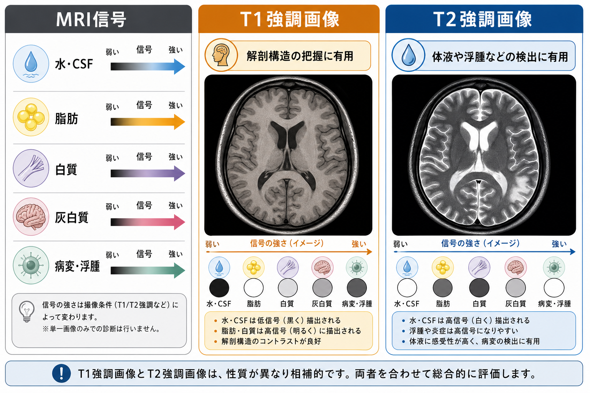
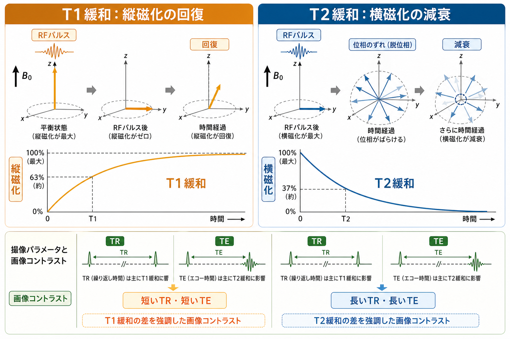
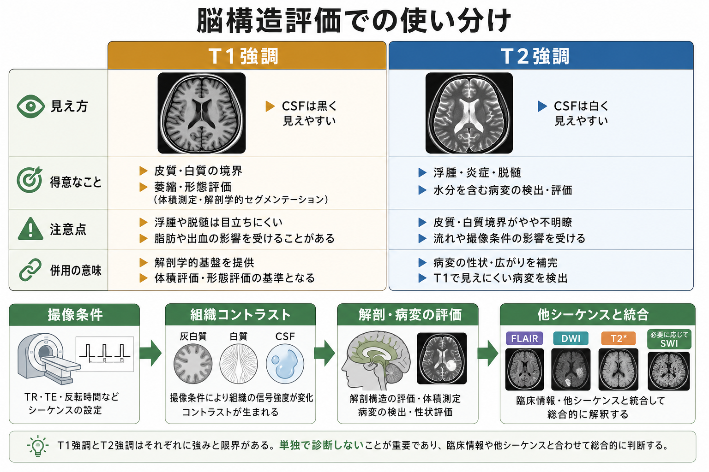

# T1強調画像とT2強調画像は何が違うのか

## 要点

- MRI画像の明るさは、組織中の水素原子核から得られる信号を、撮像条件によってどの物理量に敏感にするかで変わる[1][2]。
- T1強調画像は、主に縦磁化が回復する速さの違いを利用する。脳では白質が灰白質よりやや明るく、脳脊髄液（CSF）は暗く見えやすいため、皮質・白質境界や形態評価に使いやすい[2][3]。
- T2強調画像は、主に横磁化が減衰する速さの違いを利用する。水分の多い組織やCSFが明るく見えやすく、浮腫、炎症、脱髄など水分変化を伴う病変を拾いやすい[3][4]。
- 「T1画像」「T2画像」は純粋なT1値・T2値の地図ではない。実際のコントラストにはプロトン密度、流れ、磁化率、撮像シーケンス、装置条件も混ざる[1][5]。
- 脳構造評価では、T1とT2を競合させるのではなく、T1で解剖学的な基盤を見て、T2やFLAIR、DWI、T2*/SWIなどで病変性状を補う[4][6]。

## この記事で答える問い

- T1強調画像とT2強調画像は、何を「強調」しているのか。
- なぜT1ではCSFが黒く、T2ではCSFが白く見えやすいのか。
- 脳構造評価では、T1とT2をどのように使い分けるのか。
- 「T1/T2を見れば診断できる」という理解のどこが危ないのか。

## まず結論

T1強調画像とT2強調画像の違いは、同じ脳を別の「物理的な窓」から見ている点にある。T1強調画像は、RFパルスで乱された縦方向の磁化がどれだけ回復したかを反映しやすい。T2強調画像は、横方向にそろったスピンの位相がどれだけばらけて信号が減ったかを反映しやすい[1][2]。

脳画像で直感的に言えば、T1強調画像は解剖構造を読む画像、T2強調画像は水分変化に敏感な画像である。T1では皮質、白質、脳室、脳溝、萎縮、形態が読みやすく、T2ではCSF、浮腫、炎症、脱髄、古い梗塞性変化などが目に入りやすい[3][4]。ただし、これは教育上の単純化であり、実際の読影では撮像法、造影、FLAIR、DWI、T2*/SWI、臨床情報を合わせて解釈する。

## 背景

CTはX線吸収の違いを画像化するが、MRIは主に水素原子核の磁気的なふるまいを画像化する。強い静磁場 $B_0$ の中では、水素原子核の集団がわずかに同じ向きへそろい、全体として縦方向の磁化を作る。RFパルスを加えると、この磁化が倒され、受信コイルで検出できる信号が生じる[3]。

RFパルスの後、磁化は元の平衡状態へ戻っていく。この戻り方には大きく2つの側面がある。縦磁化が回復する過程がT1緩和、横磁化が失われる過程がT2緩和である[2][3]。同じ脳組織でも、脂肪、水、白質、灰白質、血液成分、病変組織では緩和時間が異なるため、撮像条件を変えると画像コントラストが変わる。

## 基本概念

### T1緩和

T1緩和は、RFパルス後に縦磁化が $B_0$ 方向へ回復する過程である。T1時間は、縦磁化が平衡値の約63%まで戻る時間として説明されることが多い[3][4]。脂肪や髄鞘成分に富む組織は比較的T1が短く、T1強調画像では明るくなりやすい。CSFや水分の多い組織はT1が長く、短いTRで十分に回復しないため暗く見えやすい。

脳では、白質は脂質に富む[[髄鞘はなぜ神経伝導を速くするのか|髄鞘]]を多く含むため、T1強調画像で灰白質より明るく見えやすい。これにより、皮質・白質境界、脳室、脳溝、萎縮、腫瘤による形態変化などを評価しやすい。

### T2緩和

T2緩和は、RFパルス後に横方向へそろったスピンの位相がばらけ、横磁化が減衰する過程である。T2時間は、横磁化が約37%まで減衰する時間として説明される[3][6]。自由水は分子間相互作用が比較的弱いためT2が長く、T2強調画像ではCSFや浮腫が明るく見えやすい[3][4]。

この性質のため、T2強調画像は「水っぽい変化」を拾うのに向いている。脱髄、炎症、浮腫、慢性期の梗塞性変化などはT2高信号として見えることが多い。ただし、T2高信号は病因を一つに決める所見ではない。年齢、血管性変化、炎症、脱髄、腫瘍、外傷後変化など、多くの可能性を文脈と合わせて考える必要がある。

## 仕組み

スピンエコー系の単純化した説明では、TR（repetition time）とTE（echo time）が画像コントラストを大きく左右する。TRは次のRFパルスまでの間隔で、主にT1差をどれだけ残すかに関わる。TEは信号を読むまでの時間で、主にT2減衰差をどれだけ見せるかに関わる[1][2]。

- 短いTR・短いTEでは、T1差が強調されやすい。
- 長いTR・長いTEでは、T2差が強調されやすい。
- 長いTR・短いTEでは、T1差もT2差も相対的に弱まり、プロトン密度の寄与が目立ちやすい[1]。

なぜT1では「長いT1の水」が暗く、T2では「長いT2の水」が明るいのか。T1強調画像では、短いTRで次のRFパルスをかけるため、T1が長い組織は縦磁化が十分に回復せず、次に取り出せる信号が小さい。反対にT1が短い組織は早く回復し、信号が大きくなる。T2強調画像では、長いTEまで待つため、T2が短い組織は信号が大きく減衰し、T2が長い水分は信号を保ちやすい[1][2]。

## 図解

T1強調画像とT2強調画像の使い分けは、次のように整理できる。

| 観点 | T1強調画像 | T2強調画像 |
|---|---|---|
| 主に反映しやすい差 | 縦磁化の回復の違い | 横磁化の減衰の違い |
| CSF | 暗く見えやすい | 明るく見えやすい |
| 白質と灰白質 | 白質がやや明るく、境界を追いやすい | 境界はT1より弱いことが多い |
| 得意な評価 | 解剖、形態、萎縮、体積測定、造影効果 | 浮腫、炎症、脱髄、水分を含む病変 |
| 注意点 | 浮腫や脱髄は目立ちにくいことがある | CSFが明るく、脳室周囲病変はFLAIRが有用なことがある |

## 臨床・研究との接続

### 脳構造MRI

研究では、T1強調画像は解剖学的な標準画像として使われることが多い。皮質厚、灰白質体積、白質体積、脳室容積、脳萎縮、領域分割などは、T1強調画像を基盤に処理されることが多い。これは、T1強調画像が皮質・白質境界や頭蓋内構造の区別に向いているためである[2][3]。

一方で、白質病変や浮腫性変化を見たい場合、T2強調画像やFLAIRが重要になる。FLAIRはT2感受性を保ちながらCSF信号を抑えるため、脳室周囲や脳溝近傍の病変が見やすくなることがある[5]。[[構造的結合と機能的結合は何が違うのか|構造的結合]]を扱う研究では、T1/T2だけでなく、拡散MRIなど別のコントラストも必要になる。

### 臨床画像

臨床では、T1強調画像とT2強調画像は単独で結論を出すための画像ではなく、相補的な材料である。T1で形を確認し、T2で水分変化を確認し、FLAIRでCSF近傍の病変を確認し、DWI/ADCで拡散制限を見て、T2*/SWIで出血や鉄沈着・石灰化に関わる磁化率変化を評価する、というように複数の系列を統合する[4][6]。

造影MRIでは、ガドリニウム造影剤が主にT1短縮効果を通じて病変や血管の信号を高めるため、造影T1強調画像が重要になる[4]。ただし造影の適応や安全性は個別の臨床判断に属し、研究・教育目的の記事だけで診断や治療方針を決めることはできない。

## よくある誤解

### 誤解1: T1は解剖、T2は病変、と完全に分けられる

これは便利な入口だが、厳密ではない。T1強調画像でも病変は見えるし、T2強調画像でも解剖は読める。違いは「何に敏感か」であって、「何しか見えないか」ではない。

### 誤解2: T1強調画像はT1値そのもの、T2強調画像はT2値そのものを表す

通常のT1強調画像・T2強調画像は、定量的なT1マップ・T2マップではない。画像の明るさには、T1、T2、プロトン密度、シーケンス設計、受信感度、補正処理などが混ざる[1][5]。定量値が必要な研究では、専用の定量MRI手法を使う。

### 誤解3: CSFが黒ければT1、白ければT2と覚えれば十分

初学者には役立つが、FLAIRのようにT2感受性がありながらCSFを抑制する系列があるため、CSFの色だけで判断すると間違える[5]。画像の見え方は、T1/T2だけでなく、反転回復、脂肪抑制、流れ、磁化率、撮像後処理にも左右される。

### 誤解4: T2高信号は特定の病気を意味する

T2高信号は、水分増加や組織変化を示すことが多いが、原因は一つではない。脱髄、虚血性変化、炎症、浮腫、腫瘍性変化、外傷後変化など、鑑別には分布、形、経時変化、他系列、臨床情報が必要である。

## 関連ノート

- [[MOC｜脳・神経科学]]
- [[髄鞘はなぜ神経伝導を速くするのか]]
- [[グリア細胞は単なる支持細胞なのか]]
- [[血液脳関門はなぜ必要なのか]]
- [[構造的結合と機能的結合は何が違うのか]]

MOC更新候補: `content/00_MOC/MOC｜脳・神経科学.md` に、本記事を「脳画像・神経計測」または「構造MRI」の項目として追加する。

今後の作成候補: 「FLAIRとは何か」「DWIとADCは何が違うのか」「T2*強調画像とSWIは何を見るのか」「構造MRIの前処理とは何か」。

## 理解チェック

1. T1強調画像でCSFが暗く見えやすいのは、短いTRでは長いT1をもつ水が十分に縦磁化を回復できないためである。
2. T2強調画像でCSFや浮腫が明るく見えやすいのは、水分が長いT2をもち、長いTEでも横磁化信号が残りやすいためである。
3. T1強調画像は、皮質・白質境界、脳室、脳溝、萎縮、体積測定など解剖学的評価の基盤になりやすい。
4. T2強調画像は、水分変化を伴う病変の検出に有用だが、T2高信号だけで病因を決めることはできない。
5. 通常のT1/T2強調画像は、T1値・T2値そのものを測った定量マップではない。

## 参考文献

[1] Nitz, W. R., & Reimer, P. (1999). Contrast mechanisms in MR imaging. *European Radiology*, 9, 1032-1046. https://doi.org/10.1007/s003300050789

[2] Jung, B. A., & Weigel, M. (2013). Spin echo magnetic resonance imaging. *Journal of Magnetic Resonance Imaging*, 37(4), 805-817. https://doi.org/10.1002/jmri.24068

[3] Pai, A., Shetty, R., Hodis, B., & Chowdhury, Y. S. (2023). Magnetic Resonance Imaging Physics. In *StatPearls*. StatPearls Publishing. https://www.ncbi.nlm.nih.gov/books/NBK564320/

[4] Ibrahim, M. A., Hazhirkarzar, B., & Dublin, A. B. (2023). Gadolinium Magnetic Resonance Imaging. In *StatPearls*. StatPearls Publishing. https://www.ncbi.nlm.nih.gov/books/NBK482487/

[5] Elster, A. D. MR parameter weighting. *Questions and Answers in MRI*. https://www.mriquestions.com/meaning-of-weighting.html

[6] Chavhan, G. B., Babyn, P. S., Thomas, B., Shroff, M. M., & Haacke, E. M. (2009). Principles, techniques, and applications of T2*-based MR imaging and its special applications. *Radiographics*, 29(5), 1433-1449. https://pmc.ncbi.nlm.nih.gov/articles/PMC2799958/
