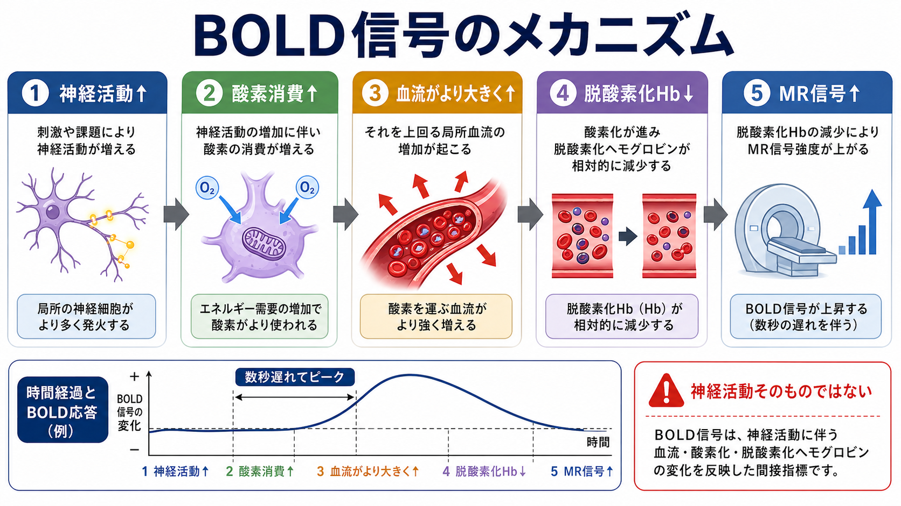
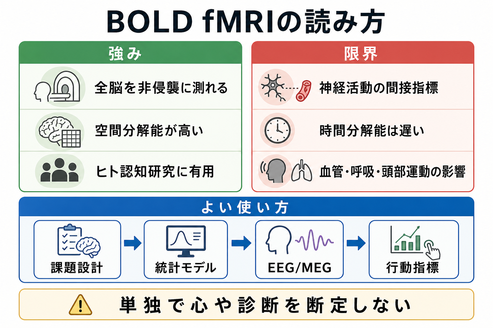

# fMRIは神経活動を直接測っているのか

## 要点

- fMRIの代表的な信号であるBOLD信号は、神経発火やシナプス電流を直接測っているわけではない。
- BOLDは、神経活動に伴う局所血流、酸素消費、酸素化ヘモグロビンと脱酸素化ヘモグロビンの比率変化を反映する間接指標である [1][2][4]。
- 活動した領域では酸素消費も増えるが、多くの場合それを上回る局所脳血流の増加が起こり、脱酸素化ヘモグロビンが相対的に減る。その結果、T2*強調MR信号が上がる [5][6]。
- BOLD信号は神経活動と有用に結びつくが、時間遅れ、血管反応、呼吸・心拍、頭部運動、解析モデルの影響を受ける [6][7][8]。
- したがって、fMRIは「脳のどこが条件間で相対的に変化したか」を調べる強力な方法であり、「心」や「個人の診断」を単独で直接読む方法ではない。

## この記事で答える問い

1. fMRIはニューロンの活動を直接測っているのか。
2. BOLD信号は、血流・酸素化・ヘモグロビンとどう関係するのか。
3. fMRI結果を研究や臨床の文脈で読むとき、どこに注意が必要か。

## まず結論

fMRIは、神経活動を**直接**測っているのではなく、神経活動に伴って起こる血行動態の変化を測っている。もっと正確には、よく使われるBOLD fMRIは、局所の脱酸素化ヘモグロビン量が変わることで生じる磁気共鳴信号の変化を測る。

この違いは重要である。[[ニューロンとは何か|ニューロン]]の発火や[[シナプスとは何か|シナプス]]入力はミリ秒単位で変化する。一方、BOLD応答は数秒単位で立ち上がり、ピークに達し、ゆっくり戻る。fMRIで見える「活動」は、神経活動、血管応答、代謝、計測条件、統計モデルを通った後の相対的な信号である [4][5][8]。

## 背景

fMRIが広く使われるようになった理由は、ヒトの脳活動を非侵襲的に、比較的高い空間分解能で、全脳に近い範囲から測れるからである。1990年代初頭、血液酸素化に依存したMRコントラストが脳機能計測に使えることが示され、感覚刺激や課題中のヒト脳活動をMRIで追跡する研究が始まった [1][2][3]。

ただし、この技術の便利さは誤解も生みやすい。fMRI画像で色がついた領域を見ると、そこに「神経活動そのもの」が直接映っているように感じられる。しかし実際には、fMRIの色付きマップは、課題条件、対照条件、前処理、統計モデル、閾値設定によって得られた推定結果である。これは[[構造的結合と機能的結合は何が違うのか|機能的結合]]や[[脳内ネットワークとは何か|脳内ネットワーク]]を読むときにも同じで、計測指標と生物学的過程を一対一に同一視しないことが基本になる。

## 基本概念

### BOLD信号

BOLDは blood-oxygen-level dependent の略で、血液の酸素化状態に依存するMR信号変化を指す。脱酸素化ヘモグロビンは磁場を乱しやすく、T2*強調画像の信号を下げる方向に働く。局所血流が増えて脱酸素化ヘモグロビンが相対的に減ると、BOLD信号は上がりやすくなる [1][5]。

### 神経血管カップリング

神経血管カップリングとは、神経活動の変化が、血管径、血流、血液量、酸素供給へ結びつく過程である。ここにはニューロンだけでなく、[[アストロサイトはシナプスと代謝をどう支えているのか|アストロサイト]]、血管内皮細胞、周皮細胞、平滑筋、代謝物、神経修飾系などが関わる [6][7]。したがって、BOLD信号は「神経活動だけ」の関数ではなく、神経血管ユニット全体の応答として読む必要がある。

### 血流と酸素消費

神経活動が増えると、ATP需要が増え、酸素消費も増える。しかし典型的なBOLD陽性応答では、局所脳血流の増加が酸素消費の増加を上回る。そのため、酸素を使った後の脱酸素化ヘモグロビンは相対的に薄まり、MR信号が上がる [5][6]。

## 仕組み

BOLD応答は、単純化すると次の流れで理解できる。

| 段階 | 起きていること | fMRI解釈での注意 |
|---|---|---|
| 1. 神経活動 | 課題、刺激、内的状態により局所のシナプス入力や発火が変わる | 発火だけでなく局所場電位やシナプス活動も関係する |
| 2. 代謝需要 | イオン勾配の回復や伝達物質処理にエネルギーが必要になる | [[グリア細胞は単なる支持細胞なのか|グリア細胞]]や代謝支援も関わる |
| 3. 血管応答 | 血管拡張により局所脳血流が増える | 血管反応性、薬物、加齢、疾患、CO2などに影響される |
| 4. 酸素化変化 | 脱酸素化ヘモグロビンが相対的に減る | 「酸素消費が減った」という意味ではない |
| 5. MR信号 | T2*強調画像で信号が変化する | 神経活動から数秒遅れる |

Logothetisらのサル研究は、BOLD信号が神経活動と密接に関連する一方で、単一ニューロンのスパイクよりも局所場電位、つまり集団的な入力・シナプス処理と強く対応することを示した [4]。この知見は、fMRIを「出力としての発火率の地図」と単純化しすぎないために重要である。

## 図解

図1は、BOLD応答を「神経活動そのもの」ではなく、神経活動に連動した血流・酸素化・脱酸素化ヘモグロビンの変化として整理している。図の中の時間曲線が示すように、BOLD信号は神経活動より遅れて立ち上がる。

図2は、BOLD fMRIの強みと限界を並べたものである。fMRIは全脳を非侵襲に調べられ、空間分解能に優れる。一方で、時間分解能は神経活動そのものより遅く、血管・呼吸・頭部運動・解析条件の影響を受ける。

## 臨床・研究との接続

研究では、fMRIは課題中の活動、安静時機能結合、薬理学的操作、発達、疾患群比較、治療前後比較などに使われる。たとえば安静時fMRIでは、領域間のBOLD時系列相関から[[デフォルトモードネットワークとは何か|デフォルトモードネットワーク]]などの大規模ネットワークを推定する。これは[[コネクトームとは何か|コネクトーム]]研究の重要な入口でもある。

臨床との接続では、術前マッピング、言語・運動関連領域の推定、疾患群研究、予後予測研究などに使われる。ただし、BOLD信号だけで個人の症状、診断名、治療方針を断定することはできない。脳血管反応性、薬剤、睡眠、年齢、呼吸、頭部運動、解析パイプラインが結果に影響するため、教育・研究目的の知見と個別診断を混同しないことが重要である [7][8]。

また、fMRIデータから因果方向を読む場合にはさらに慎重さが必要になる。[[有効結合とは何か|有効結合]]解析や動的因果モデリングは、観測されたBOLD信号の背後にある神経状態と血行動態をモデル化するが、その結論はモデル仮定に依存する。

## よくある誤解

### 誤解1：fMRIの明るい場所はニューロンが発火している場所そのもの

明るさや色は、多くの場合、条件間差や統計値を可視化したものである。神経発火を直接撮影したものではない。BOLD信号は、神経活動に伴う血行動態変化を介して得られる。

### 誤解2：BOLD信号が上がれば酸素消費が減ったという意味

典型的なBOLD陽性応答では、酸素消費は増えているが、それ以上に血流が増えるため脱酸素化ヘモグロビンが減る。したがって、BOLD上昇を「酸素を使っていない」と読むのは誤りである [5][6]。

### 誤解3：fMRIなら心の内容を直接読める

fMRIは心理過程と脳活動の関係を調べる有力な方法だが、単独で思考内容、人格、診断を直接読む装置ではない。課題設計、対照条件、被験者集団、統計モデル、再現性、他の行動指標との整合性が必要である [8]。

### 誤解4：fMRIは時間分解能も十分に高い

BOLD応答は数秒単位で変化する。ミリ秒単位の神経活動を調べたい場合は、EEG、MEG、頭蓋内記録などの時間分解能の高い方法と組み合わせて考える必要がある。

## 関連ノート

- [[ニューロンとは何か]]
- [[シナプスとは何か]]
- [[アストロサイトはシナプスと代謝をどう支えているのか]]
- [[グリア細胞は単なる支持細胞なのか]]
- [[血液脳関門はなぜ必要なのか]]
- [[構造的結合と機能的結合は何が違うのか]]
- [[脳内ネットワークとは何か]]
- [[コネクトームとは何か]]
- [[有効結合とは何か]]
- [[デフォルトモードネットワークとは何か]]

## 理解チェック

1. BOLD信号が「神経活動の直接測定」ではない理由を、血流とヘモグロビンの変化を含めて説明できるか。
2. BOLD陽性応答で、酸素消費が増えているのに信号が上がりうる理由を説明できるか。
3. fMRIの空間分解能の強みと、時間分解能・血管要因の限界を分けて説明できるか。
4. 安静時fMRIの機能結合を、直接の解剖学的結合や因果方向として読んではいけない理由を説明できるか。

## 関連ノート候補

- 神経血管カップリングとは何か
- BOLD信号とは何か
- 安静時fMRIとは何か
- 課題fMRIとは何か
- EEGとfMRIは何が違うのか
- 脳画像統計の多重比較とは何か

## MOC更新候補

- `content/00_MOC/MOC｜脳・神経科学.md` の「今後追加する代表テーマ」または脳画像・神経計測セクションへ追加。
- 将来 `MOC｜脳画像・神経計測.md` を作る場合、fMRI、BOLD、EEG/MEG、PET、拡散MRIをまとめる入口ノートにする。

## 未解決問題

- BOLD信号に含まれる神経活動成分、血管反応性成分、呼吸・心拍成分を個人レベルでどこまで分離できるか。
- 細胞型ごとの活動、グリア、周皮細胞、血管内皮の寄与を、ヒトfMRIからどこまで推定できるか。
- 疾患群で観察されるBOLD変化を、神経活動の変化、血管機能の変化、薬物・睡眠・行動状態の違いへどう分解するか。

## 参考文献

[1] Ogawa, S., Lee, T. M., Kay, A. R., & Tank, D. W. (1990). Brain magnetic resonance imaging with contrast dependent on blood oxygenation. *Proceedings of the National Academy of Sciences*, 87(24), 9868-9872. https://doi.org/10.1073/pnas.87.24.9868

[2] Kwong, K. K., Belliveau, J. W., Chesler, D. A., Goldberg, I. E., Weisskoff, R. M., Poncelet, B. P., Kennedy, D. N., Hoppel, B. E., Cohen, M. S., Turner, R., Cheng, H. M., Brady, T. J., & Rosen, B. R. (1992). Dynamic magnetic resonance imaging of human brain activity during primary sensory stimulation. *Proceedings of the National Academy of Sciences*, 89(12), 5675-5679. https://doi.org/10.1073/pnas.89.12.5675

[3] Bandettini, P. A., Wong, E. C., Hinks, R. S., Tikofsky, R. S., & Hyde, J. S. (1992). Time course EPI of human brain function during task activation. *Magnetic Resonance in Medicine*, 25(2), 390-397. https://doi.org/10.1002/mrm.1910250220

[4] Logothetis, N. K., Pauls, J., Augath, M., Trinath, T., & Oeltermann, A. (2001). Neurophysiological investigation of the basis of the fMRI signal. *Nature*, 412, 150-157. https://doi.org/10.1038/35084005

[5] Buxton, R. B., Uludag, K., Dubowitz, D. J., & Liu, T. T. (2004). Modeling the hemodynamic response to brain activation. *NeuroImage*, 23(Suppl 1), S220-S233. https://doi.org/10.1016/j.neuroimage.2004.07.013

[6] Hillman, E. M. C. (2014). Coupling mechanism and significance of the BOLD signal: a status report. *Annual Review of Neuroscience*, 37, 161-181. https://doi.org/10.1146/annurev-neuro-071013-014111

[7] Uludag, K., & Blinder, P. (2018). Linking brain vascular physiology to hemodynamic response in ultra-high field MRI. *NeuroImage*, 168, 279-295. https://doi.org/10.1016/j.neuroimage.2017.02.063

[8] Logothetis, N. K. (2008). What we can do and what we cannot do with fMRI. *Nature*, 453, 869-878. https://doi.org/10.1038/nature06976
