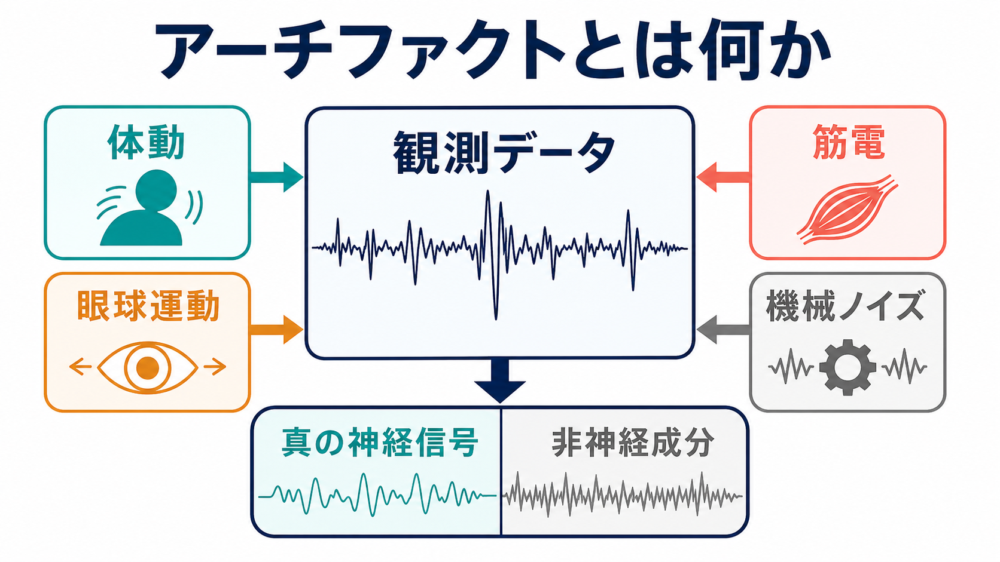
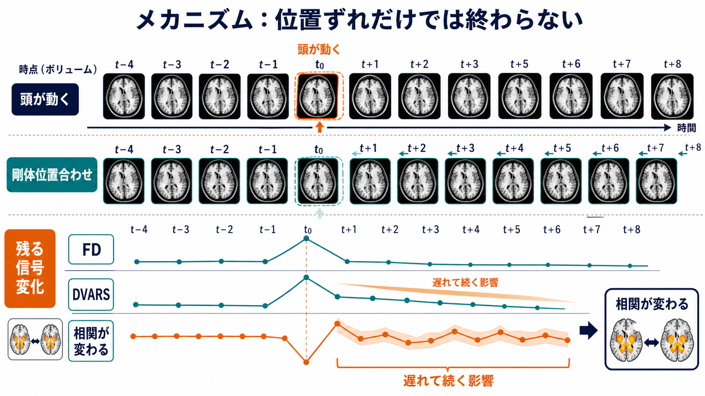
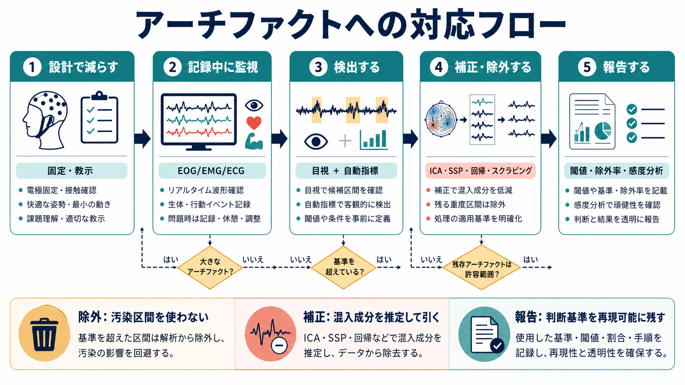

# アーチファクトとは何か

## 要点

- アーチファクトとは、研究者が知りたい神経活動そのものではないのに、観測信号へ混入し、解析結果や解釈を変えてしまう成分である。
- 代表例は、体動、眼球運動、瞬目、筋電、心拍・呼吸、発汗、電極接触不良、電源ノイズ、MRI装置や磁場に由来するノイズである。
- EEG/MEGでは眼電・筋電・電源ノイズ、fMRIでは頭動・呼吸・心拍・磁場歪み、NIRSでは体動・頭皮血流・プローブ接触が問題になりやすい[1][2][3][7]。
- 「補正したから安全」ではない。補正は混入成分を推定して影響を減らす操作であり、神経信号だけを完全に取り出す保証ではない[3][5]。
- 実践上は、記録前に減らし、記録中に監視し、解析で検出・補正・除外し、最後に閾値と手順を報告する、という一連の品質管理として扱う。

## この記事で答える問い

1. 神経計測におけるアーチファクトとは何か。
2. 体動・眼球運動・筋電・機械ノイズは、どのように観測データへ混入するのか。
3. EEG/MEG、fMRI、NIRSでは、アーチファクト対策の考え方がどう違うのか。
4. 研究・臨床の解釈で、どこまで補正し、どこから除外・報告すべきか。

## まず結論

アーチファクトは、単なる「汚いデータ」ではない。**観測された信号が、神経活動、身体由来の生理成分、行動、装置、解析処理の混合物であることを示す入口**である。たとえば[[脳波EEGは何を測っているのか|EEG]]では、瞬目や眼球運動は前頭部電極に大きな低周波成分を作り、咬筋・側頭筋・前頭筋の活動は高周波成分を増やす。[[fMRIは神経活動を直接測っているのか|fMRI]]では、頭が少し動くだけでも、ボクセルの位置ずれ、信号スパイク、磁化履歴、機能的結合の偽相関が生じうる[4][5]。

したがって、解析の目的は「ノイズを全部消す」ことではなく、研究質問に対して何を信号とみなし、何を混入成分として扱うのかを明示することである。瞬目は視覚課題ではアーチファクトになりやすいが、まばたきそのものを研究する場合には行動指標になる。体動も同様に、脳活動を乱す混入源である一方、運動課題や発達研究では研究対象の一部になりうる。

## 背景

神経計測は、脳活動を直接そのまま読む技術ではない。EEG/MEGは頭皮上の電位や頭外の磁場を測り、fMRIは血流・酸素化に関連する[[BOLD信号とは何か|BOLD信号]]を測り、[[近赤外分光法NIRSは何を測っているのか|NIRS]]は近赤外光の吸収変化からヘモグロビン濃度変化を推定する。それぞれの計測法は、神経活動へ近づくための強力な窓である一方、身体や装置の影響を同時に受ける。

観測信号は、単純化すれば次のように考えられる。

$$
y(t) = s_{\mathrm{neural}}(t) + a_{\mathrm{motion}}(t) + a_{\mathrm{physio}}(t) + a_{\mathrm{device}}(t) + \epsilon(t)
$$

ここで $s_{\mathrm{neural}}(t)$ は関心のある神経関連信号、$a_{\mathrm{motion}}(t)$ は体動や頭動、$a_{\mathrm{physio}}(t)$ は心拍・呼吸・眼球運動・筋活動などの生理成分、$a_{\mathrm{device}}(t)$ は装置・環境・電極接触などに由来する成分である。この式は厳密な生成モデルというより、前処理と品質管理で「何を分けたいのか」を整理するための地図である。

## 基本概念

### アーチファクトは研究質問に依存する

同じ成分でも、研究質問によって意味が変わる。たとえば眼球運動は、記憶課題中のEEGを解析する場合には混入成分になりやすい。しかし視線制御や瞬目反応を調べる研究では、眼球運動そのものが主要な行動データである。重要なのは、アーチファクトを「悪いもの」と決めつけることではなく、**目的変数・説明変数・混入変数のどれとして扱うか**を明確にすることである。

### ランダムノイズより危険なのは系統的なアーチファクト

平均化で減りやすいランダムノイズより、条件・群・年齢・症状・課題難度と連動するアーチファクトの方が危険である。たとえば患者群や小児群で頭動が多いと、群差として見える結果が神経活動差ではなく運動量差を反映する可能性がある。安静時fMRIでは、微小な頭動でも機能的結合の推定に系統的な影響を与えることが示されている[4][5]。

### 補正と除外は別の判断である

補正は、混入成分をモデル化して影響を小さくする操作である。除外は、特定の区間、試行、チャンネル、被験者を解析対象から外す操作である。補正はデータ量を保ちやすいが、過補正によって関心信号まで減らす危険がある。除外は汚染の強いデータを避けられるが、データ量を減らし、群間で除外率が偏ると別のバイアスを生む。

## 仕組み

### EEG/MEGでの混入

EEGでは、脳由来の電位と非脳由来の電位が同じ電極で記録される。瞬目や眼球運動は大きな眼電成分として前頭部に現れやすく、筋活動は高周波成分を増やしやすい。電極接触不良やケーブルの揺れは、急なドリフト、スパイク、特定チャンネルだけの異常として出ることがある。EEGLABやMNEでは、ICAを使って眼球・心拍・筋電に対応する成分を同定し、必要に応じて除去・再構成する手順が紹介されている[1][2]。

MEGでも、眼球運動、心拍、歯の金属、環境磁場、頭部位置の変化が問題になる。MEGは磁場を測るため、EEGとは感受性の空間パターンが異なるが、アーチファクトを「センサーで記録された非神経成分」として扱う基本は同じである。

### fMRIでの混入

fMRIでは、頭動が画像間の位置ずれだけでなく、信号強度変化、スライス取得タイミングとの相互作用、磁場不均一、spin-history効果を生む。剛体位置合わせを行っても、動きに伴う信号変化は時系列に残りうる。Powerらは、安静時機能的結合で頭動が偽の相関構造を作り、近距離結合を過大に、長距離結合を過小に見せる可能性を報告した[4]。さらに、頭動由来の信号変化は10秒以上続く場合があり、単純な1時点の除外だけでは不十分なことがある[5]。

そのため、[[頭動補正はfMRIでなぜ重要なのか|頭動補正]]では、剛体位置合わせ、motion parameters、FD、DVARS、scrubbing、CompCor、ICA系手法、視覚的品質確認を組み合わせることが多い。CompCorは、白質や脳脊髄液など神経活動の寄与が小さいと想定される領域から主成分を抽出し、nuisance regressorsとして扱う方法である[6]。fMRIPrepのような標準化された前処理パイプラインは、再現性と透明性を高めるが、それだけで残存アーチファクト問題が消えるわけではない[8]。

### NIRSでの混入

NIRSでは、プローブと頭皮の接触、体動、頭皮血流、心拍、呼吸、血圧変動、発汗が信号に影響する。fNIRSの前処理法は研究間でばらつきが大きく、フィルタ、モーション補正、短距離チャンネル、GLMの設定をどう選ぶかが解釈に直結する[7]。特に乳幼児・臨床群・自然場面の研究では、動きやすさ自体が群や条件と関係するため、単に「動いた部分を消す」だけではなく、動きの偏りを報告する必要がある。

## 図解

| 段階 | 主な目的 | 具体例 |
|---|---|---|
| 設計で減らす | 記録前に混入を少なくする | 姿勢固定、課題練習、電極・プローブ固定、装置環境の確認 |
| 同時計測する | 混入源を別チャンネルで記録する | EOG、EMG、ECG、呼吸、頭部位置、行動イベント |
| 検出する | どこに何が混じったかを見つける | 目視、振幅閾値、スペクトル、FD、DVARS、独立成分 |
| 補正する | 推定可能な混入成分を減らす | ICA、SSP、回帰、CompCor、フィルタ、短距離チャンネル回帰 |
| 除外する | 補正困難なデータを使わない | bad channel、bad epoch、scrubbing、被験者除外 |
| 報告する | 再現可能性を残す | 閾値、除外率、補正手順、感度分析、品質指標 |

## 臨床・研究との接続

臨床EEGでは、アーチファクトをてんかん性放電や徐波と誤認しないことが重要である。筋電、瞬目、心電、電極ポップ、体動は、病的波形に似た形をとることがある。ただし本記事は教育・研究目的の整理であり、個別の診断や治療方針を示すものではない。

研究では、アーチファクト対策は再現性の一部である。たとえば[[安静時fMRIは何を測っているのか|安静時fMRI]]や[[機能的結合解析とは何か|機能的結合解析]]では、頭動が群差と混ざると、脳ネットワーク差のように見える結果が生じうる[4][5]。[[独立成分分析ICAはfMRIでどう使われるのか|ICA]]やCompCorなどの方法は有用だが、手法ごとの仮定、残存ノイズ、自由度の減少、過補正を確認する必要がある[3][6]。

精神医学・発達研究では、とくに慎重さが必要である。患者群、小児、高齢者、重症度の高い参加者では、体動、眠気、課題理解、薬物、呼吸、心拍が対照群と異なることがある。したがって、群差を神経基盤として読む前に、品質指標、除外率、動きの分布、感度分析を確認するのが基本である。

## よくある誤解

### 誤解1: 前処理を強くすれば、データはきれいになる

見た目の滑らかさやノイズ指標の改善は、神経信号の忠実な復元を意味しない。強いフィルタ、過剰な成分除去、過度の平滑化は、関心のある信号まで弱めることがある。補正前後で波形、空間分布、スペクトル、除外率、結果の安定性を確認する必要がある[3][5]。

### 誤解2: ICAでアーチファクトは全部取れる

ICAは、空間的・時間的に比較的一貫した成分を分離するのに有用である。しかし、一過性の大きな体動、電極ずれ、非線形な混入、分類が曖昧な成分には限界がある。EEGLABやMNEの実践でも、成分の地形、時系列、スペクトル、EOG/ECGとの関係を見ながら判断することが前提になっている[1][2]。

### 誤解3: 少ししか動いていないなら問題にならない

fMRIの機能的結合解析では、微小な頭動でも距離依存的な偽相関を作ることがある[4]。問題は動きの大きさだけではなく、いつ動いたか、どの群で多いか、動きに伴う信号変化がどれだけ残ったかである。

### 誤解4: アーチファクトを除外すると恣意的になる

恣意性を減らすには、除外しないことではなく、事前に基準を定め、閾値、除外率、判断手順、感度分析を報告することが重要である。補正と除外のどちらにもバイアスはあるため、透明な報告が研究の信頼性を支える。

## 関連ノート

- [[脳画像とは何を見ているのか]]
- [[fMRIは神経活動を直接測っているのか]]
- [[BOLD信号とは何か]]
- [[頭動補正はfMRIでなぜ重要なのか]]
- [[安静時fMRIは何を測っているのか]]
- [[機能的結合解析とは何か]]
- [[独立成分分析ICAはfMRIでどう使われるのか]]
- [[脳波EEGは何を測っているのか]]
- [[MEGはEEGと何が違うのか]]
- [[近赤外分光法NIRSは何を測っているのか]]
- [[脳画像研究の再現性問題とは何か]]

MOC更新候補: `content/00_MOC/` 配下の脳画像・神経計測系MOCに、本記事 `[[アーチファクトとは何か]]` を追加する。

今後の作成候補: 「EOGとは何か」「EMGアーチファクトとは何か」「DVARSとは何か」「Framewise Displacementとは何か」「CompCorとは何か」「スクラビングとは何か」。

## 理解チェック

1. ある信号成分がアーチファクトかどうかは、なぜ研究質問に依存するのか。
2. EEGで瞬目、筋電、電源ノイズが問題になる理由を、それぞれ一文で説明できるか。
3. fMRIで剛体位置合わせをしても頭動アーチファクトが残りうる理由は何か。
4. 「補正」と「除外」はどのように使い分けるべきか。
5. 群間比較で、アーチファクトが偽の群差を作る例を一つ挙げられるか。

## 参考文献

[1] EEGLAB. Independent Component Analysis for artifact removal. https://eeglab.org/tutorials/06_RejectArtifacts/RunICA.html

[2] MNE-Python. Repairing artifacts with ICA. https://mne.tools/stable/auto_tutorials/preprocessing/40_artifact_correction_ica.html

[3] Caballero-Gaudes, C., & Reynolds, R. C. (2017). Methods for cleaning the BOLD fMRI signal. *NeuroImage, 154*, 128-149. https://doi.org/10.1016/j.neuroimage.2016.12.018

[4] Power, J. D., Barnes, K. A., Snyder, A. Z., Schlaggar, B. L., & Petersen, S. E. (2012). Spurious but systematic correlations in functional connectivity MRI networks arise from subject motion. *NeuroImage, 59*(3), 2142-2154. https://doi.org/10.1016/j.neuroimage.2011.10.018

[5] Power, J. D., Mitra, A., Laumann, T. O., Snyder, A. Z., Schlaggar, B. L., & Petersen, S. E. (2014). Methods to detect, characterize, and remove motion artifact in resting state fMRI. *NeuroImage, 84*, 320-341. https://doi.org/10.1016/j.neuroimage.2013.08.048

[6] Behzadi, Y., Restom, K., Liau, J., & Liu, T. T. (2007). A component based noise correction method (CompCor) for BOLD and perfusion based fMRI. *NeuroImage, 37*(1), 90-101. https://doi.org/10.1016/j.neuroimage.2007.04.042

[7] Pinti, P., Scholkmann, F., Hamilton, A., Burgess, P., & Tachtsidis, I. (2019). Current status and issues regarding pre-processing of fNIRS neuroimaging data. *Frontiers in Human Neuroscience, 12*, 505. https://doi.org/10.3389/fnhum.2018.00505

[8] Esteban, O., Markiewicz, C. J., Blair, R. W., et al. (2019). fMRIPrep: a robust preprocessing pipeline for functional MRI. *Nature Methods, 16*, 111-116. https://doi.org/10.1038/s41592-018-0235-4

## 未解決問題

- アーチファクト補正が、残存ノイズを減らす一方で、真の神経信号をどの程度弱めているかをどう評価するか。
- 自動成分分類や深層学習によるノイズ除去を、臨床群・小児・高齢者データへどこまで一般化できるか。
- 体動や生理ノイズが症状・発達・行動と関連する場合、それを単に除くべき混入源として扱うのか、行動表現の一部として扱うのか。
