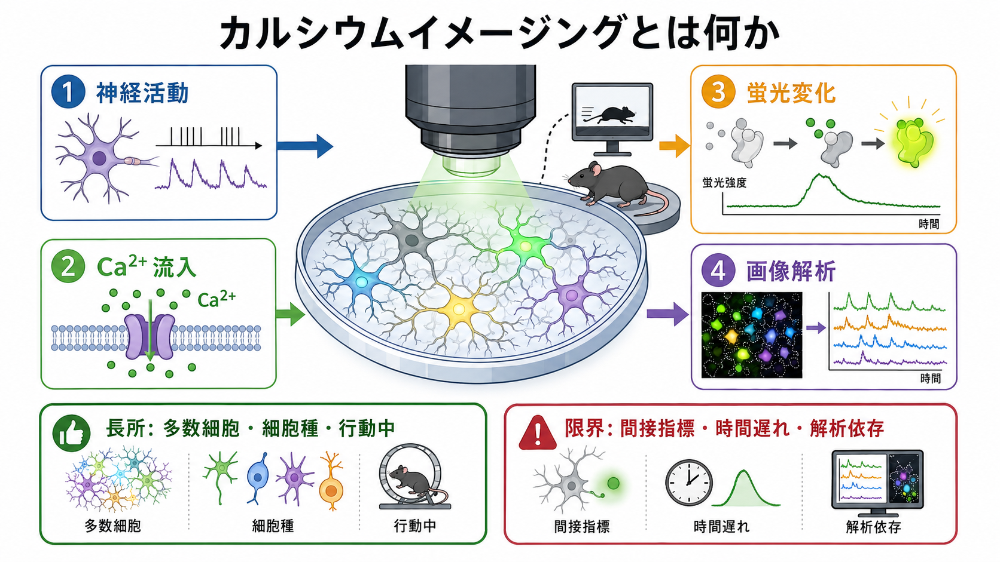
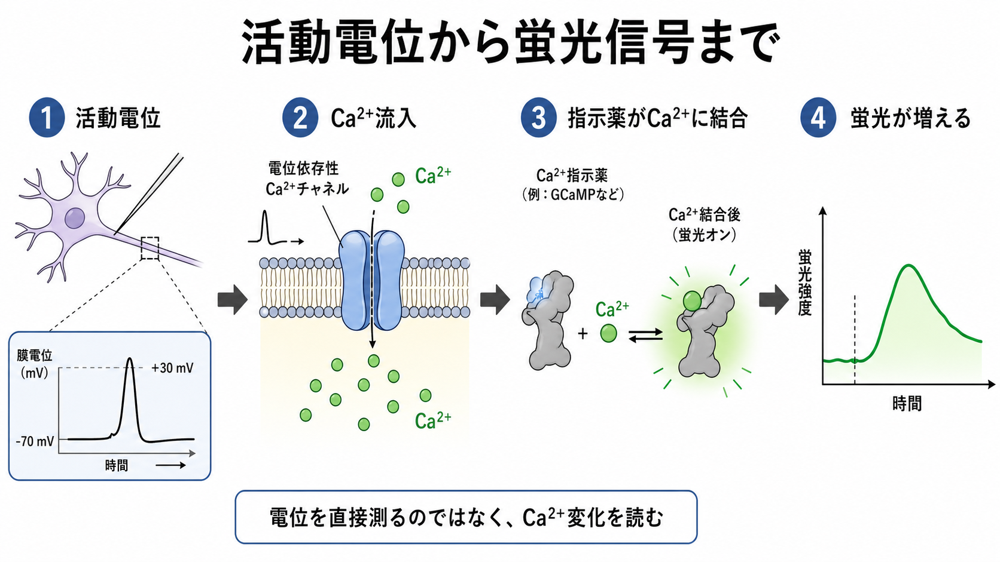
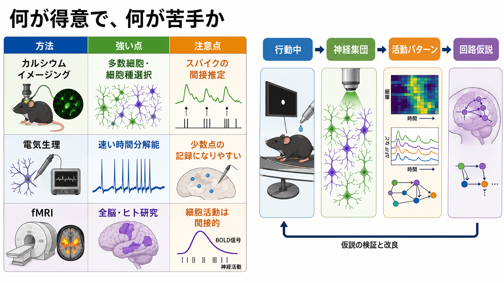

# カルシウムイメージングとは何か

## 要点

- カルシウムイメージングは、[[活動電位はどのように発生するのか]]そのものではなく、活動に伴う細胞内Ca2+濃度変化を蛍光として読む神経計測法である。
- 電気生理より時間分解能は劣るが、多数の細胞、樹状突起、スパイン、行動中の動物での神経集団活動を同時に観察しやすい。
- GCaMPのような遺伝子コード型Ca2+指示薬の発展により、特定細胞種・特定回路・長期反復観察がしやすくなった。
- 蛍光信号はスパイクの間接指標であり、指示薬の速度、発現量、光毒性、動き補正、ニューロピル混入、スパイク推定アルゴリズムに強く依存する。

## この記事で答える問い

- なぜCa2+を見ると神経活動がわかるのか。
- 蛍光指示薬、顕微鏡、画像解析はそれぞれ何をしているのか。
- 電気生理やfMRIと比べて、何が得意で何が苦手なのか。
- 研究や精神医学的な回路仮説とどう接続できるのか。

## まず結論

カルシウムイメージングは、「神経細胞が活動すると細胞内Ca2+が変化する」という性質を利用して、神経活動の時空間パターンを画像として記録する方法である。活動電位が発生すると電位依存性Ca2+チャネルやシナプス入力を通じてCa2+が細胞内に流入し、Ca2+指示薬の蛍光が変化する。この蛍光変化を顕微鏡で撮影し、細胞領域の抽出、動き補正、蛍光時系列の解析を行うことで、どの細胞群がいつ活動したかを推定する[1]。

重要なのは、カルシウムイメージングが電圧を直接測る技術ではない点である。得られるのはCa2+依存の蛍光信号であり、[[パッチクランプ法は何を測るのか]]や単一ユニット記録のようなミリ秒精度のスパイク列とは異なる。したがって、「神経活動を可視化する強力な方法」ではあるが、「すべてのスパイクを正確に読む方法」ではない。

## 背景

神経活動を測る方法には、細胞内外の電位を測る電気生理、頭皮上の電位変化を測る[[脳波EEGは何を測っているのか]]、血流・代謝を介して脳活動を推定する[[fMRIは神経活動を直接測っているのか]]や[[BOLD信号とは何か]]などがある。カルシウムイメージングはこの中で、細胞レベルの空間分解能と神経集団の同時観察を両立しやすい方法として発展してきた。

Ca2+は単なる活動の副産物ではない。[[神経伝達物質はどのように放出されるのか]]、シナプス可塑性、樹状突起での入力統合、遺伝子発現などに関わる重要な細胞内シグナルである[1]。そのためCa2+信号を測ることは、発火の近似指標を得るだけでなく、[[シナプス可塑性とは何か]]や局所回路の状態を調べる入口にもなる。

## 基本概念

### Ca2+指示薬

Ca2+指示薬は、Ca2+に結合すると蛍光特性が変わる分子である。大きく分けると、細胞へ化学的に導入する合成指示薬と、遺伝子として導入する遺伝子コード型Ca2+指示薬がある。GCaMPは代表的な遺伝子コード型指示薬で、Ca2+結合により蛍光タンパク質の明るさが変わる[2]。

GCaMP6は単一活動電位やスパインレベルのCa2+応答を高感度に検出できることを示し、カルシウムイメージングを神経回路研究の標準的手法に押し上げた[2]。その後のjGCaMP7、jGCaMP8では、感度、速度、線形性、細胞区画ごとの適性がさらに改善された[3][4]。

### 顕微鏡

カルシウムイメージングでは、目的に応じて顕微鏡を選ぶ。

| 方法 | 得意な場面 | 注意点 |
|---|---|---|
| 広視野蛍光顕微鏡 | 広い領域を高速に見る | 深さ方向の分離が弱い |
| 共焦点顕微鏡 | 光学切片を得る | 生体深部や高速撮影には制約 |
| 二光子顕微鏡 | 生体脳内の比較的深い層を細胞レベルで観察 | 装置が大きく、撮影範囲と速度に制約 |
| ミニスコープ | 自由行動中の動物で記録しやすい | 光学性能や視野、深さに制約 |
| ライトシート顕微鏡 | 小型透明動物で広範囲・高速観察 | 哺乳類脳深部には制約[6] |

これらは「何を犠牲にして何を得るか」の選択である。空間分解能、時間分解能、撮影深度、視野、侵襲性、行動自由度は同時に最大化できない。

## 仕組み

基本的な流れは次の通りである。

1. 神経細胞が入力を受け、膜電位が変化する。
2. 活動電位やシナプス入力に伴い、Ca2+が細胞内へ流入する。
3. Ca2+指示薬がCa2+に結合し、蛍光強度が変化する。
4. 顕微鏡が蛍光画像の時系列を撮影する。
5. 画像解析で細胞領域を抽出し、各細胞の蛍光時系列を計算する。
6. 必要に応じて蛍光時系列からスパイク活動を推定する。

蛍光変化はしばしば $\Delta F/F$ として表される。

$$
\Delta F/F = \frac{F(t) - F_0}{F_0}
$$

ここで $F(t)$ は時刻 $t$ の蛍光強度、$F_0$ は基準となる蛍光強度である。実際の解析では、背景蛍光、ニューロピル信号、細胞の動き、退色、焦点ずれなどを補正する必要がある。CaImAnのような解析パイプラインは、動き補正、細胞領域の同定、複数セッションの位置合わせ、活動推定を再現可能に処理するために開発されている[5]。

## 図解

カルシウムイメージングの強みは、多数細胞の活動を同時に見ることにある。たとえば、行動中の動物で、どの神経集団が刺激、選択、運動、報酬、学習段階に対応して活動するかを追跡できる。これは[[神経回路とは何か]]、[[神経可塑性は発達と学習をどう支えるのか]]、[[経験依存的可塑性はネットワークをどう変えるのか]]を実験的に調べるうえで有用である。

一方で、速いスパイク列を厳密に測るには電気生理が強い。全脳レベル・ヒト研究ではfMRIが強い。カルシウムイメージングは、細胞レベルの神経集団活動を、比較的長い時間、細胞種や回路を指定して追うところに独自の位置がある。

## 臨床・研究との接続

カルシウムイメージングは、現時点では主に基礎研究・前臨床研究の方法であり、通常の臨床診断で患者の脳活動を直接測る道具ではない。精神医学や神経科学との接続は、患者個人の診断というより、動物モデルや細胞モデルを通じて「どの回路がどの行動・症状関連過程に関わるか」を調べる点にある。

たとえば、特定の細胞種にGCaMPを発現させれば、[[興奮性ニューロンと抑制性ニューロンは回路内でどう協調するのか]]、[[介在ニューロンは神経回路で何をしているのか]]、報酬学習や恐怖学習のときにどの神経集団が変化するかを調べられる。慢性窓やミニスコープを使えば、同じ動物の同じ細胞集団を日単位から週単位で追跡でき、学習、可塑性、病態モデル、薬理操作の前後比較に向く。

ただし、臨床的な症状は多層的であり、細胞活動だけから直接に診断名や治療方針を導くことはできない。カルシウムイメージングの結果は、行動課題、解剖、遺伝学、電気生理、[[脳画像とは何を見ているのか]]と合わせて解釈する必要がある。

## よくある誤解

### 「蛍光が上がった細胞は必ず発火している」

蛍光上昇は発火と関連することが多いが、完全に同じではない。Ca2+は樹状突起入力、スパイン活動、細胞内ストア、チャネル分布、細胞型によっても変わる。指示薬の速度や感度によっては、単一スパイクを見逃したり、複数スパイクを滑らかな1つの波形として見たりする。

### 「カルシウムイメージングは電気生理の上位互換である」

そうではない。電気生理は高速な膜電位・スパイクの直接測定に強い。カルシウムイメージングは多数細胞や細胞区画の同時観察に強い。問いが「正確なスパイク時刻」なら電気生理、「集団活動の空間パターン」ならカルシウムイメージングが向くことが多い。

### 「画像解析を通せば客観的な活動がそのまま出る」

解析結果は、ROI抽出、動き補正、背景補正、ニューロピル補正、デコンボリューションの仮定に依存する。大規模データでは自動化が不可欠だが、アルゴリズムの選択と品質管理が結果の解釈を左右する[5]。

### 「新しい指示薬なら限界はほぼ解決した」

jGCaMP8のような高速・高感度指示薬は、従来の遅い応答や低感度を大きく改善した[4]。それでもCa2+信号は電圧の直接測定ではなく、発現毒性、光毒性、飽和、細胞型差、ニューロピル混入などの制約は残る。

## 関連ノート

- [[活動電位はどのように発生するのか]]
- [[パッチクランプ法は何を測るのか]]
- [[脳波EEGは何を測っているのか]]
- [[fMRIは神経活動を直接測っているのか]]
- [[BOLD信号とは何か]]
- [[神経回路とは何か]]
- [[シナプス可塑性とは何か]]
- [[興奮性ニューロンと抑制性ニューロンは回路内でどう協調するのか]]

## MOC更新候補

- `content/01_脳・神経科学/脳画像・神経計測` のMOCがある場合、本記事を「細胞レベル神経計測」または「光学的神経計測」の項目に追加する。
- `content/01_脳・神経科学/基礎神経科学` 側では、活動電位、Ca2+チャネル、シナプス可塑性に関するノートからの相互リンク候補になる。
- `content/01_脳・神経科学/神経回路・脳ネットワーク` 側では、神経集団活動・回路可塑性を測る方法としてリンク候補になる。

## 理解チェック

1. カルシウムイメージングが直接測っているものは、膜電位、血流、Ca2+依存蛍光のどれか。
2. $\Delta F/F$ は何を基準化している指標か。
3. 電気生理よりカルシウムイメージングが有利になりやすい問いは何か。
4. 蛍光信号からスパイクを推定するとき、どのような仮定や補正が必要か。
5. fMRIとカルシウムイメージングを比較すると、空間スケール、対象、臨床応用はどう違うか。

## 参考文献

[1] Grienberger, C., & Konnerth, A. (2012). Imaging calcium in neurons. *Neuron*, 73(5), 862-885. https://doi.org/10.1016/j.neuron.2012.02.011

[2] Chen, T. W., Wardill, T. J., Sun, Y., et al. (2013). Ultrasensitive fluorescent proteins for imaging neuronal activity. *Nature*, 499, 295-300. https://doi.org/10.1038/nature12354

[3] Dana, H., Sun, Y., Mohar, B., et al. (2019). High-performance calcium sensors for imaging activity in neuronal populations and microcompartments. *Nature Methods*, 16, 649-657. https://doi.org/10.1038/s41592-019-0435-6

[4] Zhang, Y., Rózsa, M., Liang, Y., et al. (2023). Fast and sensitive GCaMP calcium indicators for imaging neural populations. *Nature*, 615, 884-891. https://doi.org/10.1038/s41586-023-05828-9

[5] Giovannucci, A., Friedrich, J., Gunn, P., et al. (2019). CaImAn an open source tool for scalable calcium imaging data analysis. *eLife*, 8, e38173. https://doi.org/10.7554/eLife.38173

[6] Ahrens, M. B., Orger, M. B., Robson, D. N., Li, J. M., & Keller, P. J. (2013). Whole-brain functional imaging at cellular resolution using light-sheet microscopy. *Nature Methods*, 10, 413-420. https://doi.org/10.1038/nmeth.2434

## 未解決問題

- 高速・高感度なCa2+指示薬と電圧指示薬を、どの問いで使い分けるべきか。
- ニューロピル混入、細胞種差、発現量差をどこまで標準化できるか。
- 自由行動中の大規模カルシウムイメージングから、行動・認知・病態に関わる因果的回路仮説をどこまで推定できるか。
- 動物モデルで得られた細胞集団活動の知見を、ヒトの脳画像・精神医学研究へどう橋渡しするか。
