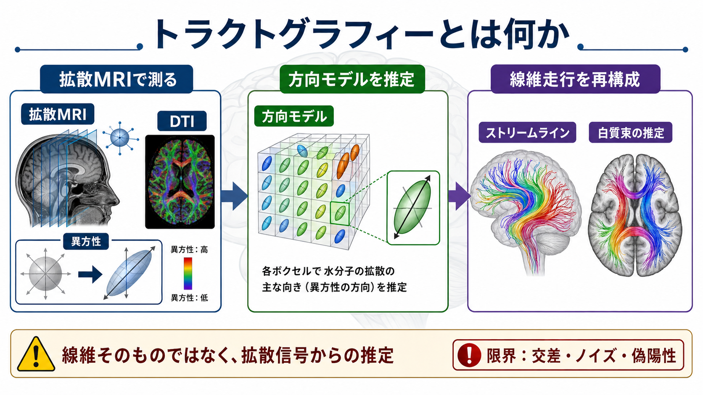
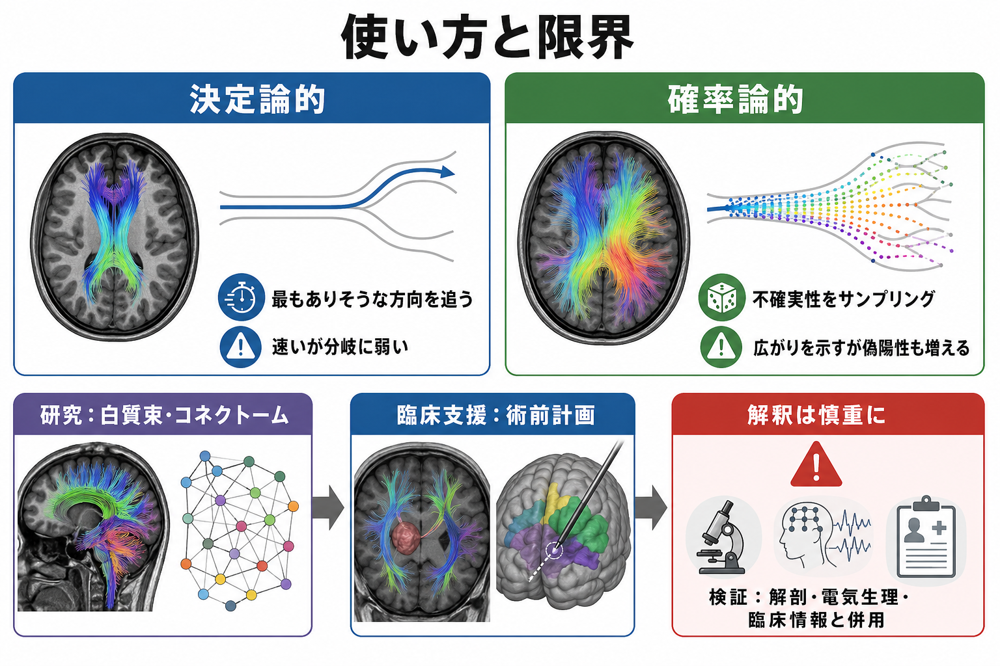

# トラクトグラフィーとは何か

## 要点

- トラクトグラフィーは、拡散MRIで観測される水分子拡散の方向性から、白質束の走行を計算的に推定する方法である。
- 出力される線は「軸索そのもの」ではなく、ボクセル単位の拡散方向モデルをつないだストリームラインである。
- DTIは直感的で広く使われるが、交差線維・分岐・接触・部分容積効果に弱く、複雑な白質構造を単一テンソルで表すには限界がある。
- 研究では[[コネクトームとは何か]]や[[構造的結合と機能的結合は何が違うのか]]の推定、臨床では術前計画の補助などに使われるが、定量値や「接続」の解釈には慎重さが必要である。

## この記事で答える問い

このノートでは、トラクトグラフィーについて次の問いに答える。

1. 拡散MRIやDTIは、白質の何を測っているのか。
2. ストリームラインはどのような手順で作られるのか。
3. 決定論的トラクトグラフィーと確率論的トラクトグラフィーは何が違うのか。
4. 研究・臨床で使うとき、どこまで信じてよいのか。

## まず結論

トラクトグラフィーは、白質束を「直接見る」方法ではなく、拡散MRI信号から神経線維の向きを推定し、その推定方向に沿って仮想的な軌跡を伸ばす方法である。1990年代末からDTIを用いた三次元線維追跡が示され、2000年代以降、脳内白質路の可視化と[[脳内ネットワークとは何か]]の解析に広く使われるようになった[1][2][3]。

ただし、推定されるストリームラインは解剖学的な軸索一本一本ではない。白質の各ボクセルには多数の軸索、髄鞘、グリア、細胞外空間が含まれ、さらに複数の線維束が交差・接触・分岐しうる。したがって、トラクトグラフィーの結果は「ありそうな白質走行の仮説」として扱うのが適切である[4][5][6]。

## 背景

脳の白質は、遠く離れた皮質領域や皮質下構造を結ぶ長距離連絡の基盤である。古典的には、解剖学的切開、組織染色、動物でのトレーサー研究が白質路の理解を支えてきた。しかしヒト生体で全脳的に白質束を調べるには、非侵襲的な画像法が必要だった。

拡散MRIは、水分子の拡散が組織の微細構造によって制約されることを利用する。白質では、髄鞘化された軸索束に沿う方向では水が比較的拡散しやすく、軸索束を横切る方向では拡散しにくい。この方向依存性、つまり異方性を画像化することで、白質の主要な向きを推定できる[2][3]。この考え方は、[[FA値とは何か]]のような拡散指標の解釈とも密接に関係する。

## 基本概念

### 拡散MRIとDTI

拡散MRIでは、複数方向の拡散強調画像を撮像し、各ボクセルで拡散の方向依存性を推定する。DTIでは、この方向依存性を楕円体のような二階テンソルで表す。テンソルの最も長い軸は、そのボクセルで水分子が最も拡散しやすい方向を表すため、白質線維の主要方向の近似として使われる[2][3]。

DTIの強みは、比較的少ない撮像方向でも計算しやすく、FA、平均拡散率、主固有ベクトルなどを直感的に扱える点にある。一方、1ボクセルに複数方向の線維が存在する場合、単一テンソルでは複雑な方向分布を表しきれない。この問題は、トラクトグラフィーの限界の中心にある[5]。

### ストリームライン

ストリームラインとは、ボクセルごとに推定された方向をつないで作る仮想的な曲線である。多くの手法では、種となるシード点を置き、そこから局所的な方向推定に沿って少しずつ進む。FAが低い、急に曲がりすぎる、脳マスクの外に出る、信号が不十分といった条件を満たすと追跡を止める[3]。

重要なのは、ストリームライン数が軸索数を意味しないことである。シード数、追跡アルゴリズム、しきい値、前処理、後処理によって結果は大きく変わるため、「線が多いから白質結合が強い」と単純に読むことはできない[6]。

## 仕組み

トラクトグラフィーの典型的な流れは次のように整理できる。

1. **拡散強調画像を撮る**  
   複数方向・複数b値で拡散MRIを撮像し、頭部運動、渦電流、歪みなどを補正する。

2. **各ボクセルの方向モデルを推定する**  
   DTIでは単一テンソルを推定する。高角度分解能拡散MRIや多殻データでは、球面デコンボリューションなどを用いて、複数方向の線維方向分布を推定することがある[5][8]。

3. **シード点から追跡する**  
   白質全体、特定ROI、皮質表面近傍などにシードを置き、方向モデルに沿ってステップごとに進む。

4. **停止条件で止める**  
   低異方性、曲率しきい値、解剖学的マスク、長さ制限などに基づいて追跡を止める。

5. **束として抽出・評価する**  
   ROI、解剖学的事前知識、アトラス、クラスタリングなどを使って、弓状束、鉤状束、皮質脊髄路などの候補を抽出する。

### 決定論的と確率論的

決定論的トラクトグラフィーは、各地点で最もありそうな方向を選び、1本の軌跡を進める。結果が見やすく計算も比較的速いが、分岐や交差、ノイズに弱い。

確率論的トラクトグラフィーは、方向推定の不確実性をサンプリングし、同じシードから多数の候補軌跡を生成する。接続可能性の広がりを表しやすい反面、偽陽性や解釈の難しさも増える[4][7]。

## 臨床・研究との接続

研究では、トラクトグラフィーは白質束の同定、発達・加齢・疾患に伴う白質変化、構造的コネクトームの推定に使われる。[[コネクトームとは何か]]の文脈では、脳領域をノード、トラクトグラフィーで推定された白質経路をエッジとして扱うことが多い。

臨床では、脳腫瘍やてんかん手術などで、皮質脊髄路、視放線、言語関連白質束などを術前に推定し、外科的アプローチの検討に役立てることがある。ただし、病変による浮腫、腫瘍浸潤、圧排、信号低下は拡散推定を変化させるため、術中所見、電気刺激、神経心理評価、通常MRIなどと併用して解釈する必要がある[4][7]。

## よくある誤解

### 誤解1：トラクトグラフィーは軸索を直接写している

トラクトグラフィーは水分子拡散の方向性をもとにした推定であり、軸索一本一本を直接撮像しているわけではない。ストリームラインは可視化として強力だが、実体としての線維そのものではない[4][6]。

### 誤解2：線が多いほど接続が強い

ストリームライン数は、撮像条件、シード密度、アルゴリズム、しきい値、後処理に強く依存する。そのため、単純な線数を接続強度や軸索数として読むのは危険である[6]。

### 誤解3：DTIだけで複雑な白質構造を十分に表せる

多くの白質ボクセルには交差・キス・分岐などの複雑な線維構造が含まれる。単一テンソルモデルは、そのような領域で方向推定を誤りやすい[5]。FODなどのモデルはこの問題を緩和するが、完全に解決するわけではない[8]。

### 誤解4：トラクトグラフィーで見えない経路は存在しない

偽陰性も偽陽性も起こる。信号雑音比、空間分解能、交差角度、線維束の曲率、病変、前処理の違いによって、存在する経路が見えないことも、存在しない経路が描かれることもある[7]。

## 限界と未解決問題

最大の限界は、局所的な方向情報だけから長距離の白質経路を再構成するという逆問題の曖昧さである。Maier-Heinらの国際的な tractography challenge では、多くの手法が真の束の一部を検出できる一方、無効な束も多く含むことが示され、方向情報だけに基づく再構成の根本的曖昧さが強調された[7]。

今後の改善点としては、高品質な多殻拡散MRI、解剖学的制約、表面・組織セグメンテーションとの統合、外部データによる検証、再現性の高いパイプライン、定量解釈の標準化がある。MRtrix3のようなオープンソース基盤は、拡散MRI解析の再現性と方法比較を進めるうえで重要である[8]。

## 関連ノート

既存ノートとして次が関連する。

- [[FA値とは何か]]
- [[コネクトームとは何か]]
- [[脳内ネットワークとは何か]]
- [[構造的結合と機能的結合は何が違うのか]]
- [[神経回路とは何か]]
- [[髄鞘はなぜ神経伝導を速くするのか]]

今後の作成候補としては、「拡散MRIとは何か」「DTIとは何か」「FODとは何か」「白質束アトラスとは何か」「皮質脊髄路とは何か」がある。

MOC更新候補: `content/00_MOC/MOC｜脳・神経科学.md`、必要に応じて脳画像・神経計測カテゴリの索引。

## 理解チェック

1. トラクトグラフィーの線が「軸索そのもの」ではない理由を説明できるか。
2. DTIの単一テンソルモデルが交差線維で弱くなる理由を説明できるか。
3. 決定論的トラクトグラフィーと確率論的トラクトグラフィーの利点・弱点を比較できるか。
4. ストリームライン数を接続強度として単純に解釈してはいけない理由を説明できるか。

## 参考文献

[1] Mori, S., Crain, B. J., Chacko, V. P., & van Zijl, P. C. M. (1999). Three-dimensional tracking of axonal projections in the brain by magnetic resonance imaging. *Annals of Neurology*, 45(2), 265-269. https://doi.org/10.1002/1531-8249(199902)45:2%3C265::AID-ANA21%3E3.0.CO;2-3

[2] Basser, P. J., Pajevic, S., Pierpaoli, C., Duda, J., & Aldroubi, A. (2000). In vivo fiber tractography using DT-MRI data. *Magnetic Resonance in Medicine*, 44(4), 625-632. https://doi.org/10.1002/1522-2594(200010)44:4%3C625::AID-MRM17%3E3.0.CO;2-O

[3] Mori, S., & van Zijl, P. C. M. (2002). Fiber tracking: principles and strategies - a technical review. *NMR in Biomedicine*, 15(7-8), 468-480. https://doi.org/10.1002/nbm.781

[4] Jbabdi, S., & Johansen-Berg, H. (2011). Tractography: where do we go from here? *Brain Connectivity*, 1(3), 169-183. https://doi.org/10.1089/brain.2011.0033

[5] Jeurissen, B., Leemans, A., Tournier, J.-D., Jones, D. K., & Sijbers, J. (2013). Investigating the prevalence of complex fiber configurations in white matter tissue with diffusion magnetic resonance imaging. *Human Brain Mapping*, 34(11), 2747-2766. https://doi.org/10.1002/hbm.22099

[6] Jones, D. K., Knosche, T. R., & Turner, R. (2013). White matter integrity, fiber count, and other fallacies: the do's and don'ts of diffusion MRI. *NeuroImage*, 73, 239-254. https://doi.org/10.1016/j.neuroimage.2012.06.081

[7] Maier-Hein, K. H., Neher, P. F., Houde, J.-C., et al. (2017). The challenge of mapping the human connectome based on diffusion tractography. *Nature Communications*, 8, 1349. https://doi.org/10.1038/s41467-017-01285-x

[8] Dell'Acqua, F., & Tournier, J.-D. (2019). Modelling white matter with spherical deconvolution: how and why? *NMR in Biomedicine*, 32(4), e3945. https://doi.org/10.1002/nbm.3945

