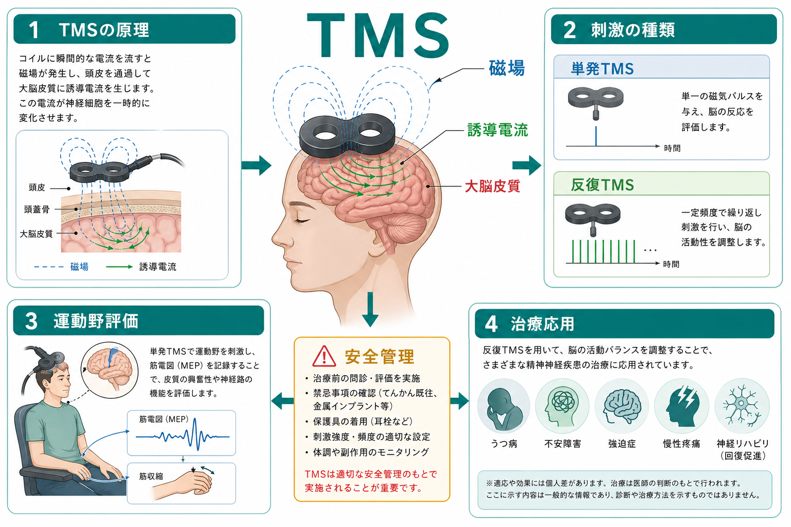
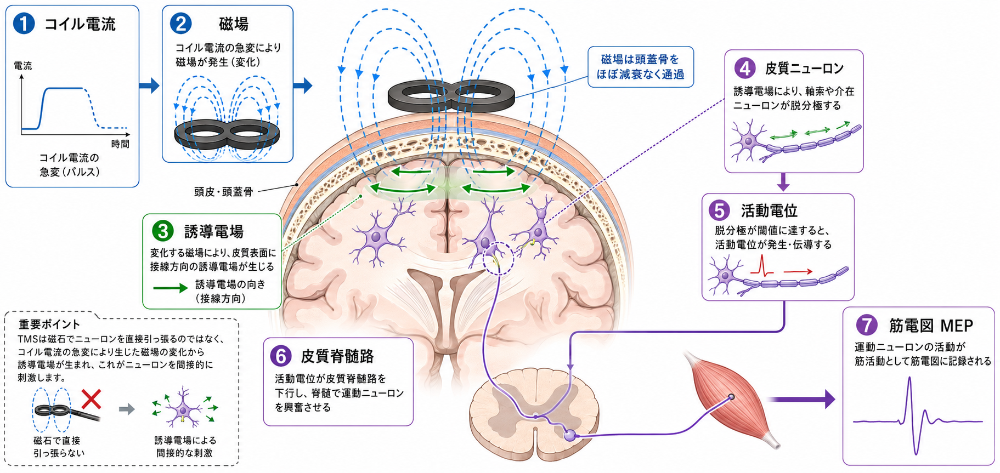
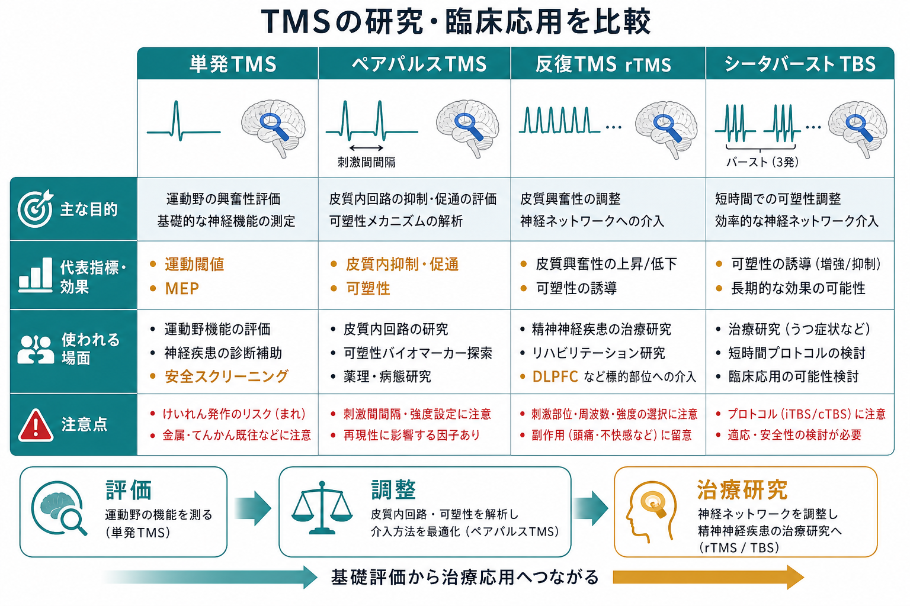

# トランスクラニアル磁気刺激TMSは何をしているのか

## 要点

- TMS（transcranial magnetic stimulation; 経頭蓋磁気刺激）は、頭皮上のコイルに瞬間的な電流を流し、変化する磁場を介して脳内に誘導電場を作る方法である[1][2]。
- ニューロンを「磁石で引っ張る」のではなく、皮質表面に生じた電場が軸索や介在ニューロンを脱分極させ、神経活動の発生確率を変える[2][3]。
- 単発TMSは運動野を刺激して筋電図上のMEP（motor evoked potential; 運動誘発電位）を測り、皮質脊髄路や皮質興奮性を評価する[3][4]。
- 反復TMS（rTMS）やTBS（theta burst stimulation）は、神経ネットワークの活動性・可塑性を時間的に調整する介入として、うつ病などの治療・研究に使われる[5][6][7]。
- 医療としてのTMSは、適応、禁忌、金属・電子機器、けいれんリスク、聴覚保護、刺激条件の管理を含む安全手順と一体で理解する必要がある[5][8]。

## この記事で答える問い

1. TMSは、頭蓋骨の外からどのように大脳皮質へ作用するのか。
2. 単発TMS、ペアパルスTMS、rTMS、TBSは何が違うのか。
3. 運動野評価で測っている「MEP」や「運動閾値」は何を意味するのか。
4. 精神神経疾患への治療応用では、何が確立し、何が研究段階なのか。

## まず結論

TMSは、磁場で脳を直接「操作」する装置というより、コイル電流の急変から生じる誘導電場を使って、皮質ニューロンの発火しやすさを一時的に変える非侵襲的脳刺激法である。単発TMSでは反応を測る「検査」に近く、反復TMSでは刺激を繰り返すことで皮質ネットワークの興奮性や可塑性を変える「介入」に近づく。

ただし、TMSの効果は刺激部位、コイル向き、波形、強度、頻度、刺激列、脳の状態、薬剤、個人差に依存する。したがって「磁場を当てると特定の機能が上がる」と単純化するより、[[fMRIは神経活動を直接測っているのか]]や[[PETは脳の何を測るのか]]と同じく、測定・介入が何を反映しているかを分けて考える必要がある。

## 背景

TMSの古典的な出発点は、Barkerらがヒト運動野を非侵襲的に磁気刺激し、手の筋活動を誘発できることを示した1985年の報告である[1]。電気刺激に比べると、TMSは頭皮や頭蓋骨を直接大電流が流れにくく、運動野・皮質脊髄路の機能評価に広く使われるようになった。

その後、TMSは3つの方向に広がった。第一に、単発TMSによる運動閾値、MEP振幅、皮質サイレントピリオド、中心運動伝導時間などの神経生理学的評価である[3][4]。第二に、ペアパルスTMSによる皮質内抑制・促通の評価である[3]。第三に、rTMSやTBSを用いた神経調整であり、うつ病、強迫症、疼痛、運動リハビリテーションなどへの応用が検討されてきた[5][6][8]。

## 基本概念

### TMS

TMSは、頭皮上に置いたコイルに短い高電流パルスを流し、急速に変化する磁場を作る。この磁場は頭皮・頭蓋骨を比較的通過しやすく、脳内で時間変化する電場を誘導する[2][3]。神経細胞に直接作用する主役は、磁場そのものではなく、この誘導電場である。

### 運動閾値

運動閾値は、一次運動野を刺激したときに、標的筋から一定以上のMEPを一定割合で誘発する最小刺激強度として扱われる。臨床・研究では、各人の皮質興奮性や頭部形状の違いを考慮して、刺激強度を運動閾値の何%として設定することが多い[3][5]。

### MEP

MEPは、運動野TMSで皮質脊髄路が活性化され、末梢筋に現れた筋電図反応である。MEP振幅は皮質、脊髄、末梢神経、筋、覚醒度、筋収縮状態の影響を受けるため、「皮質だけ」の純粋な値ではない。それでも、運動系の入出力関係を非侵襲的に調べる強力な指標である[3][4]。

### rTMSとTBS

rTMSは、TMSパルスを一定頻度で反復して与える方法である。低頻度刺激、高頻度刺激、間欠的・連続的TBSなどのプロトコルにより、刺激後の皮質興奮性が上がる場合も下がる場合もある[5][6]。ただし、方向は固定的ではなく、刺激部位、強度、プロトコル、個人差、脳状態に依存する。

## 仕組み

TMSの物理過程は、ファラデーの電磁誘導として理解できる。コイル電流が急変すると磁場が時間的に変化し、その変化が周囲の組織に電場を誘導する。頭蓋骨は電流には抵抗となるが、磁場は比較的通過しやすいため、頭皮上から皮質表面近くに刺激を届けられる[2][3]。

誘導電場は、皮質表面に沿った方向、軸索の曲がり、神経線維の向き、灰白質・白質境界、脳溝の形状に影響される。したがって、同じ強度でもコイル向きや刺激位置が少し変わるだけで、活性化されるニューロン集団が変わりうる。TMSで刺激されるのは、多くの場合、錐体細胞の細胞体そのものよりも、軸索、介在ニューロン、皮質内回路を含むネットワークである[2][3]。

このため、TMSは[[有効結合とは何か]]と相性がよい。ある領域を刺激したときに、筋反応、EEG、行動、fMRI信号などがどう変化するかを見ることで、単なる相関ではなく、介入に基づく因果的な手がかりを得られる。ただし、TMSの効果は刺激点だけに閉じず、接続するネットワークへ広がるため、「この脳部位だけをオン・オフした」とは言いにくい。

## 図解

TMSを用途別に見ると、評価、機序研究、介入研究、臨床治療が連続している。

| 方法 | 主な目的 | 代表的な指標・効果 | 注意点 |
|---|---|---|---|
| 単発TMS | 運動野・皮質脊髄路の評価 | 運動閾値、MEP、中心運動伝導時間 | 反応は筋収縮状態や覚醒度にも依存する |
| ペアパルスTMS | 皮質内抑制・促通の評価 | SICI、ICF、LICIなど | 薬理・病態研究に有用だが、解釈は単一受容体に還元できない |
| rTMS | 皮質興奮性・ネットワーク活動の調整 | 刺激後効果、症状尺度、行動変化 | 周波数だけで効果方向を断定しない |
| TBS | 短時間の可塑性誘導プロトコル | iTBS、cTBS後の興奮性変化 | 個人差と安全管理が重要 |

## 臨床・研究との接続

### 運動野評価

運動野TMSは、神経伝導や皮質興奮性を調べる臨床神経生理学の手段である。中心運動伝導時間、運動閾値、MEP、皮質サイレントピリオドなどは、運動系の障害、上位運動ニューロン徴候、脱髄性疾患、神経変性疾患などの評価で検討されてきた[4]。ただし、TMS単独で診断を確定するというより、神経診察、画像、電気生理、臨床経過と合わせて解釈する。

### 皮質興奮性とE/Iバランス

ペアパルスTMSでは、条件刺激と試験刺激を短い間隔で組み合わせ、MEPが抑制されるか促通されるかを見る。これはGABA作動性抑制やグルタミン酸作動性促通と関連づけて解釈されることが多い[3]。ただし、[[E_Iバランスとは何か]]で扱うように、TMS指標は細胞レベルの興奮・抑制を直接読んでいるわけではない。皮質内回路、脊髄興奮性、筋活動、薬剤の影響を含む複合指標である。

### 精神神経疾患治療

rTMSは、特定の皮質部位に反復刺激を与え、症状に関わるネットワーク活動を調整する治療・研究手段として発展してきた。エビデンスに基づく治療ガイドラインでは、うつ病に対する左背外側前頭前野（DLPFC）高頻度rTMSや右DLPFC低頻度rTMSなどが比較的強い支持を受けている[6][7]。FDAのrTMSシステムに関する特別管理ガイダンスも、MDDに対する装置の適応、リスク、禁忌、表示、安全対策を規定している[8]。

一方で、強迫症、疼痛、脳卒中後リハビリテーション、パーキンソン病、幻聴、認知機能障害などへの応用は、疾患・刺激部位・プロトコルによってエビデンスの強さが異なる[6]。臨床実装されているものと、探索的研究段階のものを分ける必要がある。

### 安全性

TMSの重大リスクとして最も重視されるのは、まれな誘発けいれんである。安全ガイドラインでは、刺激強度、頻度、列長、休止時間、既往歴、薬剤、睡眠不足、物質使用、脳病変、金属・電子機器の有無などを確認する[5]。また、コイル音が大きいため聴覚保護が必要であり、頭痛、頭皮痛、不快感、めまいなどの軽微な副作用も説明・監視される[5][8]。

## よくある誤解

### 誤解1: TMSは磁石でニューロンを直接引っ張っている

TMSの主作用は、変化する磁場が作る誘導電場である。磁場がニューロンを機械的に引っ張る、という説明は不正確である[2][3]。

### 誤解2: 高頻度なら必ず興奮、低頻度なら必ず抑制

一般的には高頻度rTMSが興奮性を高め、低頻度rTMSが抑制的に働くと説明されることがある。しかし、実際の効果はプロトコル、部位、強度、個人差、脳状態に依存し、単純な周波数ルールだけでは決まらない[5][6]。

### 誤解3: TMSは脳画像と同じように「見る」技術である

TMSは画像法ではなく、介入を加えて反応を見る神経生理学的手法である。[[脳画像とは何を見ているのか]]や[[構造MRIは脳の何を測っているのか]]が脳の構造・信号を観察するのに対し、TMSは脳回路を刺激して反応性を調べる。

### 誤解4: 治療TMSは誰にでも同じように効く

治療効果には個人差があり、適応疾患、重症度、併用治療、刺激部位、刺激条件、治療回数、測定尺度によって解釈が変わる。医療としてのTMSは、診断、適応判断、リスク評価、効果判定を含む臨床プロセスであり、自己判断で行うものではない[5][7][8]。

## 関連ノート

- [[脳画像とは何を見ているのか]]
- [[fMRIは神経活動を直接測っているのか]]
- [[PETは脳の何を測るのか]]
- [[構造MRIは脳の何を測っているのか]]
- [[有効結合とは何か]]
- [[E_Iバランスとは何か]]

## MOC更新候補

- `content/00_MOC/MOC｜脳・神経科学.md`
- `content/00_MOC/MOC｜臨床実践・治療.md`

並列ジョブとの競合を避けるため、このタスクではMOC本文は更新しない。

## 理解チェック

1. TMSでニューロンに直接作用する主な物理量は、磁場そのものではなく何か。
2. MEPは、なぜ「皮質だけ」の指標とは言い切れないのか。
3. 単発TMSとrTMSでは、研究・臨床上の役割がどう違うか。
4. rTMSの効果方向を、周波数だけで断定してはいけない理由は何か。
5. 医療としてTMSを行うとき、金属・電子機器、けいれん既往、聴覚保護を確認する理由は何か。

## 未解決問題

- 個人の脳構造・機能結合に基づいて、刺激部位とコイル向きをどこまで最適化できるか。
- TMS-EEG、TMS-fMRI、ニューロナビゲーションを組み合わせたとき、ネットワーク効果をどの程度再現よく測れるか。
- うつ病以外の精神神経疾患で、どの刺激部位・プロトコルが臨床的に十分な効果をもつか。
- 皮質興奮性指標を、[[E_Iバランスとは何か]]のような細胞・シナプス水準のモデルにどう対応づけるか。

## 参考文献

[1] Barker, A. T., Jalinous, R., & Freeston, I. L. (1985). Non-invasive magnetic stimulation of human motor cortex. *The Lancet*, 1(8437), 1106-1107. https://doi.org/10.1016/S0140-6736(85)92413-4

[2] Hallett, M. (2007). Transcranial magnetic stimulation: A primer. *Neuron*, 55(2), 187-199. https://doi.org/10.1016/j.neuron.2007.06.026

[3] Rossini, P. M., Burke, D., Chen, R., et al. (2015). Non-invasive electrical and magnetic stimulation of the brain, spinal cord, roots and peripheral nerves: Basic principles and procedures for routine clinical and research application. An updated report from an I.F.C.N. Committee. *Clinical Neurophysiology*, 126(6), 1071-1107. https://doi.org/10.1016/j.clinph.2015.02.001

[4] Vucic, S., Chen, K.-H. S., Kiernan, M. C., et al. (2023). Clinical diagnostic utility of transcranial magnetic stimulation in neurological disorders. Updated report of an IFCN committee. *Clinical Neurophysiology*, 150, 131-175. https://doi.org/10.1016/j.clinph.2023.03.010

[5] Rossi, S., Antal, A., Bestmann, S., et al. (2021). Safety and recommendations for TMS use in healthy subjects and patient populations, with updates on training, ethical and regulatory issues: Expert Guidelines. *Clinical Neurophysiology*, 132(1), 269-306. https://doi.org/10.1016/j.clinph.2020.10.003

[6] Lefaucheur, J.-P., Aleman, A., Baeken, C., et al. (2020). Evidence-based guidelines on the therapeutic use of repetitive transcranial magnetic stimulation (rTMS): An update (2014-2018). *Clinical Neurophysiology*, 131(2), 474-528. https://doi.org/10.1016/j.clinph.2019.11.002

[7] Perera, T., George, M. S., Grammer, G., Janicak, P. G., Pascual-Leone, A., & Wirecki, T. S. (2016). The Clinical TMS Society Consensus Review and Treatment Recommendations for TMS Therapy for Major Depressive Disorder. *Brain Stimulation*, 9(3), 336-346. https://doi.org/10.1016/j.brs.2016.03.010

[8] U.S. Food and Drug Administration. (2011). *Repetitive Transcranial Magnetic Stimulation (rTMS) Systems - Class II Special Controls Guidance for Industry and FDA Staff*. https://www.fda.gov/medical-devices/guidance-documents-medical-devices-and-radiation-emitting-products/repetitive-transcranial-magnetic-stimulation-rtms-systems-class-ii-special-controls-guidance
