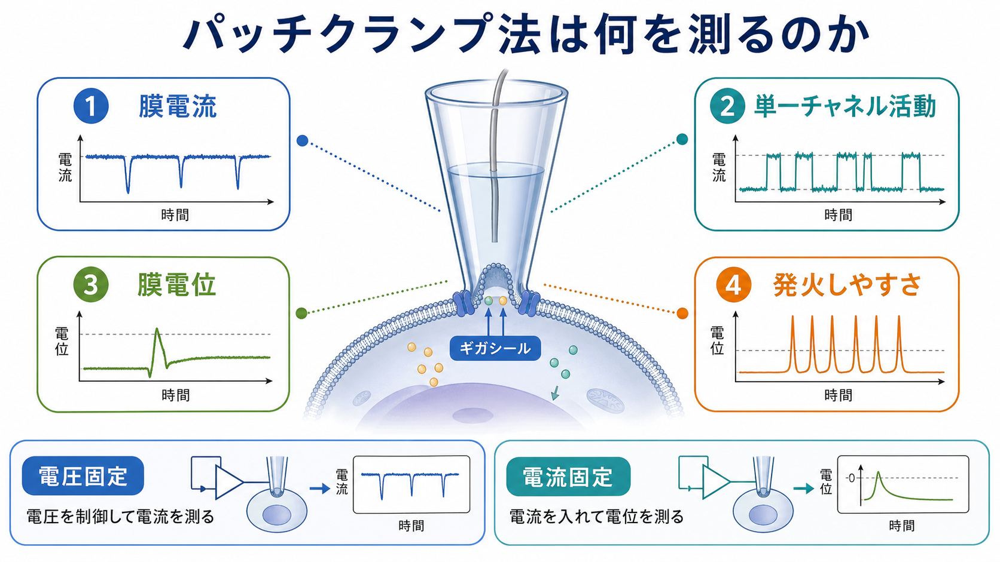
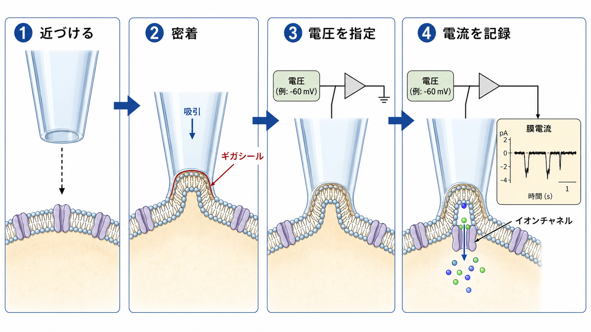
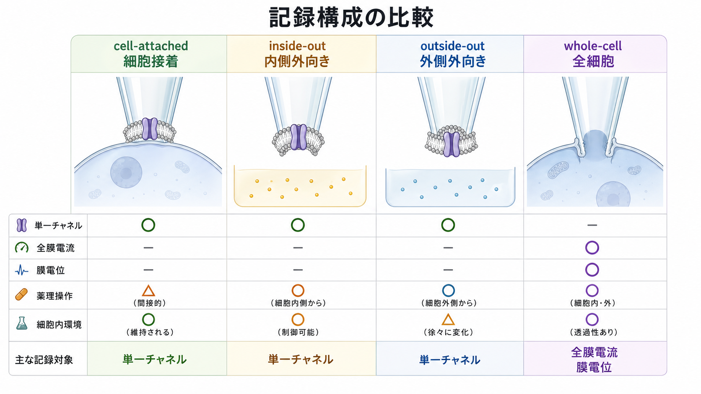

# パッチクランプ法は何を測るのか

## 要点

- パッチクランプ法は、細胞膜を横切る電流や膜電位を高い時間分解能で測る電気生理学的手法である。
- 電圧固定では、膜電位を実験者が指定し、その電位を保つために必要な電流を測る。これは主に[[イオンチャネルとは何か|イオンチャネル]]を流れる膜電流の測定になる[1][2]。
- 電流固定では、電流を注入し、その結果として変化する膜電位を測る。これは[[活動電位はどのように発生するのか|活動電位]]、閾値、発火頻度、[[静止膜電位はどのように生じるのか|静止膜電位]]などの評価に使われる[3][5]。
- cell-attached、inside-out、outside-out、whole-cell などの構成を選ぶことで、単一チャネル、膜パッチ、細胞全体の電流、細胞内環境の操作を切り替えられる[2][6]。
- 測れるのは「心」や「行動」そのものではなく、細胞膜・イオンチャネル・シナプス入力・発火しやすさに近いミクロな生理量である。

## この記事で答える問い

1. パッチクランプ法は、電流を測っているのか、電圧を測っているのか。
2. 単一イオンチャネルの開閉は、どのように電気信号として見えるのか。
3. 電圧固定と電流固定は何が違うのか。
4. 神経科学・薬理学・臨床研究では、どのような解釈に使われるのか。

## まず結論

パッチクランプ法は、細胞膜の小さな領域または細胞全体に対して、**電圧と電流の関係**を精密に測る方法である。より具体的には、ガラス微小電極を細胞膜に密着させ、高抵抗のシールを作り、膜を横切るイオンの流れを電流として記録する[1][2]。

重要なのは、「何を制御し、何を読むか」である。電圧固定では膜電位を一定に保ち、そのために流れる電流を読む。電流固定では注入電流を指定し、膜電位の変化を読む。前者はチャネル電流や[[シナプスとは何か|シナプス]]電流の解析に向き、後者はニューロンの発火しやすさや活動電位波形の解析に向く[3][5]。

## 背景

神経細胞や筋細胞は、膜を横切る Na+、K+、Ca2+、Cl- などの移動によって電気的に振る舞う。膜電位は、細胞内外のイオン濃度差と膜透過性の組み合わせで生じる。活動電位やシナプス後電位は、この膜電位が時間的に変化する現象である。

かつては、膜電流を集団平均として推定することはできても、単一のチャネル分子が開く瞬間を直接測ることは難しかった。Neher と Sakmann は、膜の小領域から単一チャネル電流を記録し、イオンチャネルが離散的に開閉することを実験的に示した[1]。この流れを発展させた改良パッチクランプ法は、ギガオーム級のシール、膜電位制御、膜パッチの物理的分離を可能にし、現代の細胞電気生理学の中心技術になった[2][4]。

## 基本概念

### 膜電流

膜電流とは、細胞膜を横切って流れる電荷の移動である。主な担い手はイオンであり、イオンチャネルが開くと、電気化学的勾配に従ってイオンが流れる。パッチクランプでは、この流れを pA 程度の電流として測定できる[4]。

### 単一チャネル活動

膜パッチ内に少数のチャネルしか含まれない条件では、チャネルが開くと電流が階段状に変化し、閉じると戻る。したがって、単一チャネル記録からは、開口時間、閉口時間、開口確率、単一チャネルコンダクタンスなどを推定できる[1][2]。

### 電圧固定

電圧固定は、膜電位を指定値に保ち、その電位を維持するために必要な補償電流を測る方法である。たとえば -70 mV に保持して神経伝達物質を与えれば、受容体チャネルを通る電流が時間波形として見える。これは[[EPSPとIPSPはどのように発火を調節するのか|EPSPとIPSP]]の背後にあるシナプス電流を切り分けるときにも重要である[3][5]。

### 電流固定

電流固定は、細胞に一定または段階的な電流を注入し、膜電位がどう変わるかを測る方法である。入力抵抗、時定数、閾値、活動電位の高さ・幅、発火頻度、適応などを評価できる。つまり「このニューロンはどれくらい発火しやすいか」を見る手法である[3][5]。

## 仕組み

パッチクランプの典型的な手順は、細いガラスピペットを細胞膜に近づけ、軽い吸引でピペット先端と膜の間に高抵抗シールを作るところから始まる。このシールにより、漏れ電流が減り、膜パッチを通る小さな電流を高い信号対雑音比で測れる[2][3]。

パッチクランプ増幅器は、ピペット内電極と浴槽側参照電極の間の電位差と電流を扱う。電圧固定では、実際の膜電位が指定値からずれると、増幅器が補償電流を流してずれを戻す。この補償電流が、膜を横切るイオン電流の指標になる。電流固定では、増幅器が指定した電流を流し、その結果として膜電位がどう動くかを記録する。

ただし、記録される信号は「純粋なチャネルだけ」ではない。シリーズ抵抗、膜容量、液間電位、空間固定の不完全さ、細胞内成分の洗い出し、温度、薬理条件などが影響する。特に複雑な樹状突起をもつニューロンでは、細胞体からの whole-cell 電圧固定だけで遠位樹状突起の電位を完全に制御することは難しい[5]。

## 図解

パッチクランプには複数の記録構成がある。構成の違いは、膜のどちら側を浴液やピペット液にさらすか、細胞内環境をどれだけ保つか、単一チャネルを見るか細胞全体を見るかを決める[2][6]。

| 構成 | 主に測るもの | 強み | 注意点 |
|---|---|---|---|
| cell-attached | 細胞に付いたままの単一チャネル活動、発火 | 細胞内環境を保ちやすい | 真の膜電位を正確に指定しにくい |
| inside-out | 膜内側に作用する調節因子の効果 | 細胞内側を浴液で操作できる | 細胞全体から切り離された膜パッチである |
| outside-out | 細胞外側に作用するリガンド・薬物の効果 | 受容体チャネルの薬理操作に向く | パッチ作成時の安定性が必要 |
| whole-cell | 細胞全体の膜電流、膜電位、発火 | ニューロンの興奮性やシナプス電流を測りやすい | 細胞内成分がピペット液と交換される |

## 臨床・研究との接続

神経科学研究では、パッチクランプは細胞レベルの因果的な読み取りに近い。たとえば、薬物を投与して特定の受容体電流が変化するか、経験や疾患モデルで発火閾値が変わるか、[[興奮性ニューロンと抑制性ニューロンは何が違うのか|興奮性・抑制性ニューロン]]でシナプス電流がどう違うかを調べられる[5]。

臨床と直結する場面では、イオンチャネル病、てんかん、心筋不整脈、疼痛、糖尿病、嚢胞性線維症など、チャネル機能や膜興奮性が関わる病態理解に寄与する。ただし、個人の症状をパッチクランプ結果だけで診断するわけではない。研究で得られるのは、特定の細胞・条件・モデルにおける膜電流や膜電位の変化であり、臨床判断には遺伝学、画像、行動、薬理、病歴などとの統合が必要である[4]。

脳画像との対比も重要である。[[fMRIは神経活動を直接測っているのか|fMRI]]や [[PETは脳の何を測るのか|PET]] は広い脳領域の間接信号を扱う。一方、パッチクランプは空間的には小さいが、膜電流や膜電位に非常に近い信号を扱う。したがって、マクロな脳画像で見える活動変化を、細胞・シナプス・チャネルの水準へ橋渡しする基礎技術として位置づけられる。

## よくある誤解

### 誤解1: パッチクランプは常に電圧を測る

電圧を測る場合もあるが、電圧固定では主に電流を測る。電流固定では主に膜電位を測る。したがって「パッチクランプは何を測るか」は、記録モードと実験構成によって変わる。

### 誤解2: whole-cell 記録なら細胞全体を完全に制御できる

whole-cell 電圧固定は強力だが、樹状突起が長く分岐したニューロンでは、細胞体から遠い部位の膜電位を完全に固定できない。これは space clamp 問題として知られる[5]。

### 誤解3: 単一チャネル電流は直接「分子の形」を見ている

見ているのは電流の離散的な変化である。そこからチャネルの開閉、開口確率、コンダクタンスを推定する。分子構造そのものを見るには構造生物学や蛍光法など別の手法との統合が必要になる。

### 誤解4: パッチクランプは臨床検査としてそのまま使うもの

多くの場合、パッチクランプは研究・薬理評価・疾患モデル解析の手法である。臨床病態の理解には役立つが、個別患者への診断や治療指示として直接読むものではない。

## 関連ノート

- [[イオンチャネルとは何か]]
- [[静止膜電位はどのように生じるのか]]
- [[活動電位はどのように発生するのか]]
- [[シナプスとは何か]]
- [[EPSPとIPSPはどのように発火を調節するのか]]
- [[ニューロンとは何か]]
- [[fMRIは神経活動を直接測っているのか]]
- [[PETは脳の何を測るのか]]

## 理解チェック

1. 電圧固定では、実験者は何を固定し、何を測るか。
2. 電流固定では、発火しやすさをどのような指標で評価できるか。
3. ギガシールが重要なのは、どのような電気的問題を減らすためか。
4. cell-attached と whole-cell では、細胞内環境の保たれ方がどう違うか。
5. パッチクランプの結果を脳画像や行動データと結びつけるとき、どの水準の違いに注意すべきか。

## 関連ノート候補

- 電圧固定法とは何か
- 電流固定法とは何か
- whole-cell 記録とは何か
- シリーズ抵抗補償とは何か
- 空間固定問題とは何か
- イオンチャネル病とは何か

## MOC更新候補

- バッチ統合時に [[MOC｜脳・神経科学]] の「脳画像・神経計測」または「基礎神経科学」周辺へ追加する。
- 将来「神経計測」専用MOCを作る場合、fMRI、PET、EEG/MEG、細胞内記録、パッチクランプを比較する入口ノートにする。

## 未解決問題

- 樹状突起・軸索・シナプス局所で生じる電気現象を、細胞体 whole-cell 記録からどこまで正確に推定できるか。
- 生体内での自然な神経活動と、急性スライスや培養細胞でのパッチクランプ結果をどのように対応づけるか。
- チャネルの構造変化、局在、細胞内シグナル、膜電流を同時に測る統合的手法をどこまで高解像度化できるか。

## 参考文献

[1] Neher, E., & Sakmann, B. (1976). Single-channel currents recorded from membrane of denervated frog muscle fibres. *Nature*, 260, 799-802. https://doi.org/10.1038/260799a0

[2] Hamill, O. P., Marty, A., Neher, E., Sakmann, B., & Sigworth, F. J. (1981). Improved patch-clamp techniques for high-resolution current recording from cells and cell-free membrane patches. *Pflugers Archiv: European Journal of Physiology*, 391, 85-100. https://doi.org/10.1007/BF00656997

[3] National Library of Medicine. Patch-Clamp Techniques. *MeSH Browser*. https://www.ncbi.nlm.nih.gov/mesh/68018408

[4] Nobel Prize Outreach. (1991). The Nobel Prize in Physiology or Medicine 1991: Press release. https://www.nobelprize.org/prizes/medicine/1991/press-release/

[5] Segev, A., Garcia-Oscos, F., & Kourrich, S. (2016). Whole-cell Patch-clamp Recordings in Brain Slices. *Journal of Visualized Experiments*, 112, 54024. https://doi.org/10.3791/54024

[6] Sakmann, B., & Neher, E. (1992). The Patch Clamp Technique. *Scientific American*, 266(3), 44-51. https://doi.org/10.1038/scientificamerican0392-44

[7] Molecular Devices. Patch Clamp Electrophysiology. https://www.moleculardevices.com/applications/patch-clamp-electrophysiology
