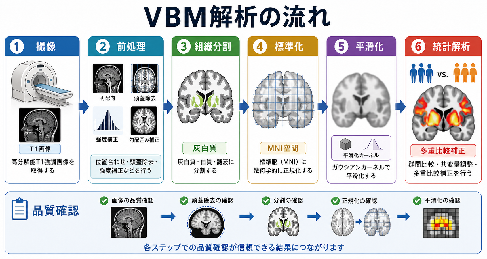
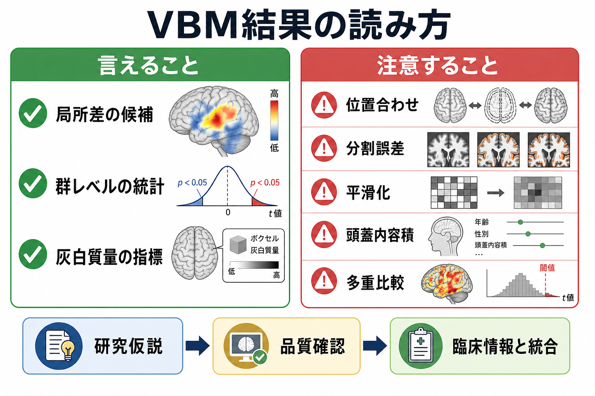

# ボクセルベース形態計測VBMとは何か

## 要点

- ボクセルベース形態計測（voxel-based morphometry; VBM）は、T1強調MRIから灰白質などを分割し、脳全体を小さな3次元画素（ボクセル）単位で統計比較する[[構造MRIは脳の何を測っているのか|構造MRI]]解析である[1][2]。
- 典型的には、灰白質体積、灰白質濃度、あるいはそれに近い局所的な組織量の指標を、群間差、年齢、症状尺度、認知課題成績などと関連づけて評価する[2][4]。
- 結果は「その部位の神経細胞が何個減った」と直接読むものではない。分割精度、位置合わせ、平滑化、頭蓋内容積、年齢・性別・撮像条件、多重比較補正の影響を受ける[5][8]。
- VBMは全脳探索に向く一方、関心領域を事前に決める[[ROI解析と全脳解析は何が違うのか|ROI解析]]や、皮質厚・表面積を分ける表面ベース解析とは問いが異なる。

## この記事で答える問い

この記事では、[[脳画像とは何を見ているのか|脳画像]]研究でよく使われるVBMについて、次の問いに答える。

- VBMはMRIから何を取り出し、何を比較しているのか。
- 「灰白質体積差」はどのような前処理と統計モデルから出てくるのか。
- 研究論文や臨床研究でVBMの結果を読むとき、どこに注意すべきか。

## まず結論

VBMは、個々の脳画像を共通の標準空間にそろえ、灰白質などの組織確率画像をボクセル単位で比較する方法である。したがって、結果は「ある条件で、この標準空間上の近傍に灰白質量の統計的差が見られた」という群レベルの推定であり、解剖学的な原因を単独で確定する検査ではない[1][2][5]。

## 背景

VBMが登場した背景には、脳構造の変化を、あらかじめ決めた少数の領域だけでなく、全脳にわたって探索したいという要求がある。従来の手作業の体積測定では、海馬や扁桃体などの領域を丁寧に描くことはできるが、全脳の多数の部位を同じ基準で測るには大きな労力がかかる。

AshburnerとFristonによる初期のVBMは、脳画像を標準空間へ正規化し、灰白質・白質・脳脊髄液に分割し、平滑化した組織画像を統計解析する枠組みとして提示された[1]。その後、組織分割と位置合わせを同時に扱う統合分割、DARTELのような高精度位置合わせ、CAT12などの計算解剖ツールにより、標準的な構造MRI解析パイプラインの一部として広く使われるようになった[3][8]。

## 基本概念

### ボクセル

ボクセルは3次元画像における最小単位で、2次元画像のピクセルに相当する。MRI画像は、脳を細かい立方体の格子として表現する。VBMでは、この格子ごとに「灰白質らしさ」や「灰白質量」を持つ画像を作り、全脳の各ボクセルで統計検定を行う。

### 灰白質量・灰白質濃度

VBMで扱う灰白質指標は、単純な細胞数ではない。T1強調画像の信号から推定された組織確率、位置合わせ時の局所的な伸縮、平滑化された近傍情報を含む、マクロな形態指標である[1][2]。

ここで重要なのが、modulation（変調）である。標準空間に合わせると、個人の脳は局所的に伸び縮みする。modulated VBMでは、その伸縮量を補正して、標準化前の局所体積情報をより反映するようにする。unmodulated画像は、局所的な組織濃度や組織確率に近い意味を持つ。論文を読むときは、著者がどちらを使ったかを確認する必要がある[1][5][8]。

### 標準空間

多人数の脳を同じ座標で比較するには、個人差のある脳を共通テンプレートに合わせる必要がある。多くの研究ではMNI空間などの[[脳アトラスとは何か|標準座標系]]が使われる。ただし、標準空間は平均的な座標系であり、個人の折りたたまれた皮質構造を完全に一致させるものではない。

## 仕組み

典型的なVBM解析は、次のように進む[1][3][8]。

1. **T1強調MRIを撮像する**  
   高解像度の構造画像を取得する。撮像プロトコル、磁場強度、装置、頭部運動、画質が後の解析に影響する。

2. **前処理を行う**  
   画像の向き、頭蓋外組織、強度むら、ノイズなどを確認し、解析可能な状態にする。品質確認は結果の信頼性に直結する。

3. **組織分割を行う**  
   各ボクセルを灰白質、白質、脳脊髄液などの確率画像として推定する。分割誤差は、萎縮、病変、低画質、発達段階、加齢変化があるデータで問題になりやすい。

4. **標準空間へ正規化する**  
   個人の脳をテンプレートに合わせる。位置合わせが不十分だと、実際の灰白質差ではなく、解剖学的位置のずれが差として見えることがある。

5. **modulationと平滑化を行う**  
   modulationは局所体積情報の扱いを決める。平滑化はノイズを減らし、位置合わせ誤差を緩和し、統計モデルの前提に近づけるが、効果の空間的範囲をぼかす。

6. **統計解析を行う**  
   群、年齢、性別、全頭蓋内容積、撮像サイト、症状尺度、認知指標などを含めた一般線形モデルを用いる。全脳の多数のボクセルで検定するため、FWEやFDRなどの多重比較補正が必要になる[5]。

## 図解

VBMの出力は、脳の形をそのまま「見た」ものではなく、前処理と統計モデルを通した結果である。図の赤や黄色の領域は、通常、「このモデル、この補正、この閾値のもとで差または関連が検出された場所」と読む。

| 観点 | 確認したいこと | 解釈上の意味 |
|---|---|---|
| 撮像 | 装置、磁場強度、撮像条件、頭部運動 | サイト差や画質差が構造差に見えることがある |
| 分割 | 灰白質・白質・脳脊髄液の推定が妥当か | 分割誤差は局所差として残りうる |
| 標準化 | テンプレートへの位置合わせが妥当か | 位置ずれは群間差と混同されうる |
| 平滑化 | カーネル幅が研究目的に合うか | 小さい効果は消え、大きい効果は広がって見える |
| 共変量 | 年齢、性別、頭蓋内容積、サイトなど | 交絡の統制と過統制の両方に注意する |
| 統計 | 多重比較補正、閾値、効果量 | p値だけで実質的意味は決まらない |

## 臨床・研究との接続

VBMは、加齢、神経変性疾患、発達、精神疾患、学習、認知機能、治療前後変化などの研究で使われる。たとえば、Goodらは多数の健常成人を対象に、年齢に伴う灰白質・白質の局所差をVBMで示した[4]。このような研究は、脳構造の加齢変化を全脳規模で把握するうえで重要である。

精神医学や認知神経科学では、VBMは症状尺度、認知機能、疾患群、薬物治療歴、罹病期間などとの関連を調べるために用いられる。ただし、臨床的には「VBMで差があるから診断できる」とは言えない。個人診断には、症状、神経学的診察、認知検査、既往歴、薬剤、他の画像所見を統合する必要がある。

研究でVBMを使うときは、サンプルサイズ、統計的検出力、多施設データの調和、事前仮説、探索解析と確認解析の区別が重要になる。多施設構造MRIでは、スキャナや施設の違いが皮質厚や形態指標に影響しうるため、調和化や統計的調整が必要になる[7]。

## よくある誤解

### 誤解1: VBMは神経細胞数を測っている

VBMは神経細胞数を直接測っていない。灰白質指標には、ニューロン、グリア、血管、シナプス、髄鞘、水分、細胞外空間、画像分割アルゴリズムの影響が混ざる。したがって、「灰白質体積が小さい」は「神経細胞が減った」と同義ではない[2][5]。

### 誤解2: 赤く表示された部位が疾患の原因である

統計地図は関連や差を示すが、因果を示すとは限らない。年齢、薬剤、罹病期間、睡眠、生活習慣、頭蓋内容積、撮像条件、サンプル選択が影響する可能性がある。原因を論じるには縦断研究、介入研究、行動指標、他モダリティの証拠が必要である。

### 誤解3: 全脳解析ならバイアスがない

全脳解析は事前に関心領域を限定しない利点があるが、解析パイプライン、平滑化幅、統計閾値、共変量選択、品質除外基準は研究者が選ぶ。報告の透明性が低いと再現性が下がるため、VBM研究では前処理、正規化、modulation、平滑化、共変量、多重比較補正を明示することが推奨される[5]。

### 誤解4: VBMは皮質厚解析と同じである

VBMは3次元ボクセル内の組織量を扱う。一方、表面ベース解析は皮質の白質境界と軟膜面を再構成し、皮質厚や表面積を分けて扱う。皮質の薄さと表面積の変化は発達的・遺伝的背景が異なる可能性があるため、研究目的によって使い分ける。

## 関連ノート

- [[脳画像とは何を見ているのか]]
- [[構造MRIは脳の何を測っているのか]]
- [[T1強調画像とT2強調画像は何が違うのか]]
- [[ROI解析と全脳解析は何が違うのか]]
- [[脳アトラスとは何か]]
- [[脳画像研究の再現性問題とは何か]]

## MOC更新候補

- `content/00_MOC/` 配下に脳画像・神経計測系のMOCがある場合、本記事を「構造MRI」「形態計測」「画像統計」の入口として追加する。
- 並列ジョブとの競合を避けるため、この作業ではMOC本文の更新は行わない。

## 理解チェック

1. VBMがT1強調MRIから直接測っているものと、統計解析後に推定しているものは何が違うか。
2. modulated VBMとunmodulated VBMでは、灰白質指標の意味がどのように変わるか。
3. 全頭蓋内容積、年齢、性別、撮像サイトを共変量に入れる理由は何か。
4. VBMの赤い統計地図を「疾患原因の地図」と読んではいけない理由は何か。
5. VBMとROI解析、表面ベース解析は、それぞれどのような問いに向いているか。

## 未解決問題

- 灰白質体積差を、細胞密度、シナプス、グリア、血管、髄鞘、水分量などの微視的変化へどこまで対応づけられるか。
- 多施設・多機種データで、スキャナ差を補正しながら真の生物学的差をどこまで保持できるか。
- 個人レベルの予測や臨床判断に使う場合、どの程度の再現性、説明可能性、外部妥当性が必要か。

## 参考文献

[1] Ashburner, J., & Friston, K. J. (2000). Voxel-based morphometry: The methods. *NeuroImage*, 11(6), 805-821. https://doi.org/10.1006/nimg.2000.0582

[2] Mechelli, A., Price, C. J., Friston, K. J., & Ashburner, J. (2005). Voxel-based morphometry of the human brain: Methods and applications. *Current Medical Imaging Reviews*, 1(2), 105-113. https://doi.org/10.2174/1573405054038726

[3] Ashburner, J., & Friston, K. J. (2005). Unified segmentation. *NeuroImage*, 26(3), 839-851. https://doi.org/10.1016/j.neuroimage.2005.02.018

[4] Good, C. D., Johnsrude, I. S., Ashburner, J., Henson, R. N. A., Friston, K. J., & Frackowiak, R. S. J. (2001). A voxel-based morphometric study of ageing in 465 normal adult human brains. *NeuroImage*, 14(1), 21-36. https://doi.org/10.1006/nimg.2001.0786

[5] Ridgway, G. R., Henley, S. M. D., Rohrer, J. D., Scahill, R. I., Warren, J. D., & Fox, N. C. (2008). Ten simple rules for reporting voxel-based morphometry studies. *NeuroImage*, 40(4), 1429-1435. https://doi.org/10.1016/j.neuroimage.2008.01.003

[6] Shen, S., & Sterr, A. (2013). Is DARTEL-based voxel-based morphometry affected by width of smoothing kernel and group size? A study using simulated atrophy. *PLoS ONE*, 8(6), e63595. https://doi.org/10.1371/journal.pone.0063595

[7] Fortin, J. P., Cullen, N., Sheline, Y. I., Taylor, W. D., Aselcioglu, I., Cook, P. A., et al. (2018). Harmonization of cortical thickness measurements across scanners and sites. *NeuroImage*, 167, 104-120. https://doi.org/10.1016/j.neuroimage.2017.11.024

[8] Gaser, C., Dahnke, R., Thompson, P. M., Kurth, F., & Luders, E. (2024). CAT: A computational anatomy toolbox for the analysis of structural MRI data. *bioRxiv*. https://doi.org/10.1101/2022.06.11.495736
