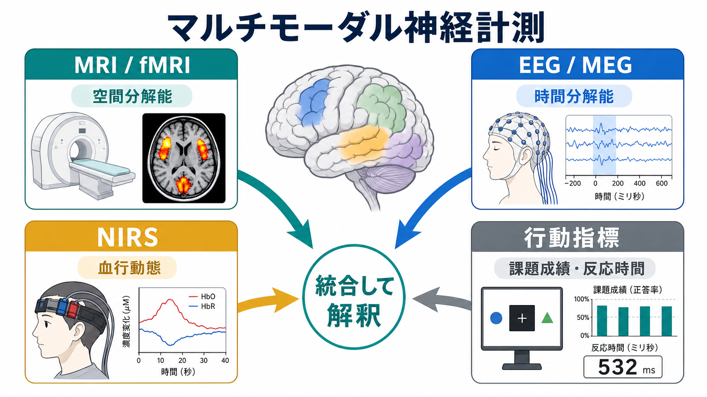
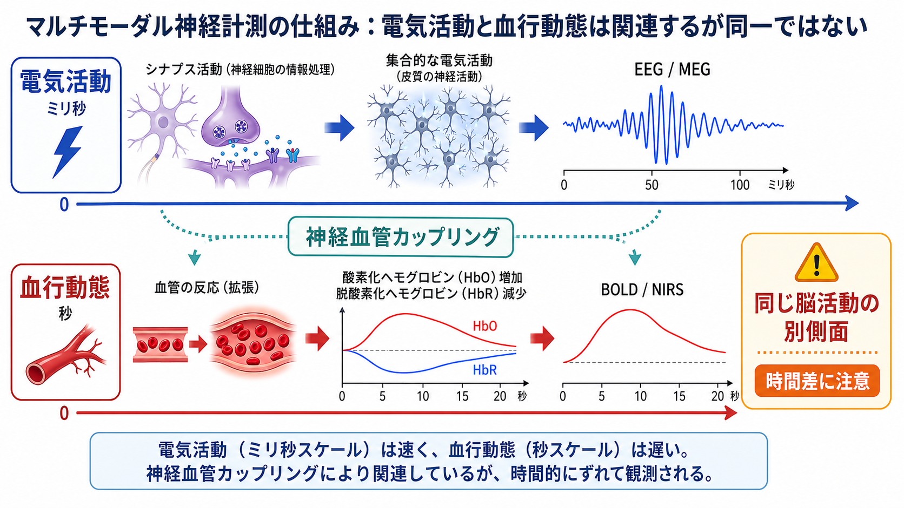
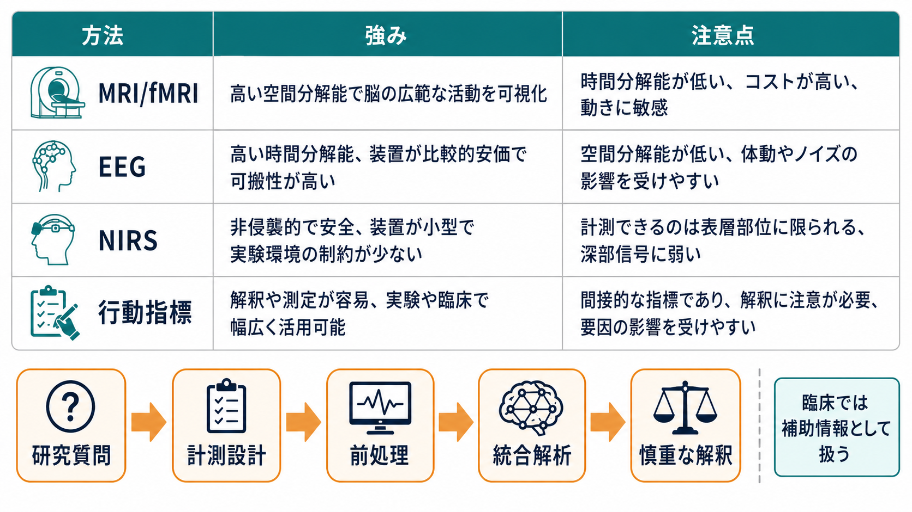

# マルチモーダル神経計測とは何か

## 要点

- マルチモーダル神経計測とは、[[構造MRIは脳の何を測っているのか|構造MRI]]、[[fMRIは神経活動を直接測っているのか|fMRI]]、[[脳波EEGは何を測っているのか|EEG]]、[[近赤外分光法NIRSは何を測っているのか|NIRS]]、行動指標などを組み合わせ、脳の構造・活動・血行動態・行動を同じ研究質問のもとで読む方法である。
- 目的は「一つの方法で完全に測る」ことではなく、それぞれの方法が持つ時間分解能、空間分解能、侵襲性、可搬性、解釈上の限界を補い合うことである[1][2]。
- EEG/MEGはミリ秒単位の電気・磁気活動に強く、fMRIやNIRSは神経活動に伴う血行動態変化に強い。ただし血行動態信号は神経活動そのものではなく、時間的に遅れて現れる[3][4]。
- 統合解析の価値は高いが、前処理、時刻同期、位置合わせ、欠測、アーチファクト、統計的多重性、逆推論の問題を丁寧に扱う必要がある[2][5]。

## この記事で答える問い

この記事では、次の問いに答える。

1. マルチモーダル神経計測は、単なる「複数計測の寄せ集め」と何が違うのか。
2. MRI、EEG、NIRS、行動指標は、それぞれ脳機能のどの側面を測るのか。
3. 電気活動と血行動態を組み合わせると、なぜ解釈が豊かになるのか。
4. 研究や臨床で使うとき、どこに注意すべきか。

## まず結論

マルチモーダル神経計測は、脳を「一枚の画像」や「一本の波形」としてではなく、複数の測定窓から推定する考え方である。たとえば、[[脳画像とは何を見ているのか|脳画像]]は脳の構造や血流変化を可視化し、EEGは速い電気的変動を捉え、NIRSは比較的自然な課題環境で表層皮質の酸素化ヘモグロビン変化を追跡し、行動指標は反応時間・正答率・選択・発話などとして機能的意味を与える。

重要なのは、これらを「どれが正解か」の競争として扱わないことである。fMRIのBOLD信号は神経活動に伴う血行動態の代理指標であり[3]、EEGは神経活動に近いが頭蓋・髄液・頭皮による体積伝導と逆問題の制約を受ける[6]。したがって、複数の信号が一致したときは解釈の信頼度が上がり、不一致が出たときは時間スケール、空間スケール、課題設計、前処理のどこに差があるのかを考える手がかりになる。

## 背景

脳機能の研究では、長いあいだ「どの部位が活動したか」と「いつ活動したか」を同時に高精度で知ることが難しかった。MRI/fMRIは空間的な局在に強い一方、血行動態応答は秒単位で遅れる。EEG/MEGはミリ秒単位の変化を追える一方、信号源の位置推定には頭部モデルや逆問題の仮定が必要である[6][7]。

この制約を補うために、EEG-fMRI、EEG-NIRS、MRIに基づくEEG/MEGソース推定、行動・生理・画像の統合解析などが発展してきた。精神医学や認知神経科学では、単一モダリティだけでは説明しにくい個人差や病態の異質性を理解するため、構造、機能結合、電気活動、行動を統合する研究が増えている[1][2]。

## 基本概念

マルチモーダル神経計測を理解するには、各方法が「何の代理指標か」を分けて考えるとよい。

| モダリティ | 主に測るもの | 強み | 注意点 |
|---|---|---|---|
| 構造MRI | 灰白質、白質、病変、形態 | 高い解剖学的情報 | 機能そのものは直接測らない |
| fMRI | BOLD信号、血流・酸素化変化 | 比較的高い空間分解能 | 神経活動の間接指標で時間応答が遅い[3] |
| EEG/MEG | 電気・磁気活動 | 高い時間分解能 | 空間推定には逆問題と頭部モデルが関わる[6][7] |
| NIRS/fNIRS | HbO/HbRの変化 | 可搬性、自然な課題環境との相性 | 表層皮質中心、皮膚血流などの生理ノイズに注意[8] |
| 行動指標 | 反応時間、正答率、選択、症状尺度 | 機能的意味づけに必須 | 脳内過程を一対一には反映しない |

ここでいう「統合」は、単に同じ参加者から複数データを取ることではない。研究質問、課題設計、時刻同期、空間位置合わせ、統計モデル、解釈の単位をそろえ、異なる信号がどの仮説を支持するのかを明示することである[2]。

## 仕組み

### 電気活動と血行動態は関連するが同一ではない

EEG/MEGは、主に神経細胞集団のシナプス後電位などに由来する電気・磁気的変化を高時間分解能で測る。対してfMRIやNIRSは、神経活動に伴う酸素需要、血流、血液量、酸素化状態の変化を捉える。両者を結びつける代表的な概念が神経血管カップリングである[4]。

ただし、神経血管カップリングは単純な一対一対応ではない。BOLDやNIRSの応答は刺激や課題の後に遅れて立ち上がり、血管反応、代謝、ベースライン状態、生理ノイズの影響を受ける。Logothetisらの同時計測研究は、BOLD信号が神経活動、とくに局所フィールド電位と密接に関係することを示したが、それでもBOLDは神経発火そのものではない[3]。

### 空間・時間・行動を対応づける

たとえば認知課題で反応時間が遅くなったとする。このとき、fMRIだけなら関連領域のBOLD変化、EEGだけなら刺激後数百ミリ秒の成分変化、NIRSだけなら前頭葉表層のHbO/HbR変化、行動だけなら課題成績の差として見える。これらを同じ試行、同じ条件、同じ個人差モデルに入れることで、「どの時点の処理が、どの領域の血行動態変化や行動の変化と結びつくか」を検討できる。

### 統合解析の型

代表的な統合には、次のような型がある。

- 同時計測: EEG-fMRIやEEG-NIRSのように、同じ課題中に複数信号を同時記録する。
- 逐次計測: MRIで構造や関心領域を定義し、別日にEEGや行動課題を実施する。
- 制約つき推定: MRIの解剖情報を使ってEEG/MEGの信号源推定を制約する。
- 特徴量融合: 画像、波形、行動尺度から抽出した特徴量を統計モデルや機械学習モデルで統合する。
- 仮説検証型統合: 事前に「時間成分Aが領域Bの活動を媒介して行動Cに影響する」といった仮説を置き、複数データで検証する。

## 図解

図のように、研究質問から逆算して計測設計を決めることが重要である。たとえば「脳部位の局在」が主目的ならMRI/fMRIが中心になりやすい。「処理の時間順序」が主目的ならEEG/MEGが中心になる。「自然な対人場面や運動課題に近い環境で前頭葉活動を追う」ならNIRSが有用な場合がある。行動指標は、どの計測でも機能的解釈の基準線になる。

## 臨床・研究との接続

研究では、マルチモーダル神経計測は認知課題、発達、加齢、精神疾患、神経疾患、リハビリテーション、ブレイン・コンピュータ・インターフェースなどに使われる。とくに精神医学領域では、症状が同じ診断名の中でも多様であるため、構造・機能・電気生理・行動を統合してサブタイプや病態メカニズムを探る試みがある[1]。

臨床では、複数の検査を統合すること自体は珍しくない。たとえばてんかん焦点の評価では、EEG、MRI、PET/SPECT、発作症候、行動観察などを総合する。ただし、研究用のマルチモーダル解析結果を個別患者の診断や治療方針へ直ちに適用できるとは限らない。教育・研究目的の記事としては、「臨床では補助情報として扱い、個別判断は専門家の評価に委ねる」と整理するのが適切である。

## よくある誤解

### 誤解1: 複数の計測をすれば必ず正確になる

複数のデータを足すだけでは、ノイズやバイアスも増える。時刻同期、頭部運動、電極アーチファクト、皮膚血流、課題条件の違い、前処理の選択を管理しないと、統合によってむしろ解釈が不安定になる[2][8]。

### 誤解2: fMRIの活動部位から心理過程を直接読める

ある領域が活動したからといって、特定の心理過程が必ず生じたとは言えない。Poldrackが論じたように、脳画像から心理過程を推論する逆推論は、領域の選択性や事前確率に依存する[5]。マルチモーダル計測はこの問題を弱める助けになるが、完全に消すわけではない。

### 誤解3: EEGは直接計測だから常に解釈しやすい

EEGは電気活動に近い信号を高時間分解能で測れるが、頭皮上の電位から脳内信号源を推定するには逆問題を解く必要がある。信号源の数や位置は一意に決まらないため、解剖情報、頭部モデル、妥当な制約が重要になる[6][7]。

### 誤解4: NIRSは簡便なので制約が少ない

NIRSは可搬性が高く、自然な課題との相性がよい一方、主に表層皮質を対象とし、頭皮血流、心拍、呼吸、体動などの生理ノイズの影響を受ける。短距離チャンネルや適切な前処理を含め、計測設計が重要である[8]。

## 関連ノート

- [[脳画像とは何を見ているのか]]
- [[構造MRIは脳の何を測っているのか]]
- [[fMRIは神経活動を直接測っているのか]]
- [[BOLD信号とは何か]]
- [[課題fMRIでは何を比較しているのか]]
- [[安静時fMRIは何を測っているのか]]
- [[機能的結合解析とは何か]]
- [[脳波EEGは何を測っているのか]]
- [[脳波の周波数帯域にはどのような意味があるのか]]
- [[MEGはEEGと何が違うのか]]
- [[近赤外分光法NIRSは何を測っているのか]]

## MOC更新候補

- `content/00_MOC/` 配下の脳画像・神経計測系MOCがある場合、本記事を「計測方法の比較・統合」または「マルチモーダル計測」の項目に追加する。
- 並列記事生成との競合を避けるため、本ジョブではMOC本文は更新しない。

## 理解チェック

1. fMRIやNIRSが測る血行動態信号は、なぜ神経活動そのものとは言えないのか。
2. EEG/MEGの高い時間分解能と、MRI/fMRIの高い空間分解能は、どのように補完し合うか。
3. 行動指標を同時に取ることは、脳計測データの解釈にどのような役割を持つか。
4. マルチモーダル解析で「不一致」が出たとき、どのような原因を検討すべきか。

## 未解決問題

- 複数モダリティの特徴量を統合したモデルが、どの程度まで個人差や臨床的予後を一般化可能に説明できるか。
- EEG/MEGとfMRI/NIRSの時間差を、単純な相関ではなく、生成モデルとしてどこまで精密に扱えるか。
- 大規模データ統合において、施設差、装置差、前処理差、欠測をどのように標準化・補正するか。
- 研究上の統合指標を、個別診断や治療選択に結びつける際の妥当性と倫理的条件。

## 参考文献

[1] Calhoun, V. D., & Sui, J. (2016). Multimodal fusion of brain imaging data: A key to finding the missing link(s) in complex mental illness. *Biological Psychiatry: Cognitive Neuroscience and Neuroimaging*, 1(3), 230-244. https://doi.org/10.1016/j.bpsc.2015.12.005

[2] Sui, J., Adali, T., Yu, Q., & Calhoun, V. D. (2012). A review of multivariate methods for multimodal fusion of brain imaging data. *Journal of Neuroscience Methods*, 204(1), 68-81. https://doi.org/10.1016/j.jneumeth.2011.10.031

[3] Logothetis, N. K., Pauls, J., Augath, M., Trinath, T., & Oeltermann, A. (2001). Neurophysiological investigation of the basis of the fMRI signal. *Nature*, 412, 150-157. https://doi.org/10.1038/35084005

[4] Mulert, C. (2013). Simultaneous EEG and fMRI: Towards the characterization of structure and dynamics of brain networks. *Dialogues in Clinical Neuroscience*, 15(3), 381-386. https://doi.org/10.31887/DCNS.2013.15.3/cmulert

[5] Poldrack, R. A. (2006). Can cognitive processes be inferred from neuroimaging data? *Trends in Cognitive Sciences*, 10(2), 59-63. https://doi.org/10.1016/j.tics.2005.12.004

[6] Eom, T.-H. (2023). Electroencephalography source localization. *Clinical and Experimental Pediatrics*, 66(5), 201-209. https://doi.org/10.3345/cep.2022.00962

[7] Baillet, S., Mosher, J. C., & Leahy, R. M. (2001). Electromagnetic brain mapping. *IEEE Signal Processing Magazine*, 18(6), 14-30. https://doi.org/10.1109/79.962275

[8] Scholkmann, F., Kleiser, S., Metz, A. J., Zimmermann, R., Mata Pavia, J., Wolf, U., & Wolf, M. (2014). A review on continuous wave functional near-infrared spectroscopy and imaging instrumentation and methodology. *NeuroImage*, 85, 6-27. https://doi.org/10.1016/j.neuroimage.2013.05.004
