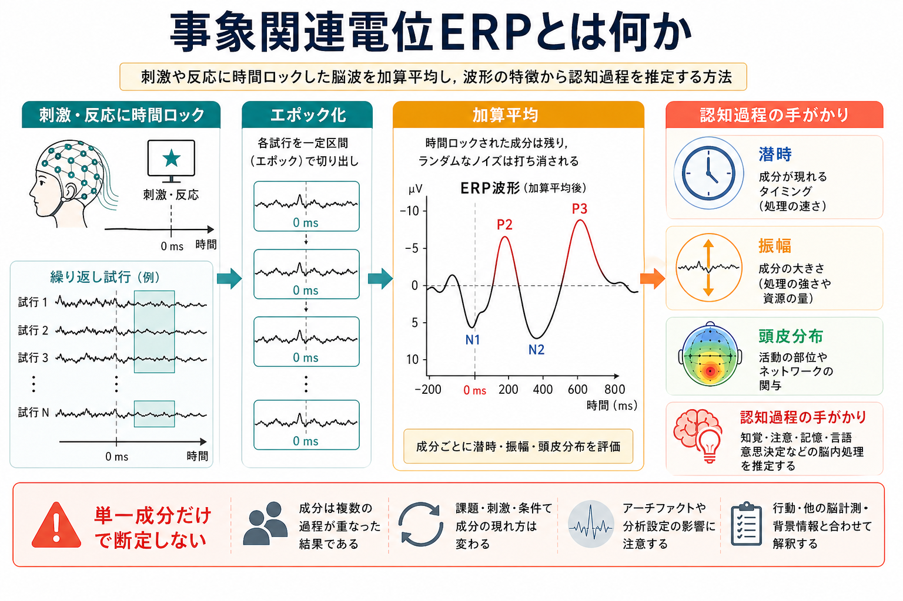
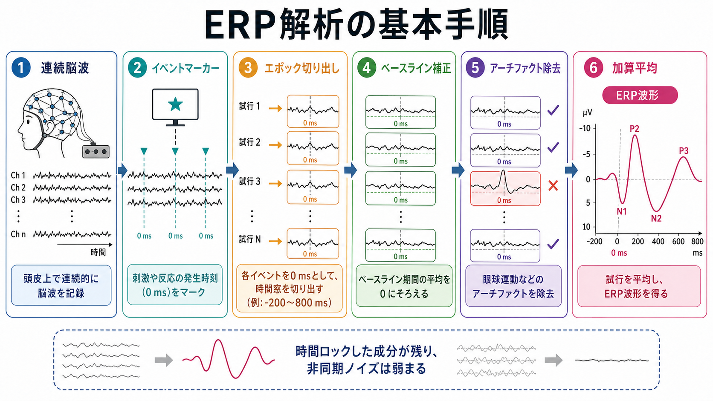

# 事象関連電位ERPとは何か

## 要点

- 事象関連電位（event-related potential; ERP）は、刺激提示、反応、フィードバックなどの出来事に時間をそろえて脳波を切り出し、加算平均して得られる電位変化である[1][2]。
- ERPは、ミリ秒単位の時間分解能で、知覚、注意、意味処理、反応準備、誤反応モニタリングなどの時間経過を調べる方法として使われる[1][3]。
- ERP成分は、潜時、振幅、極性、頭皮分布、課題条件への感受性から読む。ただし、単一成分を単一の心理機能や疾患に一対一対応させることはできない[2][7]。
- 研究では、事前仮説、十分な試行数、アーチファクト処理、参照電極、フィルタ設定、統計補正を明示することが重要である[2][7][8]。

## この記事で答える問い

1. ERPは、通常の[[神経振動とは何か|脳波リズム]]や周波数解析と何が違うのか。
2. 刺激や反応に時間ロックすることで、どのように認知過程の時間構造を推定するのか。
3. N170、MMN、N400、P3、LRP、ERN などの成分を読むとき、どこに注意すべきか。
4. 研究・臨床応用で、ERPをどこまで信頼してよいのか。

## まず結論

ERPは「脳波から、出来事に同期した小さな応答を取り出す方法」である。連続EEGには、課題に関係する神経活動、背景脳波、筋電、眼球運動、電源ノイズなどが混ざる。ERP解析では、各試行を刺激時刻や反応時刻にそろえて切り出し、平均することで、時間ロックした成分を相対的に強調し、時間ロックしていない変動を弱める[1][2]。

ただし、ERP波形は「心の部品」が直接見えているものではない。波形の山や谷は、複数の神経発生源、課題設計、注意状態、感覚入力、運動反応、前処理手順が重なった結果である。したがってERPは、認知過程を推定する強力な手がかりだが、行動データ、課題操作、統計モデル、他の脳計測と合わせて解釈する必要がある[2][7][8]。

## 背景

EEGは頭皮上の電位差を連続的に測るため、時間分解能に優れる。一方で、頭皮で観察される信号は、多数のニューロン集団の同期したシナプス活動が頭蓋骨や頭皮を通って混ざったものであり、空間分解能は高くない。この制約は、[[神経同期とは何か|神経同期]]や[[脳内ネットワークとは何か|脳内ネットワーク]]をEEGで扱うときにも共通する。

ERPの発想は、この時間分解能の高さを、課題の出来事と結びつけるところにある。たとえば、画面に単語が出た時刻、珍しい音が鳴った時刻、ボタンを押した時刻、誤反応が起きた時刻を基準にして、前後数百ミリ秒から1秒程度のEEGを切り出す。多くの試行を平均すると、その出来事に一貫して同期した電位変化が見えやすくなる[1][2]。

## 基本概念

### 事象

ERPでいう「事象」は、刺激だけではない。視覚刺激、聴覚刺激、単語、顔、標的刺激、逸脱刺激、反応、誤反応、報酬、フィードバックなど、解析上の基準時刻にできる出来事を指す。刺激にそろえる場合は刺激ロックERP、反応にそろえる場合は反応ロックERPと呼ばれることがある。

### 極性・潜時・振幅

ERP成分名には、しばしば極性と潜時が入る。たとえばN100やN1は、刺激後およそ100 ms前後に出る陰性方向の成分を指す。P3やP300は、刺激後およそ300 ms以降に出る陽性成分を指す。ただし、実際の潜時範囲は課題、年齢、感覚モダリティ、電極位置、前処理によって変わる[1][4]。

振幅は、成分の大きさを表す。基線からピークまでを測るピーク振幅、一定時間窓の平均振幅、条件差波の振幅などが使われる。潜時は、処理の速さを反映する手がかりになることがあるが、反応時間そのものとは同じではない。

### 頭皮分布

ERPは、どの電極で大きく見えるかも重要である。P3aは前頭部寄り、P3bは頭頂部寄りに現れやすいなど、頭皮分布は成分同定の手がかりになる[4]。ただし、頭皮分布は発生源そのものではない。体積伝導、参照電極、頭部形状、信号源の向きが影響するため、発生源推定には追加の仮定が必要になる。

## 仕組み

典型的なERP解析は、次の流れで進む。

1. 頭皮EEGを連続的に記録する。
2. 刺激提示や反応の時刻にイベントマーカーを入れる。
3. 各イベントを0 msとして、前後の時間窓をエポックとして切り出す。
4. 刺激前の基線区間を使ってベースライン補正を行う。
5. 瞬目、眼球運動、筋電、電極不良などのアーチファクトを除去または補正する。
6. 条件ごとに試行を平均し、ERP波形や条件差波を得る。
7. 事前に定めた電極・時間窓・成分について、振幅や潜時を統計解析する[2][3][8]。

加算平均が有効なのは、課題に同期した活動が各試行で似たタイミングに現れ、同期していないノイズが平均で相殺されやすいからである。ただし、すべての認知活動が厳密に同じ潜時で起きるわけではない。試行ごとの潜時揺らぎが大きい場合、平均波形は成分をぼかすことがある。

## 図解

代表的なERP成分は、研究領域ごとに「処理の時間的手がかり」として使われる。たとえば、N170は顔処理、MMNは聴覚逸脱検出、N400は意味処理、P3は注意や文脈更新、LRPは反応準備、ERNは誤反応モニタリングと関係づけられることが多い[3][4][5][6]。

ただし、これらは「典型的に関連する課題操作」であり、「その成分が出たから、その心理機能が証明された」という意味ではない。同じ成分名でも、刺激、課題、解析窓、電極、比較条件が違えば、解釈も変わる。

## 臨床・研究との接続

ERPは、精神医学・神経心理学・発達研究・言語研究・注意研究で広く使われる。たとえばP3は、標的検出、注意資源、文脈更新、加齢、精神疾患研究で扱われてきた[4]。N400は、単語や文脈の意味処理、予測、意味記憶へのアクセスを調べる代表的成分である[5]。MMNは、参加者が能動的に課題をしていない状況でも聴覚変化への自動的応答として測りやすく、臨床研究でも注目されている[6]。

臨床との接続では、ERPを「診断そのもの」としてではなく、認知機能や神経処理の研究指標として読む必要がある。個人の診断や治療方針は、症状、面接、行動評価、神経心理検査、画像、薬物、発達歴、生活背景などを総合して判断される。ERPの異常や群差は、疾患メカニズムの仮説生成には役立つが、単独で個別診断を決めるものではない。

## よくある誤解

### 誤解1: ERP成分は心理機能そのものを表す

ERP成分は、心理機能そのものではなく、ある課題条件で観察される電位変化である。たとえばN400は意味処理と深く関係するが、語の頻度、予測可能性、文脈、注意、刺激提示条件にも影響される[5]。

### 誤解2: P300が大きければ注意力が高い

P3振幅は注意資源や課題関連性と関係することがあるが、刺激確率、課題難度、記憶更新、覚醒水準、年齢、測定条件にも左右される[4]。単純な能力指標として読むのは危険である。

### 誤解3: 平均すれば常に正しいERPが出る

平均はノイズ低減に有効だが、アーチファクト、試行数不足、条件差の反応時間差、潜時揺らぎ、フィルタ歪み、事後的な電極・時間窓選択があると、見かけの効果を作ることがある[7][8]。

### 誤解4: ERPだけで脳内発生源がわかる

頭皮ERPは高い時間分解能を持つが、空間的な発生源推定は逆問題であり一意に決まらない。発生源を論じる場合は、頭部モデル、電極数、MRI、MEG、fMRI、解剖学的仮定などを確認する必要がある。

## 関連ノート

- [[神経振動とは何か]]
- [[神経同期とは何か]]
- [[ガンマ振動は認知機能にどう関わるのか]]
- [[脳内ネットワークとは何か]]
- [[構造的結合と機能的結合は何が違うのか]]
- [[有効結合とは何か]]

MOC更新候補: `content/00_MOC/MOC｜脳・神経科学.md` の「fMRI・EEG・MEG・PET」付近に追加候補。ただし、並列ジョブとの競合を避けるため今回は未更新。

## 理解チェック

1. ERP解析でイベント時刻を0 msにそろえる理由は何か。
2. 加算平均は、どのような信号を強め、どのような変動を弱めるのか。
3. ERP成分を読むとき、潜時、振幅、頭皮分布のそれぞれは何を示す手がかりになるか。
4. N400やP3を、単独で「意味能力」や「注意力」の指標として断定してはいけない理由は何か。
5. ERP研究の結果を読むとき、試行数、アーチファクト処理、事前仮説、統計補正を確認すべき理由は何か。

## 参考文献

[1] Luck, S. J. (2014). *An Introduction to the Event-Related Potential Technique* (2nd ed.). MIT Press. https://mitpress.mit.edu/9780262525855/an-introduction-to-the-event-related-potential-technique/

[2] Picton, T. W., Bentin, S., Berg, P., Donchin, E., Hillyard, S. A., Johnson, R., Jr., Miller, G. A., Ritter, W., Ruchkin, D. S., Rugg, M. D., & Taylor, M. J. (2000). Guidelines for using human event-related potentials to study cognition: Recording standards and publication criteria. *Psychophysiology, 37*(2), 127-152. https://doi.org/10.1111/1469-8986.3720127

[3] Kappenman, E. S., Farrens, J. L., Zhang, W., Stewart, A. X., & Luck, S. J. (2021). ERP CORE: An open resource for human event-related potential research. *NeuroImage, 225*, 117465. https://doi.org/10.1016/j.neuroimage.2020.117465

[4] Polich, J. (2007). Updating P300: An integrative theory of P3a and P3b. *Clinical Neurophysiology, 118*(10), 2128-2148. https://doi.org/10.1016/j.clinph.2007.04.019

[5] Kutas, M., & Federmeier, K. D. (2011). Thirty years and counting: Finding meaning in the N400 component of the event-related brain potential. *Annual Review of Psychology, 62*, 621-647. https://doi.org/10.1146/annurev.psych.093008.131123

[6] Näätänen, R., Paavilainen, P., Rinne, T., & Alho, K. (2007). The mismatch negativity (MMN) in basic research of central auditory processing: A review. *Clinical Neurophysiology, 118*(12), 2544-2590. https://doi.org/10.1016/j.clinph.2007.04.026

[7] Luck, S. J., & Gaspelin, N. (2017). How to get statistically significant effects in any ERP experiment and why you should not. *Psychophysiology, 54*(1), 146-157. https://doi.org/10.1111/psyp.12639

[8] Keil, A., Debener, S., Gratton, G., Junghöfer, M., Kappenman, E. S., Luck, S. J., Luu, P., Miller, G. A., & Yee, C. M. (2014). Committee report: Publication guidelines and recommendations for studies using electroencephalography and magnetoencephalography. *Psychophysiology, 51*(1), 1-21. https://doi.org/10.1111/psyp.12147

## 未解決問題

- 試行ごとの潜時揺らぎや個人差を、平均ERPと単一試行解析のどちらで扱うべきか。
- ERP成分と、[[神経振動とは何か|周波数帯域活動]]や[[脳内ネットワークとは何か|ネットワーク指標]]をどう統合するか。
- 臨床群差として報告されるERP変化を、個人レベルの予測や介入評価にどこまで使えるか。
- 大規模データ、事前登録、標準化パイプラインによって、ERP研究の再現性をどこまで高められるか。
