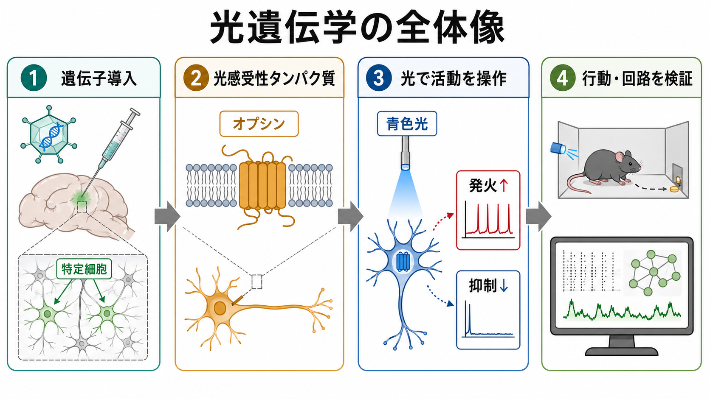
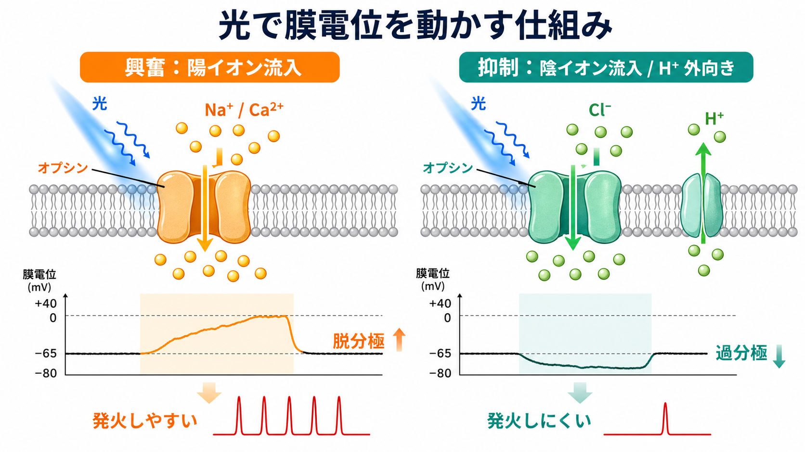
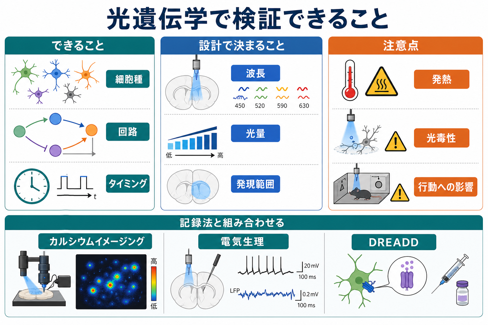

# 光遺伝学は神経活動をどう操作するのか

## 要点

- 光遺伝学は、光で開閉するオプシンを特定の[[ニューロンとは何か|ニューロン]]に発現させ、光照射で膜電位・発火・シナプス出力を操作する方法である[1][2]。
- チャネルロドプシン2（ChR2）のような陽イオンチャネルは脱分極を起こし、細胞を発火しやすくする。抑制性オプシンや光駆動ポンプ、光開口性Cl^-チャネルは、条件に応じて発火しにくい状態を作る[1][5]。
- 強みは、細胞種・投射経路・時間をかなり細かく指定して「活動を変えたら何が起きるか」を問える点にある[2][3]。
- ただし、発現範囲、光量、発熱、光毒性、組織散乱、行動への干渉、同時記録のアーチファクトを無視すると、因果解釈は簡単に崩れる[3][4][7]。
- 現時点では主に基礎・前臨床研究の道具であり、臨床応用は網膜疾患など一部で探索段階にある[8]。

## この記事で答える問い

1. 光感受性タンパク質は、どのように神経細胞の活動を変えるのか。
2. なぜ光遺伝学は「観察」ではなく「因果操作」の技術と呼ばれるのか。
3. 実験では、細胞種・回路・時間をどのように指定するのか。
4. 研究や臨床応用を読むとき、どの限界に注意すべきか。

## まず結論

光遺伝学の核心は、「光で反応する[[イオンチャネルとは何か|イオンチャネル]]またはポンプを、狙った細胞群に発現させる」ことである。光が当たるとオプシンが構造変化を起こし、Na^+、Ca2+、H^+、Cl^-などのイオン移動が変わる。その結果、膜電位が脱分極または過分極し、[[活動電位はどのように発生するのか|活動電位]]の出やすさが変わる。

これにより、従来の記録法が主に「活動している細胞を測る」技術だったのに対し、光遺伝学は「その細胞を活動させる、または止めると、回路や行動がどう変わるか」を調べられる。つまり、[[神経回路とは何か|神経回路]]研究における因果介入の道具である[2][3]。

## 背景

神経科学では長く、特定の細胞群が活動していることと、行動・知覚・症状が変わることの関係をどう区別するかが問題だった。[[fMRIは神経活動を直接測っているのか|fMRI]]、[[カルシウムイメージングとは何か]]、[[単一ユニット記録とは何か]]は活動の観察に強いが、「その活動が原因か」を確かめるには、活動を選択的に変える必要がある。

2005年、BoydenらはChR2を哺乳類神経細胞に導入し、青色光でミリ秒スケールのスパイク制御ができることを示した[1]。この実証は、遺伝学的な細胞標的化、光感受性タンパク質、光刺激装置、電気生理・行動計測を組み合わせる現在の光遺伝学の出発点になった[2]。

## 基本概念

### オプシン

オプシンは、光を受けて構造が変わるタンパク質である。光遺伝学では、微生物由来または改変されたオプシンを神経細胞に発現させる。代表的なChR2は光開口性陽イオンチャネルで、光が当たると陽イオンを通し、膜を脱分極させる[1]。

### 細胞標的化

「どの細胞を操作するか」は、プロモーター、Cre-lox系、ウイルスベクター、投射経路を利用した導入法、局所注入部位などで決まる。ここでの特異性が曖昧だと、光で変わった行動がどの細胞群に由来するのかも曖昧になる[3][4]。

### 光送達

「どこに光を当てるか」は、LED、レーザー、光ファイバー、顕微鏡、ミニスコープ、空間光変調などで決まる。脳組織内では光が散乱・吸収されるため、照射範囲は単純な円柱ではない。光量を上げれば強く操作できる一方で、発熱や非特異的影響のリスクも増える[4][7]。

## 仕組み

### 興奮させる

ChR2やChronosなどの陽イオンチャネル型オプシンは、光で開くとNa^+やCa2+などを通す。細胞内が相対的に正の方向へ動くと脱分極が起き、発火閾値に近づく。十分な脱分極があればスパイクが発生し、[[シナプスとは何か|シナプス]]出力も変わる[1][6]。

### 抑制する

抑制には複数の設計がある。古典的にはハロロドプシン系のCl^-流入、アーキロドプシン系のH^+外向きポンプなどが用いられた。さらに、陽イオン性チャネルロドプシンを構造改変してCl^-チャネルとして働かせる方法も開発され、より効率的な光抑制の選択肢が増えた[5]。

ただし、「抑制性オプシンを使えば常に完全に沈黙する」とは限らない。Cl^-の反転電位、発現量、照射強度、細胞区画、ネットワーク内の再帰結合によって、観察される効果は変わる。[[EPSPとIPSPはどのように発火を調節するのか]]で見るように、抑制の意味はイオンの種類だけでなく膜電位条件にも依存する。

### 時間を指定する

光遺伝学が強いのは、ミリ秒から秒単位で入力を制御できる点である。たとえば、刺激提示の直前だけ特定の介在ニューロンを活性化する、報酬直後だけ投射経路を抑制する、神経振動の特定位相に合わせて刺激する、といった設計が可能になる[3][7]。

## 図解

上の図1は、遺伝子導入、オプシン発現、光照射、回路・行動評価という全体の流れを示している。図2は、光がオプシンを介して膜電位を変える仕組みを、興奮と抑制に分けて示している。

次の図3は、光遺伝学で検証しやすい問いと注意点を整理したものである。光遺伝学だけで結論を出すのではなく、[[パッチクランプ法は何を測るのか]]、[[局所フィールド電位LFPとは何か]]、[[カルシウムイメージングとは何か]]、行動解析などと組み合わせて、操作が本当に狙った神経活動を変えたかを確認する必要がある。

## 臨床・研究との接続

### 神経回路の因果検証

光遺伝学は、ある細胞群や投射経路が行動に「相関する」だけでなく、操作すると行動が変わるかを調べる。たとえば、特定の興奮性ニューロン、[[抑制性介在ニューロンにはどのような種類があるのか|抑制性介在ニューロン]]、長距離投射、入力終末だけを操作し、運動、報酬、恐怖、睡眠、意思決定への寄与を検証できる[2][3]。

### 閉ループ制御

記録した神経活動や行動状態に応じて、リアルタイムに光刺激を変える方法もある。これは「活動を見てから刺激する」閉ループ実験であり、回路ダイナミクスや因果モデルを検証するうえで重要である[7]。ただし、記録系と刺激系の時間遅れ、光アーチファクト、解析アルゴリズムの仮定が結果に入り込む。

### 化学遺伝学との違い

[[化学遺伝学DREADDとは何か|DREADD]]は、人工受容体とリガンドを使って神経活動を変える。一般に、DREADDは分から時間単位の状態操作に向き、光遺伝学はミリ秒から秒単位のタイミング操作に向く。どちらが優れているというより、問いの時間スケール、侵襲性、操作範囲、必要な装置で使い分ける。

### 臨床応用

臨床応用は慎重に読む必要がある。脳深部の神経回路をヒトで広く光操作するには、遺伝子導入、安全性、光送達、標的選択、長期発現、倫理的課題が大きい。一方、網膜は光を届けやすく、遺伝子治療の標的としても扱いやすいため、網膜変性疾患に対する探索が進んでいる。Sahelらは、網膜色素変性症患者にChrimsonRを用いた治療と光刺激ゴーグルを組み合わせ、部分的な視機能回復を報告した[8]。ただし、これは個別診療の一般的治療指示ではなく、研究段階の知見として位置づけるべきである。

## よくある誤解

### 誤解1: 光を当てれば狙った細胞だけが必ず操作される

遺伝子発現が狙い通りでも、光は組織内で広がる。逆に、光が届かない細胞は発現していても十分に操作されない。発現範囲と光照射範囲の重なりを確認する必要がある[4]。

### 誤解2: 発火を増やせば、その細胞の自然な活動を再現できる

人工的な光刺激は、自然な入力のタイミング、樹状突起入力、シナプス局在、神経調節物質の状態を完全には再現しない。光で誘発されたスパイク列は、自然活動の一部を模倣する実験操作であって、自然状態そのものではない[3][7]。

### 誤解3: 行動が変われば、その細胞がその行動を単独で作っている

行動変化は、操作した細胞群だけでなく、下流回路、補償的活動、覚醒水準、運動出力、ストレス反応を含むネットワーク全体の結果である。光遺伝学は因果検証を強めるが、単一細胞群に心理機能を単純に割り当てる道具ではない。

### 誤解4: 光遺伝学はすぐ臨床治療になる

研究ツールとしては強力だが、ヒト脳への広い応用には安全な遺伝子導入と光送達の問題が残る。網膜領域の研究は進んでいるが、精神疾患や神経疾患の治療として一般化するには、基礎研究、前臨床、安全性評価が必要である[8]。

## 関連ノート

- [[ニューロンとは何か]]
- [[イオンチャネルとは何か]]
- [[活動電位はどのように発生するのか]]
- [[シナプスとは何か]]
- [[神経回路とは何か]]
- [[カルシウムイメージングとは何か]]
- [[パッチクランプ法は何を測るのか]]
- [[化学遺伝学DREADDとは何か]]

## MOC更新候補

- `content/00_MOC/MOC｜脳・神経科学.md`
- `content/00_MOC/MOC｜基礎神経科学.md`
- `content/01_脳・神経科学/脳画像・神経計測/` 配下の神経計測関連ノート群

## 理解チェック

1. ChR2のような陽イオンチャネル型オプシンは、なぜ発火を起こしやすくするのか。
2. 「発現範囲」と「光照射範囲」が一致しないと、どのような解釈上の問題が起きるか。
3. 光遺伝学とDREADDは、時間スケールと実験目的の点でどう違うか。
4. 光遺伝学で行動変化が出たとき、それだけで「その細胞がその行動を作る」と言えない理由は何か。

## 参考文献

[1] Boyden, E. S., Zhang, F., Bamberg, E., Nagel, G., & Deisseroth, K. (2005). Millisecond-timescale, genetically targeted optical control of neural activity. *Nature Neuroscience*, 8, 1263-1268. https://doi.org/10.1038/nn1525

[2] Deisseroth, K. (2015). Optogenetics: 10 years of microbial opsins in neuroscience. *Nature Neuroscience*, 18, 1213-1225. https://doi.org/10.1038/nn.4091

[3] Yizhar, O., Fenno, L. E., Davidson, T. J., Mogri, M., & Deisseroth, K. (2011). Optogenetics in neural systems. *Neuron*, 71(1), 9-34. https://doi.org/10.1016/j.neuron.2011.06.004

[4] Zhang, F., Gradinaru, V., Adamantidis, A. R., Durand, R., Airan, R. D., de Lecea, L., & Deisseroth, K. (2010). Optogenetic interrogation of neural circuits: technology for probing mammalian brain structures. *Nature Protocols*, 5, 439-456. https://doi.org/10.1038/nprot.2009.226

[5] Berndt, A., Lee, S. Y., Ramakrishnan, C., & Deisseroth, K. (2014). Structure-guided transformation of channelrhodopsin into a light-activated chloride channel. *Science*, 344(6182), 420-424. https://doi.org/10.1126/science.1252367

[6] Klapoetke, N. C., Murata, Y., Kim, S. S., Pulver, S. R., Birdsey-Benson, A., Cho, Y. K., Morimoto, T. K., Chuong, A. S., Carpenter, E. J., Tian, Z., Wang, J., Xie, Y., Yan, Z., Zhang, Y., Chow, B. Y., Surek, B., Melkonian, M., Jayaraman, V., Constantine-Paton, M., Wong, G. K.-S., & Boyden, E. S. (2014). Independent optical excitation of distinct neural populations. *Nature Methods*, 11, 338-346. https://doi.org/10.1038/nmeth.2836

[7] Grosenick, L., Marshel, J. H., & Deisseroth, K. (2015). Closed-loop and activity-guided optogenetic control. *Neuron*, 86(1), 106-139. https://doi.org/10.1016/j.neuron.2015.03.034

[8] Sahel, J.-A., Boulanger-Scemama, E., Pagot, C., Arleo, A., Galluppi, F., Martel, J. N., Degli Esposti, S., Delaux, A., de Saint Aubert, J.-B., de Montleau, C., Gutman, E., Audo, I., Duebel, J., Picaud, S., Dalkara, D., Blouin, L., Taiel, M., & Roska, B. (2021). Partial recovery of visual function in a blind patient after optogenetic therapy. *Nature Medicine*, 27, 1223-1229. https://doi.org/10.1038/s41591-021-01351-4

## 未解決問題

- 光刺激で作った活動パターンを、自然な神経活動にどこまで近づけられるか。
- ヒト脳で安全かつ長期に、細胞種・回路特異的な光操作を実現できるか。
- 光遺伝学、カルシウムイメージング、電気生理、行動解析を統合した閉ループ実験で、どこまで神経回路の因果モデルを検証できるか。
