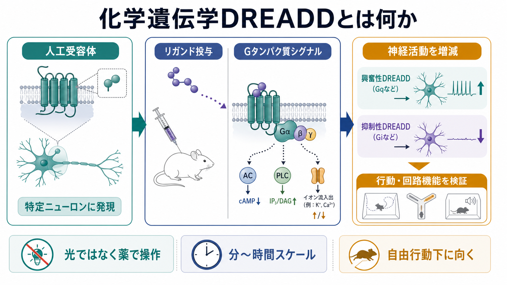
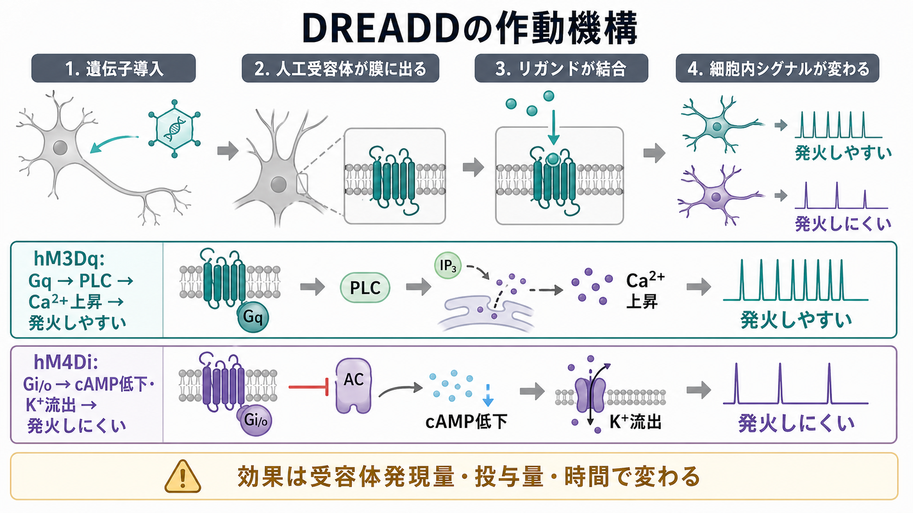
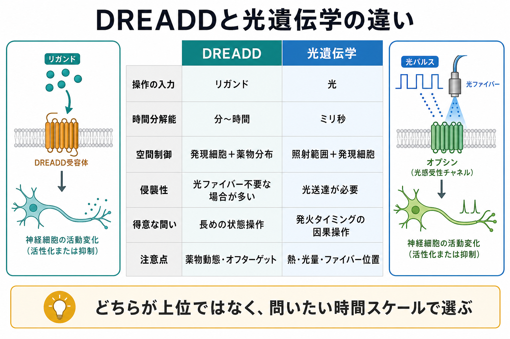

# 化学遺伝学DREADDとは何か

## 要点

- DREADDは、内因性リガンドには反応しにくく、特定の人工リガンドで活性化されるよう設計された人工受容体を、特定の細胞に発現させる化学遺伝学ツールである[1][3][4]。
- 代表例はムスカリン性アセチルコリン受容体を改変したGPCR型DREADDで、hM3Dqは主にGq経路を介して活動を高め、hM4DiはGi/o経路を介して活動を下げる方向に使われる[1][3]。
- 光遺伝学がミリ秒単位の発火タイミング操作に強いのに対し、DREADDは薬物投与後の分から時間スケールの状態操作、広い細胞集団、自由行動下の実験に向く[3][8]。
- ただし、効果は受容体発現量、投与量、投与経路、脳移行性、代謝、オフターゲット作用に依存する。特にCNOは体内でクロザピンへ変換されうるため、薬理学的対照が重要である[5][6]。

## この記事で答える問い

1. DREADDは、通常の薬理操作や遺伝子改変と何が違うのか。
2. 人工受容体とリガンドは、どのように[[ニューロンとは何か|ニューロン]]の活動を変えるのか。
3. DREADDと光遺伝学は、どのような時間スケールと研究目的で使い分けるのか。
4. CNO、クロザピン、deschloroclozapineなどのリガンドを読むとき、何に注意すべきか。

## まず結論

DREADDは「特定の細胞だけに人工受容体を持たせ、その細胞だけを薬で操作する」ための方法である。ここでいう「薬」は、通常の薬理学のように全身の内因性受容体へ広く作用する薬ではなく、実験者が導入した人工受容体に選択的に作用することを狙ったリガンドである。

したがってDREADDの核心は、**遺伝学的な細胞選択性**と**薬理学的な遠隔操作性**の組み合わせにある。ウイルスベクター、Cre-lox系、細胞種特異的プロモーターなどで受容体発現細胞を絞り、リガンド投与によってその細胞群のGタンパク質シグナルを変える。これにより、ある細胞群や回路が行動、情動、代謝、知覚、運動にどの程度因果的に関わるかを検証できる[2][3]。

## 背景

神経科学では、[[脳画像とは何を見ているのか|脳画像]]、電気生理、カルシウムイメージング、遺伝子発現解析などによって、ある脳領域や細胞群が課題中に活動することを観察できる。しかし観察だけでは、その活動が行動や症状の原因なのか、結果なのか、単なる相関なのかは分からない。

このため、神経回路研究では「活動を測る」だけでなく「活動を操作する」方法が重要になる。電気刺激、薬物投与、損傷、光遺伝学、化学遺伝学は、いずれも神経活動を変えて機能を推定するための方法である。DREADDはその中でも、特定細胞に発現させた人工GPCRを、全身投与可能なリガンドで比較的ゆっくり操作する手段として発展した[2][3][4]。

## 基本概念

### DREADDとは何か

DREADDは、Designer Receptors Exclusively Activated by Designer Drugsの略である。直訳すれば「デザイナー薬物だけで活性化されるデザイナー受容体」となる。古典的なDREADDは、ムスカリン性[[アセチルコリンは注意や記憶にどう関わるのか|アセチルコリン]]受容体を変異させ、内因性アセチルコリンには反応しにくく、CNOなどのリガンドに反応するよう設計したGPCRである[1]。

通常の受容体は、脳内に自然に存在する[[神経伝達物質はどのように放出されるのか|神経伝達物質]]やホルモンに反応する。一方、DREADDでは、実験者が標的細胞に人工受容体を発現させる。リガンドを投与すると、その人工受容体を持つ細胞だけが反応し、持たない細胞は原則として直接反応しない。この「受容体を持つ細胞だけが薬に反応する」という設計が、化学遺伝学の強みである。

### 化学遺伝学とは何か

化学遺伝学は、遺伝学的に導入した分子を、化学物質で操作する方法の総称である。DREADDの場合、遺伝学的な要素は人工受容体の発現であり、化学的な要素はリガンド投与である。

この考え方は、単に「薬を投与する」こととは違う。通常の薬物は、標的以外の受容体、輸送体、酵素にも作用しうる。DREADDでは、まず細胞種、脳領域、投射経路などを指定して人工受容体を発現させ、その後にリガンドで操作する。したがって、薬理学だけでは難しい細胞選択性を、遺伝学で補う方法といえる。

## 仕組み

### 1. 標的細胞に人工受容体を発現させる

最初の段階では、ウイルスベクターやトランスジェニック動物を用いて、特定の細胞群にDREADDを発現させる。たとえば、興奮性ニューロン、抑制性介在ニューロン、特定の投射を持つ細胞、あるいは特定の脳領域の細胞を標的にする。

ここでの特異性は、プロモーター、Cre依存性発現、注入部位、ウイルスの広がり、発現量に依存する。つまり「DREADDを使ったから特定細胞だけが操作される」のではなく、発現設計と検証がうまくいって初めて細胞選択性が得られる。

### 2. リガンドが人工受容体に結合する

次に、CNO、低用量クロザピン、Compound 21、deschloroclozapine（DCZ）などのリガンドを投与する。初期のDREADD研究ではCNOが「不活性でDREADD選択的なリガンド」として広く使われたが、その後の研究では、CNOの脳移行性やクロザピンへの変換が重要な論点になった[5][6]。

Gomezらは、CNOそのものよりも体内で変換されたクロザピンがDREADDを占有・活性化しうることを示し、DREADD実験ではリガンドの薬物動態とオフターゲット作用を厳密に考える必要があることを明確にした[5]。その後、Compound 21やDCZなど、より使いやすいリガンド候補の評価も進んでいる[6][7]。

### 3. Gタンパク質シグナルを介して活動を変える

代表的なDREADDはGPCRであり、結合するGタンパク質の種類によって細胞内シグナルが変わる。hM3DqはGq経路に結合し、PLC、IP3、細胞内Ca2+上昇などを介して神経細胞を発火しやすい方向へ動かす。一方、hM4DiはGi/o経路に結合し、アデニル酸シクラーゼ抑制、cAMP低下、K+チャネルを介した過分極などを通じて神経活動を低下させる方向に使われる[1][3]。

ただし、DREADDの効果は「オンにすれば必ず発火」「オフにすれば完全沈黙」という単純なスイッチではない。[[シナプスとは何か|シナプス]]入力、膜特性、発現部位、受容体密度、内因性活動状態、投与後の時間によって、見える効果は変わる。

## 図解

図1は、DREADDを「人工受容体」「リガンド投与」「Gタンパク質シグナル」「神経活動の増減」「行動・回路機能の検証」という流れで整理した概念地図である。

図2は、hM3DqとhM4Diの代表的な作動機構を示している。hM3Dqは活動を高める方向、hM4Diは活動を下げる方向に使われることが多いが、どちらもGPCRシグナルを介した調節であり、光で直接チャネルを開閉する方法とは異なる。

図3は、DREADDと光遺伝学の違いを比較している。DREADDはリガンド、光遺伝学は光を入力とする。DREADDは状態操作、光遺伝学はタイミング操作に強い、と大まかに捉えると理解しやすい。

## 光遺伝学との違い

光遺伝学は、チャネルロドプシンなどの光感受性タンパク質を細胞に発現させ、光照射で神経活動を制御する方法である。光のオン・オフは高速に制御できるため、ミリ秒単位の発火タイミング、リズム、同期、因果操作に強い[8]。

一方、DREADDは薬物投与に依存するため、効果の立ち上がりと消失は分から時間単位になりやすい。これは欠点であると同時に、長めの内部状態、情動状態、摂食、睡眠、ストレス反応、慢性的な回路調節を扱うには利点にもなる。光ファイバーや照射装置を必要としない設計が可能な場合もあり、広く分散した細胞群や自由行動下の実験に向くことがある[2][3]。

| 観点 | DREADD | 光遺伝学 |
|---|---|---|
| 入力 | リガンド | 光 |
| 主な分子 | 人工GPCRなど | オプシン、光感受性チャネルなど |
| 時間分解能 | 分から時間 | ミリ秒から秒 |
| 空間制御 | 発現細胞と薬物分布 | 発現細胞と照射範囲 |
| 得意な問い | 状態を長めに変えたときの行動・回路変化 | 発火タイミング、同期、短時間因果操作 |
| 主な注意点 | 薬物動態、代謝、オフターゲット、発現量 | 光送達、発熱、照射範囲、ファイバー位置 |

## 臨床・研究との接続

DREADDは現時点では主に研究ツールであり、個別の患者に対する標準的な治療法ではない。精神疾患、神経疾患、疼痛、運動、摂食、睡眠、依存などの研究では、特定回路を一時的に活性化・抑制し、行動や生理反応がどう変化するかを調べるために使われる[3]。

臨床研究との接続で重要なのは、DREADDが「症状を直接治す道具」というより、回路機能を因果的に検証する道具だという点である。たとえば[[PETは脳の何を測るのか|PET]]や[[fMRIは神経活動を直接測っているのか|fMRI]]で見える活動差が、実際に行動や症状へ因果的に関わるのかを、動物モデルで操作して検証する発想と相性がよい。

また、DREADD受容体をPETリガンドで可視化する研究も進み、人工受容体がどこにどれくらい発現しているかを生体内で評価する方向もある[7]。これは[[脳内ネットワークとは何か|脳内ネットワーク]]の観察と介入を接続するうえで重要な技術的展開である。

## よくある誤解

### 誤解1: DREADDは神経活動を完全にオン・オフする

DREADDは神経活動を変えられるが、完全なスイッチではない。GPCRシグナルを介して発火しやすさ、シナプス放出、細胞内シグナルを調節するため、効果は細胞種、発現量、投与量、内因性入力に依存する。

### 誤解2: CNOは常に不活性で、DREADD以外には作用しない

初期にはCNOが比較的不活性なリガンドとして用いられたが、体内でクロザピンに変換され、クロザピンがDREADDを活性化しうることが示された[5]。クロザピンは内因性受容体にも作用しうるため、DREADD陰性対照、リガンド単独対照、用量反応、可能なら薬物濃度や受容体発現の確認が必要である。

### 誤解3: DREADDは光遺伝学の下位互換である

DREADDと光遺伝学は競合するというより、問える時間スケールが違う。発火の1スパイク単位の因果性を問うなら光遺伝学が強い。一方、数十分続く活動状態や、広く分散した細胞集団の機能を自由行動下で調べるならDREADDが適する場合がある[3][8]。

### 誤解4: DREADDの発現が見えれば実験は成立する

蛍光タグや免疫染色で発現が見えても、それだけでは機能的効果は保証されない。電気生理、活動マーカー、行動指標、薬理対照、発現範囲の確認を組み合わせて、「どの細胞が、どの程度、いつ操作されたのか」を検証する必要がある。

## 関連ノート

- [[ニューロンとは何か]]
- [[シナプスとは何か]]
- [[受容体にはどのような種類があるのか]]
- [[アセチルコリンは注意や記憶にどう関わるのか]]
- [[神経伝達物質はどのように放出されるのか]]
- [[PETは脳の何を測るのか]]
- [[fMRIは神経活動を直接測っているのか]]
- [[脳内ネットワークとは何か]]

## MOC更新候補

- `content/00_MOC/` 配下の脳・神経科学系MOCに、本記事 `[[化学遺伝学DREADDとは何か]]` を追加する候補。
- 光遺伝学、神経操作法、神経計測、介入的神経科学に関するMOCがある場合は、DREADDを「神経活動操作法」の項目に配置する候補。

## 理解チェック

1. DREADDにおける「遺伝学的選択性」と「薬理学的操作性」は、それぞれ何を指すか。
2. hM3DqとhM4Diは、どのGタンパク質経路を介して神経活動を変えるか。
3. DREADDが光遺伝学より適している可能性がある研究課題を一つ挙げられるか。
4. CNOを用いたDREADD実験で、クロザピンへの変換が問題になる理由は何か。
5. DREADDの発現確認に加えて、なぜ機能的検証が必要なのか。

## 未解決問題

- ヒト臨床応用を考える場合、人工受容体の安全な導入、長期発現、免疫反応、リガンドの選択性をどこまで制御できるか。
- DREADDの効果を、単一細胞、局所回路、全脳ネットワーク、行動の各階層でどう対応づけるか。
- CNO、クロザピン、Compound 21、DCZなどのリガンド選択を、種差、投与経路、標的細胞、実験目的に応じてどのように標準化するか。

## 参考文献

[1] Armbruster, B. N., Li, X., Pausch, M. H., Herlitze, S., & Roth, B. L. (2007). Evolving the lock to fit the key to create a family of G protein-coupled receptors potently activated by an inert ligand. *Proceedings of the National Academy of Sciences*, 104(12), 5163-5168. https://doi.org/10.1073/pnas.0700293104

[2] Alexander, G. M., Rogan, S. C., Abbas, A. I., et al. (2009). Remote control of neuronal activity in transgenic mice expressing evolved G protein-coupled receptors. *Neuron*, 63(1), 27-39. https://doi.org/10.1016/j.neuron.2009.06.014

[3] Roth, B. L. (2016). DREADDs for neuroscientists. *Neuron*, 89(4), 683-694. https://doi.org/10.1016/j.neuron.2016.01.040

[4] Sternson, S. M., & Roth, B. L. (2014). Chemogenetic tools to interrogate brain functions. *Annual Review of Neuroscience*, 37, 387-407. https://doi.org/10.1146/annurev-neuro-071013-014048

[5] Gomez, J. L., Bonaventura, J., Lesniak, W., et al. (2017). Chemogenetics revealed: DREADD occupancy and activation via converted clozapine. *Science*, 357(6350), 503-507. https://doi.org/10.1126/science.aan2475

[6] Jendryka, M., Palchaudhuri, M., Ursu, D., et al. (2019). Pharmacokinetic and pharmacodynamic actions of clozapine-N-oxide, clozapine, and compound 21 in DREADD-based chemogenetics in mice. *Scientific Reports*, 9, 4522. https://doi.org/10.1038/s41598-019-41088-2

[7] Nagai, Y., Miyakawa, N., Takuwa, H., et al. (2020). Deschloroclozapine, a potent and selective chemogenetic actuator enables rapid neuronal and behavioral modulations in mice and monkeys. *Nature Neuroscience*, 23, 1157-1167. https://doi.org/10.1038/s41593-020-0661-3

[8] Deisseroth, K. (2011). Optogenetics. *Nature Methods*, 8, 26-29. https://doi.org/10.1038/nmeth.f.324

## 更新ログ

- 2026-04-27: 初稿作成。DREADDの概念、GPCR型DREADDの作動機構、光遺伝学との比較、CNO・クロザピン・DCZに関する注意点、図解3枚、関連ノート候補を整理。
