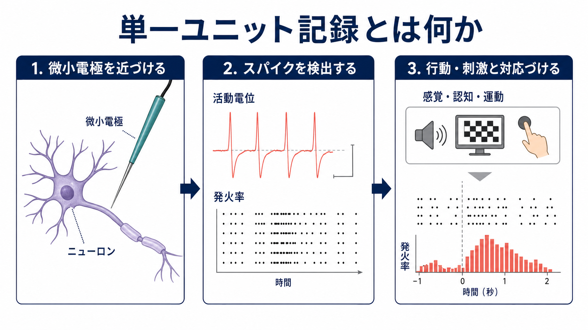
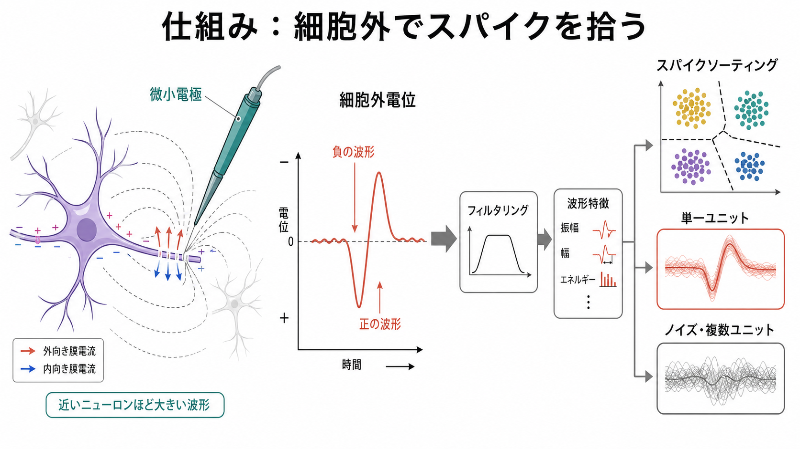
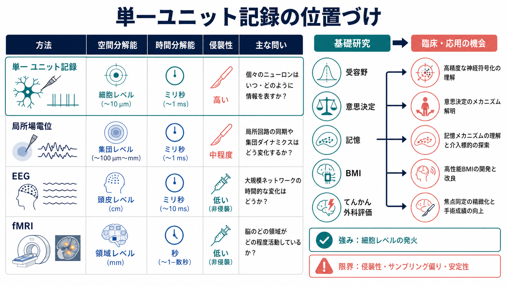

# 単一ユニット記録とは何か

## 要点

- 単一ユニット記録は、微小電極を脳組織や神経組織に近づけ、個々のニューロンのスパイク発火をミリ秒単位で記録する侵襲的な電気生理学的手法である[1][2]。
- 多くの場合、電極は細胞内ではなく細胞外に置かれ、近傍のニューロンが作る細胞外電位の急峻な波形を検出する[1][2]。
- 記録された波形から「どのスパイクが同じニューロンに由来するか」を推定する処理をスパイクソーティングと呼び、単一ユニット記録の解釈に不可欠である[2]。
- 強みは、細胞レベルで「いつ発火したか」を直接扱える点であり、受容野、意思決定、記憶、運動制御、脳機械インターフェースなどの研究に使われる[3][4][5]。
- 限界は、侵襲性、記録できる細胞の偏り、長期安定性、スパイクソーティング誤差、ヒト研究での倫理的・臨床的制約である[1][2][6]。

## この記事で答える問い

この記事では、[[脳画像とは何を見ているのか]]や[[課題fMRIでは何を比較しているのか]]のような非侵襲・間接計測とは対照的に、単一ユニット記録が「個々のニューロンの発火」をどのように扱うのかを整理する。

具体的には、次の問いに答える。

- 単一ユニット記録は何を測っているのか。
- 電極はニューロンの中に入っているのか、それとも外から拾っているのか。
- 「単一ユニット」と「単一ニューロン」は同じ意味でよいのか。
- 研究・臨床ではどのような意義があるのか。
- どのような限界と誤解があるのか。

## まず結論

単一ユニット記録は、ニューロン集団の平均的な活動ではなく、個々のニューロンが発する活動電位、すなわちスパイクの時刻列を扱う方法である。脳の活動を「どの領域が明るくなったか」と読むのではなく、「この細胞は刺激、行動、記憶、選択のどの時点で発火したか」と読むための方法だと言える。

ただし、「単一ユニット」は常に「完全に1個のニューロン」と同義ではない。細胞外記録では、電極近傍の複数ニューロンから波形が混じるため、波形の形、振幅、時間的特徴、複数電極での空間パターンを使って、同じニューロンに由来すると考えられるスパイク群を分離する[2]。したがって、単一ユニット記録の結果を読むときは、電極技術、信号処理、スパイクソーティング、サンプリング偏りをセットで見る必要がある。

## 背景

神経科学では、脳活動をさまざまな空間・時間スケールで測る。[[機能的結合解析とは何か]]や[[シードベース解析とは何か]]では、脳領域間の信号変動の関係を扱う。[[PETは脳の何を測るのか]]や fMRI では、代謝、血流、血液酸素化などを介して神経活動を推定する。一方、単一ユニット記録は、脳組織に微小電極を挿入し、ニューロンの発火に近い電気信号を直接測る。

この方法の歴史的な意義は大きい。たとえば Hubel と Wiesel は、ネコ視覚皮質の単一細胞応答を記録し、視覚ニューロンが単なる光点ではなく、線分の向き、眼優位性、受容野構造に選択的に応答することを示した[3]。このような研究によって、「脳領域が何をしているか」ではなく、「特定のニューロンがどの特徴に反応するか」を問う実験神経科学が発展した。

## 基本概念

### ユニットとは何か

電気生理学でいう「ユニット」とは、記録信号の中から一つの発火源として分離されたスパイク群を指す。理想的には1個のニューロンに対応するが、実際には次のような区別がある。

| 用語 | 意味 | 注意点 |
|---|---|---|
| 単一ユニット | 1つの発火源として分離されたスパイク群 | 多くの場合は1ニューロンと解釈するが、推定を含む |
| 多ユニット活動 | 複数ニューロンのスパイクが混ざった活動 | 局所集団の活動として扱う |
| 局所場電位 | 低周波成分を中心とする局所集団信号 | スパイクそのものではなく、シナプス入力や集団活動を反映しやすい |

### 細胞外記録と細胞内記録

単一ユニット記録は、多くの場合、細胞外記録である。電極はニューロンの膜内に刺さるのではなく、細胞外空間に置かれる。ニューロンが活動電位を発生させると、膜をまたぐ電流が流れ、その一部が細胞外電位の急峻な変化として検出される[1][2]。

細胞内記録やパッチクランプは膜電位そのものを詳細に測れるが、安定して長時間・多細胞で記録することは難しい。単一ユニット記録は、膜電位の全体像ではなく、発火時刻を高精度に追うことに強みがある。

### 「直接記録」とは何を意味するか

ここでいう直接記録とは、[[構造MRIは脳の何を測っているのか]]や fMRI のように血流・代謝・組織コントラストを介して推定するのではなく、ニューロンの電気的活動に由来する信号を記録するという意味である。ただし、細胞外単一ユニット記録も「電極先端の電位変化」を測っているのであり、ニューロンの全ての生理過程を直接見ているわけではない。

## 仕組み

### 1. 微小電極を近づける

金属線、ガラス微小電極、テトロード、シリコンプローブ、Neuropixels のような高密度プローブを、標的組織に挿入する。電極先端の近くで発火したニューロンほど、振幅の大きいスパイク波形として検出されやすい[1][4]。

### 2. スパイク波形を検出する

記録信号には、低周波の局所場電位、筋電・運動・機器ノイズ、高周波スパイク成分が混ざる。単一ユニット解析では、一般に高周波成分をフィルタリングし、しきい値を超える急峻な波形をスパイク候補として検出する[2]。

### 3. スパイクソーティングを行う

スパイク候補は、波形の振幅、幅、ピーク・谷の形、複数電極上の空間分布などを特徴量として抽出される。その特徴量空間でクラスタを作り、同じクラスタに属するスパイクを同じユニットに由来すると推定する[2]。

ここで重要なのは、スパイクソーティングは「真のニューロンID」を完全に読む処理ではなく、観測信号からもっとも妥当な発火源を推定する処理だという点である。低発火率の細胞、小さい振幅の細胞、波形が似た細胞、時間とともに電極から離れる細胞は、誤分類や見落としの影響を受けやすい[2]。

### 4. 刺激・行動・内部状態と対応づける

スパイク時刻だけでは、ニューロンの機能は分からない。研究では、視覚刺激、音、触覚刺激、運動、選択、報酬、記憶課題、睡眠・覚醒状態などとスパイク列を対応づける。たとえば、刺激提示からの時間にそろえて発火率を平均する peri-stimulus time histogram、試行ごとのスパイクを並べるラスタープロット、発火率と行動変数の回帰モデルなどが使われる。

この対応づけによって、「このニューロンは何を表現しているのか」という問いが立てられる。ただし、発火の相関が見つかっただけで、そのニューロンがその機能を因果的に担っているとは限らない。因果性を調べるには、刺激、薬理、光遺伝学、電気刺激、病変、計算モデルなど別の証拠が必要になる。

## 図解

単一ユニット記録は、計測法の中でかなり特殊な位置にある。空間分解能と時間分解能は高いが、侵襲性も高く、記録対象は脳全体ではなく電極が届いた近傍の細胞に限られる。したがって、fMRI や EEG と競合する方法というより、異なるスケールの問いに答える方法として理解するのがよい。

## 臨床・研究との接続

### 基礎研究

単一ユニット記録は、受容野、方向選択性、場所細胞、意思決定、注意、報酬予測、運動準備、記憶想起などの研究で中心的な役割を果たしてきた。細胞単位の発火を行動と結びつけられるため、神経コードや計算モデルの検証に向いている。

高密度電極技術の進展により、従来の「数個から数十個のユニット」ではなく、1本のプローブで数百個規模の単一ユニットを同時記録する研究も可能になった。Neuropixels は、細いシリコンシャンク上に多数の記録点と増幅・デジタル化回路を統合し、覚醒・自由行動下の動物から多数のユニットを記録できることを示した[4]。

### ヒト研究

ヒトでの単一ユニット記録は、主に臨床上の理由で頭蓋内電極が留置される状況、たとえば難治性てんかんの外科評価や脳外科手術中の研究協力に限られる。内側側頭葉の単一ニューロン記録からは、特定の人物・物体・概念に選択的かつ抽象的に応答する「概念細胞」に関する知見が得られている[7][8]。また、記憶研究では、個々のニューロンの発火が知覚、意識的認知、想起、親近性、エピソード記憶とどのように関係するかが調べられている[7][8]。

近年は、手術室で Neuropixels 系プローブを用いてヒト皮質から200個以上の良好に分離された単一ユニットを同時記録した報告もある[6]。ただし、これは研究上の高度な手法であり、一般的な臨床検査として日常的に行われるものではない。

### 臨床応用との距離

単一ユニット記録は、脳機械インターフェース、深部脳刺激の標的同定、てんかん焦点評価、神経補綴などと接続する可能性がある。しかし、個別患者の診断や治療方針を単一ユニット記録だけで決めるものではない。臨床では、症状、神経診察、画像、脳波、神経心理検査、既往、リスク評価を統合して判断する必要がある。

## よくある誤解

### 誤解1: 単一ユニット記録は常に1個のニューロンを完全に見ている

単一ユニットは、観測信号から分離された発火源である。多くの場合は1個のニューロンとして扱えるが、波形の重なり、ノイズ、電極ドリフト、発火率の低さによって、分類誤差が入りうる[2]。

### 誤解2: 電極はいつもニューロンの中に刺さっている

多くの単一ユニット記録は細胞外記録である。電極は細胞外空間にあり、近傍の活動電位に由来する電位変化を拾う[1]。細胞内記録やパッチクランプとは、測っている信号と実験条件が異なる。

### 誤解3: あるニューロンが発火したから、その心理機能の原因だと言える

単一ユニット発火と刺激・行動の対応は、まず相関的な証拠である。因果的な役割を主張するには、発火を操作したときに行動や知覚が変わるか、回路モデルと整合するかなどを検証する必要がある。

### 誤解4: fMRI や EEG より常に優れている

単一ユニット記録は細胞レベル・ミリ秒レベルに強いが、侵襲的で、観測範囲は限定的である。fMRI は脳全体の領域レベルの空間分布、EEG は非侵襲で高速な頭皮上電位変化を見るのに向いている。どの方法が優れているかではなく、問いのスケールが違う。

## 関連ノート

- [[脳画像とは何を見ているのか]]
- [[課題fMRIでは何を比較しているのか]]
- [[機能的結合解析とは何か]]
- [[シードベース解析とは何か]]
- [[PETは脳の何を測るのか]]
- [[構造MRIは脳の何を測っているのか]]

### 今後の作成候補

- 「スパイクソーティングとは何か」
- 「局所場電位とは何か」
- 「ニューロピクセルとは何か」
- 「神経コードとは何か」
- 「脳機械インターフェースとは何か」

### MOC更新候補

- `content/00_MOC/` 配下の脳・神経科学 MOC
- 脳画像・神経計測カテゴリの索引

並列ジョブとの競合を避けるため、本記事では MOC 本体の更新は行わない。

## 理解チェック

1. 単一ユニット記録が主に扱う信号は、脳領域全体の血流変化か、個々のニューロンのスパイク時刻か。
2. 細胞外単一ユニット記録では、電極は通常ニューロン膜の内側に入っているか、細胞外空間で近傍の電位変化を拾っているか。
3. スパイクソーティングが必要になる理由は何か。
4. 単一ユニット記録と fMRI は、どの点で相補的か。
5. ヒト単一ニューロン記録の研究が、主に臨床的理由で頭蓋内電極が留置される状況に限られやすいのはなぜか。

## 参考文献

[1] Hong, G., & Lieber, C. M. (2019). Novel electrode technologies for neural recordings. *Nature Reviews Neuroscience*, 20, 330-345. https://doi.org/10.1038/s41583-019-0140-6

[2] Rey, H. G., Pedreira, C., & Quian Quiroga, R. (2015). Past, present and future of spike sorting techniques. *Brain Research Bulletin*, 119, 106-117. https://doi.org/10.1016/j.brainresbull.2015.04.007

[3] Hubel, D. H., & Wiesel, T. N. (1962). Receptive fields, binocular interaction and functional architecture in the cat's visual cortex. *The Journal of Physiology*, 160(1), 106-154. https://doi.org/10.1113/jphysiol.1962.sp006837

[4] Jun, J. J., Steinmetz, N. A., Siegle, J. H., et al. (2017). Fully integrated silicon probes for high-density recording of neural activity. *Nature*, 551, 232-236. https://doi.org/10.1038/nature24636

[5] Suthana, N., & Fried, I. (2012). Percepts to recollections: insights from single neuron recordings in the human brain. *Trends in Cognitive Sciences*, 16(8), 427-436. https://doi.org/10.1016/j.tics.2012.06.006

[6] Paulk, A. C., Kfir, Y., Khanna, A. R., et al. (2022). Large-scale neural recordings with single neuron resolution using Neuropixels probes in human cortex. *Nature Neuroscience*, 25, 252-263. https://doi.org/10.1038/s41593-021-00997-0

[7] Quiroga, R. Q. (2012). Concept cells: the building blocks of declarative memory functions. *Nature Reviews Neuroscience*, 13, 587-597. https://doi.org/10.1038/nrn3251

[8] Rutishauser, U., Reddy, L., & Mormann, F. (2021). The architecture of human memory: insights from human single-neuron recordings. *Journal of Neuroscience*, 41(5), 883-890. https://doi.org/10.1523/JNEUROSCI.1648-20.2020

## 未解決問題

- 高密度記録で得られる多数のユニットを、どの程度「安定した同一ニューロン」として長期追跡できるか。
- スパイクソーティングを介したユニット推定と、ソーティングを行わない集団活動解析をどのように使い分けるべきか。
- ヒト単一ニューロン記録から得られる知見を、非侵襲計測や計算モデルとどう統合するか。
- 細胞レベルの発火記録を、個別の診断・治療ではなく、教育・研究目的の知識としてどのように適切に伝えるか。
