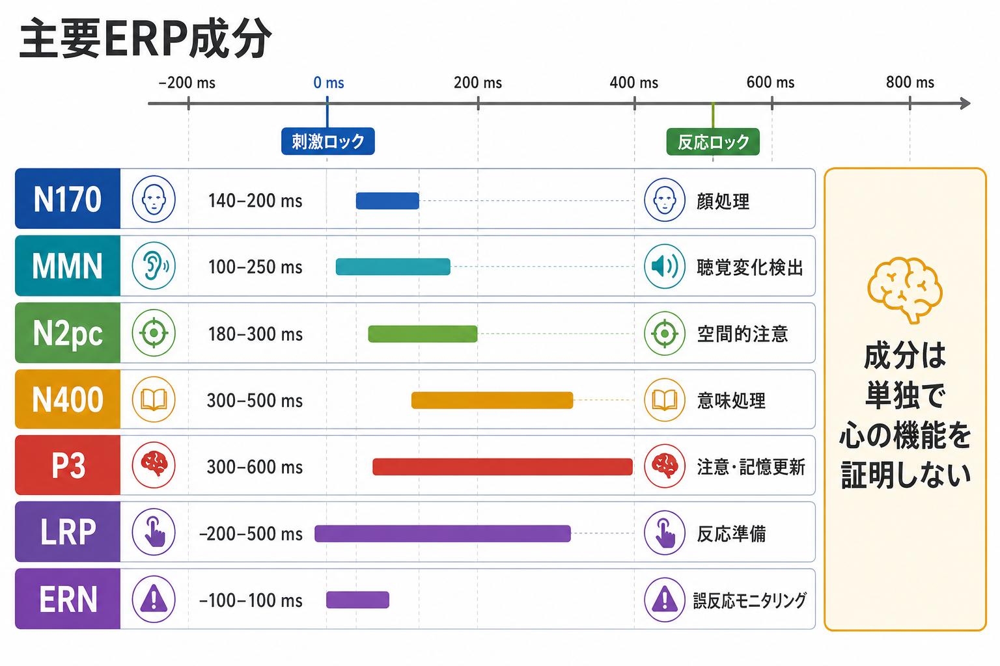
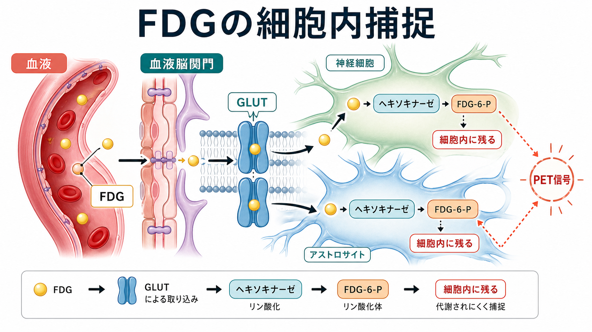
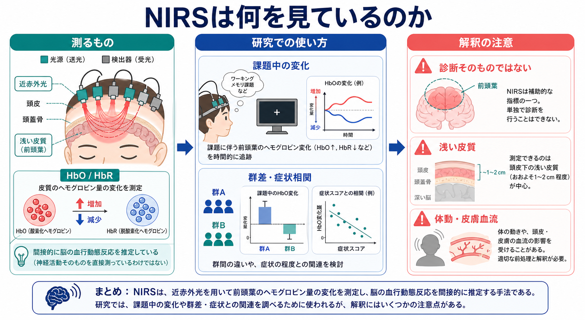

# 受容体PETとは何か

## 要点

- 受容体PETは、放射性同位元素で標識したリガンドを用いて、脳内の受容体、トランスポーター、病理タンパク質などの「分子標的」を可視化する[[PETは脳の何を測るのか|PET]]の一種である。
- 画像の濃淡は、標的分子の量そのものではなく、リガンドの親和性、非特異的結合、血流、代謝、内因性リガンドとの競合、解析モデルを通した推定値である[1][2]。
- ドパミンD2/D3受容体PET、ドパミントランスポーターPET、セロトニン受容体PET、アミロイドPET、タウPETなどは、同じPET装置でも「何を測っているか」が大きく異なる。
- 臨床では、アミロイド/タウPETやドパミン系イメージングが診断補助や治療選択に関わる一方、PET単独で疾患名や治療方針を断定するものではない[6][7]。

## この記事で答える問い

1. 受容体PETは、通常の[[脳画像とは何を見ているのか|脳画像]]や[[構造MRIは脳の何を測っているのか|構造MRI]]と何が違うのか。
2. 放射性トレーサーは、どのように脳内の分子標的を画像化するのか。
3. 「結合ポテンシャル」や「占有率」は何を意味し、何を意味しないのか。
4. ドパミン受容体やアミロイドPETは、研究・臨床でどのように使われるのか。

## まず結論

受容体PETの中心にある考え方は、「脳の形」ではなく「特定分子に結合できる標識分子の分布」を見ることである。MRIが水素原子核の信号から組織コントラストを作るのに対して、受容体PETは、あらかじめ設計した放射性リガンドが脳内の標的にどれくらい集まるかを測る。したがって、同じPETでも、ドパミンD2/D3受容体を標的にするのか、アミロイドβを標的にするのか、FDGで糖代謝を見るのかで、読んでいる生物学的意味は変わる[1][3]。

## 背景

脳科学では、神経活動や行動を説明するときに「どの脳領域が働いたか」だけでなく、「どの分子系が関与したか」を問う必要がある。たとえば報酬、運動、精神病症状、薬物効果を考えるとき、ドパミンD2/D3受容体やドパミントランスポーターは重要な標的になる。認知症の文脈では、アミロイドβやタウの蓄積が、症状や神経変性とどのように対応するかが問題になる[4][7]。

このような問いに対して、死後脳や髄液・血液バイオマーカーだけでは、脳内の空間分布を同じ個体で繰り返し見ることが難しい。受容体PETは、放射性リガンドの微量投与とPET検出を組み合わせることで、生体内の分子標的を非侵襲的に推定する方法として発展してきた[1][2]。

## 基本概念

### トレーサーとリガンド

PETで用いる放射性トレーサーは、陽電子放出核種で標識された分子である。受容体PETでは、この分子が特定の受容体やトランスポーターに結合するように設計される。たとえば、[^11C]raclopride は線条体のドパミンD2/D3受容体PETで古くから使われてきた代表的リガンドである[5]。

ただし「結合する」ことは「標的だけを完全に測る」ことではない。実際の信号には、標的への特異的結合、標的以外への非特異的結合、血管内の放射能、代謝産物、頭部運動、部分容積効果が混ざる。そのため、受容体PETは撮像だけで完結せず、薬物動態モデルや参照領域を使った解析を必要とする[1][2]。

### 結合ポテンシャル

可逆的に結合する放射性リガンドでは、しばしば結合ポテンシャル（binding potential）が用いられる。よく使われる $BP_{ND}$ は、非置換性結合に対する特異的結合の比として解釈され、参照領域法で推定されることが多い[1]。

直感的には、$BP_{ND}$ が高いほど「利用可能な標的結合部位が多い」と読める。しかしこれは、受容体密度そのものではない。$BP_{ND}$ は、利用可能受容体密度、リガンド親和性、内因性神経伝達物質による占有、非特異的結合、参照領域の妥当性に依存する。したがって、群間差を「受容体数の差」とだけ読むのは危険である[1]。

### 占有率

薬物が受容体をどれくらい占有しているかを調べるときには、投薬前後の結合ポテンシャルの変化から占有率を推定する。抗精神病薬のD2受容体占有率研究は、PETが薬効・副作用・用量設定を結びつける代表例である[5][6]。ただし、占有率も撮像条件、薬物濃度、内因性リガンド、解析モデルの影響を受けるため、個別患者への単純な治療指示としては扱わない。

## 仕組み

受容体PETの典型的な流れは、次のように整理できる。

1. 測りたい標的を決める。例として、D2/D3受容体、セロトニントランスポーター、アミロイドβ、タウなどがある。
2. 標的に結合する放射性リガンドを選ぶ。
3. 微量のトレーサーを投与し、時間とともに脳内放射能を測る。
4. PET装置が、陽電子消滅で生じる2本の511 keV光子を同時計数し、放射能分布を再構成する。
5. 動態モデル、参照領域法、標準化取り込み値比（SUVR）などを用いて、標的結合や病理負荷の指標へ変換する[1][2][7]。

この流れで重要なのは、PET装置が直接「受容体」を見ているわけではない点である。PETが検出するのは放射能分布であり、そこから「このトレーサーなら、この分布は標的結合をどの程度反映するか」を推定している。したがって、よい受容体PET研究には、リガンドの選択性、脳移行性、代謝、結合の可逆性、参照領域の妥当性、再現性が必要になる[1][2]。

## 図解

PETは、用いるトレーサーによって意味が変わる。FDG-PETは主に糖代謝を、受容体PETは受容体・トランスポーター結合を、アミロイド/タウPETは病理タンパク質の蓄積を評価する。[[fMRIは神経活動を直接測っているのか|fMRI]]がBOLD信号を介して神経活動を間接推定するのと同じく、PETもトレーサーを介した代理指標である。

## 臨床・研究との接続

### ドパミン系

ドパミンD2/D3受容体PETは、統合失調症研究、薬物占有率研究、報酬系研究で重要な役割を担ってきた。[^11C]raclopride のようなリガンドでは、内因性ドパミン放出が増えるとリガンド結合が相対的に低下するため、課題や薬物投与に伴うドパミン変化を推定する研究にも使われる[5]。

臨床に近い領域では、ドパミントランスポーターイメージングがパーキンソン症候群の鑑別や神経変性の評価に関わる。現在の臨床標準にはSPECTも多く含まれるが、PETは空間分解能や定量性の面で利点を持つと整理されている[8]。

### アミロイドとタウ

アミロイドPETは、Pittsburgh Compound-B（PiB）を用いた初期研究によって、アルツハイマー病患者の脳内アミロイド蓄積を生体内で可視化できることを示した[4]。その後、複数のフッ素18標識トレーサーが臨床・研究で使われるようになった。

2025年に公表されたAlzheimer's Association/SNMMIの更新適正使用基準では、アミロイドPETとタウPETは、認知症専門医による評価のなかで、結果が診断や治療選択に影響する場面に限って使うことが推奨されている[7]。重要なのは、陽性PETが「その人の症状の原因を単独で確定する」わけではない点である。認知機能、病歴、MRI、血液・髄液バイオマーカー、生活機能を組み合わせて解釈する必要がある。

### 研究デザイン

研究では、受容体PETは仮説をかなり明確にする必要がある。「ドパミン系を見る」といっても、D2/D3受容体、D1受容体、ドパミントランスポーター、ドパミン合成能では、使うトレーサーも解釈も異なる。さらに、横断研究か縦断研究か、薬物負荷を行うか、参照領域が妥当か、同じ個人で再検査するかによって、結論の強さが変わる。

## よくある誤解

### 誤解1: 受容体PETは受容体数をそのまま測る

受容体PETは、利用可能な結合部位を反映するが、受容体数だけを測るわけではない。内因性リガンド、親和性、非特異的結合、血流、代謝、解析モデルが影響する[1]。

### 誤解2: PETで光れば病気が確定する

アミロイドやタウの陽性所見は重要な病理情報だが、臨床症状の原因を単独で決めるものではない。陽性・陰性・境界的所見は、年齢、症状、神経心理検査、他の画像・バイオマーカーと統合して読む[7]。

### 誤解3: PETは神経活動を直接撮影している

PETは放射性トレーサーの分布を画像化する。活動、代謝、血流、受容体結合、病理負荷はいずれもトレーサーとモデルを介した推定である。これは、[[安静時fMRIは何を測っているのか|安静時fMRI]]が神経活動そのものではなくBOLD信号を読むのと似た注意点である。

## 関連ノート

- [[PETは脳の何を測るのか]]
- [[脳画像とは何を見ているのか]]
- [[構造MRIは脳の何を測っているのか]]
- [[fMRIは神経活動を直接測っているのか]]
- [[安静時fMRIは何を測っているのか]]

MOC更新候補:

- `content/00_MOC/` 配下の脳画像・神経計測関連MOCがある場合、本記事を「PET・分子イメージング」または「核医学的脳画像」の項目に追加する。

関連ノート候補:

- ドパミンD2受容体PETとは何か
- アミロイドPETとは何か
- タウPETとは何か
- 結合ポテンシャルとは何か
- PETトレーサーとは何か

## 理解チェック

1. 受容体PETが直接検出している物理量は何か。
2. $BP_{ND}$ を「受容体数」とだけ読めない理由は何か。
3. ドパミンD2/D3受容体PETとアミロイドPETでは、分子標的と臨床的問いがどう違うか。
4. PET所見を個別診断や治療判断に使うとき、なぜ他の臨床情報との統合が必要なのか。

## 未解決問題

- 新しいトレーサーの標的選択性と再現性を、疾患群・年齢群・薬物使用状況をまたいでどの程度標準化できるか。
- アミロイド/タウPET、血液バイオマーカー、MRIをどの順序で組み合わせると、診断精度と患者負担のバランスがよいか。
- 精神疾患研究で観察される受容体結合差を、原因、結果、薬物影響、状態依存変化としてどう分離するか。

## 参考文献

[1] Innis, R. B., Cunningham, V. J., Delforge, J., et al. (2007). Consensus nomenclature for in vivo imaging of reversibly binding radioligands. *Journal of Cerebral Blood Flow & Metabolism, 27*(9), 1533-1539. https://doi.org/10.1038/sj.jcbfm.9600493

[2] Van Laere, K., Varrone, A., Booij, J., et al. (2010). EANM procedure guidelines for brain neurotransmission SPECT/PET using dopamine D2 receptor ligands, version 2. *European Journal of Nuclear Medicine and Molecular Imaging, 37*(2), 434-442. https://doi.org/10.1007/s00259-009-1265-z

[3] Guedj, E., Varrone, A., Boellaard, R., et al. (2022). EANM procedure guidelines for brain PET imaging using [^18F]FDG, version 3. *European Journal of Nuclear Medicine and Molecular Imaging, 49*, 632-651. https://doi.org/10.1007/s00259-021-05603-w

[4] Klunk, W. E., Engler, H., Nordberg, A., et al. (2004). Imaging brain amyloid in Alzheimer's disease with Pittsburgh Compound-B. *Annals of Neurology, 55*(3), 306-319. https://doi.org/10.1002/ana.20009

[5] Laruelle, M. (1998). Imaging dopamine transmission in schizophrenia: a review and meta-analysis. *Quarterly Journal of Nuclear Medicine, 42*(3), 211-221. https://pubmed.ncbi.nlm.nih.gov/9796369/

[6] Nordström, A. L., Farde, L., Wiesel, F. A., et al. (1993). Central D2-dopamine receptor occupancy in relation to antipsychotic drug effects: a double-blind PET study of schizophrenic patients. *Biological Psychiatry, 33*(4), 227-235. https://doi.org/10.1016/0006-3223(93)90288-O

[7] Rabinovici, G. D., Knopman, D. S., Arbizu, J., et al. (2025). Updated appropriate use criteria for amyloid and tau PET: a report from the Alzheimer's Association and Society for Nuclear Medicine and Molecular Imaging Workgroup. *Journal of Nuclear Medicine, 66*(Supplement 2), S5-S31. https://doi.org/10.2967/jnumed.124.268756

[8] Kerstens, V. S., & Varrone, A. (2020). Dopamine transporter imaging in neurodegenerative movement disorders: PET vs. SPECT. *Clinical and Translational Imaging, 8*, 349-356. https://doi.org/10.1007/s40336-020-00386-w
