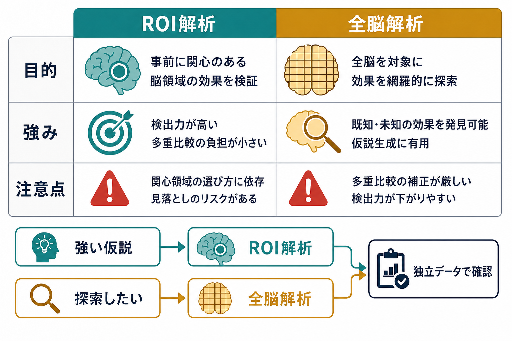
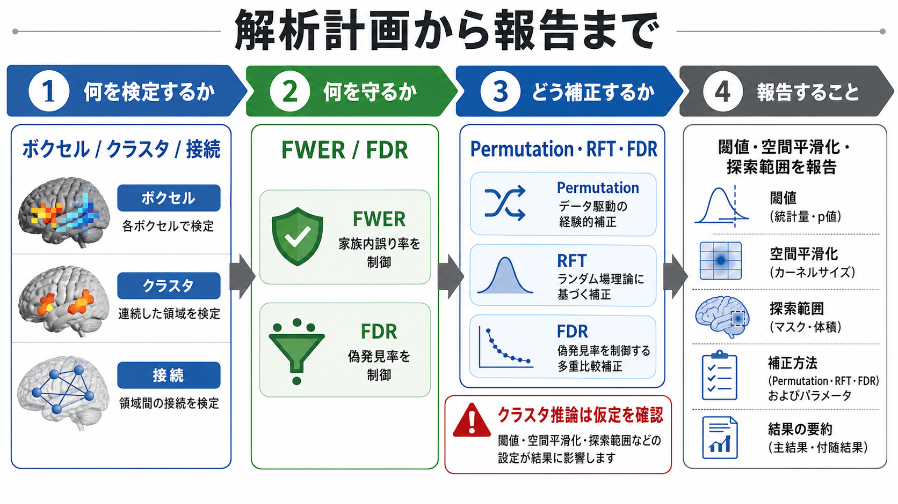
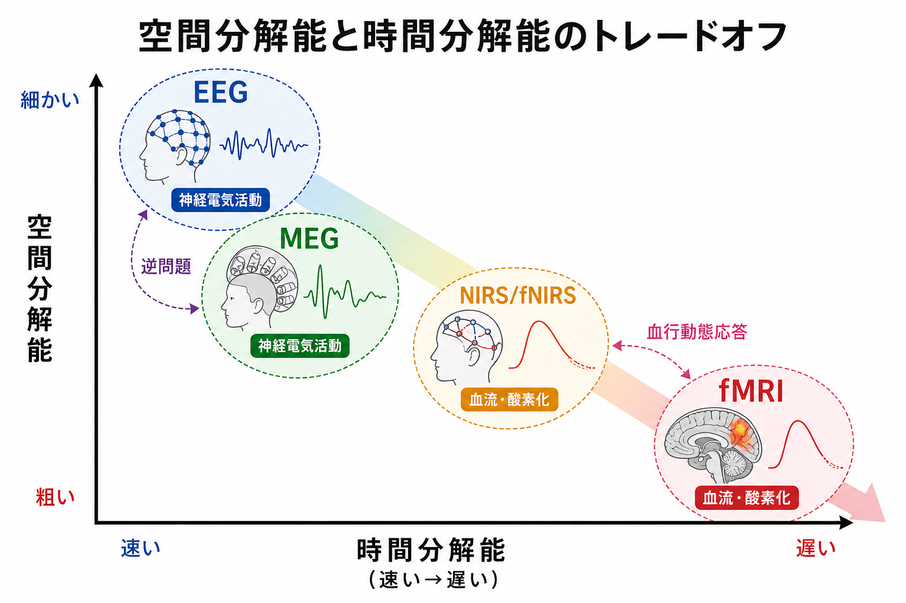

# 多重比較補正は脳画像解析でなぜ重要なのか

## 要点

- 脳画像解析では、数万から十数万のボクセル、あるいは多数の領域間接続を同時に検定するため、未補正の \(p < .05\) をそのまま使うと偶然の「有意」が大量に出やすい。
- 多重比較補正は、効果を大きく見せるための形式手続きではなく、偽陽性を制御して研究解釈を守るための推論設計である。
- 代表的な考え方には、少なくとも1つの偽陽性を抑える family-wise error rate（FWER）と、発見された結果の中に含まれる偽陽性割合を抑える false discovery rate（FDR）がある。
- 脳画像ではボクセル同士が空間的に相関するため、単純な Bonferroni 補正だけでなく、ランダム場理論、Permutation 検定、FDR、クラスタ推論などが使われる。
- クラスタ単位の有意性は「クラスタ内のどの点も有意」という意味ではない。大きなクラスタは局在解釈を弱めることがある。

## この記事で答える問い

[[課題fMRIでは何を比較しているのか]]や[[安静時fMRIは何を測っているのか]]では、脳画像解析がボクセルや領域ごとの信号を統計モデルにかけることを扱った。この記事では、その次に必ず出てくる問い、つまり「多数の場所を検定したとき、どの結果を信じてよいのか」を整理する。

具体的には、次の問いに答える。

1. なぜ脳画像解析では偽陽性が増えやすいのか。
2. FWER と FDR は何を守っているのか。
3. ボクセル、クラスタ、接続の解析では何に注意すべきか。
4. 研究・臨床応用で、補正済み結果をどう読めばよいのか。

## まず結論

多重比較補正が重要なのは、脳画像が「1枚の画像」ではなく、多数の統計検定の集合だからである。たとえば 100,000 個のボクセルで帰無仮説がすべて正しいとしても、各ボクセルで未補正の \(\alpha = .05\) を使えば、平均的には約 5,000 個の偽陽性が期待される。少なくとも1つの偽陽性が出る確率は、

$$
1 - (1-\alpha)^m
$$

で表され、検定数 \(m\) が大きいほど急速に 1 に近づく。脳画像解析ではこの \(m\) が非常に大きいため、「赤く光った場所がある」こと自体は、補正なしでは強い証拠にならない。

Nichols と Hayasaka は、機能的神経画像データには約 100,000 個の相関した検定統計量を評価するという大規模な多重検定問題が含まれると整理し、Bonferroni、ランダム場理論、Permutation 検定を比較している[1]。したがって、多重比較補正は「厳しすぎる統計の飾り」ではなく、脳画像から誤った局在やネットワーク解釈を引き出さないための最低限の防波堤である。

## 背景

[[脳画像とは何を見ているのか]]で扱うように、脳画像は脳の活動や構造を直接そのまま写すものではなく、MRI信号、BOLD信号、拡散、血流、代謝などの代理指標を画像化したものである。さらに解析段階では、各ボクセルや領域ごとに統計モデルを当てはめ、「条件差があるか」「群差があるか」「接続強度が関連するか」を検定する。

問題は、脳が空間的に広いこと、画像が高解像度であること、解析対象がボクセルだけでなく領域間接続にも広がることである。ボクセル単位解析では数万から十数万の検定が行われ、機能的結合解析では \(n\) 個の領域から \(n(n-1)/2\) 個の辺が生じる。領域数が 200 なら、接続は 19,900 本になる。

この状況では、「どこか1か所でも有意なら発見」と読む姿勢は危険である。探索範囲が広いほど、偶然に極端な値が出る場所を見つけやすくなる。多重比較補正は、その探索範囲全体を明示し、その中でどれだけ誤検出を許容するのかを定める手続きである。

## 基本概念

### 偽陽性と第一種過誤

偽陽性とは、本当は効果がないのに「効果がある」と判断する誤りである。統計的には第一種過誤と呼ばれる。1つの検定だけなら \(\alpha = .05\) は「帰無仮説が正しいとき、5%の確率で誤って棄却する」ことを意味する。

しかし、脳画像では検定が1つではない。多くのボクセルや接続を調べるほど、どこかで偶然の有意差が出る確率は高くなる。このため、単一検定の \(p\) 値と、画像全体で何かを発見する確率を区別する必要がある。

### FWER

FWER は、解析全体の中で少なくとも1つの偽陽性が出る確率を制御する考え方である。ボクセル単位で FWER \(< .05\) と報告する場合、「探索範囲全体で、少なくとも1つの偽陽性が出る確率を5%以下に抑える」という意味になる。

FWER は保守的になりやすい一方、局在を強く主張したい場合に重要である。たとえば「この小領域に疾患群と対照群の差がある」と言うなら、解析全体の探索を考慮した誤検出制御が必要になる。

### FDR

FDR は、発見された結果の中に含まれる偽陽性の期待割合を制御する考え方である。Benjamini と Hochberg の方法は、多数の検定で検出力を保ちながら偽発見の割合を制御する実用的手法として提案された[2]。神経画像では Genovese、Lazar、Nichols が統計マップに FDR を適用し、ボクセル単位の閾値づけに使えることを示した[3]。

FWER が「1つでも偽陽性を出したくない」に近い考え方であるのに対し、FDR は「発見集合全体の中で偽陽性割合を制御したい」という考え方である。探索的研究や広いネットワーク解析では FDR が使われることがあるが、個々のボクセルを強く局在解釈する用途では注意が必要である。

## 仕組み

### Bonferroni 補正

Bonferroni 補正は、単純には有意水準を検定数 \(m\) で割り、各検定の閾値を \(\alpha/m\) にする方法である。検定同士が独立でなくても FWER を制御しやすいが、脳画像のようにボクセルが空間的に相関している場合、実効的な独立検定数を過大に見積もり、検出力が低くなりやすい。

### ランダム場理論

ランダム場理論は、画像の空間的平滑性を利用して、統計マップ全体で極端な値やクラスタが偶然に生じる確率を近似する方法である。Worsley らは、3次元画像内の局所最大値や閾値超過領域を扱う枠組みを示し、画像全体の探索に対する有意性評価を可能にした[4]。

この方法は古典的な SPM 系の推論で重要だが、平滑性、解像度、探索範囲、統計場の仮定に依存する。したがって、単に「ソフトウェアが補正した」と読むのではなく、どの前処理と探索範囲に基づく補正なのかを確認する必要がある。

### Permutation 検定

Permutation 検定は、群ラベルや条件ラベルを並べ替えて、帰無仮説のもとで統計量がどれくらい極端になりうるかを経験的に評価する方法である。Nichols と Holmes は、機能的神経画像における非パラメトリック permutation 検定を、仮定の少ない実用的な選択肢として整理した[5]。

Permutation は、データの交換可能性が成り立つ設計では強力であり、最大統計量を使えば FWER を制御できる。近年の脳画像解析では、ボクセル、クラスタ、TFCE などと組み合わせて使われることが多い。

### クラスタ推論

クラスタ推論は、個々のボクセルの強さだけでなく、隣接した有意領域の広がりを使って推論する。弱く広い信号に敏感になりやすい一方、クラスタ形成閾値や空間平滑化に結果が左右される。

Woo、Krishnan、Wager は、クラスタ範囲に基づく閾値づけは感度が高いが、空間的特異性が低く、大きなクラスタ内の特定位置が有意だとは言えない点を強調している[6]。さらに Eklund、Nichols、Knutsson は、実データを用いた大規模な検証で、一般的なクラスタ推論手続きが条件によって名目水準より高い偽陽性率を示しうることを報告した[7]。この結果は、クラスタ推論を捨てるべきというより、仮定、閾値、検証、報告の透明性が不可欠であることを示している。

## 図解

上の3枚の図は、次の順で読むとよい。

1. 1枚目は、多数のボクセル検定を行うと偶然の有意差が増えることを示している。赤い点は「本当の効果」ではなく、探索回数が多いために見つかる偽陽性を表す。
2. 2枚目は、FWER と FDR が守る対象の違いを示している。FWER は解析全体での偽陽性を厳しく抑え、FDR は発見集合の中の偽陽性割合を抑える。
3. 3枚目は、解析前に「何を検定するか」「何を守るか」「どう補正するか」「どう報告するか」を決める必要があることを示している。

重要なのは、図の赤い領域や緑の領域を「真の脳活動」と直読しないことである。脳画像の色は、測定、前処理、モデル、閾値、補正方法を通った統計的判断の表示である。

## 臨床・研究との接続

研究では、多重比較補正は再現性を支える。補正なしの小さな \(p\) 値を多数の探索から拾うと、後続研究で再現されにくい知見が増える。特に、疾患群と対照群の差、症状スコアとの相関、治療反応予測、[[機能的結合解析とは何か]]における接続差などでは、探索空間が大きく、誤検出の影響が解釈全体に及ぶ。

臨床応用ではさらに慎重である必要がある。研究で「補正後有意」とされた群レベル差は、ただちに個別患者の診断や治療選択を決める根拠にはならない。脳画像所見は、症状、神経診察、心理検査、既往歴、他の検査所見と合わせて解釈されるべきである。この記事の内容は教育・研究目的の整理であり、個別診断や治療指示ではない。

実務上は、少なくとも次の情報を報告する必要がある。

- 検定単位: ボクセル、クラスタ、ROI、接続、全脳か限定マスクか。
- 探索範囲: 全脳、灰白質マスク、事前定義ROI、ネットワーク内接続など。
- 補正単位: ボクセルレベル、クラスタレベル、接続集合、ROI集合。
- 補正方法: FWER、FDR、Permutation、ランダム場理論、TFCE など。
- 閾値: クラスタ形成閾値、補正後 \(p\) 値、効果量、信頼区間。
- 前処理: 空間平滑化、正規化、ノイズ回帰、モーション処理。

Smith と Nichols が提案した TFCE は、任意のクラスタ形成閾値への依存を減らし、クラスタ的な広がりと局所的な強さを組み合わせる方法である[8]。ただし、どの方法も万能ではなく、研究仮説、デザイン、サンプルサイズ、前処理、解析単位に依存して選ぶ必要がある。

## よくある誤解

### 「補正すると本当の効果まで消える」

補正後に有意でなくなる結果は、必ずしも効果がないことを意味しない。しかし、現在のデータと探索範囲では、偽陽性を制御したうえで主張するには証拠が弱い、という意味である。効果量、信頼区間、事前仮説、独立データでの再現を合わせて評価する必要がある。

### 「FDR は FWER より甘いから悪い」

FDR は目的が違う。広い探索で候補領域を見つけたい場合、FDR は有用なことがある。一方、個々の局在を強く主張したい場合や臨床的判断に近い解釈をしたい場合、より厳密な FWER 制御や独立検証が望ましい。

### 「クラスタが有意なら、クラスタ内のピークは全部有意」

これは誤りである。クラスタレベルの有意性は、その広がりを持つクラスタが偶然に生じにくいことを示す。クラスタ内の各ボクセルが個別に有意であることは保証しない[6]。

### 「全脳補正ではなくROI解析なら多重比較は不要」

ROI解析でも、複数のROI、複数の指標、複数の群比較、複数の症状スコアを調べれば多重比較は生じる。ROIを事前に定義したのか、結果を見てから選んだのかも重要である。

## 関連ノート

- [[脳画像とは何を見ているのか]]
- [[課題fMRIでは何を比較しているのか]]
- [[安静時fMRIは何を測っているのか]]
- [[機能的結合解析とは何か]]
- [[シードベース解析とは何か]]
- [[独立成分分析ICAはfMRIでどう使われるのか]]
- [[構造MRIは脳の何を測っているのか]]

### MOC更新候補

- `content/00_MOC/` 配下の脳画像・神経計測系MOCがある場合、本記事を「統計推論・解析上の注意」の項目に追加する。
- 並列生成ジョブとの競合を避けるため、この作業ではMOC本文の直接更新は行わない。

### 今後の作成候補

- 偽陽性と偽陰性の違い
- FDRとは何か
- Permutation検定は脳画像解析でどう使われるのか
- クラスタ推論とは何か
- TFCEとは何か

## 理解チェック

1. 100,000個のボクセルで未補正の \(p < .05\) を使うと、帰無仮説がすべて正しくても、平均してどの程度の偽陽性が期待されるか。
2. FWER と FDR は、それぞれ何を制御する考え方か。
3. クラスタレベルで有意な結果を、なぜ「クラスタ内の全ボクセルが有意」と読んではいけないのか。
4. 機能的結合解析で領域数が増えると、多重比較問題はなぜ急速に大きくなるのか。
5. 論文を読むとき、補正方法以外にどの情報を確認すべきか。

## 未解決問題

- 空間平滑化、前処理、ノイズ除去、モーション補正が、多重比較補正の仮定にどの程度影響するかは解析パイプラインごとに検討が必要である。
- 大規模探索と事前仮説に基づく限定解析を、同じ論文内でどのように透明に分けて報告するかは、再現性の観点から重要である。
- 群レベルの補正済み統計を、個人レベルの予測や臨床判断へどう橋渡しするかには、独立検証と外部妥当性の評価が必要である。

## 参考文献

[1] Nichols, T. & Hayasaka, S. (2003). Controlling the familywise error rate in functional neuroimaging: A comparative review. *Statistical Methods in Medical Research*, 12(5), 419-446. https://doi.org/10.1191/0962280203sm341ra

[2] Benjamini, Y. & Hochberg, Y. (1995). Controlling the false discovery rate: A practical and powerful approach to multiple testing. *Journal of the Royal Statistical Society: Series B (Methodological)*, 57(1), 289-300. https://doi.org/10.1111/j.2517-6161.1995.tb02031.x

[3] Genovese, C. R., Lazar, N. A. & Nichols, T. (2002). Thresholding of statistical maps in functional neuroimaging using the false discovery rate. *NeuroImage*, 15(4), 870-878. https://doi.org/10.1006/nimg.2001.1037

[4] Worsley, K. J., Evans, A. C., Marrett, S. & Neelin, P. (1992). A three-dimensional statistical analysis for CBF activation studies in human brain. *Journal of Cerebral Blood Flow & Metabolism*, 12(6), 900-918. https://doi.org/10.1038/jcbfm.1992.127

[5] Nichols, T. E. & Holmes, A. P. (2002). Nonparametric permutation tests for functional neuroimaging: A primer with examples. *Human Brain Mapping*, 15(1), 1-25. https://doi.org/10.1002/hbm.1058

[6] Woo, C.-W., Krishnan, A. & Wager, T. D. (2014). Cluster-extent based thresholding in fMRI analyses: Pitfalls and recommendations. *NeuroImage*, 91, 412-419. https://doi.org/10.1016/j.neuroimage.2013.12.058

[7] Eklund, A., Nichols, T. E. & Knutsson, H. (2016). Cluster failure: Why fMRI inferences for spatial extent have inflated false-positive rates. *Proceedings of the National Academy of Sciences*, 113(28), 7900-7905. https://doi.org/10.1073/pnas.1602413113

[8] Smith, S. M. & Nichols, T. E. (2009). Threshold-free cluster enhancement: Addressing problems of smoothing, threshold dependence and localisation in cluster inference. *NeuroImage*, 44(1), 83-98. https://doi.org/10.1016/j.neuroimage.2008.03.061
