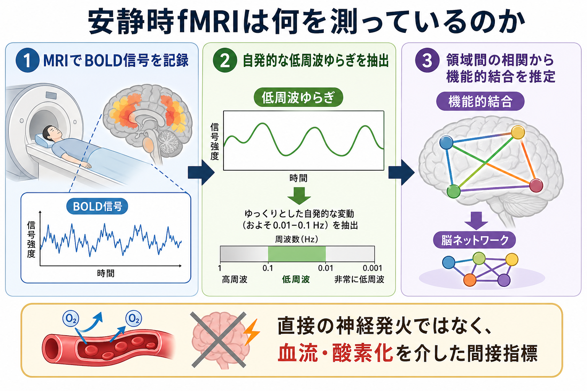
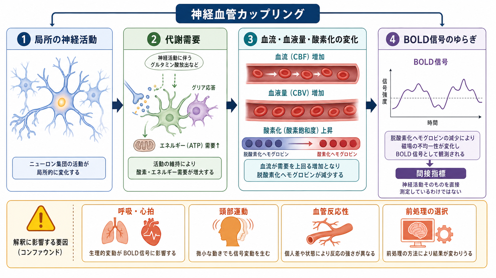

# 安静時fMRIは何を測っているのか

## 要点

- 安静時fMRIは、課題をしていない状態でのBOLD信号の自発的な時間変動を測り、領域間でその変動がどれだけ同期するかから[[構造的結合と機能的結合は何が違うのか|機能的結合]]を推定する。
- BOLD信号は神経発火そのものではなく、神経活動に伴う血流、血液量、酸素化の変化を介した間接指標である[1]。
- 領域間相関、種子領域解析、独立成分分析、グラフ解析などを使うと、[[デフォルトモードネットワークとは何か|デフォルトモードネットワーク]]、感覚運動ネットワーク、前頭頭頂ネットワークなどの[[脳内ネットワークとは何か|脳内ネットワーク]]を推定できる[2][3]。
- ただし、頭部運動、呼吸・心拍、血管反応性、前処理の選択は結果を大きく変える。安静時fMRIの結合は「直接つながっている証拠」でも「因果」でもない[6][7][8]。

## この記事で答える問い

この記事では、安静時fMRIが何を直接測り、何を推定しているのかを分けて考える。中心の問いは、BOLD信号の揺らぎがどのように機能的結合や脳ネットワークの指標へ変換されるのか、そしてその解釈でどこに注意が必要かである。

## まず結論

安静時fMRIが直接記録するのは、脳の各ボクセルで時間とともに変動するBOLD信号である。BOLD信号は、脱酸素化ヘモグロビンの量が磁場に与える影響を利用しており、神経活動そのものではなく、神経活動に伴う血流・酸素化変化の反映として読む必要がある[1]。

安静時fMRI解析が推定するのは、複数領域のBOLD時系列がどれくらい一緒に揺らぐかである。たとえば、離れた2領域のBOLD信号が数分間にわたり似た低周波変動を示すなら、その2領域は機能的に結合していると表現される[2][3]。ここでいう結合は、白質線維の直接経路ではなく、観測された時系列上の統計的関係である。

## 背景

安静時fMRI研究の出発点の一つは、Biswalらが運動課題をしていない状態でも左右の運動野のBOLD信号が相関することを示した研究である[2]。この発見は、課題に対する反応だけでなく、課題がない状態の自発的活動にも脳の機能的構成が現れることを示した。

その後、安静時BOLD信号の相関構造は、感覚運動、視覚、注意、前頭頭頂制御、デフォルトモードなどの大規模ネットワークとして整理されるようになった[3][4]。Human Connectome Projectのような大規模プロジェクトでは、安静時fMRIは拡散MRIと並び、ヒト脳のコネクトームを記述する主要なデータ様式として使われている[5]。

## 基本概念

### BOLD信号

BOLDとは blood oxygenation level dependent の略で、血液中の酸素化状態に依存して変化するMRI信号である。神経活動が局所的に増えると、酸素とエネルギーの需要が増え、それに応じて血流や血液量が変化する。この血管応答の結果としてBOLD信号が変動する[1]。

重要なのは、BOLD信号が神経活動の「翻訳版」であって、神経発火の直接記録ではない点である。局所フィールド電位、スパイク活動、代謝、血管反応は互いに関係するが、同一ではない。したがって、BOLD信号の変化を神経活動の変化として読むときには、血管系と前処理の影響を常に考える必要がある。

### 安静時

安静時とは、明示的な課題を行わず、スキャナ内で目を開ける、閉じる、または固視点を見るなどの条件で測定する状態を指す。何もしていない状態ではなく、内的思考、覚醒度、注意、眠気、呼吸、心拍などが続いている状態である。

### 機能的結合

機能的結合とは、複数の脳領域の活動指標が統計的に関係していることを指す。安静時fMRIでは、多くの場合、領域Aと領域BのBOLD時系列の相関として表される。相関が高いからといって、AからBへ情報が流れた、AがBを因果的に駆動した、白質線維で直接つながっている、ということまでは言えない。

## 仕組み

典型的な解析は次の流れをたどる。

1. 数分から十数分程度、安静状態のfMRI時系列を撮像する。
2. 頭部運動補正、空間正規化、平滑化、ノイズ成分の除去、場合によってはバンドパスフィルタなどの前処理を行う。
3. 脳領域ごと、またはボクセルごとのBOLD時系列を抽出する。
4. 時系列間の相関、独立成分分析、部分相関、グラフ指標などを計算する。
5. 得られた結合行列や成分を、ネットワーク、モジュール、ハブ、群間差、症状との関連として解釈する。

種子領域解析では、関心のある領域を一つ選び、その時系列と脳内の他領域の時系列との相関を地図化する。仮説検証には向いているが、種子の選び方に結果が依存する。

独立成分分析では、データから空間パターンと時系列を分解し、ネットワーク成分を抽出する。事前の種子を置かずにネットワークを探索できる一方で、成分数やノイズ成分の判定が解釈に影響する[5]。

グラフ解析では、脳領域をノード、結合をエッジとして扱い、ハブ、モジュール性、クラスタ係数、経路長、ネットワーク効率などを評価する。これは[[グラフ理論は脳ネットワーク解析にどう使われるのか]]や[[コネクトームとは何か]]と接続する視点である。

## 図解

安静時fMRIの図解で最も大事なのは、「測定」と「推定」を混同しないことである。測定されるのはBOLD信号であり、機能的結合やネットワークは、その時系列を統計処理して得られる解釈層である。

## 臨床・研究との接続

研究では、安静時fMRIは発達、加齢、学習、睡眠、意識状態、精神疾患、神経変性疾患などにおけるネットワーク構成の違いを調べるために使われる。大規模データでは、個人内で比較的安定したネットワーク地図や、集団で再現されるネットワーク構造を推定できる[4][5]。

臨床との接続では、疾患群と対照群の比較、症状尺度との関連、治療前後の変化、脳刺激やリハビリテーション研究の評価指標として利用されることがある。ただし、安静時fMRIだけで個人の診断や治療方針を決める段階には一般に達していない。群平均で見える差が、個人レベルで安定して使えるとは限らないためである。

精神医学・神経疾患研究では、ネットワーク異常を「病因そのもの」と断定するのではなく、症状、認知機能、薬物、睡眠、運動、撮像条件、前処理を含む多層の要因の一つとして扱うのが安全である。

## よくある誤解

### 誤解1: 安静時fMRIは脳が何もしていない状態を測る

安静時は無活動ではない。脳は課題がなくても自発的活動を続け、内的思考、覚醒度、感覚入力、身体状態の影響を受ける。したがって、安静時fMRIは「何もない基準線」ではなく、「明示的課題がない条件での活動構造」を測る方法である。

### 誤解2: 機能的結合は直接の神経線維を意味する

機能的結合は時系列上の統計的関係である。直接の白質線維、間接経路、共通入力、広域的な覚醒・血管要因のいずれでも相関は生じうる。白質結合を知りたい場合は、[[トラクトグラフィーとは何か]]や拡散MRIの結果と統合して考える必要がある。

### 誤解3: 前処理は細部であり、結論にはあまり影響しない

前処理は結論に直結する。頭部運動は機能的結合に系統的な歪みを生み、短距離結合を強く、長距離結合を弱く見せることがある[6][7]。グローバル信号回帰は有用な場合がある一方、負の相関や群差の解釈に影響するため、研究目的に応じた明示的な判断が必要である[8]。

## 関連ノート

- [[構造MRIは脳の何を測っているのか]]
- [[構造的結合と機能的結合は何が違うのか]]
- [[脳内ネットワークとは何か]]
- [[デフォルトモードネットワークとは何か]]
- [[動的機能的結合とは何か]]
- [[グラフ理論は脳ネットワーク解析にどう使われるのか]]
- [[コネクトームとは何か]]
- [[トラクトグラフィーとは何か]]

MOC更新候補: [[MOC｜脳・神経科学]]、[[MOC｜基礎神経科学]]

## 理解チェック

1. 安静時fMRIが直接測定している信号は何か。
2. BOLD信号を「神経発火そのもの」と言えない理由は何か。
3. 機能的結合と構造的結合は何が違うか。
4. 頭部運動やグローバル信号回帰は、なぜ安静時fMRIの解釈で重要か。
5. 安静時fMRIを個人診断に使うとき、どのような限界に注意すべきか。

## 未解決問題

- 安静時BOLDのどの成分が、どの時間スケールの神経活動をどの程度反映するのか。
- 個人内で安定なネットワーク特徴と、睡眠・注意・生理状態により変動する特徴をどう分けるか。
- 前処理パイプラインの選択が、研究間の再現性と臨床応用可能性にどの程度影響するか。
- 機能的結合の相関構造から、因果的・方向性のある脳内相互作用をどこまで推定できるか。

## 参考文献

[1] Logothetis, N. K., Pauls, J., Augath, M., Trinath, T., & Oeltermann, A. (2001). Neurophysiological investigation of the basis of the fMRI signal. *Nature*, 412, 150-157. https://doi.org/10.1038/35084005

[2] Biswal, B., Yetkin, F. Z., Haughton, V. M., & Hyde, J. S. (1995). Functional connectivity in the motor cortex of resting human brain using echo-planar MRI. *Magnetic Resonance in Medicine*, 34(4), 537-541. https://doi.org/10.1002/mrm.1910340409

[3] Fox, M. D., & Raichle, M. E. (2007). Spontaneous fluctuations in brain activity observed with functional magnetic resonance imaging. *Nature Reviews Neuroscience*, 8, 700-711. https://doi.org/10.1038/nrn2201

[4] Yeo, B. T. T., Krienen, F. M., Sepulcre, J., Sabuncu, M. R., Lashkari, D., Hollinshead, M., et al. (2011). The organization of the human cerebral cortex estimated by intrinsic functional connectivity. *Journal of Neurophysiology*, 106(3), 1125-1165. https://doi.org/10.1152/jn.00338.2011

[5] Smith, S. M., Beckmann, C. F., Andersson, J., Auerbach, E. J., Bijsterbosch, J., Douaud, G., et al. (2013). Resting-state fMRI in the Human Connectome Project. *NeuroImage*, 80, 144-168. https://doi.org/10.1016/j.neuroimage.2013.05.039

[6] Van Dijk, K. R. A., Sabuncu, M. R., & Buckner, R. L. (2012). The influence of head motion on intrinsic functional connectivity MRI. *NeuroImage*, 59(1), 431-438. https://doi.org/10.1016/j.neuroimage.2011.07.044

[7] Power, J. D., Barnes, K. A., Snyder, A. Z., Schlaggar, B. L., & Petersen, S. E. (2012). Spurious but systematic correlations in functional connectivity MRI networks arise from subject motion. *NeuroImage*, 59(3), 2142-2154. https://doi.org/10.1016/j.neuroimage.2011.10.018

[8] Murphy, K., & Fox, M. D. (2017). Towards a consensus regarding global signal regression for resting state functional connectivity MRI. *NeuroImage*, 154, 169-173. https://doi.org/10.1016/j.neuroimage.2016.11.052
