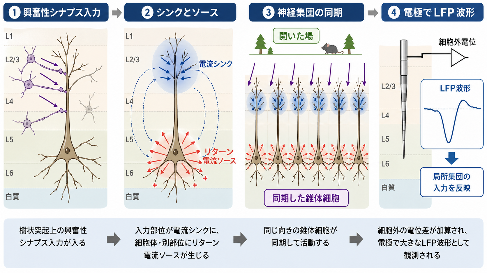

# 局所フィールド電位LFPとは何か

## 要点

- 局所フィールド電位 LFP は、脳組織内の電極で測られる低周波の細胞外電位であり、近傍の神経集団に生じる膜電流の重ね合わせを反映する。[1][2]
- 生理的条件では、LFP の主要な発生源はしばしば[[シナプスとは何か|シナプス]]入力に伴う樹状突起・細胞体の膜電流である。ただし、活動電位、カルシウムスパイク、電位依存性チャネル、内因性膜振動なども寄与しうる。[1]
- LFP は単一ニューロンの発火を数える信号ではなく、神経集団への入力、局所処理、同期性を読むための窓である。[2][6]
- 「局所」といっても、電極の周囲数百マイクロメートルだけを単純に見ているとは限らない。細胞の配置、入力位置、同期、周波数、伝導特性、参照電極、体積伝導によって空間的な広がりが変わる。[3][4]

## この記事で答える問い

1. LFP は、神経細胞の何を反映しているのか。
2. なぜ LFP は「シナプス活動を反映する」と説明されるのか。
3. スパイク、EEG、ECoG、BOLD 信号とは何が違うのか。
4. LFP を研究・臨床で読むとき、どのような誤解を避けるべきか。

## まず結論

LFP は、脳組織の中に置いた電極が拾う「近傍の神経集団が作る細胞外電位」である。個々の[[活動電位はどのように発生するのか|活動電位]]のような高速で鋭い信号ではなく、より遅い膜電流が空間的・時間的に足し合わされた信号として扱われることが多い。[1][2]

特に大脳皮質や海馬のように、錐体細胞の樹状突起が比較的そろった向きに並ぶ構造では、同じタイミングで入るシナプス入力が電流の「シンク」と「ソース」を作り、細胞外電位として観測されやすくなる。[1][2] そのため LFP は、ニューロン集団の出力スパイクだけでなく、入力と局所処理を読む信号として重要である。

ただし、LFP は「純粋なシナプス入力計」ではない。どの細胞種が、どの層で、どの周波数帯で、どの参照・フィルタ設定で記録されたかによって、意味は変わる。LFP を読むときは、信号の発生源、空間的広がり、周波数解析、スパイクとの関係を分けて考える必要がある。[2][6]

## 背景

神経科学では、脳活動を複数の窓から測る。単一ユニットやマルチユニット活動はスパイク出力を細かい時間分解能で捉える。一方、[[脳波EEGは何を測っているのか|脳波EEG]]や ECoG は、より広い神経集団が作る電位変化を頭皮上または皮質表面から測る。LFP はその中間に位置し、脳内の電極から局所集団の電気活動を測る方法である。[1][6]

この位置づけは、[[BOLD信号とは何か|BOLD信号]]との比較でも重要である。BOLD-fMRI は血流・酸素化変化を介した間接指標で、時間分解能は秒単位になりやすい。サル視覚皮質の同時計測研究では、BOLD 応答がスパイク活動よりも LFP と強く対応する場面が示され、fMRI が局所シナプス処理や入力を強く反映しうるという議論を支えた。[7]

LFP は、神経活動とマクロな脳画像・脳波信号をつなぐ橋渡しでもある。細胞レベルの[[シナプス後電位とは何か|シナプス後電位]]、集団レベルの[[神経同期とは何か|神経同期]]、周波数帯として観察される[[神経振動とは何か|神経振動]]を、同じ電気生理の枠組みで結びつけて考えられるからである。

## 基本概念

### LFP は細胞外電位である

神経細胞が活動すると、イオンが膜をまたいで流れる。膜の内外で電流が流れると、周囲の細胞外空間にも電位差が生じる。電極はこの細胞外電位を測る。LFP は、そのうち低周波成分として扱われることが多い信号であり、しばしば数百 Hz 以下の成分を指す。[2][4]

ここで重要なのは、LFP が単一の発生源から出る信号ではないことである。シナプス電流、スパイク後電位、樹状突起スパイク、電位依存性チャネル、グリアや組織特性の影響が、程度の差はあれ重なりうる。[1] したがって「LFP = シナプス活動」とだけ覚えると、解析条件によっては誤解が生じる。

### シンクとソース

興奮性シナプス入力では、陽イオンが細胞内へ流入し、入力部位の細胞外空間から見ると正電荷が失われる。これを電流シンクと呼ぶ。一方、細胞体や別の膜部位ではリターン電流が生じ、細胞外空間から見ると電流ソースとして振る舞う。[1][8]

シンクとソースが空間的に分かれ、細胞がそろった向きに並ぶと、電気双極子的な配置ができる。この配置は、遠くからも比較的測られやすい。大脳皮質の錐体細胞が LFP や EEG/ECoG の発生源として重視される理由の一つは、この形態と配列にある。[1][2]

### スパイクとの違い

スパイクは、ニューロンの出力を表す高速な活動電位である。LFP は、より遅い膜電流の重ね合わせを主に反映するため、入力や局所処理に近い情報を含みやすい。[1][2] ただし、高周波成分や記録条件によっては、スパイクやスパイク後電位が LFP 帯域へ影響することもある。[1]

この違いは、神経回路を「何が入ってきたか」と「何を出力したか」に分けて考える助けになる。LFP は集団への入力・局所処理・同期、スパイクは細胞または集団の出力として位置づけると見通しがよい。ただし実データでは両者は完全に独立ではない。

## 仕組み

### 1. シナプス入力が膜電流を作る

神経伝達物質が後シナプス受容体を開くと、Na^+、Ca^2+、K^+、Cl^- などのイオン透過性が変わり、局所的な膜電流が生じる。個々のシナプス電流は小さいが、時間的に重なり、同じ向きの細胞でそろうと、電極で測れる大きさの細胞外電位になる。[1][2]

### 2. 細胞形態と配列が信号を大きくする

LFP は、単に近くの細胞数が多ければ大きくなるわけではない。細胞の樹状突起と細胞体の配置、入力がどの層に入るか、シンクとソースが打ち消し合うか、同じ向きの双極子がそろうかが重要である。[1][2]

たとえば球形に近い細胞がランダムな向きに集まると、発生した電流が互いに打ち消し合いやすい。逆に皮質錐体細胞のように、細胞体と樹状突起が層構造に沿って並ぶ場合、同じ入力が集団として観測されやすい。

### 3. 同期が電位を足し合わせる

LFP が大きく見えるには、多数の膜電流が時間的に重なる必要がある。ばらばらのタイミングで生じた電流は平均化されやすいが、同じ周波数帯や同じ刺激タイミングで同期すると、電位変化が足し合わされる。[1][6]

このため LFP は、[[神経振動とは何か|神経振動]]や周波数帯域解析と相性がよい。デルタ、シータ、ベータ、ガンマなどの帯域パワーや位相は、局所回路の状態、入力、注意、記憶、運動準備などと関連づけて研究される。ただし、周波数帯の名前だけで心理機能を直接決めることはできない。

### 4. 空間的広がりは条件で変わる

LFP の「局所性」は固定値ではない。モデル研究や実験研究は、電極からどの範囲の細胞が寄与するかが、細胞形態、入力相関、周波数、組織伝導、記録配置によって変わることを示している。[3][4] 低周波成分ほど広く広がりやすく、高周波成分ほど局所的になりやすい傾向があるが、単純な半径で言い切ることは難しい。

したがって「この電極の LFP はこの点の活動だけを表す」と読むのは危険である。高密度電極、層状プローブ、電流源密度解析、スパイク同時計測、行動課題、解剖学的知識を組み合わせることで、解釈の精度が上がる。[2][8]

## 図解

図1は、LFP を「発生源」「計測信号」「解釈上の注意」の三層で整理した概念地図である。LFP はシナプス入力を強く反映しうるが、膜電流の重ね合わせであり、スパイクや EEG/ECoG と連続した電気生理信号の一部として理解する必要がある。

図2は、興奮性シナプス入力からシンク・ソースが生じ、同期した神経集団が電極で測れる LFP 波形を作る流れを示している。重要なのは、1個の細胞の小さな局所電流ではなく、空間配置と同期によって集団信号が形成される点である。

## 臨床・研究との接続

### 電気生理研究での役割

LFP は、動物実験、ヒト頭蓋内電極、深部脳刺激電極、神経補綴、てんかん研究などで使われる。多電極記録により、スパイク、LFP、ECoG、EEG を同時に扱い、局所回路と広域ネットワークの関係を調べる研究が進んでいる。[2][6]

スパイクだけを見ると、どのニューロンが出力したかはよくわかるが、その細胞群へどのような入力や状態変化が来ていたかは見えにくい。LFP はこの欠けた側面を補い、入力、同期、局所場、周波数帯の変化を調べるための指標になる。

### fMRIやBOLD信号との接続

LFP は、[[BOLD信号とは何か|BOLD信号]]の神経基盤を考えるうえでも重要である。Logothetis らのサル視覚皮質研究では、BOLD 応答が単一・多ユニットのスパイク活動より LFP とよく対応する条件が示された。[7] これは fMRI の賦活を「発火出力の増加」とだけ読むのではなく、入力や局所処理、シナプス活動を含む神経活動の代理指標として読む必要があることを示している。

ただし、この知見は「BOLD = LFP」と同義ではない。BOLD は血管反応、代謝、酸素化、解析モデルを経た信号であり、LFP は電気生理信号である。両者は接続できるが、同じものではない。

### 臨床での注意

臨床神経生理や脳刺激では、電位信号を症状、発作、運動、認知、薬理作用と関連づけることがある。しかし LFP は教育・研究上の解釈枠組みであり、個別の診断や治療方針を単独で決める信号ではない。疾患、薬剤、覚醒度、電極位置、参照、アーチファクトを含めて読む必要がある。

## よくある誤解

### 誤解1: LFP は発火数そのものである

LFP はスパイク数ではない。主要な寄与はしばしばシナプス入力や樹状突起・細胞体の膜電流であり、細胞の出力スパイクとは別の情報を含む。[1][2]

### 誤解2: LFP は純粋に局所だけを見ている

「局所」という名前は、頭皮 EEG より近いという意味では有用だが、電極周囲のごく狭い点だけを見るという意味ではない。低周波成分、同期した遠方入力、体積伝導、参照電極の影響を受ける。[3][4]

### 誤解3: LFP の周波数帯は心理機能と一対一対応する

シータ、ベータ、ガンマなどの帯域は有用な記述単位だが、同じ帯域でも脳部位、課題、種、記録条件で意味が変わる。周波数帯の名前だけで「記憶」「注意」「不安」などを直接決めることはできない。[6]

### 誤解4: LFP はスパイクより曖昧なので価値が低い

LFP はスパイクより発生源が複合的で解釈が難しいが、その分、神経集団への入力、局所処理、同期、周波数構造を見られる。スパイクと LFP は優劣ではなく、回路の別の側面を測る相補的な信号である。[2][6]

## 関連ノート

- [[シナプスとは何か]]
- [[シナプス後電位とは何か]]
- [[ニューロンは複数の入力をどのように統合するのか]]
- [[活動電位はどのように発生するのか]]
- [[神経同期とは何か]]
- [[神経振動とは何か]]
- [[脳波EEGは何を測っているのか]]
- [[MEGはEEGと何が違うのか]]
- [[BOLD信号とは何か]]
- [[脳画像とは何を見ているのか]]

関連ノート候補:

- ECoGとは何か
- 電流源密度解析CSDとは何か
- マルチユニット活動MUAとは何か
- 深部脳刺激DBSでLFPはどう使われるのか
- 体積伝導とは何か

MOC更新候補:

- バッチ統合時に `content/00_MOC/MOC｜脳・神経科学.md` の「脳画像・神経計測」または「神経電気生理」周辺へ追加する。
- 並列記事生成との衝突を避けるため、このタスクでは MOC 本体を更新しない。

## 理解チェック

1. LFP とスパイクの違いを、「入力・局所処理」と「出力」の観点から説明できるか。
2. なぜシナプス入力は LFP の主要な発生源になりやすいのか。
3. シンクとソースは、細胞外電位の発生をどう説明する概念か。
4. 「LFP は局所的である」という表現に、どのような注意が必要か。
5. BOLD 信号が LFP と対応しやすいという知見を、どこまで一般化してよいか。

## 参考文献

[1] Buzsáki, G., Anastassiou, C. A., & Koch, C. (2012). The origin of extracellular fields and currents: EEG, ECoG, LFP and spikes. *Nature Reviews Neuroscience, 13*, 407-420. https://doi.org/10.1038/nrn3241

[2] Einevoll, G. T., Kayser, C., Logothetis, N. K., & Panzeri, S. (2013). Modelling and analysis of local field potentials for studying the function of cortical circuits. *Nature Reviews Neuroscience, 14*, 770-785. https://doi.org/10.1038/nrn3599

[3] Kajikawa, Y., & Schroeder, C. E. (2011). How local is the local field potential? *Neuron, 72*(5), 847-858. https://doi.org/10.1016/j.neuron.2011.09.029

[4] Lindén, H., Tetzlaff, T., Potjans, T. C., et al. (2011). Modeling the spatial reach of the LFP. *Neuron, 72*(5), 859-872. https://doi.org/10.1016/j.neuron.2011.11.006

[5] Lindén, H., Pettersen, K. H., & Einevoll, G. T. (2010). Intrinsic dendritic filtering gives low-pass power spectra of local field potentials. *Journal of Computational Neuroscience, 29*, 423-444. https://doi.org/10.1007/s10827-010-0245-4

[6] Pesaran, B., Vinck, M., Einevoll, G. T., et al. (2018). Investigating large-scale brain dynamics using field potential recordings: analysis and interpretation. *Nature Neuroscience, 21*, 903-919. https://doi.org/10.1038/s41593-018-0171-8

[7] Logothetis, N. K., Pauls, J., Augath, M., Trinath, T., & Oeltermann, A. (2001). Neurophysiological investigation of the basis of the fMRI signal. *Nature, 412*, 150-157. https://doi.org/10.1038/35084005

[8] Mitzdorf, U. (1985). Current source-density method and application in cat cerebral cortex: investigation of evoked potentials and EEG phenomena. *Physiological Reviews, 65*(1), 37-100. https://doi.org/10.1152/physrev.1985.65.1.37

## 未解決問題

- LFP の局所性を、種、脳部位、周波数帯、電極配置ごとにどの程度定量的に推定できるか。
- LFP の周波数帯パワーや位相を、細胞種特異的なシナプス入力や抑制性介在ニューロン活動へどこまで分解できるか。
- ヒト頭蓋内記録、非侵襲 EEG/MEG、fMRI を統合するとき、LFP をどの階層の橋渡し信号として扱うのが最も妥当か。

