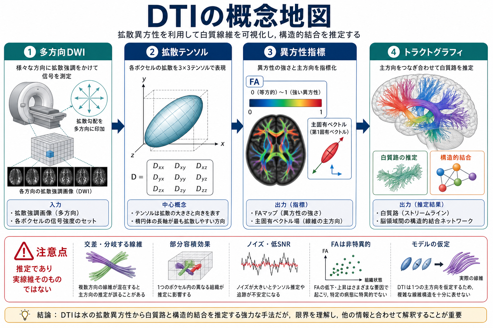
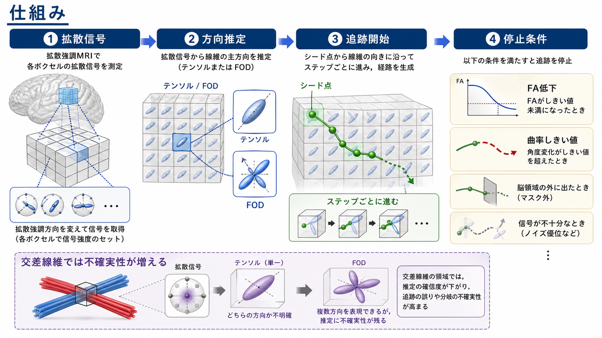
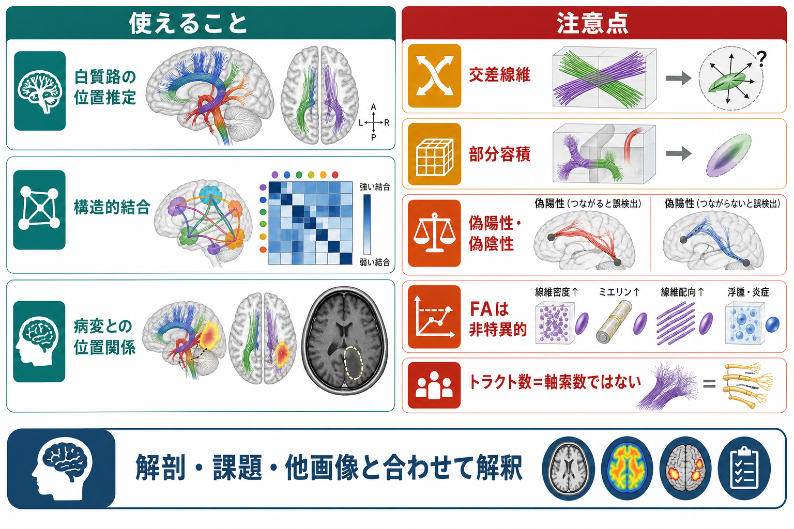

# 拡散テンソル画像DTIは白質線維をどう可視化するのか

## 要点

- DTIは、[[拡散強調画像DWIは何を反映しているのか|DWI]]を多方向に撮像し、各ボクセルで水分子の拡散しやすさを3次元テンソルとして推定する方法である[1][2]。
- 白質では、水分子が軸索束に沿う方向へ比較的拡散しやすく、軸索束を横切る方向へは拡散しにくい。この拡散異方性を利用して、線維方向の手がかりを得る[3]。
- DTIから得られる[[FA値とは何か|FA]]、平均拡散率、主固有ベクトルは、白質の微細構造を読むための指標だが、軸索密度、髄鞘、水分量、炎症、線維配向などが混ざった非特異的な指標である[4]。
- [[トラクトグラフィーとは何か|トラクトグラフィー]]は、ボクセルごとの方向推定をつなぎ合わせて白質路らしい経路を再構成するが、これは「推定された経路」であって、個々の軸索を直接撮影したものではない[5][6]。

## この記事で答える問い

1. DTIは、通常のMRIやDWIと何が違うのか。
2. 拡散テンソル、固有値、主固有ベクトル、FAは何を表すのか。
3. 白質路や[[構造的結合と機能的結合は何が違うのか|構造的結合]]は、どのような手順で推定されるのか。
4. DTIトラクトグラフィーを解釈するとき、どこに限界があるのか。

## まず結論

DTIは、白質線維そのものを光学顕微鏡のように見ているわけではない。見ているのは、MRIの1ボクセル内で水分子がどの方向へ動きやすいかという統計的な信号である。白質では軸索、髄鞘、細胞膜、細胞外腔などが水の動きを方向づけるため、拡散が等方的ではなく異方的になる。この異方性をテンソルで表し、その長軸方向を白質線維の主方向の手がかりとして扱う[1][3]。

したがって、DTIの強みは「白質路や構造的ネットワークを非侵襲的に推定できる」ことであり、弱みは「交差線維、分岐、部分容積、ノイズ、モデル仮定に弱い」ことである。研究や臨床支援では有用だが、単独で解剖学的真実や個別診断を確定する検査ではない[6][7]。

## 背景

通常の[[構造MRIは脳の何を測っているのか|構造MRI]]は、T1強調画像やT2強調画像として、灰白質、白質、脳脊髄液、病変のコントラストを示す。一方、DWIは拡散勾配をかけ、水分子の見かけの移動によってMRI信号がどれだけ減衰するかを測る。DTIはこのDWIをさらに多方向に拡張し、拡散が「どの方向にどれくらい強いか」を推定する枠組みである[1][2]。

この発想が重要なのは、白質が方向性をもつ組織だからである。白質には、多数の有髄軸索が束になって走る領域が多い。水分子は完全に自由に動くのではなく、細胞膜、髄鞘、軸索内外の空間、線維束の幾何学的配置によって動き方が制限される。拡散MRIは、このミクロな制約をミリメートル単位のボクセル信号として読む技術である[3][4]。

## 基本概念

### 拡散テンソル

テンソルとは、ここでは3次元空間における拡散の形を表す3×3の行列である。自由水のように全方向へ同じように拡散する場合、拡散は球に近い形で表せる。白質のように一方向へ伸びた拡散を示す場合、拡散は楕円体のような形になる。DTIは各ボクセルでこの楕円体を推定する[1][2]。

簡略化すると、拡散テンソル $D$ は次のように表される。

$$
D =
\begin{pmatrix}
D_{xx} & D_{xy} & D_{xz} \\
D_{yx} & D_{yy} & D_{yz} \\
D_{zx} & D_{zy} & D_{zz}
\end{pmatrix}
$$

この行列を固有値分解すると、3つの固有値 $\lambda_1, \lambda_2, \lambda_3$ と、それぞれに対応する固有ベクトルが得られる。最大固有値 $\lambda_1$ に対応する方向、つまり主固有ベクトルは、そのボクセルで最も拡散しやすい方向を示す。

### FA

FA、fractional anisotropyは、拡散がどれくらい方向依存的かを0から1に近い値で表す指標である。0に近いほど等方的、1に近いほど一方向へ偏った拡散を意味する。白質のまとまった線維束ではFAが高くなりやすいが、FAの高さは「白質が健康」という単純なラベルではない[4][6]。

FAは、固有値どうしのばらつきから計算される。

$$
FA =
\sqrt{\frac{3}{2}}
\frac{
\sqrt{(\lambda_1-\bar{\lambda})^2 + (\lambda_2-\bar{\lambda})^2 + (\lambda_3-\bar{\lambda})^2}
}{
\sqrt{\lambda_1^2+\lambda_2^2+\lambda_3^2}
}
$$

ここで $\bar{\lambda}$ は3つの固有値の平均である。FAが変化する理由には、髄鞘化、軸索密度、線維の整列、交差線維、浮腫、炎症、発達、変性などが含まれうる。

### 構造的結合

構造的結合とは、脳領域どうしが白質路などの物理的経路によって結ばれうることを指す。DTIトラクトグラフィーを使うと、領域間に推定ストリームラインを引き、[[コネクトームとは何か|コネクトーム]]解析の結合行列を作ることができる。ただし、ストリームラインの本数は軸索数そのものではなく、撮像条件、追跡アルゴリズム、閾値、領域設定に強く依存する[6][7]。

## 仕組み

DTI解析は、典型的には次の流れをたどる。

1. 複数方向の拡散勾配をかけてDWIを撮像する。
2. 各ボクセルで、方向ごとの信号減衰から拡散テンソルを推定する。
3. テンソルを固有値分解し、主固有ベクトル、FA、平均拡散率などを計算する。
4. 主固有ベクトルの向きを色で表した方向マップやFAマップを作る。
5. 種点から方向場に沿って少しずつ進め、停止条件を満たすまでストリームラインを生成する。
6. 関心領域どうしを結ぶ経路、あるいは全脳の構造結合行列として要約する。

決定論的トラクトグラフィーでは、各ボクセルで最もありそうな主方向に沿って進む。実装は直感的で速いが、交差や分岐に弱い。確率論的トラクトグラフィーでは、方向推定の不確実性をサンプリングし、ある領域へ到達する確率分布として表す。こちらは不確実性を表現しやすいが、偽陽性も増えうる[5][6]。

## 図解

DTIの可視化を読むときは、次の3層を分けると混乱しにくい。

| 層 | 何を見ているか | 代表的な出力 | 注意点 |
|---|---|---|---|
| 信号 | 多方向DWIの信号減衰 | b0画像、DWI、ADC/MD | 動き、歪み、SNRの影響を受ける |
| モデル | ボクセル内の拡散をテンソルで近似 | FA、固有値、主固有ベクトル | 1ボクセル1主方向という仮定が強い |
| 経路推定 | 方向場をつないだストリームライン | 白質路、結合行列 | 実軸索、シナプス、因果方向を直接示さない |

## 臨床・研究との接続

研究では、DTIは白質発達、加齢、外傷、脳卒中、精神疾患、神経変性疾患、発達障害などにおける白質指標の差を調べるために使われる。FAや平均拡散率は、組織微細構造の変化に敏感であり、群間比較や縦断研究の手がかりになる[4]。

臨床支援では、腫瘍、出血、梗塞、てんかん外科などで、病変や手術経路と錐体路、弓状束、視放線などの重要白質路の位置関係を検討することがある。ただし、浮腫、腫瘍浸潤、圧排、術前後の歪み、低FA領域では追跡が途切れたり誤った経路が出たりしやすい。したがって、DTIは解剖、症状、神経心理、電気生理、他のMRIシーケンスと統合して読む必要がある[6][7]。

ネットワーク研究では、DTIから領域間の構造的結合行列を作り、ハブ、モジュール性、ネットワーク効率、リッチクラブ構造などを調べる。これは[[脳内ネットワークとは何か|脳内ネットワーク]]を構造面から記述する強力な方法だが、結合重みの定義が解析パイプラインに依存するため、再現性と前処理の透明性が重要になる[7]。

## よくある誤解

### 誤解1: DTIは白質線維を直接撮影している

DTIは水分子の拡散信号を撮影している。ストリームラインは、拡散方向場から再構成された推定経路であり、軸索一本一本の顕微鏡写真ではない[6]。

### 誤解2: FAが高いほど脳がよい状態である

FAは異方性の強さであって、良し悪しの単純な指標ではない。FA低下は脱髄や軸索損傷と関連しうるが、FA上昇も交差線維の減少、線維配向の変化、部分容積の変化などで起こりうる[4][6]。

### 誤解3: トラクト数は軸索数である

ストリームライン数は、種点数、追跡条件、ROI設定、アルゴリズム、補正方法に依存する。したがって「ストリームラインが多い=軸索が多い」とは読めない[6][7]。

### 誤解4: DTIで機能的な情報の流れがわかる

DTIは物理的経路の候補を示すが、活動の同期、情報方向、因果的影響を直接示さない。機能的結合や有効結合を議論するには、fMRI、EEG/MEG、課題、行動データなど別の情報が必要である。

## 関連ノート

- [[拡散強調画像DWIは何を反映しているのか]]
- [[FA値とは何か]]
- [[トラクトグラフィーとは何か]]
- [[構造MRIは脳の何を測っているのか]]
- [[構造的結合と機能的結合は何が違うのか]]
- [[コネクトームとは何か]]
- [[髄鞘はなぜ神経伝導を速くするのか]]

## MOC更新候補

- バッチ統合時に [[MOC｜脳・神経科学]] の「脳画像・神経計測」または「脳ネットワーク」周辺へ追加する候補。
- 脳画像・神経計測カテゴリの入口ノートを作る場合、DWI、FA、トラクトグラフィー、構造MRIと相互参照させる候補。

## 理解チェック

1. DWIとDTIの違いを説明できるか。
2. 主固有ベクトルは、何の方向を表しているか。
3. FAが白質の「健康度」と直結しない理由は何か。
4. 決定論的トラクトグラフィーと確率論的トラクトグラフィーの違いは何か。
5. ストリームライン数を軸索数として読めない理由は何か。

## 未解決問題

- DTIより複雑な拡散モデルを使って、交差線維、分岐、扇状線維をどこまで安定して推定できるか。
- FAやMDの変化を、髄鞘、軸索密度、炎症、水分量、線維配向のどの成分へどこまで分解できるか。
- 個人レベルの臨床判断で、DTIトラクトグラフィーの不確実性をどのように定量表示するか。
- 構造的結合と機能的結合を、発達、学習、精神疾患、神経変性の縦断変化としてどう統合するか。

## 参考文献

[1] Basser, P. J., Mattiello, J., & LeBihan, D. (1994). MR diffusion tensor spectroscopy and imaging. *Biophysical Journal*, 66(1), 259-267. https://doi.org/10.1016/S0006-3495(94)80775-1

[2] Basser, P. J., & Pierpaoli, C. (1996). Microstructural and physiological features of tissues elucidated by quantitative-diffusion-tensor MRI. *Journal of Magnetic Resonance, Series B*, 111(3), 209-219. https://doi.org/10.1006/jmrb.1996.0086

[3] Le Bihan, D. (2003). Looking into the functional architecture of the brain with diffusion MRI. *Nature Reviews Neuroscience*, 4, 469-480. https://doi.org/10.1038/nrn1119

[4] Alexander, A. L., Lee, J. E., Lazar, M., & Field, A. S. (2007). Diffusion tensor imaging of the brain. *Neurotherapeutics*, 4(3), 316-329. https://doi.org/10.1016/j.nurt.2007.05.011

[5] Mori, S., Crain, B. J., Chacko, V. P., & van Zijl, P. C. M. (1999). Three-dimensional tracking of axonal projections in the brain by magnetic resonance imaging. *Annals of Neurology*, 45(2), 265-269. https://doi.org/10.1002/1531-8249(199902)45:2%3C265::AID-ANA21%3E3.0.CO;2-3

[6] Jones, D. K., Knosche, T. R., & Turner, R. (2013). White matter integrity, fiber count, and other fallacies: The do's and don'ts of diffusion MRI. *NeuroImage*, 73, 239-254. https://doi.org/10.1016/j.neuroimage.2012.06.081

[7] Tournier, J.-D., Mori, S., & Leemans, A. (2011). Diffusion tensor imaging and beyond. *Magnetic Resonance in Medicine*, 65(6), 1532-1556. https://doi.org/10.1002/mrm.22924
