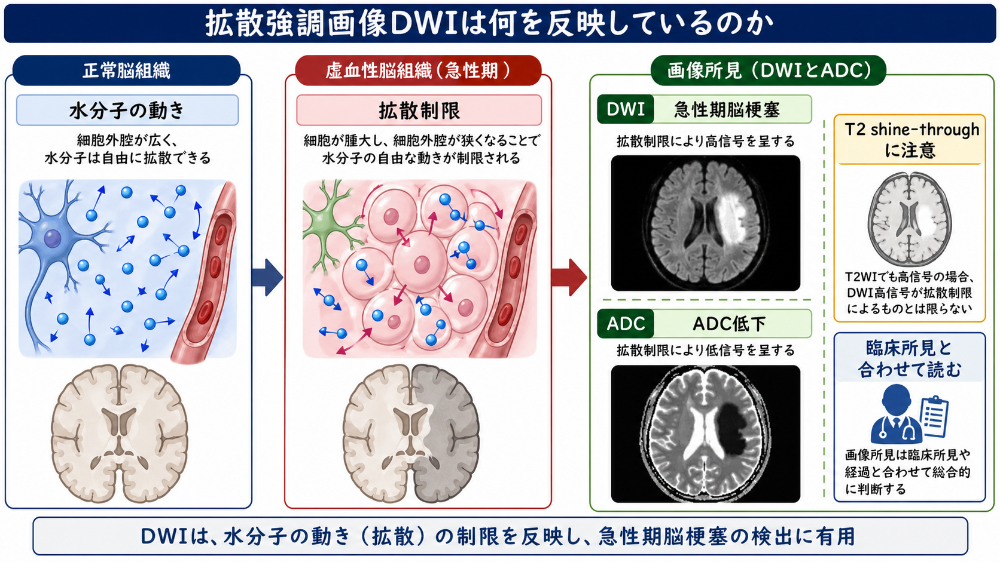
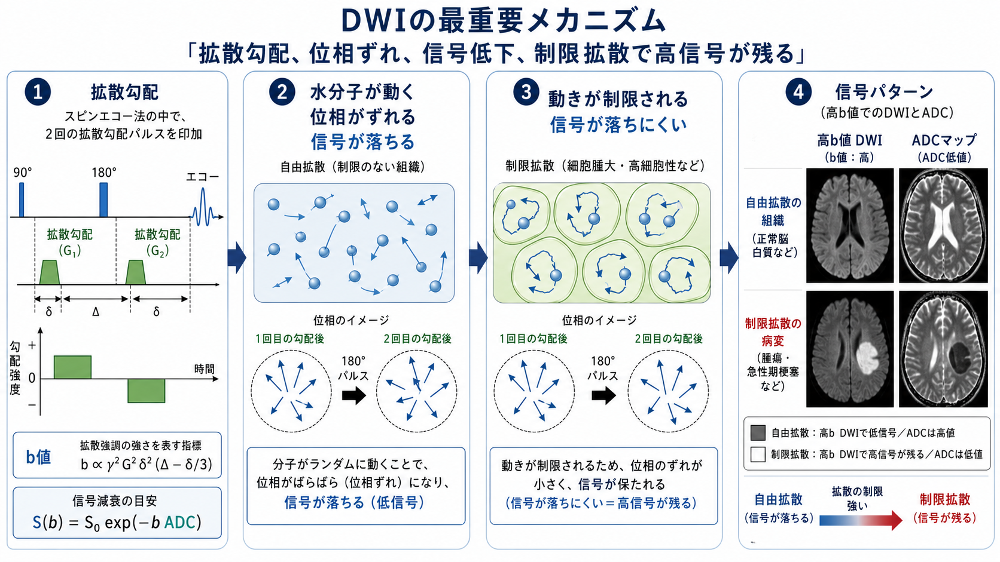
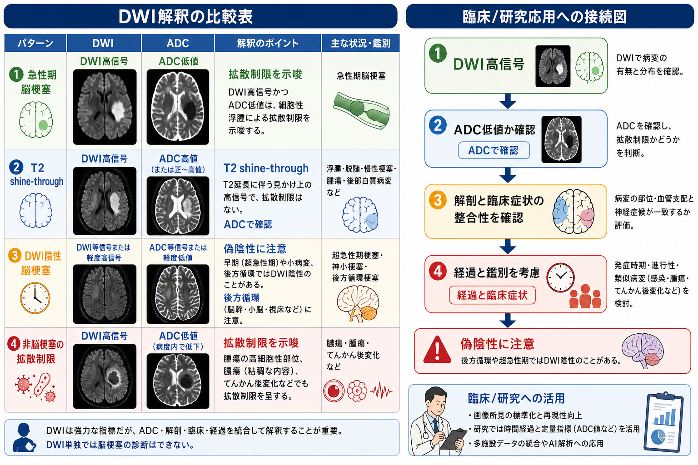

# 拡散強調画像DWIは何を反映しているのか

## 要点

- 拡散強調画像DWIは、組織内の水分子がどれくらい動きやすいかを、MRI信号の落ち方として画像化する方法である。純粋な「水の量」ではなく、細胞密度、細胞外腔、膜、粘性、灌流成分などが混ざった**見かけの拡散**を反映する[1][2]。
- 急性期脳梗塞ではエネルギー不全により細胞性浮腫が起こり、細胞外腔が狭くなることで水分子の移動が制限される。このためDWIで高信号、ADCマップで低値として見えやすい[3][4]。
- DWI高信号だけでは「拡散制限」と断定できない。DWIにはT2成分も混ざるため、ADC低下を確認し、T2 shine-through、腫瘍、膿瘍、てんかん後変化などを鑑別する必要がある[5][6]。
- 初回DWIが陰性でも急性期脳梗塞を除外しきれない。とくに後方循環、小病変、超急性期では偽陰性が起こりうるため、神経診察、血管支配、経過、再検査を合わせて読む[6][7]。

## この記事で答える問い

1. DWIの「拡散」とは何を指すのか。
2. なぜ急性期脳梗塞でDWI高信号、ADC低値になるのか。
3. DWI高信号を読むとき、どこで誤解が起こりやすいのか。
4. 臨床や研究ではDWIをどのように使うべきか。

## まず結論

DWIが直接見ているのは、神経細胞の死そのものでも、血流そのものでも、病名そのものでもない。DWIは、強い拡散勾配をかけたときに水分子のランダムな動きがMRI信号をどれだけ減衰させるかを見ている。よく動く水は位相がばらけて信号が落ち、動きにくい水は信号が保たれやすい[1][2]。

したがって、急性期脳梗塞でDWIが高信号になるのは、「虚血で水が増えたから」ではなく、多くの場合「細胞性浮腫により水の見かけの移動が制限され、拡散強調下でも信号が落ちにくくなるから」である[3][4]。この解釈を支える確認画像がADCマップであり、典型的な急性期虚血ではDWI高信号とADC低値が対応する。

## 背景

DWIの原型は、磁場勾配下でボクセル内の分子運動がスピンエコー信号を減衰させるという考え方から発展した。Le Bihanらは、分子拡散と微小循環を含むボクセル内の非干渉運動をMRIで評価し、ADCという「見かけの拡散係数」で組織差を表せることを示した[1][2]。

脳梗塞との接続は、動物虚血モデルとヒト急性期脳梗塞研究で強くなった。Moseleyらはネコの局所脳虚血で、T2変化より早く拡散強調画像が異常を捉えることを示した[3]。Warachらはヒト急性期脳梗塞で、従来のT2強調画像より早くDWIが梗塞を描出し、急性病変ではADCが低下することを報告した[4][5]。

このためDWIは、[[T1強調画像とT2強調画像は何が違うのか|T1/T2強調画像]]や[[FLAIR画像はどのような病変検出に役立つのか|FLAIR画像]]とは異なる、急性期変化に敏感なMRIコントラストとして使われる。ただし、DWIは単独で診断を完結させる検査ではない。

## 基本概念

### 拡散

ここでいう拡散とは、水分子が熱運動によってランダムに移動することである。自由水に近い環境では分子は比較的広く移動できる。脳組織内では、細胞膜、細胞小器官、軸索、髄鞘、細胞外腔の狭さ、粘性などにより移動は制約される。

DWIが測るのは、物理学の理想的な拡散係数そのものではなく、MRIボクセル内で観察される**見かけの拡散**である。そこでADC、apparent diffusion coefficient、つまり見かけの拡散係数という量が使われる[1][2]。

### b値

b値は、拡散をどれくらい強く信号に反映させるかを表す撮像条件である。b値が高いほど、水分子の移動による信号減衰が強く効く。単純化すれば、信号は次のように減衰する。

$$
S(b) = S_0 \exp(-b \cdot ADC)
$$

ADCが高い、つまり水が動きやすい組織では、高いb値で信号が落ちやすい。ADCが低い、つまり水の動きが制限される組織では、信号が残りやすく、DWIで高信号に見えやすい。

### ADCマップ

ADCマップは、複数のb値画像から見かけの拡散係数を推定した画像である。DWI高信号が本当に拡散制限を反映しているかを確認するために重要である。典型的な急性期脳梗塞ではDWI高信号、ADC低値が組み合わさる[4][5]。

## 仕組み

スピンエコー法に拡散感受性のある勾配パルスを加えると、動いた水分子は1回目と2回目の勾配で受ける位相変化が一致しにくくなる。水分子が大きく移動すれば位相がばらけ、合成されたMRI信号は弱くなる。逆に、水分子の移動が小さければ位相のばらつきが小さく、信号が残りやすい[1][2]。

急性期脳梗塞では、血流低下によりATP産生が破綻し、イオンポンプが十分に働かなくなる。ナトリウムと水が細胞内へ移動し、細胞が腫大する。これにより細胞外腔は狭くなり、水分子がボクセル内で移動できる距離が短くなる。結果としてADCは低下し、DWIでは高信号として見えやすくなる[3][4]。

ただし、この説明は「DWI高信号 = 不可逆な壊死」という意味ではない。DWI病変は虚血コアの近似として利用されることが多いが、超急性期には可逆的な成分を含むことがあり、病変全体がそのまま最終梗塞体積を表すとは限らない[6]。

## 図解

| 読影パターン | DWI | ADC | 代表的な読み方 | 注意点 |
|---|---|---|---|---|
| 急性期脳梗塞の典型例 | 高信号 | 低値 | 細胞性浮腫を伴う拡散制限を示唆 | 血管支配と神経症候に合うか確認する |
| T2 shine-through | 高信号 | 低値でない、または高値 | T2延長がDWIに残って見える | DWIだけで拡散制限と呼ばない |
| DWI陰性脳梗塞 | 正常または軽度変化 | 正常または不明瞭 | 小病変、超急性期、後方循環で起こりうる | 臨床診断と再検査が重要 |
| 非脳梗塞性の拡散制限 | 高信号 | 低値 | 膿瘍、腫瘍高細胞部位、てんかん後変化など | 病歴、造影、灌流、経過で鑑別する |

## 臨床・研究との接続

### 急性期脳梗塞

DWIは急性期脳梗塞の早期検出に強い。ヒト研究では、発症早期の病変がDWIで高信号、ADCで低値として描出され、従来MRIより早期に病変が確認される例が示された[4][5]。そのため、急性期脳卒中診療ではDWIは病変局在、発症時期の推定、FLAIRとの組み合わせ、血管画像や灌流画像との統合に使われる[8]。

一方で、初期画像だけで治療判断を単純化してはいけない。AHA/ASAの急性期脳梗塞ガイドラインでは、治療候補者では画像評価を迅速に行うこと、状況に応じてDWIを含むMRIや血管・灌流画像を使うことが整理されている[8]。このノートは教育・研究目的の整理であり、個別症例の診断や治療適応を指示するものではない。

### 脳腫瘍・膿瘍・てんかん後変化

拡散制限は脳梗塞に特異的ではない。膿瘍では粘稠な内容物や細胞成分、腫瘍では高細胞性領域、てんかん後変化では一過性の代謝・細胞環境変化によりDWI高信号とADC低下が見られることがある[6]。したがって、DWIは「病名を出す画像」ではなく、「水分子の見かけの移動が制限されている場所を示す画像」と読むのがよい。

### 研究での利用

研究では、ADC値、DWI病変体積、DWI-FLAIR mismatch、灌流画像との mismatch、拡散テンソル画像や拡散尖度画像などが使われる。DWIは急性病変の空間的な足場を与えるが、組織予後、神経症状、回復可能性を単独で決める指標ではない。[[構造的結合と機能的結合は何が違うのか|構造的結合と機能的結合]]の研究と同様に、画像指標は測定原理と限界を明示して使う必要がある。

## よくある誤解

### 誤解1: DWI高信号は水が増えて白く見えるという意味である

水分量の増加だけならT2延長として見えることが多い。DWI高信号の中心的な読みは、水分子の動きが制限され、高b値画像でも信号が落ちにくいということである。T2成分の混入があるため、ADCで確認する必要がある。

### 誤解2: DWI高信号なら必ず急性期脳梗塞である

違う。拡散制限は膿瘍、腫瘍、てんかん後変化、外傷、一部の脱髄・炎症性病変などでも見られる。脳梗塞らしさは、血管支配に沿う分布、突然発症の神経症候、血管画像、経過、他シーケンスとの整合性から判断する[6]。

### 誤解3: DWIが陰性なら脳梗塞ではない

これも危険である。メタ解析では、急性期脳梗塞の一部にDWI陰性例があり、後方循環虚血ではDWI陰性になりやすいことが示されている[7]。DWIは強力な検査だが、神経診察と時間経過を置き換えるものではない。

### 誤解4: ADC低値は不可逆的障害を意味する

ADC低値は強い虚血性変化を示唆するが、時間、再灌流、病変部位、測定条件によって意味が変わる。超急性期にはDWI病変の一部が可逆的である可能性もあり、最終梗塞体積と完全には一致しない[6]。

## 関連ノート

- [[T1強調画像とT2強調画像は何が違うのか]]
- [[FLAIR画像はどのような病変検出に役立つのか]]
- [[構造的結合と機能的結合は何が違うのか]]
- [[脳内ネットワークとは何か]]
- [[MOC｜脳・神経科学]]

### 関連ノート候補

- DWIとADCは何が違うのか
- DWI-FLAIR mismatchとは何か
- 灌流画像PWIは何を反映しているのか
- 脳梗塞の画像診断でCTとMRIはどう使い分けるのか
- 拡散テンソル画像DTIは白質線維をどう推定するのか

### MOC更新候補

- `content/00_MOC/MOC｜脳・神経科学.md` の脳画像・神経計測またはMRI関連項目に、本記事へのリンクを追加する。
- 並列ジョブとの競合を避けるため、この作業ではMOC本体は更新しない。

## 理解チェック

1. DWIが「水の量」ではなく「見かけの水分子の動き」を反映すると言える理由を説明できるか。
2. 急性期脳梗塞でDWI高信号、ADC低値が生じる細胞レベルの流れを説明できるか。
3. T2 shine-throughと真の拡散制限を区別するために、なぜADCマップを見る必要があるか。
4. DWI陰性でも急性期脳梗塞を除外できない状況を挙げられるか。

## 未解決問題

- DWI病変のどの部分が不可逆的虚血コアで、どの部分が再灌流により回復しうるのかを、個別症例でどこまで予測できるか。
- ADC、灌流、血管画像、臨床症状、時間経過を統合した予後予測を、どの程度標準化できるか。
- 拡散尖度画像、NODDI、拡散テンソル画像などの高度拡散MRIが、急性期診療や病態理解にどこまで追加価値を持つか。

## 参考文献

[1] Le Bihan, D., Breton, E., Lallemand, D., Grenier, P., Cabanis, E., & Laval-Jeantet, M. (1986). MR imaging of intravoxel incoherent motions: application to diffusion and perfusion in neurologic disorders. *Radiology*, 161(2), 401-407. https://doi.org/10.1148/radiology.161.2.3763909

[2] Le Bihan, D., Breton, E., Lallemand, D., Aubin, M. L., Vignaud, J., & Laval-Jeantet, M. (1988). Separation of diffusion and perfusion in intravoxel incoherent motion MR imaging. *Radiology*, 168(2), 497-505. https://doi.org/10.1148/radiology.168.2.3393671

[3] Moseley, M. E., Cohen, Y., Mintorovitch, J., Chileuitt, L., Shimizu, H., Kucharczyk, J., Wendland, M. F., & Weinstein, P. R. (1990). Early detection of regional cerebral ischemia in cats: comparison of diffusion- and T2-weighted MRI and spectroscopy. *Magnetic Resonance in Medicine*, 14(2), 330-346. https://doi.org/10.1002/mrm.1910140218

[4] Warach, S., Chien, D., Li, W., Ronthal, M., & Edelman, R. R. (1992). Fast magnetic resonance diffusion-weighted imaging of acute human stroke. *Neurology*, 42(9), 1717-1723. https://doi.org/10.1212/WNL.42.9.1717

[5] Warach, S., Gaa, J., Siewert, B., Wielopolski, P., & Edelman, R. R. (1995). Acute human stroke studied by whole brain echo planar diffusion-weighted magnetic resonance imaging. *Annals of Neurology*, 37(2), 231-241. https://doi.org/10.1002/ana.410370214

[6] Nagaraja, N. (2021). Diffusion weighted imaging in acute ischemic stroke: A review of its interpretation pitfalls and advanced diffusion imaging application. *Journal of the Neurological Sciences*, 425, 117435. https://doi.org/10.1016/j.jns.2021.117435

[7] Edlow, B. L., Hurwitz, S., & Edlow, J. A. (2017). Diagnosis of DWI-negative acute ischemic stroke: A meta-analysis. *Neurology*, 89(3), 256-262. https://doi.org/10.1212/WNL.0000000000004120

[8] Powers, W. J., Rabinstein, A. A., Ackerson, T., et al. (2019). Guidelines for the Early Management of Patients With Acute Ischemic Stroke: 2019 Update to the 2018 Guidelines for the Early Management of Acute Ischemic Stroke. *Stroke*, 50(12), e344-e418. https://doi.org/10.1161/STR.0000000000000211
