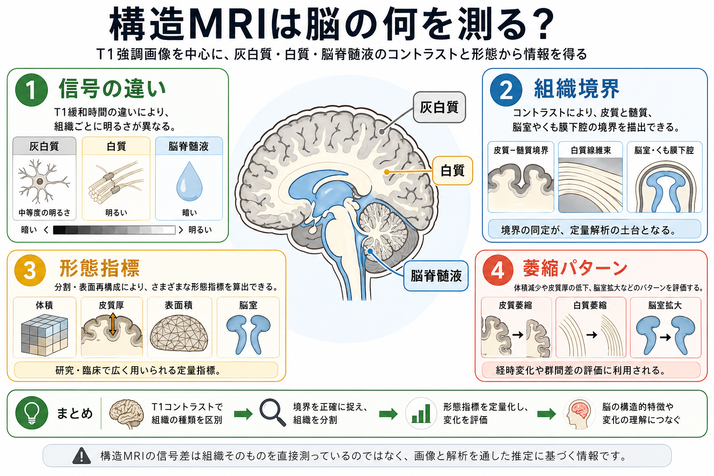
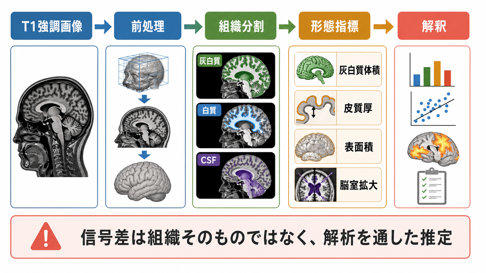

# 構造MRIは脳の何を測っているのか

## 要点

- 構造MRI、特にT1強調画像は、脳の「組織そのもの」を直接測るというより、水素原子核の信号が組織環境によってどう変わるかを画像化している。
- T1強調画像では、灰白質・白質・脳脊髄液の信号差が比較的はっきりし、組織分割や皮質表面再構成の土台になる。
- 形態解析から得られる代表的な指標は、灰白質体積、白質体積、皮質厚、表面積、脳室体積、局所的な萎縮パターンである。
- これらの指標は、神経細胞数、シナプス、髄鞘、血管、グリア、細胞外空間などが混ざったマクロな推定量であり、単一の細胞過程へ直結させて解釈してはいけない。
- 研究・臨床では、加齢、神経変性、発達、精神疾患、治療経過、群間差の評価に使われるが、撮像条件・前処理・解析パイプライン・多施設差の影響を受ける。

## この記事で答える問い

この記事では、構造MRIを「脳の形をきれいに撮る技術」としてではなく、どのような物理信号から、どのような解剖学的・統計的指標を推定しているのか、という観点から整理する。中心に置くのはT1強調画像である。拡散MRIやfMRIは重要な隣接領域だが、ここでは主に灰白質・白質・脳脊髄液のコントラスト、脳萎縮、形態解析に話を絞る。

## まず結論

構造MRIが測っているのは、第一には水素原子核から得られるMR信号であり、第二にはその信号から推定された組織境界と形態指標である。T1強調画像では、T1緩和時間や撮像パラメータによって組織間の信号差が作られ、白質、灰白質、脳脊髄液が異なる明るさとして見える。このコントラストを利用して、解析ソフトウェアは脳を標準空間へ合わせ、組織を分割し、皮質表面や局所体積を推定する[1][2]。

したがって、「海馬体積が小さい」「前頭葉皮質が薄い」「脳室が拡大している」という表現は、MRI信号をもとにした画像処理と統計モデルを通した推定である。脳の形態変化を理解する強力な窓ではあるが、ニューロン数や神経活動をそのまま読んでいるわけではない。

## 背景

脳画像には、脳の構造をみる画像、活動をみる画像、白質線維の方向性を推定する画像などがある。構造MRIは、そのうち脳の形・境界・体積・厚みを調べるための中核的な方法である。T1強調画像は、解剖学的な輪郭が比較的明瞭で、灰白質と白質の境界を追いやすいため、脳形態解析の標準的な入力画像として広く使われてきた[3][4]。

この技術は、[[神経細胞の種類はどのように分類されるのか|神経細胞]]、[[グリア細胞は単なる支持細胞なのか|グリア細胞]]、[[髄鞘はなぜ神経伝導を速くするのか|髄鞘]]のような微視的要素を直接区別するものではない。むしろ、それらを含む組織全体の物理的・解剖学的特徴が、ミリメートル単位の画像信号と形態として現れたものを扱う。

## 基本概念

### T1強調画像

MRIでは、強い静磁場の中で水素原子核の磁化をそろえ、RFパルスで励起し、その後の信号変化を測定する。T1緩和は縦磁化が回復していく過程であり、T2緩和は横磁化が減衰していく過程である。TRやTEなどの撮像パラメータを調整すると、T1差を強調した画像やT2差を強調した画像が得られる[1]。

T1強調画像では、典型的に白質が比較的明るく、灰白質が中間的、脳脊髄液が暗く見える。この順序は撮像条件に依存するが、構造解析で重要なのは、組織ごとの信号分布が異なるため境界を推定しやすいことである。

### 灰白質・白質・脳脊髄液

灰白質は大脳皮質や深部核など、細胞体、樹状突起、シナプス、グリア、血管を多く含む領域である。白質は主に有髄軸索の束を含む。脳脊髄液は脳室やくも膜下腔を満たす液体であり、T1強調画像では脳実質と異なる信号を示す。

ただし、MRIの1ボクセルには複数組織が混ざりうる。これを部分容積効果という。皮質のように薄く折りたたまれた構造では、灰白質、白質、脳脊髄液が1ボクセル内で混ざりやすく、皮質厚や灰白質体積の推定には前処理とモデル化が欠かせない。

### 脳萎縮

脳萎縮とは、肉眼的・画像的には脳実質の体積低下、脳溝の拡大、脳室拡大、局所構造の縮小として観察される変化である。萎縮は加齢、神経変性疾患、血管性変化、炎症、外傷、発達差など多様な背景で起こりうる。構造MRIは萎縮の部位とパターンを評価できるが、原因を単独で確定する検査ではない[5][6]。

## 仕組み

構造MRI解析は、画像をそのまま目で読むだけではない。典型的には次のような流れをたどる。

1. T1強調画像を撮像する。
2. 頭部位置、強度むら、ノイズ、頭蓋骨などを考慮して前処理する。
3. 灰白質、白質、脳脊髄液へ組織分割する。
4. 個人の脳を標準空間へ位置合わせする、または個人内の皮質表面を再構成する。
5. 体積、皮質厚、表面積、脳回・脳溝、脳室体積などを推定する。
6. 年齢、性別、頭蓋内容積、撮像施設、疾患群などを考慮して統計解析する。

Voxel-based morphometry（VBM）は、脳全体をボクセル単位で比較する代表的手法である。高解像度構造画像を標準空間へ正規化し、灰白質などへ分割し、平滑化したうえで群間差や連続変数との関連を調べる[2]。一方、surface-based morphometryでは、大脳皮質の白質境界と軟膜側境界を再構成し、皮質の2次元表面として厚みや面積を評価する[3][4]。

## 図解

## 何がわかるのか

### 灰白質体積

灰白質体積は、ある領域に灰白質として分類された組織がどれだけあるかを表す。VBMでは局所灰白質量や濃度として扱われることもある。加齢研究では、成人期を通じた灰白質量の低下や、部位ごとに異なる変化パターンが報告されている[5]。

ただし、灰白質体積の変化はニューロン数だけを意味しない。樹状突起、シナプス密度、グリア、血管、髄鞘化、細胞外空間、部分容積効果などが混ざった指標である。

### 白質体積

白質体積は、有髄軸索を多く含む組織のマクロな量を反映する。白質の微細構造や線維方向性を詳しくみるには拡散MRIが必要になるが、T1構造画像でも白質領域の容積、白質病変の周辺構造、萎縮との関係を検討できる。[[構造的結合と機能的結合は何が違うのか|構造的結合]]や[[コネクトームとは何か|コネクトーム]]を考えるとき、構造MRIは白質路そのものを描くというより、拡散MRIや機能画像を重ねるための解剖学的土台になる。

### 皮質厚

皮質厚は、白質境界から皮質表面までの距離を推定した指標である。皮質は折りたたまれているため、単純な断面画像上の距離測定では誤差が大きくなる。表面再構成に基づく方法は、この問題に対応するために発展してきた[3][4]。

皮質厚の低下は、神経変性、発達、加齢、精神疾患研究で頻繁に扱われる。ただし、皮質厚が薄いことを「機能が低い」と直結させるのは過剰解釈である。機能的なネットワーク変化は、[[脳内ネットワークとは何か|脳内ネットワーク]]、神経活動、行動指標と合わせて検討する必要がある。

### 表面積と折りたたみ

皮質表面積は、皮質厚とは異なる発達的・遺伝的背景をもつ可能性がある指標である。ある領域の体積はおおまかには「厚さ × 面積」と考えられるため、体積だけを見ると、厚さの変化と面積の変化が混ざってしまう。表面ベース解析では、皮質厚と表面積を分けて扱える点が重要である。

### 脳室拡大と脳脊髄液空間

脳実質が減少すると、相対的に脳室やくも膜下腔が拡大して見えることがある。神経変性疾患や加齢で脳室拡大が観察されることはあるが、脳室の大きさだけで疾患を決めることはできない。個人差、発達、頭蓋サイズ、既往、撮像条件を含めた解釈が必要である。

## 臨床・研究との接続

臨床では、構造MRIは腫瘍、出血、梗塞、奇形、萎縮、白質病変、水頭症などの評価に使われる。認知症領域では、内側側頭葉萎縮や全脳萎縮のパターンが診断補助や病期理解に用いられてきた。ただし、個別診断は画像所見だけでなく、症状、神経心理検査、経過、他の検査と統合して行われる[6]。

研究では、構造MRIは大規模データに向いている。たとえば、年齢、遺伝、環境、精神症状、認知機能、治療反応と、局所脳体積や皮質厚との関連を調べられる。多施設データではサンプルサイズを大きくできる一方、スキャナ、磁場強度、撮像プロトコル、施設差が結果に混ざるため、調和化や品質管理が重要になる[7]。

## よくある誤解

### 誤解1: 構造MRIは神経細胞の数を直接測っている

構造MRIは細胞数を直接数えない。灰白質体積や皮質厚は、ニューロン、グリア、血管、シナプス、細胞外空間、髄鞘、組織水分などを含む複合的なマクロ指標である。

### 誤解2: 灰白質が多いほど能力が高い

形態指標と行動・認知機能の関係は単純ではない。領域、発達段階、課題、疾患、補償過程によって意味が変わる。大きい、小さい、厚い、薄いという方向だけで価値判断しない方がよい。

### 誤解3: VBMの結果は脳の正確な地図である

VBMは強力だが、位置合わせ、分割、平滑化、統計しきい値、頭蓋内容積補正の影響を受ける。とくに群間で形状が大きく違う場合、位置合わせの失敗が局所差として現れる可能性があるため、結果の解釈には注意が必要である[2][8]。

### 誤解4: 皮質厚の低下は必ず萎縮を意味する

皮質厚の推定は、画像品質、境界推定、部分容積効果、加齢、発達、病変、アルゴリズムに影響される。縦断研究では同一スキャナ・同一プロトコル・同一パイプラインが望ましい。多施設研究ではスキャナ効果を明示的に扱う必要がある[7]。

## 関連ノート

- [[脳内ネットワークとは何か]]
- [[構造的結合と機能的結合は何が違うのか]]
- [[コネクトームとは何か]]
- [[髄鞘はなぜ神経伝導を速くするのか]]
- [[グリア細胞は単なる支持細胞なのか]]
- [[大脳皮質の層構造は情報の流れをどう決めるのか]]
- [[皮質カラムとは何か]]

## MOC更新候補

- `content/00_MOC/MOC｜脳・神経科学.md`
- 脳画像・神経計測カテゴリのMOCが作られる場合、その中核ノート候補

## 理解チェック

1. T1強調画像で白質、灰白質、脳脊髄液が区別しやすいのはなぜか。
2. 灰白質体積が小さいという結果を、ニューロン数の減少と直結できない理由は何か。
3. VBMと皮質表面ベース解析は、どのように違うか。
4. 多施設MRI研究でスキャナ効果が問題になるのはなぜか。
5. 構造MRI所見を臨床的に解釈するとき、画像以外に何を統合する必要があるか。

## 未解決問題

- 構造MRIのマクロ指標を、細胞密度、髄鞘、シナプス、血管変化などの微視的過程へどこまで対応づけられるか。
- 皮質厚、表面積、体積の変化が、発達・加齢・疾患ごとにどのような時間スケールで異なるか。
- 多施設・多機種データの調和化が、真の生物学的差まで消してしまわないか。
- 個人単位の予測や診断補助に使う場合、どの程度の再現性と説明可能性が必要か。

## 参考文献

[1] Pai, A., Shetty, R., Hodis, B., & Chowdhury, Y. S. (2023). *Magnetic Resonance Imaging Physics*. StatPearls. NCBI Bookshelf. https://www.ncbi.nlm.nih.gov/books/NBK564320/

[2] Ashburner, J., & Friston, K. J. (2000). Voxel-Based Morphometry-The Methods. *NeuroImage*, 11(6), 805-821. https://doi.org/10.1006/nimg.2000.0582

[3] Dale, A. M., Fischl, B., & Sereno, M. I. (1999). Cortical surface-based analysis. I. Segmentation and surface reconstruction. *NeuroImage*, 9(2), 179-194. https://doi.org/10.1006/nimg.1998.0395

[4] Fischl, B., & Dale, A. M. (2000). Measuring the thickness of the human cerebral cortex from magnetic resonance images. *Proceedings of the National Academy of Sciences*, 97(20), 11050-11055. https://doi.org/10.1073/pnas.200033797

[5] Good, C. D., Johnsrude, I. S., Ashburner, J., Henson, R. N. A., Friston, K. J., & Frackowiak, R. S. J. (2001). A voxel-based morphometric study of ageing in 465 normal adult human brains. *NeuroImage*, 14(1), 21-36. https://doi.org/10.1006/nimg.2001.0786

[6] Frisoni, G. B., Fox, N. C., Jack, C. R., Jr., Scheltens, P., & Thompson, P. M. (2010). The clinical use of structural MRI in Alzheimer disease. *Nature Reviews Neurology*, 6, 67-77. https://doi.org/10.1038/nrneurol.2009.215

[7] Fortin, J. P., Cullen, N., Sheline, Y. I., Taylor, W. D., Aselcioglu, I., Cook, P. A., et al. (2018). Harmonization of cortical thickness measurements across scanners and sites. *NeuroImage*, 167, 104-120. https://doi.org/10.1016/j.neuroimage.2017.11.024

[8] Fischl, B. (2012). FreeSurfer. *NeuroImage*, 62(2), 774-781. https://doi.org/10.1016/j.neuroimage.2012.01.021
