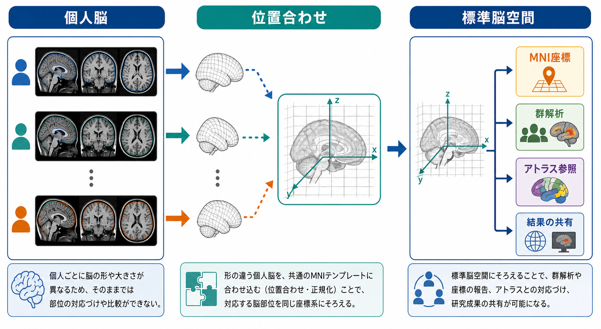
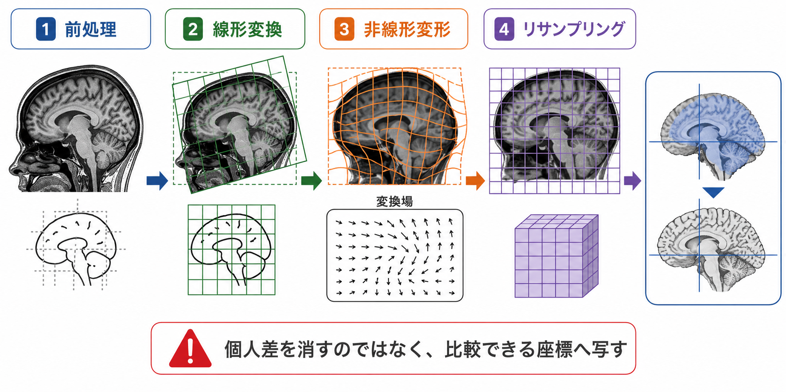
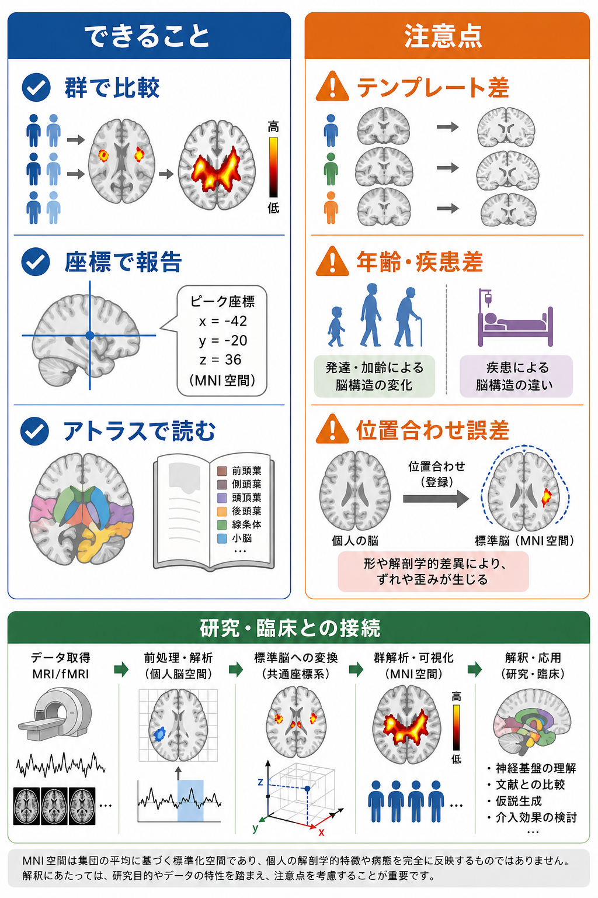

# 標準脳空間とは何か

## 要点

- 標準脳空間とは、個人ごとに形や大きさが異なる脳画像を、共通の三次元座標系に対応づけるための参照空間である。
- 代表例は MNI 空間であり、MNI305 や ICBM152、MNI152NLin2009cAsym など複数のテンプレートがある。
- 目的は「個人差を消す」ことではなく、[[脳画像とは何を見ているのか|脳画像]]の結果を、群解析・座標報告・アトラス参照・研究間比較に使える形へ写すことである。
- 位置合わせには線形変換と非線形変形が使われるが、テンプレート選択、年齢・疾患・撮像条件、位置合わせ誤差が解釈に影響する。

## この記事で答える問い

- なぜ脳画像研究では「MNI座標」や「標準空間」が必要なのか。
- MNI空間、Talairach空間、テンプレート、アトラスは何が違うのか。
- 個人脳を標準脳空間へ写すとき、実際には何が起きているのか。
- 研究や臨床応用で標準脳空間を使うとき、どこまで信じてよいのか。

## まず結論

標準脳空間は、脳画像研究における「地図の座標系」である。個人Aの前頭葉、個人Bの前頭葉、個人Cの前頭葉は、形も溝の走り方も完全には一致しない。そのまま平均したり比較したりすると、同じ座標が同じ解剖学的位置を指している保証が弱い。そこで、各参加者の[[構造MRIは脳の何を測っているのか|構造MRI]]や機能画像をテンプレート脳へ対応づけ、できるだけ同じ解剖学的位置が同じ座標に来るようにする。

ただし、標準脳空間は「真の平均脳」でも「すべての人に完全対応する脳」でもない。テンプレートは、特定のサンプル、撮像法、前処理、変換法から作られた参照画像であり、座標はその参照画像に依存する。したがって、標準脳空間を使うことは、比較可能性を高める強力な方法である一方、方法論的な仮定を持ち込む操作でもある[1][2]。

## 背景

脳画像研究では、[[fMRIは神経活動を直接測っているのか|fMRI]]、PET、構造MRI、拡散MRIなどから得た三次元画像を、多数の参加者で比較する。たとえば「課題中にどの脳領域の活動が増えたか」「疾患群で灰白質体積が小さい領域はどこか」「安静時ネットワークの結合が変化する領域はどこか」といった問いでは、個人ごとの画像を同じ空間に置かなければ、ボクセル単位の統計量を比較しにくい。

初期の標準座標系として有名なのが Talairach and Tournoux のアトラスである。これは単一脳に基づく定位脳地図として、脳機能マッピングで長く使われた[3]。その後、Montreal Neurological Institute（MNI）は多数例のMRIを用いて平均脳テンプレートを作成し、単一脳ではなく集団平均に基づく参照空間を広めた。MNI305 は 305 名のT1強調MRIを線形変換して作られ、MNI空間の基礎になった[1][4]。

現在よく使われる ICBM152 や MNI152 系テンプレートは、より高解像度・高コントラストのデータや非線形平均化を用いた改良版を含む。fMRIPrep などの現代的な前処理ツールでは、デフォルトの出力空間として `MNI152NLin2009cAsym` のようなテンプレート識別子が使われることがある[5]。

## 基本概念

**標準脳空間**とは、脳画像データを置くための共通座標系である。座標は通常、左右、前後、上下の三軸で表され、MNI空間では「x = -42, y = -20, z = 36」のようにピーク位置を報告できる。負の x は左半球、正の x は右半球を指すことが多いが、実際の向きは画像ヘッダやソフトウェアの慣習にも依存するため確認が必要である。

**テンプレート**は、位置合わせの目標になる参照画像である。MNI305、ICBM152、MNI152NLin6Asym、MNI152NLin2009cAsym などは、いずれも標準空間を定義するテンプレート名として使われるが、同じ「MNI」と呼ばれていても同一ではない[2][5]。

**アトラス**は、テンプレート空間上で脳領域に名前やラベルを付けた地図である。アトラスは「この座標は前頭前野に近い」「このボクセルはAALのこの領域に属する」といった解釈を助ける。ただし、アトラスの区分は解剖学、細胞構築、機能的結合、マルチモーダル境界など、何を基準に作られたかで意味が変わる。

**標準化・正規化・レジストレーション**は、画像を対応づける変換を推定する処理である。日本語では「位置合わせ」「空間正規化」「標準化」と呼ばれることが多い。ここで重要なのは、脳の形を同じに「してしまう」ことではなく、比較したい特徴を共通座標に移すための写像を推定する点である。

## 仕組み

標準脳空間への変換は、ふつう一段階では終わらない。典型的には、まず頭部の向き、位置、大きさをそろえる線形変換を行い、次に局所的な形の違いを補正する非線形変形を推定する。非線形空間正規化では、個人画像とテンプレート画像の差が小さくなり、変換が不自然に折れ曲がらないように、画像類似度と変形の滑らかさのバランスを取る[6]。

1. **前処理**  
   T1強調画像のバイアス補正、頭蓋外組織の除去、セグメンテーション、[[BOLD信号とは何か|BOLD信号]]画像の補正などを行い、位置合わせしやすい画像を作る。

2. **線形変換**  
   平行移動、回転、拡大縮小、せん断などで、脳全体の位置と大きさを大まかにそろえる。古典的なMNI305やICBM152線形テンプレートでは、こうした線形登録が重要な役割を持っていた[1][4]。

3. **非線形変形**  
   局所的な脳溝、脳室、皮質・白質境界などの違いに合わせて、変換場を推定する。これにより、線形変換だけでは残る個人差をある程度小さくできるが、完全な解剖学的同一性は保証されない[6]。

4. **リサンプリング**  
   推定した変換を画像に適用し、標準空間のボクセル格子へ値を配置する。補間方法や解像度の選択は、統計解析や可視化に影響する。fMRIPrep では、出力空間を `--output-spaces` で指定し、標準空間と個人空間の変換ファイルも保存する[5]。

## 図解

標準脳空間の利点は、次の三つに集約できる。

| 目的 | 何ができるか | 注意点 |
|---|---|---|
| 群解析 | 同じ座標にあるボクセルや領域を参加者間で比較する | 位置合わせ誤差が統計量に混ざる |
| 座標報告 | ピーク座標を論文やデータベースで共有する | MNIのどのテンプレートかを明記する必要がある |
| アトラス参照 | 座標やクラスターを解剖学的・機能的領域名へ対応づける | アトラスの定義法によって解釈が変わる |

## 臨床・研究との接続

研究では、標準脳空間は[[課題fMRIでは何を比較しているのか|課題fMRI]]の賦活マップ、[[安静時fMRIは何を測っているのか|安静時fMRI]]のネットワーク、[[機能的結合解析とは何か|機能的結合解析]]、VBM、病変マッピング、[[拡散テンソル画像DTIは白質線維をどう可視化するのか|DTI]]や[[トラクトグラフィーとは何か|トラクトグラフィー]]の集団解析に広く使われる。これにより、個人ごとの画像を超えて、集団レベルの統計推論やメタ解析が可能になる。

臨床との接続では、標準空間は「研究知見を患者画像の解釈に接続する補助線」として役立つ。たとえば、病変が既知の機能ネットワークや白質路に近いか、あるいは集団研究で報告された萎縮・活動変化領域と重なるかを検討できる。ただし、個別診断や治療方針は、標準空間上の座標だけで決められるものではない。患者個人の解剖、症状、撮像条件、臨床評価と合わせて慎重に読む必要がある。

また、小児、高齢者、神経発達症、神経変性疾患、脳腫瘍や術後脳などでは、若年成人平均に基づく標準テンプレートが最適でない場合がある。小児研究では年齢に応じたテンプレートを使うことで、発達に伴う形態差による誤差やバイアスを減らせると論じられている[7]。この点は、標準脳空間が「汎用の正解」ではなく、「研究目的と対象集団に応じて選ぶ参照系」であることを示している。

## よくある誤解

**誤解1: MNI空間は一種類だけである。**  
実際には、MNI305、ICBM152、MNI152NLin6Asym、MNI152NLin2009cAsym など、複数のテンプレートがある。論文や解析報告では、単に「MNI」と書くだけでなく、可能なら具体的なテンプレート名、解像度、前処理ツールを明記する方がよい[2][8]。

**誤解2: 標準空間に写せば、全員の同じ座標が完全に同じ脳部位になる。**  
標準化は解剖学的対応を改善するが、脳溝や機能領域の個人差を完全には解消しない。特に小さな核、細い白質路、病変周辺、強い萎縮を伴う脳では、残差や歪みを常に疑う必要がある。

**誤解3: アトラス名が付けば解釈は確定する。**  
アトラス参照は解釈の出発点であって、確定診断ではない。ピーク座標があるアトラス領域に入っても、近接領域、空間平滑化、統計閾値、テンプレート差によって意味は変わる。

**誤解4: 標準化は臨床画像の個別性を不要にする。**  
臨床では、個人空間での病変位置、脳溝・血管・術前計画、症状との対応が重要である。標準空間は研究知見や集団統計との橋渡しには有用だが、個人脳の読影を置き換えるものではない。

## 関連ノート

- [[脳画像とは何を見ているのか]]
- [[構造MRIは脳の何を測っているのか]]
- [[fMRIは神経活動を直接測っているのか]]
- [[BOLD信号とは何か]]
- [[課題fMRIでは何を比較しているのか]]
- [[安静時fMRIは何を測っているのか]]
- [[機能的結合解析とは何か]]
- [[拡散テンソル画像DTIは白質線維をどう可視化するのか]]
- [[トラクトグラフィーとは何か]]

## MOC更新候補

- `content/00_MOC/` 配下の脳画像・神経計測、神経科学、研究方法系MOCに追加候補。
- 並列ジョブとの競合を避けるため、本タスクではMOC本文は更新しない。

## 理解チェック

1. 標準脳空間が必要になるのは、個人脳のどのような違いを扱うためか。
2. テンプレートとアトラスの違いを、自分の言葉で説明できるか。
3. 「MNI空間」とだけ書かれた論文結果を読むとき、どのような追加情報を確認すべきか。
4. 小児や疾患群の研究で、若年成人テンプレートを使うことにはどのような限界があるか。

## 参考文献

[1] Evans, A. C., Collins, D. L., Mills, S. R., Brown, E. D., Kelly, R. L., & Peters, T. M. (1993). 3D statistical neuroanatomical models from 305 MRI volumes. *IEEE Nuclear Science Symposium and Medical Imaging Conference Record*, 1813-1817. https://www.ece.uvic.ca/~bctill/papers/learning/Evans_etal_1993.pdf

[2] Ciric, R., Thompson, W. H., Lorenz, R., et al. (2022). TemplateFlow: FAIR-sharing of multi-scale, multi-species brain models. *Nature Methods, 19*, 1568-1571. https://doi.org/10.1038/s41592-022-01681-2

[3] Talairach, J., & Tournoux, P. (1988). *Co-planar stereotaxic atlas of the human brain: 3-dimensional proportional system: an approach to cerebral imaging*. Thieme. https://www.talairach.org/about.html

[4] Mazziotta, J. C., Toga, A. W., Evans, A. C., et al. (2001). A probabilistic atlas and reference system for the human brain: International Consortium for Brain Mapping (ICBM). *Philosophical Transactions of the Royal Society B, 356*(1412), 1293-1322. https://doi.org/10.1098/rstb.2001.0915

[5] Esteban, O., Markiewicz, C. J., Blair, R. W., et al. (2019). fMRIPrep: a robust preprocessing pipeline for functional MRI. *Nature Methods, 16*, 111-116. https://doi.org/10.1038/s41592-018-0235-4

[6] Ashburner, J., & Friston, K. J. (1999). Nonlinear spatial normalization using basis functions. *Human Brain Mapping, 7*(4), 254-266. https://doi.org/10.1002/(SICI)1097-0193(1999)7:4%3C254::AID-HBM4%3E3.0.CO;2-G

[7] Fonov, V., Evans, A. C., Botteron, K., Almli, C. R., McKinstry, R. C., & Collins, D. L. (2011). Unbiased average age-appropriate atlases for pediatric studies. *NeuroImage, 54*(1), 313-327. https://doi.org/10.1016/j.neuroimage.2010.07.033

[8] TemplateFlow. TemplateFlow Archive documentation. https://www.templateflow.org/archive/

## 未解決問題

- 標準空間での群解析と、個人空間・皮質表面空間での解析をどのように使い分けるべきか。
- 疾患や発達段階に応じたテンプレート選択を、どこまで事前登録・標準化できるか。
- 座標ベースの報告と、データ・変換場・解析コードの共有をどのように組み合わせると再現性が高まるか。
