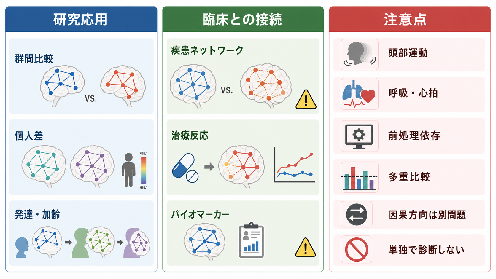
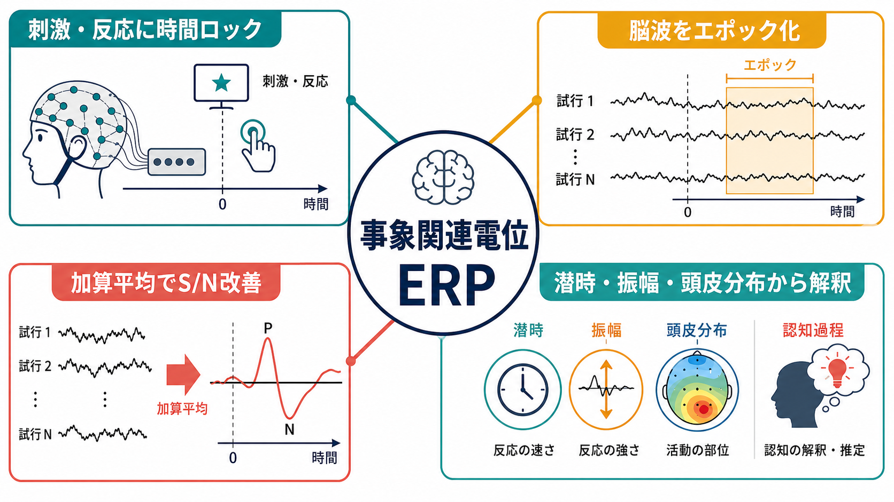

# 機能的結合解析とは何か

## 要点

- 機能的結合解析は、離れた脳領域の活動が時間的にどの程度一緒に変動するかを、相関、同期、相互情報量などで記述する方法である。
- fMRI では、BOLD 信号の低周波ゆらぎを使って安静時ネットワークや課題中ネットワークを推定することが多い[2][3]。
- 得られる「結合」は解剖学的な線維そのものではなく、統計的な共変動である。直接結合、因果方向、神経伝達の向きは自動的には分からない[1]。
- 頭部運動、呼吸・心拍、前処理、領域分割、統計的しきい値によって結果が大きく変わるため、解釈には注意が必要である[5][6][8]。

## この記事で答える問い

1. 機能的結合解析は、脳の何を測っているのか。
2. fMRI の時系列は、どのように相関行列やネットワークへ変換されるのか。
3. 機能的結合、構造的結合、[[有効結合とは何か|有効結合]]はどう違うのか。
4. 研究や臨床で使うとき、どのような限界を意識すべきか。

## まず結論

機能的結合解析は、脳領域どうしが「一緒に活動しているように見える度合い」を測る方法である。典型的には、複数の脳領域から時系列を取り出し、領域ペアごとの相関係数を計算し、相関行列やネットワークとして表す。この意味で、機能的結合は [[脳内ネットワークとは何か|脳内ネットワーク]] や [[コネクトームとは何か|機能的コネクトーム]] を記述する中心的な道具である。

ただし、機能的結合は「道路がある」ことではなく、「交通量が同じように増減している」ことに近い。2つの領域が高く相関していても、直接の白質線維があるとは限らないし、どちらがどちらを動かしているのかも分からない。共通入力、間接経路、覚醒度、呼吸、頭部運動、前処理の選択でも相関は変化する[1][5][6]。

## 背景

神経科学では長く、特定の刺激や課題に対してどの脳領域が活動するかが重視されてきた。しかし脳は、外から課題を与えられていない安静時にも持続的に活動している。Biswal らは、安静時 fMRI の低周波 BOLD 変動が左右の運動野などで相関することを示し、安静時の活動相関を「機能的結合」として読む道を開いた[2]。

その後、安静時 BOLD ゆらぎはランダムな雑音ではなく、既知の機能系や解剖学的システムと対応する大規模ネットワークを反映しうることが示されてきた[3]。Yeo らの大規模解析は、感覚運動系からデフォルトモード、前頭頭頂、サリエンス系に近い領域群まで、皮質上に再現性のある機能的ネットワーク境界が見えることを示した[4]。この流れは、[[サリエンスネットワークとは何か]] や [[スモールワールドネットワークとは何か]] のような大規模ネットワーク概念と密接に関係する。

## 基本概念

### 機能的結合

機能的結合とは、神経活動またはそれに関連する計測信号の間にみられる統計的依存関係である。fMRI では BOLD 信号、EEG/MEG では電位・磁場・周波数帯パワー・位相同期などが使われる。もっとも基本的な指標は相関係数であり、2つの領域の時系列を $x(t)$, $y(t)$ とすると、Pearson 相関係数は次のように表せる。

$$
r_{xy} = \frac{\sum_t (x_t - \bar{x})(y_t - \bar{y})}{\sqrt{\sum_t (x_t - \bar{x})^2}\sqrt{\sum_t (y_t - \bar{y})^2}}
$$

$r_{xy}$ が正なら同じ方向に変動しやすく、負なら逆方向に変動しやすい。ただし、負の相関はグローバル信号回帰などの前処理に強く依存するため、常に「生物学的な拮抗」と読めるわけではない[6]。

### 構造的結合・有効結合との違い

[[構造的結合と機能的結合は何が違うのか|構造的結合]]は、白質線維、シナプス、解剖学的経路のような物理的接続に関わる。機能的結合は、活動の共変動を表す。[[有効結合とは何か|有効結合]]は、ある領域が別の領域に及ぼす方向性のある影響を、動的因果モデリングなどのモデルで推定する概念である[1]。

| 種類 | 何を見るか | 代表的データ | 読み方の注意 |
|---|---|---|---|
| 構造的結合 | 解剖学的な経路 | 拡散 MRI、トレーサー、組織学 | 白質線維の推定はシナプス単位の接続ではない |
| 機能的結合 | 活動の共変動 | fMRI、EEG、MEG | 相関は直接結合や因果方向を意味しない |
| 有効結合 | 方向性のある影響 | DCM、Granger 型モデルなど | モデル仮定に強く依存する |

## 仕組み

機能的結合解析の基本手順は、次のように整理できる。

1. **データ取得**: 安静時 fMRI、課題 fMRI、EEG、MEG などで脳活動に関連する時系列を測定する。
2. **前処理**: fMRI では頭部運動補正、空間正規化、平滑化、ノイズ回帰、時間フィルタリングなどを行う。EEG/MEG ではアーチファクト除去、参照、フィルタリング、ソース推定などが問題になる。
3. **ノード定義**: 脳領域、ボクセル、電極、ソース空間の点、既存アトラスなどをノードとして定義する。
4. **時系列抽出**: 各ノードから代表時系列を取り出す。
5. **エッジ推定**: ノード間の相関、偏相関、コヒーレンス、位相同期、相互情報量などを計算する。
6. **ネットワーク評価**: 相関行列、グラフ、モジュール性、ハブ性、効率、クラスタリングなどを評価する。
7. **統計・予測**: 群間比較、発達・加齢変化、症状次元、行動指標、治療反応との関連を検討する。

この流れのどこか一つを変えるだけで、最終的なネットワークは変わりうる。特に領域分割、頭部運動処理、グローバル信号回帰、時系列の長さ、しきい値化、統計補正は、結果の再現性と解釈に直結する[5][6][8]。

## 図解

図1は、機能的結合解析を「脳活動データからネットワーク表現を作る」方法としてまとめている。図2は、領域ごとの時系列を取り出し、相関係数を計算し、結合の強さとして扱う基本メカニズムを示している。

図3は、機能的結合解析の応用と注意点を並べたものである。研究では、群間比較、個人差、発達、加齢、課題状態の変化を調べる。臨床研究では、疾患ネットワーク、治療反応、予後予測の候補指標として使われる。しかし、単一の機能的結合指標だけで個人の診断や治療方針を決めることはできない。

## 臨床・研究との接続

機能的結合解析は、疾患を単一領域の異常ではなくネットワークの変化として捉える枠組みを提供する。うつ病、統合失調症、自閉スペクトラム症、認知症、慢性疼痛、脳損傷などでは、安静時ネットワークや課題関連ネットワークの変化が研究されている。Craddock らは、機能的結合研究が認知・行動・精神医学的表現型との対応を探る「機能的コネクトミクス」として発展していることを整理している[7]。

ただし、臨床応用には段階がある。研究集団で差が出ること、独立データで再現すること、個人レベルで予測できること、臨床判断に上乗せ価値があることは別問題である。大規模神経画像データは発見力を高める一方で、多重比較、過学習、バッチ効果、サンプルの偏り、解析自由度によるリスクも増やす[8]。したがって、機能的結合指標は、診断名そのものの代替ではなく、症状次元、認知機能、発達歴、薬物、睡眠、身体状態、行動指標と組み合わせて読む必要がある。

教育・研究目的では、機能的結合解析は次の問いに有用である。

- ある課題や状態で、どのネットワークが強く結びつくか。
- 発達、加齢、学習、治療前後で、ネットワーク構造がどう変わるか。
- 個人差や症状の強さが、どのエッジやネットワーク指標と関連するか。
- 構造的結合、脳活動、行動をどう統合すれば、より説明力のあるモデルになるか。

## よくある誤解

### 誤解1: 機能的結合が高いなら、直接つながっている

機能的結合は活動の共変動であり、直接の白質線維やシナプス接続を示すものではない。2つの領域が同じ第三の領域から入力を受けていれば、直接つながっていなくても相関は高くなりうる。

### 誤解2: 相関があるなら、因果方向も分かる

相関だけでは、A が B を動かしているのか、B が A を動かしているのか、共通入力があるのかを区別できない。方向性のある影響を問うには、[[有効結合とは何か|有効結合]]や介入研究など、別の仮定とデザインが必要になる[1]。

### 誤解3: 前処理は細部なので結論に影響しない

頭部運動は、遠距離結合を弱く見せたり、近距離結合を強く見せたりするなど、系統的な偽相関を生みうる[5]。グローバル信号回帰も、負の相関やネットワーク境界の解釈に影響する[6]。前処理は単なる作業手順ではなく、結果の意味を決める分析上の選択である。

### 誤解4: 機能的結合は個人診断にそのまま使える

群平均で差がある指標でも、個人診断に十分な精度をもつとは限らない。臨床応用には、独立サンプルでの検証、交差検証の適切さ、外部妥当性、症状や治療反応への上乗せ説明力の確認が必要である[7][8]。

## 関連ノート

- [[脳内ネットワークとは何か]]
- [[コネクトームとは何か]]
- [[構造的結合と機能的結合は何が違うのか]]
- [[有効結合とは何か]]
- [[スモールワールドネットワークとは何か]]
- [[サリエンスネットワークとは何か]]

MOC更新候補: 並列ジョブ完了後に、`content/00_MOC/MOC｜脳・神経科学.md` の「fMRI・EEG・MEG・PET」または「大規模脳ネットワーク」関連項目へ本記事を追加する。

## 理解チェック

1. 機能的結合が「活動の共変動」であり、「解剖学的な線維結合そのもの」ではない理由を説明できるか。
2. 相関行列を作る前に、ノード定義と前処理を明示する必要があるのはなぜか。
3. 頭部運動は、機能的結合解析にどのような偽のパターンを作りうるか。
4. 機能的結合、有効結合、構造的結合の違いを、1つの具体例で説明できるか。
5. 臨床研究で「群差」と「個人診断」を分けて考えるべき理由を説明できるか。

## 未解決問題

- fMRI の BOLD 相関を、細胞・回路レベルの神経活動へどこまで対応づけられるか。
- 前処理パイプラインの違いを越えて再現する機能的結合指標をどう定義するか。
- 動的機能結合を、単なる推定ノイズではなく意味のある状態遷移としてどこまで扱えるか。
- 構造的結合、機能的結合、有効結合を統合した個人レベルの予測モデルをどう検証するか。

## 参考文献

[1] Friston, K. J. (2011). Functional and effective connectivity: a review. *Brain Connectivity*, 1(1), 13-36. https://doi.org/10.1089/brain.2011.0008

[2] Biswal, B., Yetkin, F. Z., Haughton, V. M., & Hyde, J. S. (1995). Functional connectivity in the motor cortex of resting human brain using echo-planar MRI. *Magnetic Resonance in Medicine*, 34(4), 537-541. https://doi.org/10.1002/mrm.1910340409

[3] Fox, M. D., & Raichle, M. E. (2007). Spontaneous fluctuations in brain activity observed with functional magnetic resonance imaging. *Nature Reviews Neuroscience*, 8, 700-711. https://doi.org/10.1038/nrn2201

[4] Yeo, B. T. T., Krienen, F. M., Sepulcre, J., Sabuncu, M. R., Lashkari, D., Hollinshead, M., Roffman, J. L., Smoller, J. W., Zollei, L., Polimeni, J. R., Fischl, B., Liu, H., & Buckner, R. L. (2011). The organization of the human cerebral cortex estimated by intrinsic functional connectivity. *Journal of Neurophysiology*, 106(3), 1125-1165. https://doi.org/10.1152/jn.00338.2011

[5] Power, J. D., Barnes, K. A., Snyder, A. Z., Schlaggar, B. L., & Petersen, S. E. (2012). Spurious but systematic correlations in functional connectivity MRI networks arise from subject motion. *NeuroImage*, 59(3), 2142-2154. https://doi.org/10.1016/j.neuroimage.2011.10.018

[6] Murphy, K., & Fox, M. D. (2017). Towards a consensus regarding global signal regression for resting state functional connectivity MRI. *NeuroImage*, 154, 169-173. https://doi.org/10.1016/j.neuroimage.2016.11.052

[7] Craddock, R. C., Tungaraza, R. L., & Milham, M. P. (2015). Connectomics and new approaches for analyzing human brain functional connectivity. *GigaScience*, 4, 13. https://doi.org/10.1186/s13742-015-0045-x

[8] Smith, S. M., & Nichols, T. E. (2018). Statistical challenges in "big data" human neuroimaging. *Neuron*, 97(2), 263-268. https://doi.org/10.1016/j.neuron.2017.12.018

## 更新ログ

- 2026-04-27: 初稿作成。機能的結合解析の基本概念、解析手順、図解、臨床・研究との接続、よくある誤解、参考文献を整理。
