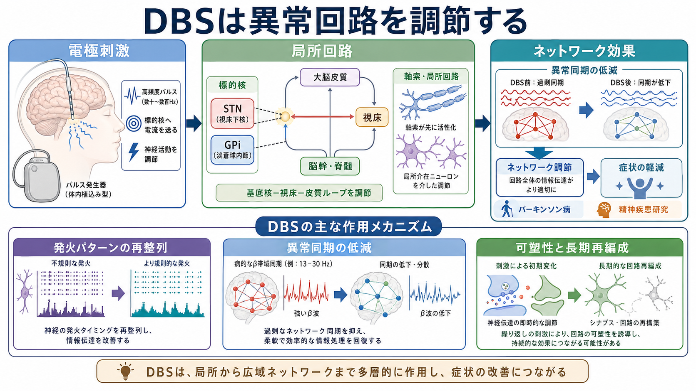
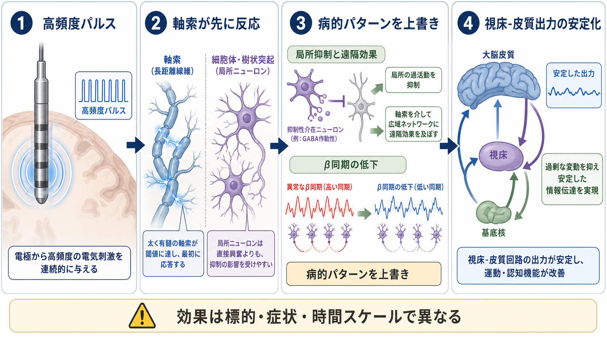
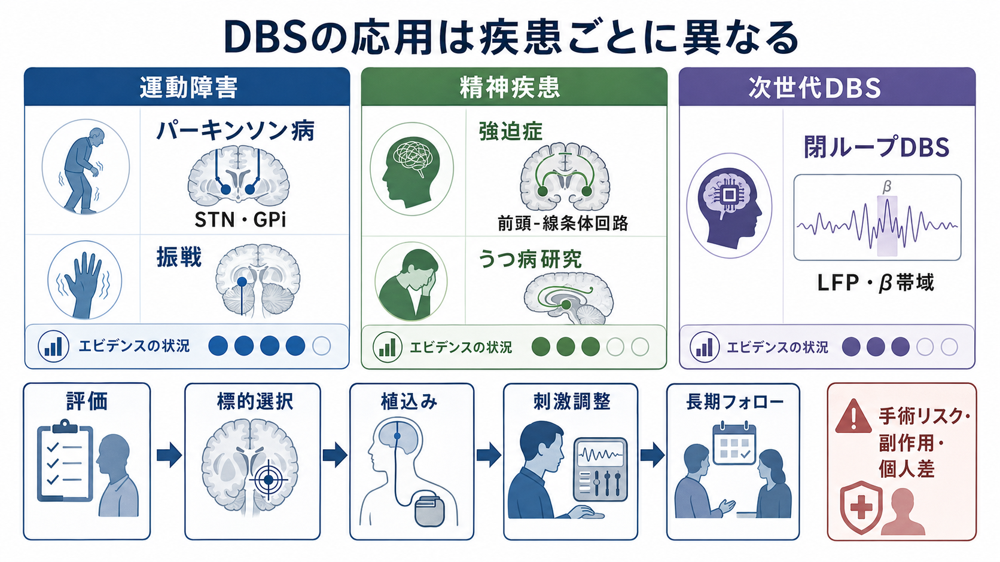

# 深部脳刺激DBSは神経回路をどう調節するのか

## 要点

- 深部脳刺激（deep brain stimulation; DBS）は、脳深部の標的に電極を置き、連続的な電気刺激で異常な回路活動を調節する治療・研究技術である。
- DBS は単純に「神経を興奮させる」治療ではない。軸索、局所ニューロン、抑制性介在ニューロン、標的核を通る遠隔回路を同時に変えるため、効果は多層的に現れる[1][2]。
- パーキンソン病では、視床下核（STN）や淡蒼球内節（GPi）への刺激が運動症状を改善しうることが、ランダム化試験で示されている[3][4]。
- 精神疾患では、強迫症に対する限定的な臨床応用と、うつ病などに対する研究段階の検討がある。ただし、個別の診断や治療適応をこの記事から判断することはできない[6][7][8]。

## この記事で答える問い

1. DBS は脳深部で何を刺激しているのか。
2. なぜ高頻度刺激で、異常な回路活動が弱まることがあるのか。
3. パーキンソン病と精神疾患では、DBS の位置づけはどう違うのか。
4. 閉ループDBSや画像・生理指標は、今後どのように関わるのか。

## まず結論

DBS は、脳の一部を「オン」にする装置というより、病的に固定された活動パターンをほどき、標的核を通る[[神経回路とは何か|神経回路]]全体の入出力を再調整する技術である。高頻度刺激は、局所の細胞体だけでなく軸索を強く動員し、標的核から離れた皮質、視床、基底核、辺縁系ネットワークにも影響を及ぼす[1][2]。

重要なのは、DBS の効果が単一の機序に還元できない点である。短期的には発火パターンや同期の変化、長期的には可塑性、刺激設定、薬物療法、症状ネットワークの再編成が重なる。したがって、DBS は「どこを刺激するか」だけでなく、「どの回路を、どの時間スケールで、どの症状に対して調節するか」として理解する必要がある[1][2]。

## 背景

DBS は、電極、延長リード、胸部や腹部に置かれるパルス発生器から構成される。刺激の標的は疾患や症状によって異なり、パーキンソン病では STN や GPi、振戦では視床腹中間核、強迫症では内包前脚、側坐核、腹側線条体などが研究・臨床で扱われてきた[2][6][7]。

DBS が注目される理由は、薬物で十分に制御できない症状に対し、可逆的かつ調整可能な介入を提供できるからである。刺激強度、周波数、パルス幅、接点の組み合わせを変えることで、効果と副作用のバランスを調整できる。一方で、手術リスク、感染、出血、電極位置、認知・気分への影響、長期管理の負担があり、適応判断は専門チームで行われる[2]。

## 基本概念

### 標的核と症状ネットワーク

DBS の標的は、症状を生み出す単独の「原因部位」とは限らない。むしろ、標的核は症状に関わる[[脳内ネットワークとは何か|脳内ネットワーク]]の交通の要所として理解しやすい。たとえば STN は、[[大脳基底核ループとは何か|大脳基底核ループ]]の中で、運動の選択、抑制、切り替えに関わる位置にある。ここを刺激すると、局所だけでなく皮質-基底核-視床-皮質ループの活動が変わる。

精神疾患で議論される DBS も同じである。強迫症では、前頭前野、線条体、視床を結ぶ回路の過剰な固定化や柔軟性低下が焦点になる。うつ病研究では、帯状皮質、内側前頭前野、扁桃体、線条体、視床下部などを含む気分調節ネットワークが問題になる。ただし、これらは研究上の回路仮説であり、症状を一つの部位に閉じ込める説明ではない[6][8]。

### 何が刺激されるのか

電極刺激では、電場の広がり、組織の導電性、電極接点の形状、刺激設定によって、どの要素が動員されるかが変わる。一般に、軸索は細胞体よりも刺激に反応しやすい場合があり、DBS の効果は「電極近くの細胞を黙らせる」だけでは説明できない[1]。

この点が重要である。局所の発火が抑えられて見える場合でも、同じ刺激が通過線維を活性化し、遠隔の皮質や視床に規則的な入力を送っていることがある。つまり DBS は、局所抑制と遠隔活性化を同時に起こしうる。

## 仕組み

### 高頻度刺激は病的パターンを上書きする

パーキンソン病では、基底核-視床-皮質回路でβ帯域の過剰な同期やバースト活動が問題になることがある。DBS はこの同期を単に「消す」というより、より規則的で情報伝達を妨げにくいパターンへ回路出力を変えると考えられている[1][5]。

この説明は「ジャミング仮説」と呼ばれることもある。病的に固定されたリズムやバーストが、連続的な高頻度刺激によって上書きされ、視床や皮質へ届く出力が安定する、という考え方である。ただし、DBS の機序はこれだけではない。神経伝達物質、グリア、局所血流、可塑性、刺激後の長期的再編成も関与しうる[1][2]。

### 刺激は時間スケールごとに違う効果を持つ

DBS の効果は、秒単位、分単位、週から月単位で異なる。たとえば刺激を入れると振戦が短時間で変わることがある一方、歩行、姿勢、気分、認知、習慣化された行動パターンでは、調整や長期フォローが必要になることがある。

この違いは、[[神経可塑性は発達と学習をどう支えるのか|神経可塑性]]の観点からも理解できる。短期的な発火パターンの変化が、繰り返し刺激と行動経験を通じて、シナプス効率やネットワーク構成の変化へつながる可能性がある。ただし、長期効果をどの程度予測できるかは、疾患、標的、刺激条件によって異なる[2]。

### 閉ループDBS

従来の DBS は、あらかじめ設定した刺激を持続的に出す開ループ型が中心だった。これに対し、閉ループDBSは、局所フィールド電位（LFP）やβ帯域活動などを読み取り、症状に関係する状態が出たときだけ刺激を調整する。パーキンソン病では、β帯域の指標を用いた適応型DBSが、従来刺激より効率的に症状を抑えうることが示されている[5]。

閉ループ化の意義は、刺激を「常に強く入れる」方向ではなく、必要なときに必要なだけ介入する方向へ進める点にある。これは、[[有効結合とは何か|有効結合]]や[[機能的結合解析とは何か|機能的結合解析]]で扱う、回路状態の推定とも接続する。

## 図解

1枚目は、電極刺激、標的核、局所回路、広域ネットワーク、症状軽減を一つの流れとして整理している。2枚目は、DBS が軸索、局所抑制、β同期、視床-皮質出力へ及ぼす多層的効果を示す。3枚目は、疾患ごとの応用、エビデンスの違い、閉ループDBS、評価から長期フォローまでの流れをまとめている。

## 臨床・研究との接続

### パーキンソン病

パーキンソン病に対する DBS は、運動合併症や薬効変動が問題になる患者で検討される代表的応用である。STN 刺激は薬物量を減らしやすい一方で、認知・気分・発語などへの影響を慎重に評価する必要がある。GPi 刺激はジスキネジア制御や副作用プロファイルの点で選ばれることがある。どちらがよいかは単純な優劣ではなく、症状、年齢、認知機能、精神症状、生活目標によって変わる[3][4]。

ランダム化試験では、適切に選択されたパーキンソン病患者に対して DBS が運動症状や生活の質を改善しうることが示された[3][4]。ただし、DBS は病気そのものを止める治療ではない。進行に伴う歩行障害、認知症、自律神経症状、発語・嚥下の問題には限界があり、薬物療法やリハビリテーションと組み合わせて考える必要がある。

### 精神疾患

精神疾患への DBS は、運動障害より慎重な位置づけにある。強迫症では、重症で治療抵抗性の症例に対して、前頭-線条体回路を標的にした DBS が一部で臨床応用・研究されている[6][7]。ここでの考え方は、強迫観念や儀式行為を「意志の弱さ」ではなく、行動選択や価値づけが固定化した回路状態として捉える点にある。

うつ病への DBS は、より研究段階の色合いが強い。初期研究では有望な結果も報告されたが、多施設ランダム化試験では主要評価項目を満たさなかった研究もあり、標的選択、患者選択、ネットワーク個別化、刺激調整の難しさが示された[8]。したがって、うつ病に対する DBS は、一般的治療として安易に語るべきではない。

## よくある誤解

### 誤解1: DBS は脳の悪い部分を止める治療である

DBS は、標的核を単純に停止させる治療ではない。軸索を介した遠隔効果、局所抑制、発火パターンの再整列、同期の低下などが重なり、回路全体の情報伝達を変える[1]。

### 誤解2: 電極の位置が同じなら効果も同じである

同じ標的名でも、電極接点の位置、刺激の向き、白質線維との関係、症状ネットワークは個人差が大きい。近年は、画像、電気生理、症状評価を組み合わせて、より個別化した標的設定を目指す方向へ進んでいる[2]。

### 誤解3: 精神疾患のDBSは性格や意思を直接変える

精神疾患への DBS は、人格を直接操作するというより、症状に関わる回路の反応性や行動選択の固定化を調整しようとする研究・治療である。ただし、気分、衝動性、認知、自己感に関わる回路を扱うため、倫理的評価と長期フォローが特に重要である。

### 誤解4: DBS は最後の万能治療である

DBS は強力な選択肢になりうるが、万能ではない。手術適応、症状の種類、併存症、期待される利益、リスク、長期管理の体制がそろって初めて検討される。この記事は教育・研究目的の説明であり、個別の診断や治療指示ではない。

## 関連ノート

- [[大脳基底核ループとは何か]]
- [[神経回路とは何か]]
- [[脳内ネットワークとは何か]]
- [[有効結合とは何か]]
- [[構造的結合と機能的結合は何が違うのか]]
- [[機能的結合解析とは何か]]
- [[神経同期とは何か]]
- [[神経可塑性は発達と学習をどう支えるのか]]

MOC更新候補: `content/00_MOC/MOC｜脳・神経科学.md`、`content/00_MOC/MOC｜臨床実践・治療.md` に、脳刺激・神経調節・神経回路介入のノートとして追加する。

今後の作成候補: 「閉ループDBSとは何か」「TMSとDBSは何が違うのか」「パーキンソン病と基底核回路」「強迫症の前頭線条体回路」「治療抵抗性うつ病の神経回路仮説」。

## 理解チェック

1. DBS が「単なる興奮」や「単なる抑制」では説明しにくい理由は何か。
2. STN や GPi がパーキンソン病の DBS 標的になるのは、どの回路に関わるからか。
3. β同期の低下は、DBS の効果を考えるうえでなぜ重要なのか。
4. 強迫症やうつ病への DBS を、運動障害への DBS と同じ確実性で語れない理由は何か。
5. 閉ループDBSが、従来の開ループ刺激と異なる点は何か。

## 参考文献

[1] Herrington, T. M., Cheng, J. J., & Eskandar, E. N. (2016). Mechanisms of deep brain stimulation. *Journal of Neurophysiology, 115*(1), 19-38. https://doi.org/10.1152/jn.00281.2015

[2] Lozano, A. M., Lipsman, N., Bergman, H., Brown, P., Chabardes, S., Chang, J. W., Matthews, K., McIntyre, C. C., Schlaepfer, T. E., Schulder, M., Temel, Y., Volkmann, J., & Krauss, J. K. (2019). Deep brain stimulation: current challenges and future directions. *Nature Reviews Neurology, 15*, 148-160. https://doi.org/10.1038/s41582-018-0128-2

[3] Deuschl, G., Schade-Brittinger, C., Krack, P., et al. (2006). A randomized trial of deep-brain stimulation for Parkinson's disease. *New England Journal of Medicine, 355*(9), 896-908. https://doi.org/10.1056/NEJMoa060281

[4] Weaver, F. M., Follett, K., Stern, M., et al. (2009). Bilateral deep brain stimulation vs best medical therapy for patients with advanced Parkinson disease: a randomized controlled trial. *JAMA, 301*(1), 63-73. https://doi.org/10.1001/jama.2008.929

[5] Little, S., Pogosyan, A., Neal, S., et al. (2013). Adaptive deep brain stimulation in advanced Parkinson disease. *Annals of Neurology, 74*(3), 449-457. https://doi.org/10.1002/ana.23951

[6] Denys, D., Mantione, M., Figee, M., et al. (2010). Deep brain stimulation of the nucleus accumbens for treatment-refractory obsessive-compulsive disorder. *Archives of General Psychiatry, 67*(10), 1061-1068. https://doi.org/10.1001/archgenpsychiatry.2010.122

[7] U.S. Food and Drug Administration. Humanitarian Device Exemption (HDE): deep brain stimulation for obsessive-compulsive disorder. https://www.fda.gov/medical-devices/humanitarian-device-exemption-hde

[8] Holtzheimer, P. E., Husain, M. M., Lisanby, S. H., et al. (2017). Subcallosal cingulate deep brain stimulation for treatment-resistant depression: a multisite, randomised, sham-controlled trial. *The Lancet Psychiatry, 4*(11), 839-849. https://doi.org/10.1016/S2215-0366(17)30371-1
