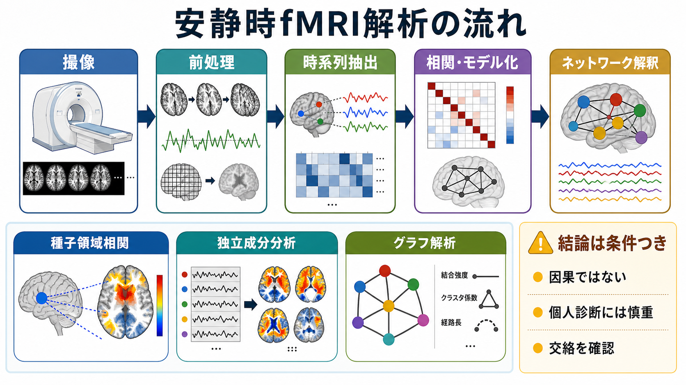
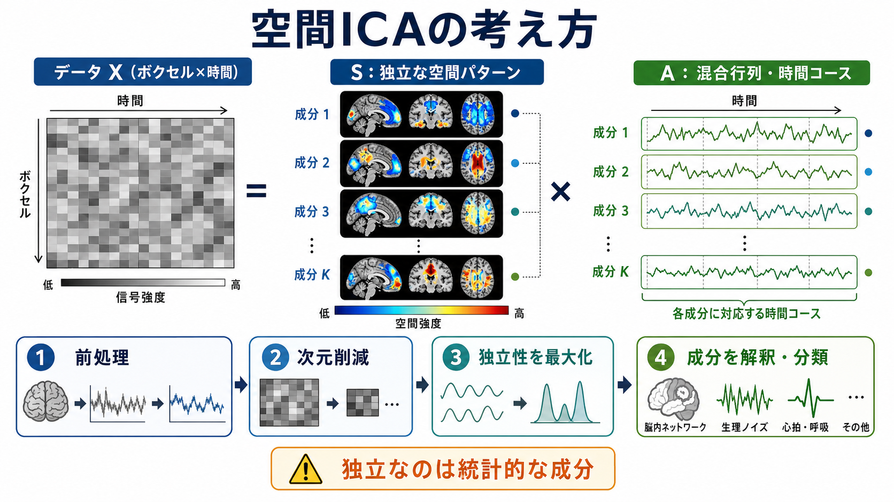
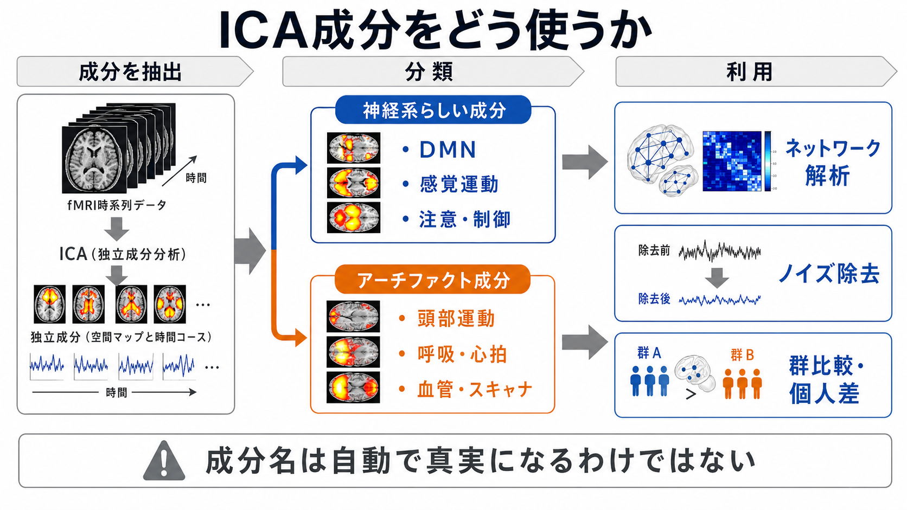

# 独立成分分析ICAはfMRIでどう使われるのか

## 要点

- 独立成分分析（independent component analysis; ICA）は、fMRI の 4D データを、複数の**空間マップ**とそれぞれに対応する**時間コース**へ分解するデータ駆動型の方法である[1][2]。
- fMRI では、神経活動に関連する大規模ネットワークだけでなく、頭部運動、呼吸、心拍、血管性変動、スキャナ由来のアーチファクトも同じ BOLD 時系列に混ざる。ICA は、この混合信号を成分として分けて眺めるために使われる[2][6]。
- ICA 成分は「発見された真の脳部位」ではない。統計的に分離されたパターンであり、空間分布、時間コース、周波数、解剖学的位置、実験課題、前処理を合わせて解釈する必要がある[3][6]。
- 安静時 fMRI では、デフォルトモードネットワーク、感覚運動ネットワーク、視覚ネットワークなどの再現性あるネットワーク同定に使われてきた[4][5]。
- 前処理では、ICA-FIX や ICA-AROMA のように、ICA 成分を分類してノイズ成分を除去する方法も広く使われる[6][7]。

## この記事で答える問い

1. ICA は fMRI データを何に分解しているのか。
2. 空間 ICA と時間 ICA はどう違い、fMRI ではなぜ空間 ICA がよく使われるのか。
3. ICA 成分から、脳ネットワークとノイズをどう見分けるのか。
4. ICA は研究・臨床応用の解釈でどこまで使えるのか。

## まず結論

fMRI における ICA は、BOLD 信号の中に混ざった複数の変動源を、**「どこで出ているか」を表す空間マップ**と、**「いつ強く出ているか」を表す時間コース**に分ける方法である。一般的な空間 ICA では、各成分の空間パターンができるだけ統計的に独立になるように分解する[2][3]。

この性質により、ICA は2つの場面で特に役立つ。第一に、安静時 fMRI から [[デフォルトモードネットワークとは何か|デフォルトモードネットワーク]] や感覚運動ネットワークのような大規模ネットワークを、事前に「種子領域」を決めずに抽出できる。第二に、頭部運動や呼吸・心拍などのアーチファクト成分を見つけ、データから取り除く前処理に使える[3][6][7]。

ただし、ICA は「脳の真の部品表」を自動的に返す装置ではない。成分数、前処理、被験者数、分類ルール、解析ソフトウェアによって結果は変わる。したがって、ICA の結果は [[構造的結合と機能的結合は何が違うのか|機能的結合]] や [[脳内ネットワークとは何か|脳内ネットワーク]] の理解を助ける道具として読み、単独で認知機能や疾患を断定しないことが重要である。

## 背景

fMRI は、神経活動そのものではなく、血流・酸素化の変化に由来する BOLD 信号を測る。BOLD 信号は数秒単位でゆっくり変化し、神経活動、血管反応、呼吸、心拍、頭部運動、スキャナノイズなどが重なった時系列として観測される。このため、単純にボクセルごとの時系列を見るだけでは、どの変動が目的の神経活動に近いのかを判断しにくい。

従来の課題 fMRI では、実験者が「刺激を出した時刻」や「課題条件」をモデルとして与え、一般線形モデルで課題関連活動を推定することが多い。一方、安静時 fMRI では明確な課題時系列がない。そこで、データ自身の中から繰り返し現れるパターンを探索する方法が必要になる。ICA はこの文脈で、モデルを先に強く指定しない探索的手法として発展した[2][3]。

MELODIC などの実装では、単一セッション、複数セッション、複数被験者データを、空間マップ、時間コース、場合によっては被験者・セッション方向の成分へ分解する。FSL の説明でも、ICA は 4D fMRI データを空間成分と時間成分へ分け、活性化成分とアーチファクト成分を、明示的な時系列モデルなしに拾える方法として位置づけられている[3]。

## 基本概念

### ICA が仮定すること

ICA の基本発想は、「観測された多変量データは、複数の隠れた信号源が混ざったものだ」と考え、その信号源をできるだけ互いに独立な成分として復元することである。古典的な説明では、複数のマイクで録音した混合音から、話者ごとの声を分ける「カクテルパーティ問題」に近い[1]。

fMRI では、観測される各ボクセル時系列が、複数の空間的・時間的成分の重ね合わせだと考える。単純化して書くと、

$$
X \approx A S
$$

である。ここで \(X\) は観測データ、\(S\) は独立成分、\(A\) はそれらがどの程度混ざっているかを表す混合行列である。空間 ICA の文脈では、各成分は「空間マップ」と「対応する時間コース」の組として解釈される[2][3]。

### 空間 ICA と時間 ICA

fMRI では多くの場合、時間点数よりボクセル数の方がはるかに多い。そこで、実践的には**空間 ICA**がよく使われる。空間 ICA では、成分どうしの空間パターンができるだけ独立になるように分解し、各成分について時間コースを推定する。

時間 ICA では、時間コースどうしが独立になるように分解する。理論上は有用だが、fMRI では時間点数が限られやすく、空間 ICA の方が標準的に使われることが多い。どちらも「神経活動とノイズを完全に分離する」方法ではなく、独立性という統計的基準に基づく分解である。

### PCA との違い

主成分分析（PCA）は、分散を大きく説明する直交成分を見つける。ICA は、直交性ではなく、成分間の統計的独立性を重視する。実際の fMRI ICA では、まず PCA などで次元削減してから ICA を行うことが多い[2][3]。

この違いは解釈に効く。PCA の第一主成分は「最大分散方向」だが、それが脳ネットワークやノイズ源として意味のある単位とは限らない。ICA は、分散の大きさだけでなく、非ガウス性や独立性を利用して、より解釈しやすい成分を得ようとする[1]。

## 仕組み

### 1. 前処理する

ICA の前には、通常の fMRI 前処理が必要である。例として、スライスタイミング補正、頭部運動補正、空間正規化、脳マスク、平滑化、ドリフト除去などが含まれる。どの前処理を行うかは、ICA の成分構造に影響する。たとえば、強い平滑化は空間パターンを広げ、モーション補正や高域・低域フィルタは時間コースの特徴を変える。

### 2. 4D データを行列として扱う

fMRI データは、3次元脳画像が時間方向に並んだ 4D データである。ICA ではこれを、概念的には「ボクセル × 時間」または「時間 × ボクセル」の行列として扱う。各ボクセルの時系列には、脳活動らしい変動、呼吸・心拍、頭部運動、ドリフト、スキャナ由来の変動が混ざっている。

### 3. 次元削減する

全ボクセルをそのまま扱うと計算量が大きく、ノイズも多い。そのため、多くの実装では PCA や確率的 PCA により、有効な次元数を推定し、データを低次元空間へ写す。PICA は、この次元推定とノイズモデルを組み込んだ fMRI 向けの確率的 ICA 枠組みとして提案された[2]。

### 4. 独立性を最大化する

次元削減後、ICA アルゴリズムは、成分どうしができるだけ独立になるような回転・変換を探す。独立性は、非ガウス性、相互情報量、尤度などの形で定式化される。得られるものは、各成分の空間マップ、時間コース、パワースペクトル、説明分散などである。

### 5. 成分を解釈・分類する

最後に、成分を見て、神経系らしい成分か、アーチファクト成分か、判断が難しい成分かを分類する。神経系らしい成分は、灰白質に沿ったまとまり、既知のネットワークとの一致、低周波の BOLD 変動、課題条件との関係などを持つことが多い。アーチファクト成分は、脳外・辺縁部・血管・脳室・白質に偏る、突然のスパイクがある、頭部運動パラメータや呼吸・心拍と関連する、高周波成分が強い、といった特徴を示すことがある[3][6][7]。

## 図解

### ICA の出力を読む最小単位

ICA の各成分は、少なくとも次の3点をセットで読む。

| 見るもの | 意味 | 解釈の例 |
|---|---|---|
| 空間マップ | どのボクセル群で同じ成分が強いか | DMN、感覚運動ネットワーク、脳室周辺ノイズ、血管性成分 |
| 時間コース | その成分が時間的にどう変動したか | 課題に同期、低周波揺らぎ、突発的スパイク、運動と同期 |
| 周波数・外部指標との関係 | 生理・運動・課題との対応 | 呼吸・心拍、頭部運動、刺激時系列、行動指標との関連 |

重要なのは、空間マップだけで成分名を決めないことである。見た目がネットワークらしくても、時間コースが運動や生理ノイズと強く結びつく場合がある。逆に、ノイズに見える成分の中に、解析目的によっては意味のある生理情報が含まれることもある。

### ICA 成分の典型的な分類

| 成分の種類 | 典型的な特徴 | 扱い方 |
|---|---|---|
| 脳ネットワーク成分 | 灰白質に沿う、左右対称性がある、既知ネットワークに似る | ネットワーク解析、群比較、個人差解析に使う |
| 課題関連成分 | 時間コースが課題デザインや反応に関連する | GLM と併用して、モデル外の反応も探索する |
| 頭部運動成分 | 脳辺縁部、縞状パターン、急なスパイク、運動パラメータとの相関 | ノイズ除去候補 |
| 呼吸・心拍成分 | 血管・脳室・脳幹周辺、周期性、周波数特徴 | 生理ノイズとして扱うことが多い |
| スキャナ・再構成由来成分 | スライス状、ゴースト、視野外構造 | 原則としてアーチファクト候補 |

## 臨床・研究との接続

### 安静時ネットワークの同定

安静時 fMRI では、被験者が明示的な課題をしていない間にも、BOLD 信号にゆっくりした共変動が見られる。ICA はこの共変動を、複数のネットワーク成分として抽出するために使われる。Damoiseaux らは、健常者間で再現性のある安静時ネットワークを ICA により示し、DMN、視覚、感覚運動、注意関連ネットワークなどの理解を進めた[4]。

この流れは [[コネクトームとは何か|機能的コネクトーム]] や [[グラフ理論は脳ネットワーク解析にどう使われるのか|グラフ理論による脳ネットワーク解析]] とも接続する。ICA で抽出したネットワークをノード候補として使い、成分間の相関や時間変動を調べることで、全脳ネットワークの構造を評価できる。

### 課題 fMRI での探索的解析

課題 fMRI では、GLM が「事前に指定した時間モデル」に強い。一方、ICA は、予想していなかった反応、遅延のある反応、複数のネットワークが重なった反応、ノイズ成分を探索するのに向く。したがって、ICA は GLM の代替というより、GLM で見える効果の背景にある成分構造を調べる補助線として使うと理解しやすい。

### ノイズ除去

fMRI 解析では、頭部運動が特に大きな問題である。運動は、見かけの機能的結合や群差を作りうる。ICA-FIX は、ICA 成分から多数の特徴を抽出し、手動ラベルに基づいて分類器を学習してノイズ成分を除去する方法である[6]。ICA-AROMA は、頭部運動アーチファクトに焦点を当て、少数の空間・時間特徴からモーション関連成分を自動分類する方法として提案された[7]。

ただし、ノイズ除去は強ければ強いほどよいわけではない。神経活動に関連する成分まで除去すると、目的の信号を失う。反対に、ノイズ成分を残すと、偽の結合や偽の群差が生じる。したがって、研究目的、データ品質、被験者群、前処理パイプラインに応じて、除去前後の品質確認が必要である。

### 臨床研究での注意

ICA は、疾患群と健常群のネットワーク差、発達・加齢、薬物反応、治療前後変化の研究に使われる。しかし、ICA 成分の違いは、診断名そのものではない。群差には、頭部運動、薬物、睡眠、覚醒度、呼吸、撮像条件、サンプル構成が影響する。個人の診断や治療方針を ICA 成分だけで決めることはできない。

医療・精神医学に関わる読み方としては、「研究で観察されたネットワーク差」と「臨床現場での個別判断」を分ける必要がある。ICA は、仮説生成、バイオマーカー候補の探索、機序理解には有用だが、単独検査として確定診断を与えるものではない。

## よくある誤解

### 誤解1: ICA 成分は脳の自然な部品である

ICA 成分は、統計モデルと前処理から得られる分解である。脳の解剖学的部品そのものではない。再現性の高い成分がある一方で、成分数、アルゴリズム、データ品質に依存する部分もある。

### 誤解2: ICA はノイズと信号を自動で完全に分ける

ICA は候補成分を出すが、どれが神経活動でどれがノイズかは、追加の解釈・分類が必要である。FSL の MELODIC FAQ でも、モデルフリーであるため、どの IC がアーチファクトかを自動的に決める一般的な方法はなく、実験知識と標準的なアーチファクト理解が必要だと説明されている[3]。

### 誤解3: ICA はシードベース解析より常に優れている

ICA は事前に種子領域を決めない探索に強い。一方、特定領域と他領域の関係を仮説検証したい場合には、シードベース解析の方が直感的で解釈しやすいことがある。問いが「既知領域の結合を検証したい」のか、「データからネットワーク候補を抽出したい」のかで使い分ける。

### 誤解4: 成分数は多いほどよい

成分数を増やすと、細かいサブネットワークやノイズ源を分けやすくなるが、過分割や解釈困難も増える。成分数を減らすと大きなネットワークは見やすいが、異なる信号源が混ざる。成分数は、研究目的、時間点数、被験者数、ノイズ水準に依存する解析上の選択である。

### 誤解5: ICA で見つかったネットワーク差は因果を意味する

ICA は共変動パターンを分解する方法であり、因果方向を直接推定する方法ではない。ネットワーク間の影響方向を問うには、有効結合モデル、縦断研究、介入研究、実験操作など、別の設計が必要である。

## 関連ノート

- [[デフォルトモードネットワークとは何か]]
- [[構造的結合と機能的結合は何が違うのか]]
- [[脳内ネットワークとは何か]]
- [[コネクトームとは何か]]
- [[グラフ理論は脳ネットワーク解析にどう使われるのか]]
- [[神経回路のノイズは情報処理にどう影響するのか]]
- [[T1強調画像とT2強調画像は何が違うのか]]
- [[FA値とは何か]]

## 理解チェック

1. fMRI の空間 ICA で、各成分は何と何の組として読まれるか。
2. ICA が GLM と違って、事前の課題時系列を必ずしも必要としない理由は何か。
3. 神経系らしい ICA 成分と頭部運動成分を見分けるとき、空間マップ以外に何を確認すべきか。
4. ICA-FIX や ICA-AROMA は、ICA 成分をどのような目的で使う方法か。
5. ICA 成分の群差を、個人診断として読んではいけない理由は何か。

## MOC更新候補

- `content/00_MOC/MOC｜脳・神経科学.md` の「脳画像・神経計測」付近に追加候補。
- 将来的に `MOC｜脳画像・神経計測` を作る場合、fMRI 解析、安静時ネットワーク、前処理、ノイズ除去をつなぐ入口ノートとして配置候補。

## 未解決問題

- ICA 成分の「神経系らしさ」を、手動評価、分類器、外部生理記録、再現性指標を組み合わせてどこまで標準化できるか。
- 成分数の選択が、群差、個人差、疾患ネットワークの解釈にどの程度影響するか。
- ICA によるノイズ除去が、微弱だが意味のある神経信号をどの程度削っているか。
- 安静時ネットワーク成分と課題中ネットワーク成分を、同じ成分空間でどこまで比較できるか。

## 参考文献

[1] Hyvärinen, A., & Oja, E. (2000). Independent component analysis: Algorithms and applications. *Neural Networks*, 13(4-5), 411-430. https://doi.org/10.1016/S0893-6080(00)00026-5

[2] Beckmann, C. F., & Smith, S. M. (2004). Probabilistic independent component analysis for functional magnetic resonance imaging. *IEEE Transactions on Medical Imaging*, 23(2), 137-152. https://doi.org/10.1109/TMI.2003.822821

[3] FSL Documentation. MELODIC: Multivariate Exploratory Linear Optimized Decomposition into Independent Components. https://fsl.fmrib.ox.ac.uk/fsl/docs/resting_state/melodic.html

[4] Damoiseaux, J. S., Rombouts, S. A. R. B., Barkhof, F., Scheltens, P., Stam, C. J., Smith, S. M., & Beckmann, C. F. (2006). Consistent resting-state networks across healthy subjects. *Proceedings of the National Academy of Sciences*, 103(37), 13848-13853. https://doi.org/10.1073/pnas.0601417103

[5] Calhoun, V. D., & Adalı, T. (2012). Multi-subject independent component analysis of fMRI: A decade of intrinsic networks, default mode, and neurodiagnostic discovery. *IEEE Reviews in Biomedical Engineering*, 5, 60-73. https://doi.org/10.1109/RBME.2012.2211076

[6] Salimi-Khorshidi, G., Douaud, G., Beckmann, C. F., Glasser, M. F., Griffanti, L., & Smith, S. M. (2014). Automatic denoising of functional MRI data: Combining independent component analysis and hierarchical fusion of classifiers. *NeuroImage*, 90, 449-468. https://doi.org/10.1016/j.neuroimage.2013.11.046

[7] Pruim, R. H. R., Mennes, M., van Rooij, D., Llera, A., Buitelaar, J. K., & Beckmann, C. F. (2015). ICA-AROMA: A robust ICA-based strategy for removing motion artifacts from fMRI data. *NeuroImage*, 112, 267-277. https://doi.org/10.1016/j.neuroimage.2015.02.064
