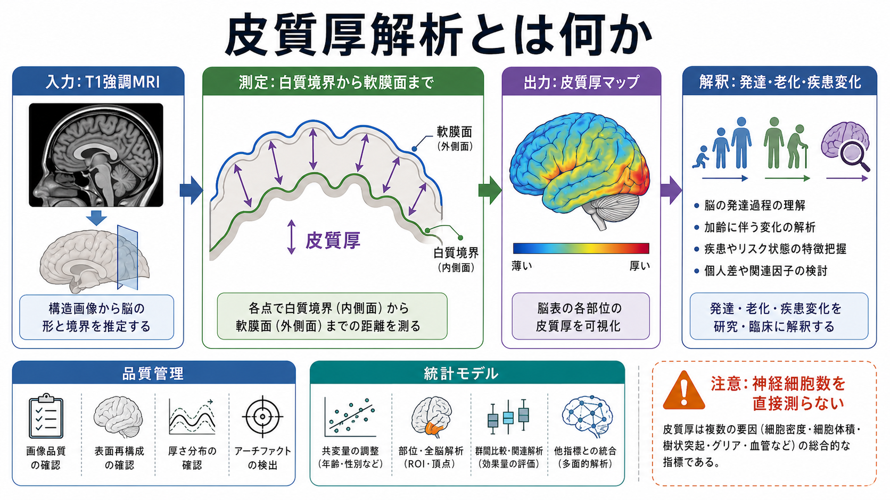
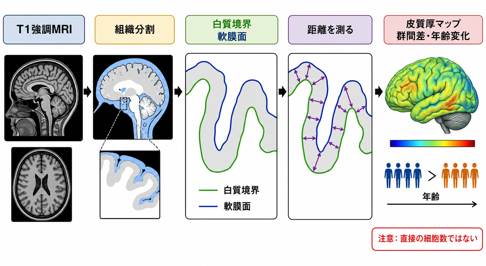

# 皮質厚解析とは何か

## 要点

- 皮質厚解析は、主にT1強調MRIから大脳皮質の内側境界である白質境界と、外側境界である軟膜面を推定し、その間の距離を測る形態解析である。
- 皮質は強く折りたたまれているため、単純な断面上の直線距離ではなく、皮質表面を再構成して測ることが重要になる[1][2]。
- 皮質厚は発達、老化、神経変性、精神疾患、治療経過、遺伝・環境要因との関連を調べる研究指標としてよく使われる[5][6][7]。
- 皮質が薄いことは、神経細胞数の減少や機能低下を直接意味しない。細胞密度、樹状突起、シナプス、グリア、髄鞘、血管、細胞外空間、画像処理誤差などが混ざったマクロな推定量である。
- 多施設研究や縦断研究では、スキャナ、撮像条件、前処理、品質管理、統計モデルの影響が大きいため、調和化と慎重な解釈が必要である[4][8]。

## この記事で答える問い

この記事では、皮質厚解析を「脳の皮質が何mmかを測る作業」としてだけではなく、[[構造MRIは脳の何を測っているのか|構造MRI]]の信号からどのように皮質表面を作り、どのような研究・臨床的問いに接続し、どこで誤解が起こりやすいのかを整理する。

中心に置くのは、FreeSurferなどで代表される表面ベースの皮質厚解析である。Voxel-based morphometry（VBM）や灰白質体積解析とも近いが、皮質厚解析は「体積」ではなく「厚み」と「表面」を分けて扱う点に特徴がある[2][3]。

## まず結論

皮質厚解析とは、T1強調MRIから大脳皮質の白質側境界と軟膜側境界を推定し、その間の距離を皮質表面上の各点または脳領域ごとに要約する方法である。代表的な実装では、脳画像の前処理、組織分割、白質表面の再構成、軟膜面の推定、皮質表面の位置合わせ、領域ごとの平均厚や頂点ごとの統計解析が行われる[1][2][3]。

この方法が重要なのは、大脳皮質が薄く、折りたたまれ、脳回・脳溝の形が個人ごとに違うからである。皮質厚を測るには、画像上の1断面で物差しを当てるだけでは足りない。皮質を2次元の曲面として扱い、白質境界から軟膜面までの距離を、脳の折りたたみを考慮して推定する必要がある[1][2]。

ただし、皮質厚は「神経細胞の数」でも「知能の量」でも「疾患の診断名」でもない。研究では、群間差、年齢変化、疾患関連パターン、症状や認知機能との関連を調べる指標であり、個別の診断や治療指示は画像だけで決められない。

## 背景

大脳皮質は、灰白質を主体とする薄いシート状の構造で、脳回と脳溝として複雑に折りたたまれている。皮質厚は成人でおおむね数mm程度のスケールであり、MRIのボクセルサイズや部分容積効果の影響を受けやすい。したがって、[[T1強調画像とT2強調画像は何が違うのか|T1強調画像]]から見える灰白質・白質・脳脊髄液のコントラストを利用し、組織境界をモデル化する必要がある。

1990年代後半から、皮質表面を明示的に再構成するsurface-based analysisが発展した。Dale、Fischl、Serenoの方法論は、個人の皮質表面を再構成し、折りたたまれた皮質を表面として扱う基盤を作った[1]。続くFischlとDaleの研究は、白質境界と軟膜面の間の距離として皮質厚を自動的に測る枠組みを提示し、全皮質にわたる厚み推定と群統計を可能にした[2]。

現在では、FreeSurferなどのソフトウェアが、T1強調画像から皮質厚、表面積、皮質分割、皮質下構造の体積などを自動推定する標準的な道具として使われている[3]。この意味で皮質厚解析は、[[脳画像とは何を見ているのか|脳画像]]を「見た目」から「測定可能な形態指標」へ変換する代表例である。

## 基本概念

### 白質境界と軟膜面

皮質厚解析でいう白質境界は、皮質灰白質と白質の境界である。軟膜面は、皮質灰白質の外側、脳脊髄液に接する表面である。皮質厚は、この2つの表面の間の距離として推定される。

実際には、境界は画像上にくっきり線として存在するわけではない。MRI信号、組織分割、強度むら補正、トポロジー補正、表面変形モデルなどを組み合わせて、もっとも妥当な境界を推定する。したがって、皮質厚は観察値というより、画像処理パイプラインを通した推定値である[1][3]。

### 頂点・領域・マップ

表面ベース解析では、皮質表面を多数の頂点からなるメッシュとして表す。各頂点に皮質厚が割り当てられると、皮質厚マップができる。さらに、Desikan-Killiany atlasなどの領域分割を使えば、前頭葉、側頭葉、海馬傍回、帯状皮質などの領域ごとの平均皮質厚を計算できる。

頂点ごとの解析は細かな局所差を見やすい一方、多重比較や位置合わせの影響を受ける。領域ごとの解析は解釈しやすいが、領域内の細かな分布を平均してしまう。研究目的に応じて、頂点ベース、領域ベース、全脳平均を使い分ける必要がある。

### 皮質厚・表面積・体積の違い

皮質体積は、単純化すれば「皮質厚 × 表面積」に近い指標である。したがって、体積だけを見ると、厚みが変わったのか、表面積が変わったのか、両方なのかが分かりにくい。皮質厚解析の利点は、皮質厚と表面積を分けて扱える点にある。

発達研究や遺伝研究では、皮質厚と表面積が異なる発達軌道や遺伝的背景をもつ可能性が議論されてきた。臨床研究でも、ある疾患で皮質体積が小さいとき、それが皮質厚の差なのか、表面積の差なのかを分けることは解釈上重要である。

## 仕組み

典型的な皮質厚解析は、次の流れで進む。

1. 高解像度のT1強調MRIを撮像する。
2. 頭部外組織の除去、強度むら補正、座標調整などの前処理を行う。
3. 白質、灰白質、脳脊髄液などへ組織分割する。
4. 白質境界をもとに白質表面を作る。
5. 白質表面を外側へ変形させ、軟膜面を推定する。
6. 2つの表面の距離から頂点ごとの皮質厚を計算する。
7. 皮質表面を共通座標へ合わせ、領域平均や全脳マップとして統計解析する[1][2][3]。

この処理で重要なのは、局所的な画像強度だけでなく、皮質表面としての連続性や形の妥当性を使うことである。脳溝の底や薄い皮質では、灰白質、白質、脳脊髄液が1ボクセル内で混ざりやすい。表面再構成は、この部分容積効果の問題を完全に消すわけではないが、単純なボクセル単位の厚み測定よりも皮質の形に沿った推定を可能にする。

縦断研究では、同じ人の複数時点の画像を比較する。ここで各時点を独立に処理すると、前処理や表面推定のばらつきが変化量に混ざりやすい。Reuterらの縦断パイプラインは、被験者内テンプレートを作って各時点を公平に扱うことで、処理バイアスとばらつきを減らす考え方を示した[4]。

## 図解

1枚目の図は、皮質厚解析を「入力」「測定」「出力」「解釈」「品質管理・統計解析」の流れとしてまとめている。皮質厚は、T1強調MRIから直接読み取る数値ではなく、境界推定と表面再構成を経て作られる形態指標である。

2枚目の図は、白質境界と軟膜面を作り、その間の距離を測る考え方を示している。白質境界から軟膜面までの距離を皮質表面の各点で測り、皮質厚マップや領域平均として扱う。

## 臨床・研究との接続

### 発達と老化

皮質厚解析は、発達と老化の研究でよく使われる。小児期から青年期、成人期、高齢期にかけて、皮質の厚みや灰白質指標は一様に変化するのではなく、部位ごとに異なる時間軸をもつ。Sowellらの寿命研究は、皮質変化が発達・成熟・加齢を通じて非線形に進むことを示し、前頭・頭頂連合野や側頭領域などで異なる軌道が見られることを報告した[5]。

ただし、年齢とともに皮質が薄く見えることを、単純な「衰え」とだけ読んではいけない。髄鞘化、シナプス再編、細胞密度、血管、画像コントラストの変化などが、皮質厚推定に影響しうる。発達研究では、年齢、性別、頭蓋内容積、動き、撮像プロトコル、認知・環境要因を含めて解釈する必要がある。

### 神経変性疾患

アルツハイマー病などの神経変性疾患では、皮質萎縮の部位パターンが病態理解や病期推定の手がかりになる。Dickersonらは、アルツハイマー病に関連する特徴的な皮質菲薄化パターンが、症状の重症度と関連し、無症候のアミロイド陽性者でも検出されうることを報告した[6]。

これは皮質厚解析が疾患研究に有用であることを示す一方、個人診断を皮質厚だけで行えるという意味ではない。臨床では、病歴、神経心理検査、血液・髄液・PETなどのバイオマーカー、生活機能、画像所見を統合して判断する。皮質厚は、診断名を直接出す検査ではなく、病態や進行を理解するための補助的な情報である。

### 精神疾患と大規模研究

精神疾患研究でも、皮質厚は大規模な群間比較に使われる。ENIGMA Major Depressive Disorder Working Groupの研究では、20コホートの脳画像を用いて、成人・青年のうつ病における皮質厚と表面積の差を検討した[7]。このような研究は、単一施設では検出しにくい小さな効果を、大規模サンプルで評価する点に強みがある。

一方で、精神疾患の皮質厚差は、多くの場合、個人を分類できるほど大きな差ではない。症状の異質性、薬物、併存症、発症年齢、罹病期間、生活習慣、撮像条件が結果に影響する。[[fMRIは神経活動を直接測っているのか|fMRI]]や[[BOLD信号とは何か|BOLD信号]]と同じく、皮質厚も「脳機能そのもの」ではなく、研究上の代理指標として読む必要がある。

### 多施設研究と調和化

多施設データでは、スキャナ機種、磁場強度、コイル、撮像プロトコル、施設ごとの運用差が皮質厚値に混ざる。Fortinらは、皮質厚測定がスキャナや施設の影響を受けることを示し、ComBatなどの調和化手法によって非生物学的なばらつきを扱う必要性を示した[8]。

調和化は便利だが、何でも消してよいわけではない。施設差を取り除く過程で、疾患や年齢に関係する本当の差まで弱めてしまう可能性がある。したがって、解析前の品質確認、事前登録、感度分析、共変量の扱い、独立データでの再現確認が重要になる。

## よくある誤解

### 誤解1: 皮質厚は神経細胞数を直接測っている

皮質厚は神経細胞数を直接測らない。MRIで見ているのはミリメートル単位の信号と境界であり、ニューロン、グリア、樹状突起、シナプス、髄鞘、血管、細胞外空間などを分けて測っているわけではない。

### 誤解2: 皮質が薄いほど機能が低い

皮質厚と機能の関係は単純ではない。発達では皮質が薄くなることが成熟過程と関連する場合もある。疾患や老化でも、薄さの意味は部位、年齢、症状、課題、補償過程によって変わる。機能を考えるには、行動指標、認知検査、[[機能的結合解析とは何か|機能的結合解析]]、白質指標などと合わせる必要がある。

### 誤解3: FreeSurferを回せば客観的な真値が出る

FreeSurferなどのパイプラインは強力だが、結果は入力画像、バージョン、前処理、品質管理、表面再構成の失敗、統計モデルに依存する[3]。脳溝の誤認、硬膜の混入、白質病変、動き、低画質画像では、皮質厚推定が不安定になることがある。

### 誤解4: 群間差があれば個人診断に使える

群平均で有意差があっても、個人レベルでは分布が大きく重なることが多い。皮質厚解析は、研究仮説を検証し、疾患群の傾向を理解するには有用だが、単独で個人の診断や治療方針を決めるものではない。

## 関連ノート

- [[脳画像とは何を見ているのか]]
- [[構造MRIは脳の何を測っているのか]]
- [[T1強調画像とT2強調画像は何が違うのか]]
- [[機能的結合解析とは何か]]
- [[拡散テンソル画像DTIは白質線維をどう可視化するのか]]
- [[FA値とは何か]]

関連ノート候補:

- VBMとは何か
- FreeSurferとは何か
- 表面ベース形態解析とは何か
- 皮質表面積とは何か
- 脳萎縮とは何か

MOC更新候補:

- `content/00_MOC/` 配下に脳画像・神経計測のMOCがある場合、本記事を構造MRI・形態解析の項目に追加する。
- 並列ジョブとの競合を避けるため、この作業ではMOC本文は更新しない。

## 理解チェック

1. 皮質厚解析で測る2つの主要な境界は何か。
2. 皮質厚と皮質体積はどのように違うか。
3. 皮質厚が薄いことを、神経細胞数の減少と直結できない理由は何か。
4. 縦断研究で被験者内テンプレートが役立つのはなぜか。
5. 多施設研究でスキャナ効果や調和化を考える必要があるのはなぜか。

## 未解決問題

- 皮質厚の変化を、細胞密度、樹状突起、シナプス、髄鞘、血管、グリアなどの微視的変化へどこまで対応づけられるか。
- 皮質厚、表面積、白質微細構造、機能的結合、行動指標を統合したとき、どのレベルの説明がもっとも再現性をもつか。
- 個人レベルの予測や臨床判断に使うには、どの程度の測定信頼性、外部妥当性、説明可能性が必要か。

## 参考文献

[1] Dale, A. M., Fischl, B., & Sereno, M. I. (1999). Cortical surface-based analysis. I. Segmentation and surface reconstruction. *NeuroImage*, 9(2), 179-194. https://doi.org/10.1006/nimg.1998.0395

[2] Fischl, B., & Dale, A. M. (2000). Measuring the thickness of the human cerebral cortex from magnetic resonance images. *Proceedings of the National Academy of Sciences*, 97(20), 11050-11055. https://doi.org/10.1073/pnas.200033797

[3] Fischl, B. (2012). FreeSurfer. *NeuroImage*, 62(2), 774-781. https://doi.org/10.1016/j.neuroimage.2012.01.021

[4] Reuter, M., Schmansky, N. J., Rosas, H. D., & Fischl, B. (2012). Within-subject template estimation for unbiased longitudinal image analysis. *NeuroImage*, 61(4), 1402-1418. https://doi.org/10.1016/j.neuroimage.2012.02.084

[5] Sowell, E. R., Peterson, B. S., Thompson, P. M., Welcome, S. E., Henkenius, A. L., & Toga, A. W. (2003). Mapping cortical change across the human life span. *Nature Neuroscience*, 6, 309-315. https://doi.org/10.1038/nn1008

[6] Dickerson, B. C., Bakkour, A., Salat, D. H., Feczko, E., Pacheco, J., Greve, D. N., et al. (2009). The cortical signature of Alzheimer's disease: Regionally specific cortical thinning relates to symptom severity in very mild to mild AD dementia and is detectable in asymptomatic amyloid-positive individuals. *Cerebral Cortex*, 19(3), 497-510. https://doi.org/10.1093/cercor/bhn113

[7] Schmaal, L., Hibar, D. P., Samann, P. G., Hall, G. B., Baune, B. T., Jahanshad, N., et al. (2017). Cortical abnormalities in adults and adolescents with major depression based on brain scans from 20 cohorts worldwide in the ENIGMA Major Depressive Disorder Working Group. *Molecular Psychiatry*, 22, 900-909. https://doi.org/10.1038/mp.2016.60

[8] Fortin, J. P., Cullen, N., Sheline, Y. I., Taylor, W. D., Aselcioglu, I., Cook, P. A., et al. (2018). Harmonization of cortical thickness measurements across scanners and sites. *NeuroImage*, 167, 104-120. https://doi.org/10.1016/j.neuroimage.2017.11.024
