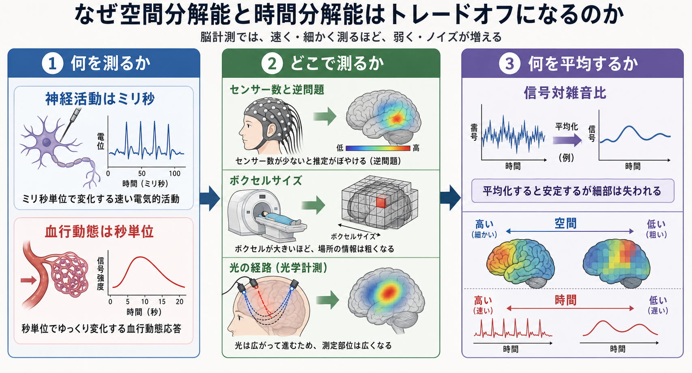

# 空間分解能と時間分解能はなぜトレードオフになるのか

## 要点

- 空間分解能とは「どこで起きたか」をどれだけ細かく区別できるか、時間分解能とは「いつ起きたか」をどれだけ細かく追えるかである。
- [[脳波EEGは何を測っているのか|EEG]] と [[MEGはEEGと何が違うのか|MEG]] は神経活動に近い電磁気信号をミリ秒単位で測れるが、頭皮上のセンサーから脳内の発生源を推定するため、空間推定には逆問題が残る[4][5]。
- [[fMRIは神経活動を直接測っているのか|fMRI]] はミリメートル単位の空間局在に強いが、主に [[BOLD信号とは何か|BOLD信号]] という血行動態応答を測るため、神経活動そのもののミリ秒変化は直接追えない[1][2][3]。
- [[近赤外分光法NIRSは何を測っているのか|NIRS/fNIRS]] は血流・酸素化を測る点でfMRIに近いが、光の散乱と浅い到達深度のため、皮質表層を比較的粗い空間分解能で見る方法である[7]。
- トレードオフは単なる機械性能の不足ではなく、「何を測るか」「どこから測るか」「どれだけ平均して信号対雑音比を稼ぐか」という物理・生理・統計の制約から生じる。

## この記事で答える問い

1. なぜ「速く測れる方法」は、場所の推定が粗くなりやすいのか。
2. なぜ「細かく見える画像」は、神経活動の時刻をそのまま表さないのか。
3. fMRI・EEG・MEG・NIRS/fNIRSは、研究や臨床でどう使い分ければよいのか。

## まず結論

脳計測の分解能は、1つの軸だけで評価できない。EEGやMEGは神経活動に近い電気・磁気現象を直接的に拾うため、時間分解能は非常に高い。しかし、センサーは頭皮外にあり、脳内の多数の電流源が作る場を外側から観測するので、どの皮質部位がどれだけ寄与したかを一意に決めにくい。これが逆問題である[4][5]。

一方、fMRIは脳をボクセルに分けて測るため、空間的な地図を作りやすい。しかしBOLD信号は、神経活動そのものではなく、酸素消費・脳血流・脱酸素化ヘモグロビン変化を介した応答である。神経活動はミリ秒で変わっても、血行動態応答は秒単位で立ち上がり、ピークや形も部位・個人・課題で変わる[2][3]。したがって、fMRIの「細かい脳画像」は、必ずしも「速い神経活動の動画」ではない。

## 背景

[[脳画像とは何を見ているのか|脳画像]] や神経計測を読むとき、「fMRIは空間分解能が高い」「EEGは時間分解能が高い」と説明されることが多い。この説明は便利だが、それだけではなぜそうなるのかが見えにくい。

重要なのは、各手法が同じものを別々の精度で測っているわけではないという点である。EEGとMEGは、神経細胞集団の同期したシナプス後電流が作る電位・磁場を測る。fMRIとNIRS/fNIRSは、神経活動に伴う血流・酸素化変化を測る。PETやSPECTは代謝・血流・受容体など別の生理量を扱う。つまり、分解能の比較は「測っている対象の違い」を抜きにできない。

## 基本概念

### 空間分解能

空間分解能は、近い2つの活動部位をどれだけ別々に見分けられるかである。MRIではボクセルサイズ、撮像法、磁場強度、動き補正、平滑化、統計モデルが関わる。EEG・MEGでは電極・センサー数だけでなく、頭部モデル、導電率、信号源モデル、事前制約が関わる。NIRS/fNIRSでは送光プローブと受光プローブの配置、光路、散乱、頭皮血流の混入が効く[4][7][8]。

### 時間分解能

時間分解能は、近い2つの出来事をどれだけ時間的に分けて追えるかである。EEG・MEGはサンプリングを高くでき、神経電気活動の速い変化を追いやすい[5][6]。fMRIは撮像を高速化できても、BOLD応答の生理的な遅れと広がりが時間精度を制限する[3]。NIRS/fNIRSもサンプリング自体は比較的速いが、測っている主成分は血行動態であるため、神経活動のミリ秒タイミングを直接表すわけではない[7]。

### 信号対雑音比

信号対雑音比は、見たい信号がノイズに対してどれだけ大きいかである。細かいボクセルや短い時間窓で測るほど、1単位あたりの信号は小さくなりやすい。そこで空間的に平滑化したり、試行を平均したり、時間窓を広げたりする。しかし平均化は安定性を上げる代わりに、細かな場所や時刻の情報を失わせる。

## 仕組み

### 1. 何を測るか

神経活動には、発火、シナプス入力、局所フィールド電位、代謝、血流、酸素化など複数の階層がある。Logothetisらの同時記録研究は、BOLD信号が単純なスパイク出力だけでなく、局所フィールド電位に代表される入力・局所処理と強く関係しうることを示した[2]。これはfMRIが神経活動と無関係だという意味ではない。むしろ、神経活動に結びつくが、間に神経血管カップリングが挟まるという意味である。

この媒介過程が、時間分解能の制限になる。BOLDやNIRS/fNIRSの血行動態応答は、神経電気活動より遅く、幅広い。したがって、秒単位の課題ブロックや条件差には強いが、ミリ秒単位の処理順序を読むには不向きである[3][7]。

### 2. どこで測るか

EEG・MEGでは、センサーは脳内に置かれず、頭皮上または頭外にある。脳内の電流源から頭皮外の信号への対応は多対一になりやすく、同じようなセンサー分布を作る脳内配置が複数ありうる。これが逆問題であり、空間分解能を制限する中心的な理由である[4][8]。

fMRIでは、測定単位はボクセルであり、撮像空間に直接対応する。これにより、EEG・MEGより「どこ」の地図を作りやすい。ただしBOLD信号は血管系にも依存するため、活動部位と血管応答の対応は完全な点対点対応ではない[1][2]。

### 3. 何を平均するか

分解能を上げるほど、1測定単位に入る信号量は減る。小さなボクセル、短いTR、少ない試行、細かな時間窓は、理論上は細かい情報を持つが、ノイズにも弱い。そこで研究者は、試行平均、時空間平滑化、周波数帯域化、事前モデル、正則化を使う。

しかし、平均化や正則化は「安定した推定」と「細部の保存」の交換である。EEG・MEGで強い事前制約を入れれば源推定は安定しやすいが、真の活動パターンからずれる可能性がある。fMRIで空間平滑化を強くすれば検出力は上がるが、近接する皮質領域の違いはぼやける。

## 図解

| 計測法 | 主に測るもの | 時間分解能の特徴 | 空間分解能の特徴 | 主な制約 |
|---|---|---|---|---|
| EEG | 頭皮電位 | ミリ秒単位の変化に強い | 頭部導電率・参照・逆問題に依存 | 頭蓋骨や体積伝導で信号が広がる |
| MEG | 頭外磁場 | ミリ秒単位の変化に強い | EEGより頭蓋骨の影響を受けにくいが逆問題は残る | 深部・放射方向の信号に弱い |
| fMRI | BOLD信号 | 血行動態により秒単位で遅れる | ボクセル単位の地図を作りやすい | 神経活動を直接測らず、血管応答に依存 |
| NIRS/fNIRS | HbO/HbR変化 | サンプリングは比較的速いが血行動態信号 | 皮質表層をcm単位で見る | 光散乱、浅い到達深度、頭皮血流混入 |

この表は厳密な順位表ではなく、実験設計上の見取り図である。装置、解析法、対象部位、課題、被験者の動き、臨床目的によって有効な分解能は変わる。

## 臨床・研究との接続

研究では、問いによって手法を選ぶ必要がある。たとえば、視覚刺激後100ミリ秒台の処理順序や振動活動を知りたいなら、EEG・MEGが向いている。課題条件でどの皮質・皮質下領域が関与するかを広く見たいなら、fMRIが向いている。乳幼児、会話、歩行、自然な対人相互作用のようにMRI内で実施しにくい課題では、NIRS/fNIRSが有用になりうる[7]。

臨床では、EEGはてんかん、睡眠、意識障害などの時間的モニタリングに強い。MEGはてんかん焦点推定や術前機能マッピングで使われることがある[6]。fMRIは術前機能局在や研究用の機能マッピングで用いられるが、個別診断を単独で確定する装置ではない。NIRS/fNIRSは可搬性と課題実施のしやすさが利点だが、深部脳活動や細かな解剖局在の解釈には限界がある。

## よくある誤解

### 誤解1: 空間分解能と時間分解能は、技術が進めば同時に無制限に上がる

技術進歩により両方が改善する場面はある。しかし、測定対象が血行動態である限り、神経活動そのもののミリ秒タイミングを直接読むことはできない。逆に、電磁気計測でサンプリングを速くしても、外側のセンサーから脳内源を一意に決める問題は残る。

### 誤解2: fMRIは脳活動を直接動画にしている

fMRIが主に見ているのはBOLD信号であり、神経活動に伴う血流・酸素化変化である[1][2]。活動に関連する有力な間接指標ではあるが、スパイク列やシナプス入力そのものではない。

### 誤解3: EEGは空間情報がない

EEGにも空間情報はある。高密度電極、頭部モデル、ソース推定、表面ラプラシアンなどにより、時空間情報を扱うことができる[5][8]。ただし、空間情報の解釈にはモデル依存性がある。

### 誤解4: MEGはEEGの完全な上位互換である

MEGは頭蓋骨の導電率の影響を受けにくく、ミリ秒単位の源イメージングに強いが、信号源の向きや深さに感度差がある。EEGとMEGは競合というより相補的な方法である[4][6]。

## 関連ノート

既存ノート:

- [[脳画像とは何を見ているのか]]
- [[BOLD信号とは何か]]
- [[fMRIは神経活動を直接測っているのか]]
- [[課題fMRIでは何を比較しているのか]]
- [[脳波EEGは何を測っているのか]]
- [[MEGはEEGと何が違うのか]]
- [[近赤外分光法NIRSは何を測っているのか]]
- [[NIRSは精神医学研究でどう使われるのか]]

MOC更新候補:

- `content/00_MOC/MOC｜脳・神経科学.md` の「脳画像・神経計測」関連項目に追加する。
- 並列ジョブとの競合を避けるため、本記事ではMOC本体は更新しない。

今後の作成候補:

- 「神経血管カップリングとは何か」
- 「EEG・MEGの逆問題とは何か」
- 「脳計測における信号対雑音比とは何か」
- 「マルチモーダル脳計測は何を補完するのか」

## 理解チェック

1. EEG・MEGの時間分解能が高いのに、空間推定が難しくなる主な理由を説明できるか。
2. fMRIの空間分解能が高くても、神経活動のミリ秒タイミングを直接読めない理由を説明できるか。
3. NIRS/fNIRSがfMRIと似ている点、EEG・MEGと異なる点を説明できるか。
4. 信号対雑音比を上げるための平均化が、なぜ細かな時空間情報を失わせることがあるのか。
5. 研究目的が「どこ」なのか「いつ」なのか「自然な行動中に測れるか」なのかによって、手法選択がどう変わるか。

## 参考文献

[1] Ogawa, S., Lee, T. M., Kay, A. R., & Tank, D. W. (1990). Brain magnetic resonance imaging with contrast dependent on blood oxygenation. *Proceedings of the National Academy of Sciences of the United States of America, 87*(24), 9868-9872. https://doi.org/10.1073/pnas.87.24.9868

[2] Logothetis, N. K., Pauls, J., Augath, M., Trinath, T., & Oeltermann, A. (2001). Neurophysiological investigation of the basis of the fMRI signal. *Nature, 412*, 150-157. https://doi.org/10.1038/35084005

[3] Kim, S.-G., Richter, W., & Uğurbil, K. (1997). Limitations of temporal resolution in functional MRI. *Magnetic Resonance in Medicine, 37*(4), 631-636. https://doi.org/10.1002/mrm.1910370427

[4] Hämäläinen, M., Hari, R., Ilmoniemi, R. J., Knuutila, J., & Lounasmaa, O. V. (1993). Magnetoencephalography: theory, instrumentation, and applications to noninvasive studies of the working human brain. *Reviews of Modern Physics, 65*(2), 413-497. https://doi.org/10.1103/RevModPhys.65.413

[5] Michel, C. M., & Murray, M. M. (2012). Towards the utilization of EEG as a brain imaging tool. *NeuroImage, 61*(2), 371-385. https://doi.org/10.1016/j.neuroimage.2011.12.039

[6] Baillet, S. (2017). Magnetoencephalography for brain electrophysiology and imaging. *Nature Neuroscience, 20*, 327-339. https://doi.org/10.1038/nn.4504

[7] Pinti, P., Tachtsidis, I., Hamilton, A., Hirsch, J., Aichelburg, C., Gilbert, S., & Burgess, P. W. (2020). The present and future use of functional near-infrared spectroscopy (fNIRS) for cognitive neuroscience. *Annals of the New York Academy of Sciences, 1464*(1), 5-29. https://doi.org/10.1111/nyas.13948

[8] Grech, R., Cassar, T., Muscat, J., Camilleri, K. P., Fabri, S. G., Zervakis, M., Xanthopoulos, P., Sakkalis, V., & Vanrumste, B. (2008). Review on solving the inverse problem in EEG source analysis. *Journal of NeuroEngineering and Rehabilitation, 5*, 25. https://doi.org/10.1186/1743-0003-5-25

## 未解決問題

- 高速fMRIや高磁場MRIにより、血行動態の時間情報をどこまで精密に扱えるか。
- EEG・MEGの源推定で、個人別MRI、頭部導電率、機械学習的事前分布をどこまで信頼できるか。
- NIRS/fNIRSで頭皮血流や全身性生理変動をどの程度分離できるか。
- 複数モダリティを統合するとき、時間的に速い信号と空間的に細かい信号をどのモデルで結びつけるべきか。
