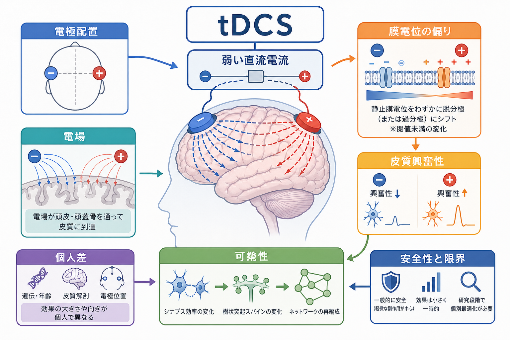
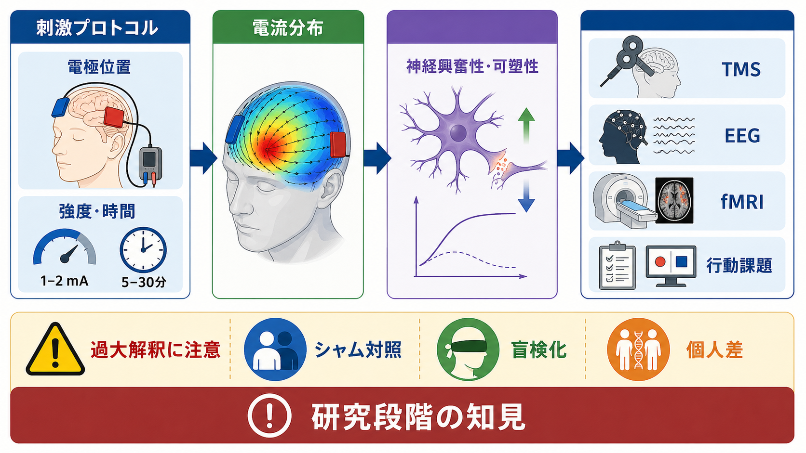

# 経頭蓋直流電気刺激tDCSは脳活動をどう変えるのか

## 要点

- 経頭蓋直流電気刺激 tDCS は、頭皮上の電極間に弱い直流電流を流し、皮質ニューロンの膜電位をわずかに偏らせる非侵襲的脳刺激法である。
- 典型的な理解では、陽極刺激は皮質興奮性を高めやすく、陰極刺激は低めやすい。ただし、この単純な極性規則は、電極配置、刺激強度、刺激時間、課題状態、脳部位、個人差によって崩れることがある[1][2][6]。
- tDCS はニューロンを外から直接発火させるというより、発火しやすさ、シナプス可塑性、神経伝達物質バランス、ネットワーク状態を少し動かす操作として理解するとよい[3]。
- 研究では、TMS、EEG、fMRI、行動課題などを組み合わせて、刺激前後の皮質興奮性や課題成績、脳活動指標を測る。ただし、[[fMRIは神経活動を直接測っているのか]]と同じく、観測指標は神経活動そのものではなく代理指標である。
- 安全性については、通常の研究プロトコルでは重篤な有害作用の報告は限られる一方、自己流使用、過度な電流、長時間刺激、脆弱な対象者への一般化には注意が必要である[5]。
- 臨床応用は研究が進んでいるが、「tDCSで能力が確実に上がる」「個人の治療方針が決まる」と読むのは過大解釈である[7][8]。

## この記事で答える問い

1. tDCS は、脳に何をしているのか。
2. なぜ弱い直流電流で皮質興奮性が変わると考えられているのか。
3. tDCS研究を読むとき、どのような注意点が必要か。

## まず結論

tDCS は、脳活動を「スイッチのようにオン・オフする」方法ではない。弱い電場によってニューロンの膜電位を閾値未満で少し偏らせ、同じ入力に対する発火しやすさやシナプス可塑性を変える方法である[1][3]。その効果は、刺激部位の下だけで完結せず、頭蓋骨・脳脊髄液・脳回・電極配置によって決まる電流分布、刺激中に何をしているか、もともとの皮質状態、個人の解剖や生理によって変わる[4][6]。

したがって、tDCS を読むときの基本は、「どの部位に電場が届いたか」「どの神経指標が変わったか」「どの行動課題で変化が見えたか」「シャム刺激と盲検化は十分か」を分けることである。これは、[[脳画像とは何を見ているのか]]で重要になる「測っている信号と解釈を分ける」姿勢と同じである。

## 背景

tDCS の近代的研究は、ヒト運動野に弱い直流電流を流し、TMSで誘発される運動誘発電位が変化することを示した研究から広く注目された。Nitsche と Paulus の研究では、弱い経頭蓋直流刺激が運動野興奮性を変え、その変化が刺激終了後もしばらく続くことが報告された[1]。その後、刺激時間や強度に応じて後効果が持続すること、神経可塑性に近い過程が関与する可能性が検討された[2][3]。

この方法が注目された理由は、装置が比較的単純で、刺激中の課題遂行やリハビリテーション、認知課題、脳画像計測と組み合わせやすいからである。一方で、効果は小さく、ばらつきやすく、研究条件に強く依存する。したがって、tDCS は「脳機能を簡単に高める道具」ではなく、皮質状態を操作して仮説を検証する研究手段として読むのが安全である。

## 基本概念

### tDCS

tDCS は transcranial direct current stimulation の略で、日本語では経頭蓋直流電気刺激と呼ばれる。典型的には、頭皮上に陽極と陰極の電極を置き、1-2 mA 程度の弱い直流電流を数分から数十分流す。電流は頭皮、頭蓋骨、脳脊髄液、皮質を通るが、皮質に届く電場は弱く、通常はニューロンを直接発火させるほど強くない。

### 皮質興奮性

皮質興奮性とは、ある皮質領域が入力に対してどの程度反応しやすいかを表す研究上の概念である。運動野研究では、TMSによって筋電図上に生じる運動誘発電位を使って推定されることが多い。これは[[BOLD信号とは何か]]のような血流由来指標とは異なり、皮質脊髄路を含む運動系の反応性を反映する。

### 陽極と陰極

単純化すれば、陽極の下では細胞体や樹状突起の向きに応じて脱分極方向の偏りが生じ、陰極の下では過分極方向の偏りが生じると説明される。ただし、実際のニューロンは向きがそろっているわけではなく、電流は脳溝・脳回に沿って複雑に分布する。そのため、「陽極は必ず促進、陰極は必ず抑制」と固定的に読むのは危険である[4][6]。

## 仕組み

### 1. 弱い電場が膜電位を偏らせる

tDCS の第一の作用は、皮質内のニューロンに弱い電場を与え、膜電位を閾値未満で偏らせることだと考えられている[1][3]。閾値未満という点が重要である。tDCS は、TMSのように急速な磁場変化で神経発火を誘発する方法とは異なり、背景状態に対して「発火しやすさ」を少し変える。

このため、刺激中に被験者がどの課題をしているかが重要になる。何もしていない皮質に同じ刺激を加える場合と、運動学習、注意課題、視覚課題、リハビリテーション課題と組み合わせる場合では、同じ電場でも変化しやすいシナプスや回路が異なる。

### 2. 後効果には可塑性が関わる

tDCS の効果は刺激中だけでなく、刺激終了後にも続くことがある。この後効果には、NMDA受容体を介した可塑性、GABA・グルタミン酸系の変化、膜電位変化とシナプス効率の相互作用が関わると考えられている[3]。ただし、これは「tDCSが常にLTPを起こす」という意味ではない。刺激条件、薬理状態、睡眠、疲労、学習履歴、課題中の神経活動によって、後効果の向きと大きさは変わる。

この点は、[[興奮性ニューロンと抑制性ニューロンは回路内でどう協調するのか]]で扱う E/I バランスとも関係する。tDCS による興奮性変化は、興奮性シナプスだけでなく、抑制性介在ニューロン、局所回路、長距離ネットワークの状態を含む。

### 3. 電流分布は電極直下だけでは決まらない

電流は頭蓋骨で大きく広がり、脳脊髄液や皮質の形状によって局所的に集中する。MRI由来の頭部モデルを使った研究では、従来型の大きなパッド電極では電場が比較的広く分布し、最大電場が必ずしも電極直下に来るわけではないことが示されている[4]。このため、tDCS の「刺激部位」は、電極を置いた頭皮位置だけでなく、頭部モデル、電極サイズ、電極間距離、電流強度を含めて考える必要がある。

## 図解

上の図1は、tDCSを電極配置、電場、膜電位、皮質興奮性、可塑性、個人差、安全性の連鎖としてまとめたものである。図2は、tDCS が発火を直接起こすのではなく、膜電位を閾値未満で偏らせるという考え方を示す。

図3は、研究での読み方を示す。tDCS 研究では、刺激プロトコルから電流分布を推定し、TMS、EEG、fMRI、行動課題などの指標で前後変化を調べる。[[安静時fMRIは何を測っているのか]]や[[課題fMRIでは何を比較しているのか]]を読むときと同様、測定指標ごとに時間分解能、空間分解能、解析上の仮定が違う。

| 観点 | 何を見るか | 注意点 |
|---|---|---|
| 刺激条件 | 電極位置、電流、時間、極性 | 同じ「陽極刺激」でも電流分布は同じではない |
| 脳状態 | 安静、課題中、学習中、疲労、薬理状態 | 効果は状態依存的に変わる |
| 神経指標 | TMS、EEG、fMRI、MRSなど | 指標ごとに反映する生理過程が違う |
| 行動指標 | 反応時間、正答率、学習率、症状尺度 | 小さな群平均差を個人効果に直結させない |
| 研究デザイン | シャム刺激、盲検化、事前登録、再現性 | 皮膚感覚や期待効果を統制する必要がある |

## 臨床・研究との接続

tDCS は、うつ病、疼痛、脳卒中後リハビリテーション、運動学習、認知機能、精神疾患研究などで検討されてきた。治療応用については、疾患や症状によってエビデンスの強さが異なり、ガイドラインでは適応ごとに推奨度が分けられている[8]。したがって、「tDCS は治療に効くか」という一問で見るのではなく、「どの疾患・どの症状・どの刺激条件・どの併用療法・どのアウトカムか」に分けて読む必要がある。

研究上は、tDCS は脳回路の因果的操作に近い手がかりを与える。たとえば、ある課題中に前頭前野へ刺激し、行動成績や[[機能的結合解析とは何か]]で測るネットワーク指標が変わるかを調べることで、その領域やネットワークが課題に関与するかを検討できる。ただし、電場は広がり、刺激は局所細胞だけでなくネットワーク全体へ影響する。そのため、[[シードベース解析とは何か]]のような関連解析と組み合わせても、単純な局在論にはできない。

## よくある誤解

### 誤解1：tDCSは脳を直接発火させる

tDCS の基本作用は、強制的に発火を起こすことではなく、膜電位をわずかに偏らせることである。強い入力が来たときに反応しやすくなる、あるいは反応しにくくなるという調整として理解する方が正確である[1][3]。

### 誤解2：陽極は常に促進、陰極は常に抑制である

初期の運動野研究では、陽極刺激で運動野興奮性が上がり、陰極刺激で下がるという分かりやすい結果が得られた[1]。しかし、この規則はすべての部位、強度、時間、課題、個人に一般化できるわけではない。高強度・長時間刺激、発達段階、薬理状態、脳損傷、皮質の向きによって、効果の向きは変わりうる。

### 誤解3：頭皮上の電極位置がそのまま刺激部位を表す

電極の下にだけ電流が入るわけではない。頭蓋骨、脳脊髄液、皮質の溝、電極サイズ、電極間距離によって電場は広がり、局所的に集中する[4]。そのため、厳密には電流分布モデルを含めて刺激部位を考える必要がある。

### 誤解4：安全だから自己流で使ってよい

通常の研究プロトコルでは、重篤な有害作用の報告は限られると整理されている[5]。しかし、これは研究倫理、除外基準、装置管理、皮膚状態の確認、刺激条件の制御がある状況での話である。自己流使用や過度な刺激を正当化する根拠にはならない。

### 誤解5：認知能力を確実に高める

健康成人の単回 tDCS による認知効果については、再現性と効果量に強い議論がある。大規模な定量レビューでは、少なくとも単回刺激の認知効果を安定した能力向上として支持しない結果が報告されている[7]。研究結果は、課題、刺激条件、サンプルサイズ、出版バイアス、個人差を含めて読む必要がある。

## 関連ノート

- [[脳画像とは何を見ているのか]]
- [[fMRIは神経活動を直接測っているのか]]
- [[BOLD信号とは何か]]
- [[安静時fMRIは何を測っているのか]]
- [[課題fMRIでは何を比較しているのか]]
- [[機能的結合解析とは何か]]
- [[シードベース解析とは何か]]
- [[興奮性ニューロンと抑制性ニューロンは回路内でどう協調するのか]]
- [[皮質視床ループは意識や注意にどう関わるのか]]

関連ノート候補:
- TMSとは何か
- EEGは何を測っているのか
- MRSでGABAやグルタミン酸を測るとはどういうことか
- 非侵襲的脳刺激のシャム対照とは何か
- 脳刺激研究の再現性問題とは何か

MOC更新候補:
- バッチ統合時に `content/00_MOC/MOC｜脳・神経科学.md` の「脳画像・神経計測」または「脳刺激・神経調節」周辺へ追加する。
- 将来 `MOC｜脳刺激・神経調節.md` を作る場合、tDCS、TMS、DBS、tACS、神経リハビリテーション研究をまとめる入口ノートにする。

## 理解チェック

1. tDCS が「発火を直接起こす刺激」ではなく「閾値未満の膜電位調整」と言われる理由は何か。
2. 陽極刺激と陰極刺激の効果を、単純な促進・抑制だけで読んではいけない理由は何か。
3. 電極位置と皮質内電場分布が一致しない理由を、頭蓋骨、脳脊髄液、脳回・脳溝を含めて説明できるか。
4. tDCS研究でシャム刺激と盲検化が重要になる理由は何か。
5. 健康成人の認知機能向上について、単回 tDCS の結果を過大解釈してはいけない理由は何か。

## 参考文献

[1] Nitsche, M. A., & Paulus, W. (2000). Excitability changes induced in the human motor cortex by weak transcranial direct current stimulation. *The Journal of Physiology*, 527(3), 633-639. https://doi.org/10.1111/j.1469-7793.2000.t01-1-00633.x

[2] Nitsche, M. A., & Paulus, W. (2001). Sustained excitability elevations induced by transcranial DC motor cortex stimulation in humans. *Neurology*, 57(10), 1899-1901. https://doi.org/10.1212/WNL.57.10.1899

[3] Stagg, C. J., & Nitsche, M. A. (2011). Physiological basis of transcranial direct current stimulation. *The Neuroscientist*, 17(1), 37-53. https://doi.org/10.1177/1073858410386614

[4] Datta, A., Bansal, V., Diaz, J., Patel, J., Reato, D., & Bikson, M. (2009). Gyri-precise head model of transcranial direct current stimulation: Improved spatial focality using a ring electrode versus conventional rectangular pad. *Brain Stimulation*, 2(4), 201-207.e1. https://doi.org/10.1016/j.brs.2009.03.005

[5] Bikson, M., Grossman, P., Thomas, C., Zannou, A. L., Jiang, J., Adnan, T., Mourdoukoutas, A. P., Kronberg, G., Truong, D., Boggio, P., Brunoni, A. R., Charvet, L., Fregni, F., Fritsch, B., Gillick, B., Hamilton, R. H., Hampstead, B. M., Jankord, R., Kirton, A., Knotkova, H., Liebetanz, D., Liu, A., Loo, C., Nitsche, M. A., Reis, J., Richardson, J. D., Rotenberg, A., Turkeltaub, P. E., & Woods, A. J. (2016). Safety of transcranial direct current stimulation: Evidence based update 2016. *Brain Stimulation*, 9(5), 641-661. https://doi.org/10.1016/j.brs.2016.06.004

[6] Wiethoff, S., Hamada, M., & Rothwell, J. C. (2014). Variability in response to transcranial direct current stimulation of the motor cortex. *Brain Stimulation*, 7(3), 468-475. https://doi.org/10.1016/j.brs.2014.02.003

[7] Horvath, J. C., Forte, J. D., & Carter, O. (2015). Quantitative review finds no evidence of cognitive effects in healthy populations from single-session transcranial direct current stimulation (tDCS). *Brain Stimulation*, 8(3), 535-550. https://doi.org/10.1016/j.brs.2015.01.400

[8] Lefaucheur, J. P., Antal, A., Ayache, S. S., Benninger, D. H., Brunelin, J., Cogiamanian, F., Cotelli, M., De Ridder, D., Ferrucci, R., Langguth, B., Marangolo, P., Mylius, V., Nitsche, M. A., Padberg, F., Palm, U., Poulet, E., Priori, A., Rossi, S., Schecklmann, M., Vanneste, S., Ziemann, U., Garcia-Larrea, L., & Paulus, W. (2017). Evidence-based guidelines on the therapeutic use of transcranial direct current stimulation (tDCS). *Clinical Neurophysiology*, 128(1), 56-92. https://doi.org/10.1016/j.clinph.2016.10.087

## 未解決問題

- 個人の頭部形状、皮質形状、神経伝達物質状態、課題状態から、tDCS反応性をどこまで予測できるのか。
- 電場モデル、TMS、EEG、fMRI、行動課題を統合したとき、どの指標がもっとも安定した介入反応性を示すのか。
- 臨床応用で、単独刺激よりも課題訓練、心理療法、リハビリテーション、薬物療法との組み合わせがどの条件で有効になるのか。
- 自宅使用や市販デバイスを含む長期安全性を、どのような制度と研究デザインで評価すべきか。
