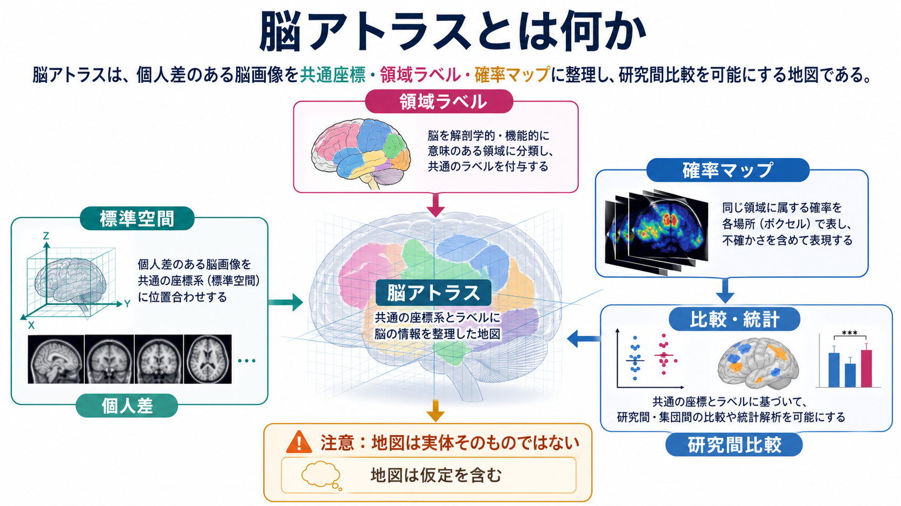
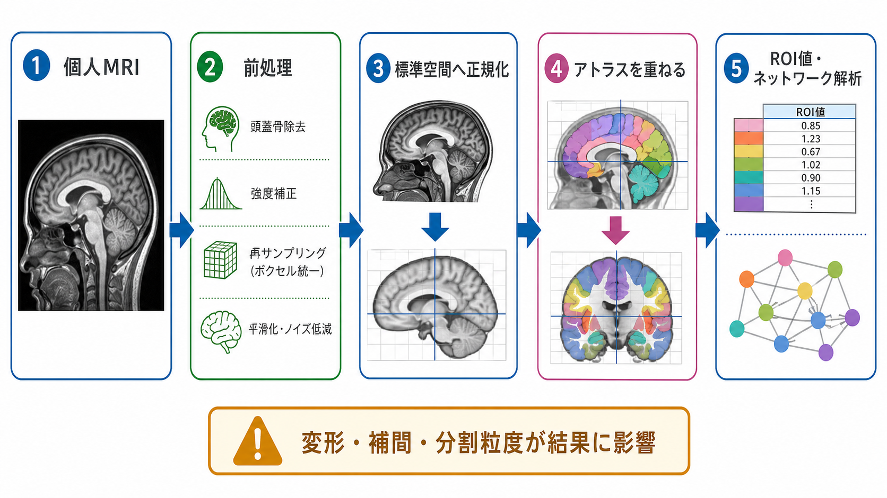
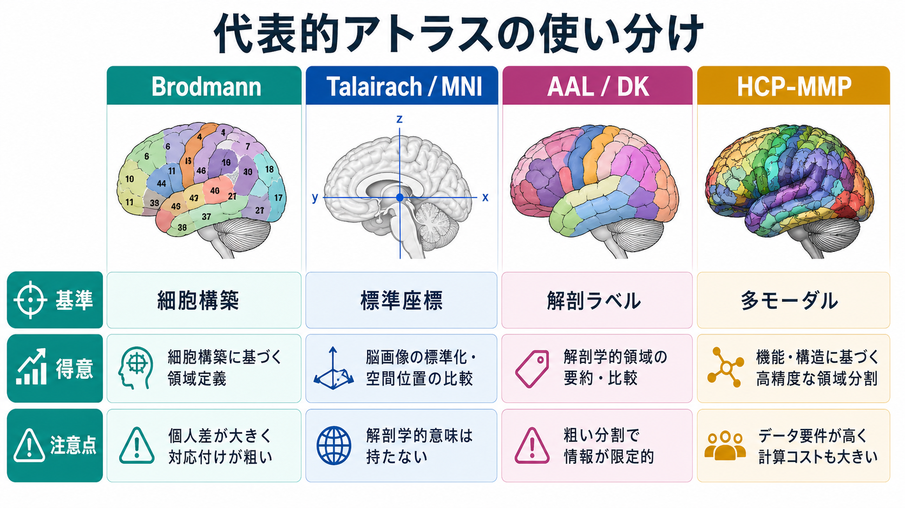

# 脳アトラスとは何か

## 要点

- 脳アトラスは、個人差のある脳を、標準座標、領域ラベル、確率分布、機能ネットワークなどとして整理する「地図」である。
- 研究では、脳画像を共通空間に合わせ、同じ領域定義でROI値、活動、結合、体積、皮質厚などを比較するために使う。
- 代表例には、Brodmann領野、Talairach座標系、MNI/ICBMテンプレート、AAL、Desikan-Killiany、Yeoネットワーク、HCP-MMPなどがある。
- ただし、アトラスは脳の自然な境界をそのまま写したものではない。どのアトラスを選ぶかで、解析結果や解釈は変わりうる。

## この記事で答える問い

1. 脳アトラスは何を標準化しているのか。
2. 代表的な脳アトラスは、どのような発想で作られているのか。
3. [[脳画像とは何を見ているのか|脳画像]]研究や臨床研究で、アトラスを使うときに何へ注意すべきか。

## まず結論

脳アトラスとは、脳画像や解剖所見を、比較可能な座標・領域名・境界・確率分布として整理した参照地図である。地図なので、現実の脳そのものではなく、目的に応じて抽象化されたモデルである。

たとえば、ある研究で「左海馬の体積が小さい」「前頭前野の活動が増えた」「デフォルトモードネットワークの結合が変わった」と述べるには、どこからどこまでを海馬、前頭前野、ネットワーク領域と呼ぶかを決める必要がある。脳アトラスは、その決め方を明示し、別の参加者、別の研究、別のデータセットを同じ枠組みで比べやすくする。

## 背景

脳は人ごとに形が違う。脳溝の走り方、脳室の大きさ、皮質の厚さ、白質路の配置、病変や加齢変化は、同じ座標に同じ機能があると単純に仮定できないほど多様である。したがって、[[構造MRIは脳の何を測っているのか|構造MRI]]やfMRIを使う研究では、まず個人の脳画像を何らかの共通基準に合わせる必要がある。

歴史的には、Brodmannが大脳皮質を細胞構築に基づいて領野へ分けた地図が、機能局在を語る代表的な参照枠になった[1]。その後、Talairach and Tournouxの定位脳アトラスは、前交連・後交連などを基準にした座標系を広め、脳画像研究で座標を報告する文化を支えた[2]。現在では、MNI/ICBM系の標準テンプレート、解剖ラベル、皮質表面アトラス、機能結合アトラス、多モーダル分割が目的に応じて使い分けられている[3][4][5][6][7]。

## 基本概念

### 標準空間

標準空間とは、複数の脳画像を比較するための共通座標系である。MNI/ICBM系のテンプレートは、個人のMRI画像を平均化・正規化して作られた標準参照として広く使われる。ICBM152の非線形テンプレートは、1人の脳に由来する形の偏りを避けるため、多数例の画像を非線形に平均して作られている[3]。

標準空間を使うと、研究者は「座標 x, y, z の近く」や「このアトラス領域内」といった形で結果を共有できる。ただし、標準化は個人差を消す処理ではない。変形の精度、脳萎縮、病変、年齢、撮像条件によって、対応づけには誤差が残る。

### 領域ラベル

領域ラベルは、脳を意味のある区画に分け、名前や番号を付けたものである。AALはMNI単一被験者脳を肉眼解剖学的に分割し、SPM上で活動部位へ自動的に解剖ラベルを付ける目的で作られた[4]。FreeSurferでよく使われるDesikan-Killianyアトラスは、MRI上の皮質を脳回ベースのROIへ自動ラベル化する枠組みとして提案された[5]。

領域ラベルは[[ROI解析と全脳解析は何が違うのか|ROI解析]]に便利である。各領域の平均信号、体積、皮質厚、拡散指標、PET結合能などを計算できる。一方で、広い領域を平均すると、細かな機能差や個人差は見えにくくなる。

### 確率アトラス

確率アトラスは、「この座標がある領域に属する確率」を持つ地図である。これは、脳溝や領域境界が人によってずれることを前提にしている。硬い境界を1本引くのではなく、集団内のばらつきを表すため、解剖学的変異が大きい領域では特に重要になる。

### 機能・ネットワークアトラス

機能アトラスは、解剖名だけでなく、活動、機能結合、受容野、課題応答、皮質構築などの情報に基づいて領域を分ける。Yeoらのアトラスは、安静時fMRIの内因性機能結合から大脳皮質の7ネットワークおよび17ネットワークを推定した[6]。HCP-MMPは、皮質構築、機能、結合、地形情報を統合して、片半球180領域の多モーダル分割を提案した[7]。

この種のアトラスは、[[機能的結合解析とは何か|機能的結合解析]]や[[コネクトームとは何か|コネクトーム]]研究で重要である。どの領域をノードにするかが、ネットワーク指標の前提になるからである。

## 仕組み

典型的な脳アトラス利用は、次の流れになる。

1. 個人のMRI、fMRI、PET、拡散MRIなどを取得する。
2. ノイズ補正、位置補正、脳抽出、空間平滑化などの前処理を行う。
3. 個人空間の画像を標準空間へ正規化する、またはアトラスを個人空間へ逆変換する。
4. アトラスラベルを重ね、領域ごとの値を抽出する。
5. 群間比較、相関、予測モデル、[[グラフ理論は脳ネットワーク解析にどう使われるのか|グラフ理論]]解析などに使う。

この流れで重要なのは、アトラスが解析の最後に付ける「飾り」ではなく、データをどう要約するかを決める設計要素だという点である。Zaleskyらは、全脳ネットワーク解析においてノード定義の選択がネットワーク特性に影響することを示し、「どのアトラスで脳を分割するか」は結果の一部であることを強調している[8]。

## 図解

| アトラス | 主な基準 | 得意な用途 | 注意点 |
|---|---|---|---|
| Brodmann領野 | 細胞構築 | 皮質領野・機能局在の古典的参照 | 現代MRIで境界を直接見ているわけではない |
| Talairach / MNI | 標準座標 | 座標報告、群解析、メタ解析 | 座標系の違いと変換誤差に注意 |
| AAL | 肉眼解剖ラベル | ROI抽出、活動部位の解剖名付け | 領域が粗く、機能境界とは一致しない場合がある |
| Desikan-Killiany | 脳回ベースの皮質ラベル | 皮質厚、皮質体積、FreeSurfer解析 | 脳溝・脳回に基づくため機能分割とは異なる |
| Yeo networks | 安静時機能結合 | 大規模ネットワーク研究 | 状態、前処理、データセットに依存する |
| HCP-MMP | 多モーダル境界 | 高精度な皮質領域分割 | HCP型データや表面解析との相性が強い |

## 臨床・研究との接続

研究では、脳アトラスは統計解析の単位を作る。fMRIではアトラス領域ごとのBOLD時系列を抽出し、相関行列を作る。拡散MRIでは、アトラス領域間を結ぶ推定白質路を数える。構造MRIでは、領域ごとの体積や皮質厚を比較する。PETでは、受容体結合や代謝を領域単位で要約する。

臨床研究でも、疾患群と対照群の違い、治療前後変化、予後予測の特徴量としてアトラス由来のROI値が使われることがある。ただし、これは個別診断や治療指示を自動的に与えるものではない。病変、萎縮、術後変化、発達段階、高齢者の脳では、標準アトラスとのずれが大きくなりうるため、個別画像の読影や臨床情報との統合が必要である。

また、アトラスは[[多重比較補正は脳画像解析でなぜ重要なのか|多重比較補正]]とも関係する。ボクセル単位で全脳を調べる場合に比べ、ROI単位の解析では比較数を減らせることがある。しかし、ROIの選び方を結果に合わせて後から変えると、選択バイアスが生じる。したがって、探索的解析と仮説検証的解析を分け、使用アトラスを事前に明示することが重要である。

## よくある誤解

### 誤解1：アトラスの境界は脳の本当の境界である

アトラスの境界は、細胞構築、脳回、座標、機能結合、課題応答など、特定の基準で引かれた境界である。別の基準を使えば別の境界になる。したがって、「この領域はここで完全に終わる」と読むより、「この解析ではこの地図で領域を定義した」と読むほうが正確である。

### 誤解2：MNI座標ならどの論文でも同じ場所を指す

MNI系テンプレートにも複数の版があり、Talairach座標との変換も完全ではない。座標だけでなく、使ったテンプレート、正規化方法、平滑化、表示ツール、アトラス名を確認する必要がある。

### 誤解3：有名なアトラスを使えば常に正しい

有名なアトラスでも、研究目的に合わない場合がある。細かい皮質機能を見たい研究に粗い解剖アトラスを使うと、領域内の異質性が平均される。逆に、細かすぎるアトラスを小規模データに使うと、各ROIの信号が不安定になりやすい。

### 誤解4：アトラス選択は前処理の細部にすぎない

アトラスは、どの単位で脳を測るかを決める。[[脳内ネットワークとは何か|脳内ネットワーク]]解析ではノード定義そのものであり、構造・機能結合の推定、中心性、モジュール性、効率といった指標に影響する[8]。

## 関連ノート

- [[脳画像とは何を見ているのか]]
- [[構造MRIは脳の何を測っているのか]]
- [[fMRIは神経活動を直接測っているのか]]
- [[ROI解析と全脳解析は何が違うのか]]
- [[機能的結合解析とは何か]]
- [[トラクトグラフィーとは何か]]
- [[コネクトームとは何か]]
- [[グラフ理論は脳ネットワーク解析にどう使われるのか]]

### 今後の作成候補

- 標準脳とは何か
- MNI座標とTalairach座標は何が違うのか
- 脳画像の空間正規化とは何か
- 皮質表面解析とは何か
- 確率アトラスとは何か

### MOC更新候補

- バッチ統合時に `content/00_MOC/MOC｜脳・神経科学.md` の脳画像・神経計測セクションへ本記事を追加する。
- 将来 `MOC｜脳画像・神経計測.md` を作る場合、MRI、fMRI、PET、拡散MRI、ROI解析、脳アトラスをつなぐ入口ノートにする。

## 理解チェック

1. 脳アトラスが標準化するものを、座標、領域ラベル、確率分布の3つに分けて説明できるか。
2. AALのような解剖ラベルと、Yeoネットワークのような機能結合アトラスは何が違うか。
3. ROI解析でアトラスを使う利点と、平均化によって失われる情報を説明できるか。
4. 脳ネットワーク解析で「ノードの切り方」が結果に影響する理由を説明できるか。
5. 臨床画像を標準アトラスに合わせるとき、病変や萎縮がなぜ問題になるか。

## 参考文献

[1] Brodmann, K. (1909). *Vergleichende Lokalisationslehre der Grosshirnrinde in ihren Prinzipien dargestellt auf Grund des Zellenbaues*. Johann Ambrosius Barth. https://commons.wikimedia.org/wiki/File:Brodmann_Cytoarchitectonics.PNG

[2] Talairach, J., & Tournoux, P. (1988). *Co-planar Stereotaxic Atlas of the Human Brain*. Thieme. https://www.thieme.com/books-main/neurosurgery/product/1909-co-planar-stereotaxic-atlas-of-the-human-brain

[3] Fonov, V. S., Evans, A. C., McKinstry, R. C., Almli, C. R., & Collins, D. L. (2009/2011). Unbiased nonlinear average age-appropriate brain templates from birth to adulthood. *NeuroImage*, 47(Suppl 1), S102. https://www.mcgill.ca/bic/icbm152-152-nonlinear-atlases-version-2009

[4] Tzourio-Mazoyer, N., Landeau, B., Papathanassiou, D., Crivello, F., Etard, O., Delcroix, N., Mazoyer, B., & Joliot, M. (2002). Automated Anatomical Labeling of Activations in SPM Using a Macroscopic Anatomical Parcellation of the MNI MRI Single-Subject Brain. *NeuroImage*, 15(1), 273-289. https://doi.org/10.1006/nimg.2001.0978

[5] Desikan, R. S., Ségonne, F., Fischl, B., Quinn, B. T., Dickerson, B. C., Blacker, D., Buckner, R. L., Dale, A. M., Maguire, R. P., Hyman, B. T., Albert, M. S., & Killiany, R. J. (2006). An automated labeling system for subdividing the human cerebral cortex on MRI scans into gyral based regions of interest. *NeuroImage*, 31(3), 968-980. https://doi.org/10.1016/j.neuroimage.2006.01.021

[6] Yeo, B. T. T., Krienen, F. M., Sepulcre, J., Sabuncu, M. R., Lashkari, D., Hollinshead, M., Roffman, J. L., Smoller, J. W., Zöllei, L., Polimeni, J. R., Fischl, B., Liu, H., & Buckner, R. L. (2011). The organization of the human cerebral cortex estimated by intrinsic functional connectivity. *Journal of Neurophysiology*, 106(3), 1125-1165. https://doi.org/10.1152/jn.00338.2011

[7] Glasser, M. F., Coalson, T. S., Robinson, E. C., Hacker, C. D., Harwell, J., Yacoub, E., Ugurbil, K., Andersson, J., Beckmann, C. F., Jenkinson, M., Smith, S. M., & Van Essen, D. C. (2016). A multi-modal parcellation of human cerebral cortex. *Nature*, 536, 171-178. https://doi.org/10.1038/nature18933

[8] Zalesky, A., Fornito, A., Harding, I. H., Cocchi, L., Yücel, M., Pantelis, C., & Bullmore, E. T. (2010). Whole-brain anatomical networks: does the choice of nodes matter? *NeuroImage*, 50(3), 970-983. https://doi.org/10.1016/j.neuroimage.2009.12.027
