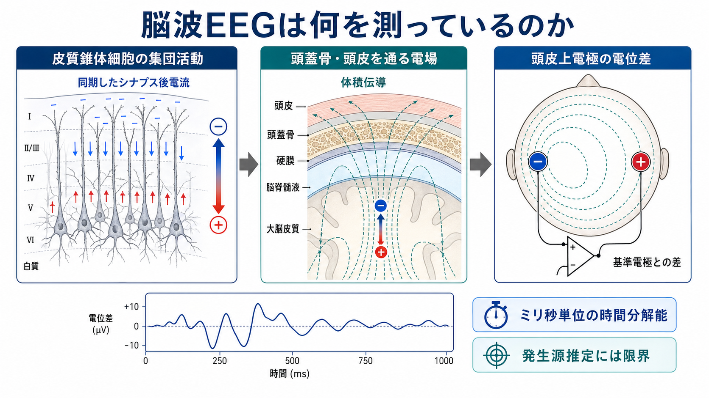
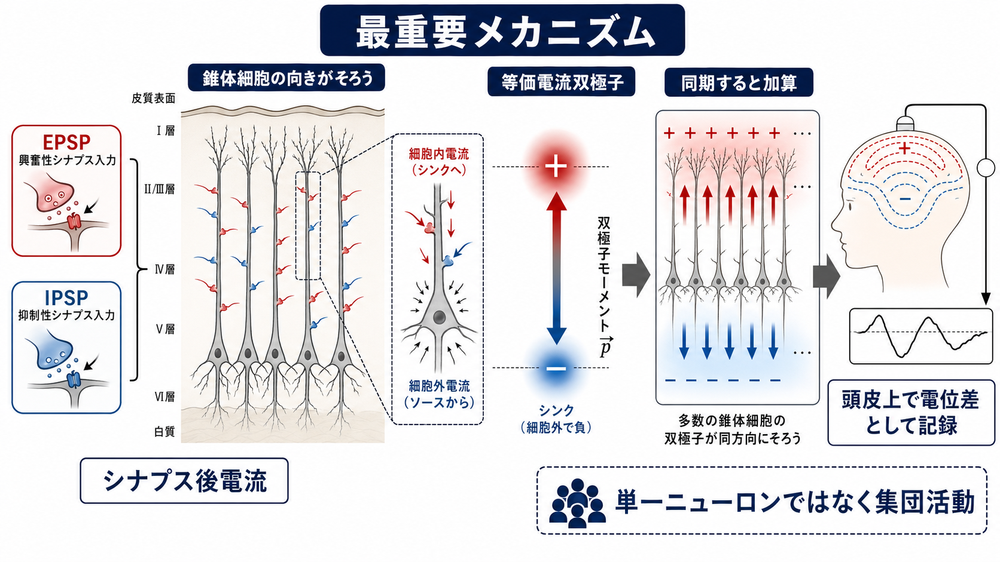
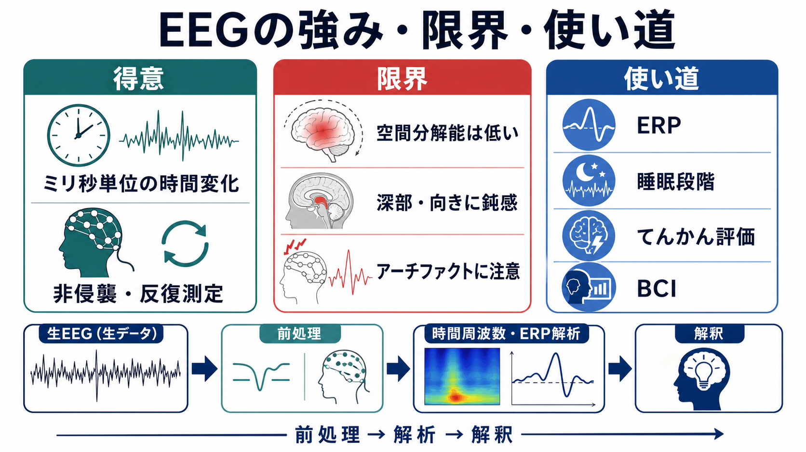

# 脳波EEGは何を測っているのか

## 要点

- 脳波EEGは、頭皮上の電極が拾う**電位差**の時間変化であり、単一ニューロンの発火を直接読む装置ではない [1][2]。
- 主な発生源は、皮質の[[ニューロンとは何か|錐体細胞]]集団で生じる同期した[[シナプス後電位とは何か|シナプス後電位]]と、それに伴う細胞内外の電流である [2][3]。
- EEGに強く寄与するには、細胞の向きがそろい、電流が打ち消し合わない「開放場」を作り、多数の細胞が時間的に同期する必要がある [1][3]。
- 頭皮上で記録される波形は、脳内発生源そのものではなく、脳脊髄液・硬膜・頭蓋骨・頭皮を通った**体積伝導**後の電場である [1][4]。
- EEGの強みはミリ秒単位の時間分解能であり、限界は空間分解能、深部発生源への感度、基準電極・電極配置・アーチファクトへの依存である [4][5][6]。

## この記事で答える問い

1. 頭皮上電極は、脳のどのような物理量を記録しているのか。
2. なぜ錐体細胞の集団活動がEEGの主要な発生源になるのか。
3. EEG波形を、研究・臨床で読むときにどこまで解釈してよいのか。

## まず結論

EEGが測っているのは、頭皮上の2点以上の電極間に現れる電位差である。電極が直接「ニューロンの発火」や「思考内容」を読んでいるわけではない。脳内で多数の皮質錐体細胞が同じ向きに並び、シナプス入力によって細胞内外に電流が流れると、皮質全体として等価的な電流双極子が形成される。その電場が脳脊髄液、頭蓋骨、頭皮を通って広がり、頭皮上の電位分布として観測される [1][2][3]。

このためEEGは、[[fMRIは神経活動を直接測っているのか|fMRI]]のような血行動態の遅い間接指標とは異なり、神経集団活動に近い時間スケールを測れる。一方で、頭皮上の波形から脳内の発生源を一意に逆算することは難しい。EEGを読むときは、「電極Fzで反応が出た」ではなく、「頭皮上にこのような電場分布が生じ、それを説明しうる発生源候補がある」と考えるほうが安全である [4][5]。

## 背景

EEGは、非侵襲的に脳活動の時間変化を測る代表的な方法である。認知課題では事象関連電位、時間周波数解析、位相同期、脳波リズムの変化を調べる。臨床では、てんかん性放電、睡眠段階、脳症、意識障害、集中治療での持続脳波などに使われる [6][7]。

しかし、EEGの解釈にはよくある落とし穴がある。頭皮上の電極名は、脳回や皮質領域の名前ではない。たとえば「Czで大きい波が出た」ことは、Cz直下の皮質だけが活動したことを意味しない。頭皮電位は、頭蓋内の複数の発生源、頭部組織の導電率、基準電極、電極配置、前処理に依存して形を変える [1][4][6]。

## 基本概念

### 電位差

EEG装置は、各電極の「絶対電位」を単独で測るのではなく、ある電極と基準電極、または2つの電極間の電位差を増幅して記録する。したがって、波形の極性や振幅は基準の取り方に影響される。ただし、十分にサンプリングされた頭皮上の電場分布そのものは、基準の選び方だけで任意に消えたり生じたりするものではない [4]。

### シナプス後電流

EEGに最も寄与しやすいのは、活動電位そのものよりも、樹状突起や細胞体周辺で生じるシナプス後電流である。活動電位は短く局所的で、細胞ごとに電流の向きも複雑なため、頭皮上では相殺されやすい。一方、皮質錐体細胞の樹状突起に同期した入力が入ると、多数の細胞で似た向きの電流が生じ、遠くまで届く電場を作りやすい [2][3]。

### 開放場と閉鎖場

同じ電流が生じても、細胞の幾何学的配置によって外から見える電場は変わる。皮質錐体細胞のように、長い樹状突起が皮質表面に対して比較的そろった向きに並ぶと、電流双極子が加算される「開放場」になりやすい。反対に、細胞の向きが放射状・対称的で、電流が互いに打ち消し合う配置では、局所活動があっても頭皮EEGには弱く現れる [1][3]。

### 体積伝導

脳内で生じた電場は、脳脊髄液、硬膜、頭蓋骨、頭皮を通って頭皮上に広がる。この過程を体積伝導という。頭蓋骨は導電率が低いため、空間的な広がりを大きくし、頭皮上の電位分布をぼかす。これがEEGの空間分解能を制約する主な理由の一つである [1][5]。

## 仕組み

EEG信号が頭皮に現れるまでを、単純化すると次の順に整理できる。

| 段階 | 起きていること | EEG解釈での意味 |
|---|---|---|
| 1. シナプス入力 | 興奮性・抑制性入力が錐体細胞の樹状突起や細胞体に入る | [[シナプスとは何か|シナプス]]後電流が局所電場を作る |
| 2. 細胞内外電流 | 電荷の移動によりソースとシンクができる | 等価電流双極子として近似できる |
| 3. 集団同期 | 多数の錐体細胞が同じ時間窓で変化する | 単一細胞ではなく集団活動として加算される |
| 4. 体積伝導 | 電場が頭部組織を通って広がる | 頭皮上の分布は脳内源をぼかして反映する |
| 5. 電極記録 | 電極間・基準電極との差として増幅される | 波形は基準、モンタージュ、前処理に依存する |

重要なのは、EEGが「活動が強い細胞の場所」をそのまま地図化しているわけではないという点である。頭皮波形は、神経活動、頭部導電モデル、電極配置、解析選択が混ざった観測量である。発生源推定はこの観測量から脳内電流源を推定する方法だが、逆問題には一意解がないため、頭部モデル、電極数、事前制約、ノイズ処理が結果に大きく影響する [4][5]。

## 図解

図1は、皮質錐体細胞の集団活動から頭皮上電極の電位差までの全体像を示している。EEGの出発点は皮質内の同期したシナプス後電流であり、それが頭部組織を通って頭皮上の電場として記録される。

図2は、最重要メカニズムである「向きのそろった錐体細胞集団の加算」を示している。EPSPやIPSPは、局所の電流シンク・ソースを作る。多数の錐体細胞でその配置とタイミングがそろうと、頭皮上で測れる電位差になる。

図3は、EEGの強み・限界・応用をまとめている。EEGは時間変化を追うのに強く、[[安静時fMRIは何を測っているのか|安静時fMRI]]や[[機能的結合解析とは何か|機能的結合解析]]と組み合わせると、脳活動の時間構造と空間構造を補完的に調べられる [5]。

## 臨床・研究との接続

研究では、EEGは刺激や反応に時間ロックした事象関連電位、アルファ・ベータ・ガンマなどのリズム、時間周波数変化、脳領域間の同期性を調べるために使われる。ミリ秒単位で変化を追えるため、知覚、注意、意思決定、運動準備などの時間順序を調べやすい [2][4]。

臨床では、標準化された電極配置とモンタージュが重要である。IFCNは標準臨床EEGの電極配置を更新し、下側頭部を含む基本電極配列や高密度EEGの役割を示している [6]。ACNSも臨床EEGの技術的要件や標準モンタージュを定めており、記録時間、電極品質、基準、賦活、睡眠記録、デジタル記録などを標準化することが、波形解釈の信頼性を支える [7][8]。

ただし、臨床EEGは個別診断や治療方針をこのノートだけで判断するためのものではない。教育・研究目的で読む場合も、眼球運動、筋電、心電、汗、電極接触不良、体動などのアーチファクトを神経活動と混同しないことが重要である [7]。

## よくある誤解

### 誤解1: EEGはニューロンの発火を直接測っている

EEGの主な発生源は、単発の活動電位ではなく、皮質錐体細胞集団のシナプス後電流である。活動電位も局所電場に寄与しうるが、頭皮上EEGの主要な成分としては同期したシナプス活動のほうが重要である [2][3]。

### 誤解2: 電極の真下の脳活動だけを測っている

頭皮電位は体積伝導で広がるため、電極の真下だけを反映するわけではない。近接する複数電極、頭皮全体の電場分布、基準、モンタージュ、発生源推定を合わせて読む必要がある [4][5]。

### 誤解3: EEGは空間情報を持たない

EEGは空間分解能が低いが、空間情報をまったく持たないわけではない。十分な電極数、正確な電極位置、個人の頭部モデル、適切な逆問題制約を使うと、発生源推定や電気的神経画像としての利用が可能になる [4][5][6]。

### 誤解4: 大きな波形ほど脳活動が強い

振幅は神経活動の強さだけでなく、発生源の向き、同期性、頭部組織、基準、フィルタ、アーチファクトに影響される。大きな波形を見たら、まず神経生理学的説明と非神経性アーチファクトの両方を検討する必要がある [1][7]。

## 関連ノート

- [[ニューロンとは何か]]
- [[シナプスとは何か]]
- [[シナプス後電位とは何か]]
- [[ニューロンは複数の入力をどのように統合するのか]]
- [[興奮性ニューロンと抑制性ニューロンは何が違うのか]]
- [[fMRIは神経活動を直接測っているのか]]
- [[脳画像とは何を見ているのか]]
- [[機能的結合解析とは何か]]

## 理解チェック

1. EEGが単一ニューロンの活動電位ではなく、主に同期したシナプス後電流を反映する理由を説明できるか。
2. 開放場と閉鎖場の違いを、錐体細胞の向きと電流の相殺という観点から説明できるか。
3. 「Czで反応が出た」という表現を、頭皮電場・基準電極・体積伝導を含めてより正確に言い換えられるか。
4. EEGの時間分解能の強みと、空間分解能・深部発生源推定の限界を分けて説明できるか。

## 関連ノート候補

- 事象関連電位ERPとは何か
- 脳波リズムとは何か
- EEGとMEGは何が違うのか
- EEGのアーチファクトとは何か
- 発生源推定とは何か
- 10-20法とは何か

## MOC更新候補

- `content/00_MOC/MOC｜脳・神経科学.md` の脳画像・神経計測または神経計測セクションへ追加。
- 将来 `MOC｜脳画像・神経計測.md` を作る場合、MRI、PET、fMRI、EEG/MEG、電気生理計測を横断する入口ノートとして配置。

## 未解決問題

- 頭皮EEGから深部発生源をどこまで安定して推定できるか。
- EEGの機能的結合指標から、体積伝導や共通参照の影響をどこまで除去できるか。
- 個人差の大きい頭部導電率、頭蓋骨厚、電極位置誤差を、研究・臨床でどこまで実用的に補正できるか。

## 参考文献

[1] Nunez, P. L., & Srinivasan, R. (2006). *Electric Fields of the Brain: The Neurophysics of EEG* (2nd ed.). Oxford University Press. https://global.oup.com/academic/product/electric-fields-of-the-brain-9780195050387

[2] Biasiucci, A., Franceschiello, B., & Murray, M. M. (2019). Electroencephalography. *Current Biology*, 29(3), R80-R85. https://doi.org/10.1016/j.cub.2018.11.052

[3] Buzsaki, G., Anastassiou, C. A., & Koch, C. (2012). The origin of extracellular fields and currents: EEG, ECoG, LFP and spikes. *Nature Reviews Neuroscience*, 13, 407-420. https://doi.org/10.1038/nrn3241

[4] Michel, C. M., & Murray, M. M. (2012). Towards the utilization of EEG as a brain imaging tool. *NeuroImage*, 61(2), 371-385. https://doi.org/10.1016/j.neuroimage.2011.12.039

[5] He, B., Sohrabpour, A., Brown, E., & Liu, Z. (2018). Electrophysiological source imaging: A noninvasive window to brain dynamics. *Annual Review of Biomedical Engineering*, 20, 171-196. https://doi.org/10.1146/annurev-bioeng-062117-120853

[6] Seeck, M., Koessler, L., Bast, T., Leijten, F., Michel, C., Baumgartner, C., He, B., & Beniczky, S. (2017). The standardized EEG electrode array of the IFCN. *Clinical Neurophysiology*, 128(10), 2070-2077. https://doi.org/10.1016/j.clinph.2017.06.254

[7] Sinha, S. R., Sullivan, L. R., Sabau, D., San-Juan, D., Dombrowski, K. E., Halford, J. J., Hani, A. J., Drislane, F. W., & Stecker, M. M. (2016). American Clinical Neurophysiology Society Guideline 1: Minimum Technical Requirements for Performing Clinical Electroencephalography. *Journal of Clinical Neurophysiology*, 33(4), 303-307. https://doi.org/10.1097/WNP.0000000000000308

[8] Acharya, J. N., Hani, A. J., Thirumala, P., & Tsuchida, T. N. (2016). American Clinical Neurophysiology Society Guideline 3: A Proposal for Standard Montages to Be Used in Clinical EEG. *Journal of Clinical Neurophysiology*, 33(4), 312-316. https://doi.org/10.1097/WNP.0000000000000317
