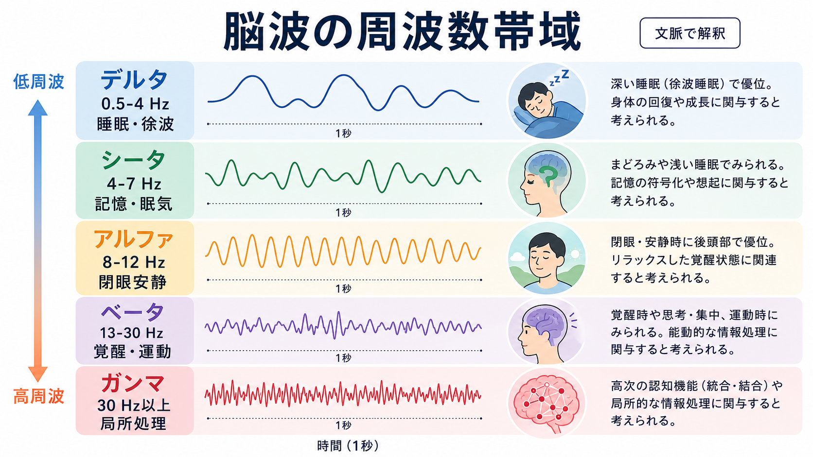
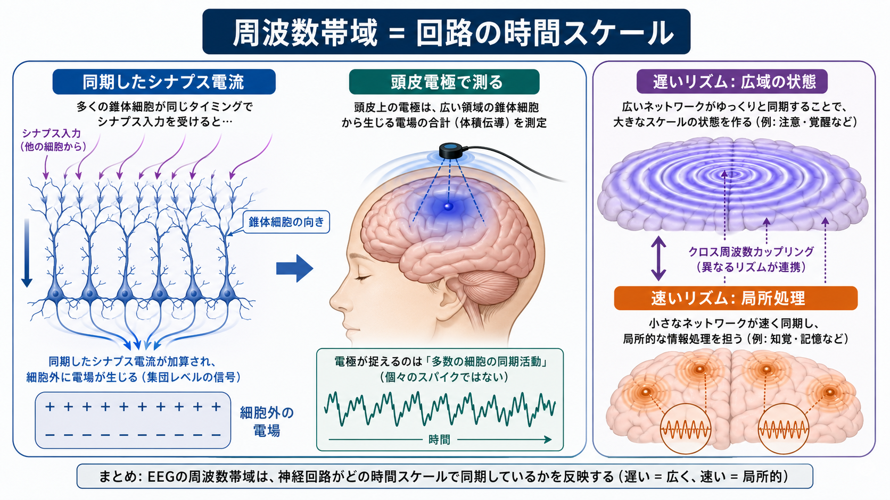
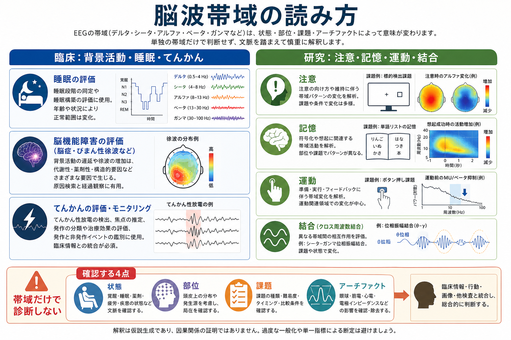

# 脳波の周波数帯域にはどのような意味があるのか

## 要点

- 脳波の周波数帯域は、脳活動を「時間スケール」で粗く分けるための記述語である。
- デルタ・シータ・アルファ・ベータ・ガンマは便利な分類だが、帯域名だけで心理状態や疾患名を決めることはできない。
- 解釈では、周波数だけでなく、振幅、波形、左右差、局在、反応性、年齢、覚醒水準、薬剤、アーチファクトを一緒に見る必要がある[1]。
- 一般に遅い活動は広域の脳状態や睡眠・脳機能低下と、速い活動は局所回路の処理や運動・感覚・認知課題と関連しやすい。ただしこれは文脈依存の傾向である[2][3]。

## この記事で答える問い

- 脳波のデルタ・シータ・アルファ・ベータ・ガンマ波は、それぞれ何を表しているのか。
- 周波数帯域は、脳内のどのような仕組みから生じるのか。
- 臨床 EEG と研究 EEG では、帯域をどのように解釈すればよいのか。
- 「アルファ波はリラックス」「ガンマ波は高次認知」のような説明はどこまで正しいのか。

## まず結論

脳波の周波数帯域は、心の内容を直接読むラベルではなく、神経集団がどの速さで同期しているかを示す観察枠である。たとえばアルファ活動は、成人の閉眼安静時に後頭部で目立つことが多く、開眼や視覚的注意で弱まりやすい[4][5]。しかし、同じアルファ帯域でも、部位、覚醒水準、課題、薬剤、病態によって意味は変わる。

したがって、周波数帯域の意味は「何 Hz か」だけでなく、「どこで」「どの状態で」「何と比べて」「どのような波形・振幅・反応性で」出ているかによって決まる。これは [[脳波EEGは何を測っているのか]] や [[神経振動とは何か]] と接続して理解するとよい。

## 背景

EEG は頭皮上の電位変化をミリ秒単位で記録するため、脳活動の時間変化に強い。一方で、頭皮 EEG は多数の神経細胞・シナプス電流・体積伝導・頭蓋骨や皮膚の影響を受けた合成信号であり、単一ニューロンの発火をそのまま見ているわけではない[2]。

臨床 EEG では、背景活動、睡眠段階、てんかん性放電、局在性またはびまん性の徐波化、薬剤や代謝性要因の影響などを評価する。研究 EEG では、課題中の帯域パワー変化、事象関連同期・脱同期、位相同期、クロス周波数結合などを使って、注意、記憶、運動、知覚、予測処理などの時間構造を調べる。

## 基本概念

### 周波数帯域とは何か

周波数は 1 秒あたりの振動回数で、単位は Hz で表す。臨床・研究でよく使われる分類は、おおまかに次の通りである[4]。

| 帯域 | 代表的な範囲 | よく見られる文脈 | 解釈の注意 |
|---|---:|---|---|
| デルタ | 0.5-4 Hz | 深睡眠、幼児、覚醒成人の徐波化 | 覚醒成人では局在性・びまん性脳機能低下を示すことがある |
| シータ | 4-7 Hz | 眠気、睡眠移行、海馬系の記憶・ナビゲーション研究 | 頭皮 EEG のシータと海馬シータを単純に同一視しない |
| アルファ | 8-12 Hz | 成人の閉眼安静、後頭優位律動 | 「リラックス」だけでなく視覚入力・注意・覚醒水準に左右される |
| ベータ | 13-30 Hz | 覚醒、運動関連活動、薬剤影響 | 筋電図アーチファクトやベンゾジアゼピンなどの影響に注意 |
| ガンマ | 30 Hz 以上 | 局所回路処理、感覚・注意・統合課題 | 筋活動や微小眼球運動の混入に特に注意 |

境界値は文献や解析目的によって少し異なる。たとえばアルファを 8-13 Hz とする場合や、ガンマを 30-80 Hz、あるいは 30-100 Hz とする場合がある[4][7]。帯域分類は自然界に絶対的な境界があるというより、解析と報告のための便宜的な窓である。

### 帯域パワーと位相

EEG 解析では、特定の帯域の強さを「パワー」として測ることが多い。パワーが増えるとは、その周波数成分の振幅が大きくなっているという意味であり、その脳機能が単純に「増えた」とは限らない。また、複数領域の波がどのタイミングでそろうかを調べるときは「位相」や「位相同期」を見る。

研究では、刺激や行動に伴って帯域パワーが増える現象を事象関連同期、減る現象を事象関連脱同期と呼ぶことがある。たとえば運動準備や運動実行では、感覚運動野のミュー・ベータ帯域の低下が観察されることがあるが、これは単に「ベータが少ないから悪い」という意味ではない。

## 仕組み

EEG に現れるリズムは、多数の神経細胞が同じタイミングでシナプス入力を受け、細胞外電場が足し合わされることで観察されやすくなる。とくに大脳皮質の錐体細胞は、樹状突起の向きが比較的そろっているため、集団としての電流双極子を作りやすい[2]。

遅いリズムは、視床皮質ループ、睡眠・覚醒調節、広域ネットワークの状態変化と関連しやすい。速いリズムは、より局所的な興奮性・抑制性回路、感覚入力、運動、注意、記憶課題などに伴って変化しやすい[3][7]。ただし、これは「低周波 = 広域」「高周波 = 局所」といつも決まるという意味ではない。頭皮 EEG では、深部発生源、体積伝導、基準電極、前処理、筋電図・眼電図アーチファクトが観察結果を変える。

## 図解

上の 2 枚の図は、周波数帯域を「脳状態のラベル」ではなく「神経回路の時間スケール」として読むための図である。デルタからガンマへ進むほど、1 秒あたりの振動回数は増える。遅い活動は睡眠、覚醒水準、びまん性の背景活動に関係しやすく、速い活動は局所処理や課題関連活動に関係しやすい。

一方で、実際の EEG は一つの帯域だけでできているわけではない。たとえば低周波の位相が高周波活動の出やすいタイミングを調整する「クロス周波数結合」が研究されている。これは、[[シータリズムは記憶とナビゲーションをどう支えるのか]] や [[ガンマ振動は認知機能にどう関わるのか]] と関連する論点である[6][7]。

## 臨床・研究との接続

### 臨床 EEG での読み方

臨床 EEG では、帯域を患者の年齢、覚醒水準、睡眠、薬剤、既往歴、診察所見、検査目的と合わせて読む。国際的な臨床 EEG 用語では、波形を周波数だけでなく、振幅、相、波形、局在、量、変動性で記述し、アーチファクトも明示することが重視されている[1]。

覚醒成人で広範なデルタ・シータ活動が増える場合、せん妄、代謝性脳症、薬剤性影響、びまん性脳機能低下などを考える手がかりになることがある。ただし EEG 所見だけで原因を確定するのではなく、臨床情報・血液検査・画像検査・薬剤歴と統合する必要がある。局在性の徐波は、構造病変や局所機能障害を示唆することがあるが、やはり非特異的所見である[4]。

てんかん評価では、背景周波数そのものよりも、棘波、鋭波、棘徐波複合などの発作間欠期てんかん性放電、発作時変化、焦点、左右差、睡眠賦活の影響が重要になる。したがって「ガンマが多いからてんかん」「デルタがあるから特定疾患」という読み方は避ける。

### 研究 EEG での読み方

研究では、帯域パワーや位相同期を使って、課題に伴う神経処理の時間構造を推定する。シータ帯域は海馬・嗅内皮質系の記憶、ナビゲーション、時系列処理に関係する研究が多い[6]。ガンマ帯域は、局所回路の同期、感覚入力、注意、皮質計算と関連づけて議論される[7][8]。

ただし、頭皮 EEG で測るシータやガンマは、動物の海馬内記録や皮質内記録と同じ信号ではない。研究では、前処理、参照電極、フィルタ、時間周波数解析、試行数、筋電図・眼球運動の除去、事前登録、統計的多重比較補正が結果の信頼性を左右する。

## よくある誤解

### 誤解1: アルファ波はリラックスを意味する

アルファ律動は、成人の閉眼安静時に後頭部で目立ち、開眼や注意で弱まりやすい[5]。そのためリラックスや安静と関連づけられることはある。しかし、アルファ帯域は視覚入力の抑制、注意配分、覚醒水準、課題要求にも関係する。アルファ波だけで「リラックスしている」と断定するのは単純化しすぎである。

### 誤解2: ベータ波が多いと不安である

ベータ活動は覚醒、運動、感覚運動処理、薬剤影響など複数の要因で変化する。頭皮 EEG の高めの周波数では筋電図混入も問題になりやすい。ベータ帯域を不安の直接指標として使うには、課題、部位、アーチファクト処理、比較条件を明確にする必要がある。

### 誤解3: ガンマ波は知能や高次意識を示す

ガンマ同期は皮質計算や認知機能と関連して研究されているが[7]、ガンマが多ければ認知機能が高いという意味ではない。ガンマ帯域は筋活動、眼球運動、電源ノイズ、解析設定の影響を受けやすい。高周波活動を扱うほど、信号源とアーチファクトの切り分けが重要になる。

### 誤解4: 周波数帯域だけで診断できる

臨床 EEG の解釈は、波形の記述と臨床文脈の統合である[1]。帯域パワーの増減は重要な手がかりになりうるが、単独で疾患名や治療方針を決めるものではない。医療場面では、個別診断や治療判断は専門家が臨床情報と検査所見を総合して行う。

## 関連ノート

- [[神経振動とは何か]]
- [[シータリズムは記憶とナビゲーションをどう支えるのか]]
- [[ガンマ振動は認知機能にどう関わるのか]]
- [[MEGはEEGと何が違うのか]]

## 関連ノート候補

- [[脳波EEGは何を測っているのか]]
- [[皮質視床ループは意識や注意にどう関わるのか]]
- 事象関連電位ERPとは何か
- 局所フィールド電位LFPとは何か
- アーチファクトとは何か
- 睡眠障害とは何か
- てんかんに伴う精神症状とは何か

## MOC更新候補

- `content/00_MOC/` 配下の脳・神経科学系 MOC に、本記事へのリンクを追加する候補。
- 並列ジョブとの競合を避けるため、本タスクでは MOC 本体は更新しない。

## 理解チェック

1. 脳波の周波数帯域は、なぜ「心理状態の名前」ではなく「時間スケール」として読むべきなのか。
2. 覚醒成人でデルタ・シータ活動が増えているとき、どのような臨床文脈を確認する必要があるか。
3. アルファ律動を評価するとき、周波数以外にどのような特徴を見るべきか。
4. ガンマ帯域の研究で、アーチファクトが特に問題になりやすいのはなぜか。
5. 帯域パワーと位相同期は、それぞれ何を見ている解析指標か。

## 未解決問題

- 頭皮 EEG の帯域変化を、個人レベルの症状・認知機能・予後にどこまで安定して結びつけられるか。
- 低周波と高周波の結合が、記憶・注意・意識・精神疾患の病態にどの程度因果的に関与するか。
- 機械学習による EEG バイオマーカーを、臨床で再現性高く使うためにどの前処理・報告基準が必要か。

## 参考文献

[1] Kane, N., Acharya, J., Beniczky, S., Caboclo, L., Finnigan, S., Kaplan, P. W., Shibasaki, H., Pressler, R., & van Putten, M. J. A. M. (2017). A revised glossary of terms most commonly used by clinical electroencephalographers and updated proposal for the report format of the EEG findings. Revision 2017. *Clinical Neurophysiology Practice, 2*, 170-185. https://doi.org/10.1016/j.cnp.2017.07.002

[2] Buzsáki, G., Anastassiou, C. A., & Koch, C. (2012). The origin of extracellular fields and currents: EEG, ECoG, LFP and spikes. *Nature Reviews Neuroscience, 13*(6), 407-420. https://doi.org/10.1038/nrn3241

[3] Buzsáki, G., & Draguhn, A. (2004). Neuronal oscillations in cortical networks. *Science, 304*(5679), 1926-1929. https://doi.org/10.1126/science.1099745

[4] Britton, J. W., Frey, L. C., Hopp, J. L., Korb, P., Koubeissi, M. Z., Lievens, W. E., Pestana-Knight, E. M., & St. Louis, E. K. (2016). The normal EEG. In *Electroencephalography (EEG): An Introductory Text and Atlas of Normal and Abnormal Findings in Adults, Children, and Infants*. NCBI Bookshelf. https://www.ncbi.nlm.nih.gov/books/NBK390343/

[5] Tatum, W. O. (2023). Normal EEG Waveforms. *StatPearls*. NCBI Bookshelf. https://www.ncbi.nlm.nih.gov/books/NBK539805/

[6] Colgin, L. L. (2013). Mechanisms and functions of theta rhythms. *Annual Review of Neuroscience, 36*, 295-312. https://doi.org/10.1146/annurev-neuro-062012-170330

[7] Fries, P. (2009). Neuronal gamma-band synchronization as a fundamental process in cortical computation. *Annual Review of Neuroscience, 32*, 209-224. https://doi.org/10.1146/annurev.neuro.051508.135603

[8] Herrmann, C. S., Fründ, I., & Lenz, D. (2010). Human gamma-band activity: A review on cognitive and behavioral correlates and network models. *Neuroscience & Biobehavioral Reviews, 34*(7), 981-992. https://doi.org/10.1016/j.neubiorev.2009.09.001
