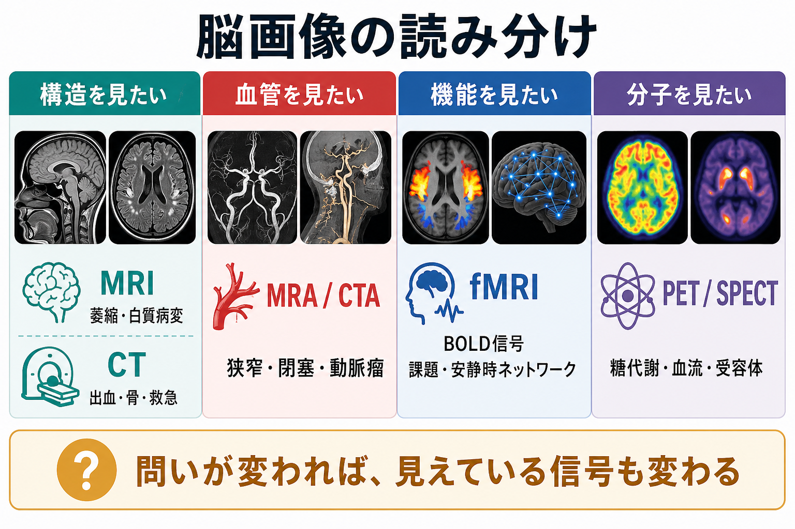
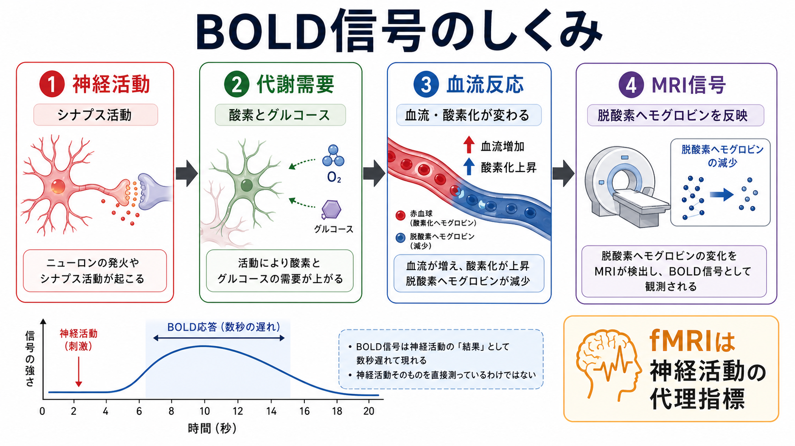

# 脳画像とは何を見ているのか

## 要点

- 脳画像は「脳そのもの」を直接写しているというより、X線吸収、磁気共鳴信号、放射性トレーサー分布、血流・酸素化変化などを、画像として再構成したものである。
- CTはX線の減弱、MRIは主に水素原子核の磁気共鳴信号、PET/SPECTは放射性トレーサー、fMRIはBOLD信号を見ている。
- fMRIやPET/SPECTは神経活動を直接測るのではなく、血流・代謝・分子結合などを介した代理指標である。
- 画像の「見え方」は、撮像法、前処理、統計解析、課題設計、基準集団との比較によって変わる。
- 臨床では病変の検出や鑑別の一部として、研究では仮説検証や群レベルの脳機能・構造理解として使われる。個別診断や治療判断は、症状、診察、検査、経過と合わせて行う。

## この記事で答える問い

この記事では、[[T1強調画像とT2強調画像は何が違うのか]]、[[FLAIR画像はどのような病変検出に役立つのか]]、[[FA値とは何か]]の前提になる問いとして、「脳画像は何を測って、何を測っていないのか」を整理する。

具体的には、次の問いに答える。

- MRI・CT・PET・SPECT・fMRIは、それぞれ何を信号源にしているのか。
- 「構造を見る」「機能を見る」「分子を見る」は、どの程度まで文字どおりなのか。
- 脳画像を読むとき、どのような誤解を避けるべきか。

## まず結論

脳画像は、脳内の神経活動や心理状態をそのまま撮影した写真ではない。CTはX線がどの程度吸収されたか、MRIは水素原子核の磁気共鳴信号が組織ごとにどう違うか、PET/SPECTは放射性トレーサーがどこに集まったか、fMRIは血液中の酸素化状態の変化を見ている[1][2][3][5][6]。

したがって、脳画像を読むときの基本は「この画像は何の代理信号か」と問うことである。画像の明るさや色は、神経活動、血流、代謝、分子結合、組織性状のどれかを、一定のモデルと解析手順を通して表したものである。

## 背景

脳画像は、臨床医学では脳出血、脳梗塞、腫瘍、炎症、変性、外傷、血管病変などの評価に使われる。研究では、認知課題、安静時ネットワーク、脳構造、白質結合、受容体分布、糖代謝などを調べるために使われる。

しかし、同じ「脳画像」でも、見ている信号は大きく異なる。形態を見たいのか、急性出血を見たいのか、白質路の方向性を見たいのか、局所血流や酸素化を見たいのか、糖代謝や受容体を見たいのかで、選ぶべき方法は変わる。

## 基本概念

### CTはX線吸収を見ている

CTは、身体を通過したX線の減弱を多数の角度から測り、断層画像として再構成する。骨、出血、石灰化などX線を吸収しやすい構造は高吸収に見えやすく、救急場面では頭蓋内出血や骨折の評価に強い[1]。

一方、CTは電離放射線を使う。緊急性、被ばく、造影剤の必要性、MRIとの使い分けを考える必要がある[1][4]。

### MRIは水素原子核の磁気共鳴信号を見ている

MRIは、強い磁場の中で水素原子核の向きをそろえ、ラジオ波で励起し、元に戻るときの信号を検出する。組織によってT1緩和、T2緩和、プロトン密度、拡散、磁化率などが異なるため、灰白質、白質、脳脊髄液、浮腫、出血、脱髄、腫瘍などの見え方が変わる[2]。

T1強調画像は解剖学的構造、T2強調画像やFLAIRは水分や浮腫、白質病変の評価に使われやすい。つまりMRIは「脳の形」を写すだけでなく、撮像条件によって組織の物理化学的性質を強調している。

### 拡散MRIは水分子の動きを見ている

拡散MRIは、水分子がどの方向に動きやすいかを測る。白質では軸索束や髄鞘などの組織構造のため、水の拡散が方向性を持ちやすい。この性質から、FA値や拡散テンソル画像は白質の微細構造や線維方向の推定に使われる[7]。

ただし、FA値は「軸索の本数」や「結合の強さ」を直接測る値ではない。交差線維、浮腫、炎症、髄鞘、細胞密度など複数の要因が影響する。

### PET/SPECTは放射性トレーサーの分布を見ている

PETとSPECTは、体内に投与した放射性トレーサーの分布を測る核医学画像である。PETは陽電子放出核種、SPECTはガンマ線を放出する核種を使い、トレーサーがどの部位に集まったかを3次元的に再構成する[3]。

脳では、FDG-PETによる糖代謝、血流SPECT、アミロイドPET、ドパミントランスポーターSPECT、各種受容体PETなどが使われる。これは「活動している神経細胞を直接見る」というより、代謝、血流、分子結合、輸送体密度などをトレーサーごとに見る方法である[3][8]。

### fMRIはBOLD信号を見ている

fMRIの代表的な信号はBOLD信号である。BOLDは、脱酸素ヘモグロビンの磁気的性質に由来するMRI信号で、局所の神経活動に続く血流、血液量、酸素化の変化を反映する[5][6]。

重要なのは、BOLD信号はニューロンの発火を直接測っていないという点である。神経活動、代謝需要、血管反応、MRI信号という複数段階を経るため、時間遅れ、血管状態、課題設計、解析手法の影響を受ける[6]。

## 仕組み

脳画像の仕組みは、次の4層で考えると分かりやすい。

1. 物理信号  
   X線、磁気共鳴、ガンマ線、陽電子消滅光子、磁場変化など。

2. 生理・組織信号  
   水分量、脂質、血流、酸素化、糖代謝、受容体結合、白質の拡散方向性など。

3. 画像再構成  
   センサーで得られた信号を、断層画像、3D画像、時系列画像、統計マップに変換する。

4. 解釈  
   解剖学、病態、課題条件、集団差、統計モデル、臨床情報と照合する。

この4層を混同すると、「画像に赤く出た部位がそのまま心の場所である」「白質路が見えたので神経線維が実際にその通り走っている」「PETで光ったので原因分子が確定した」といった誤解が起こる。

## 図解

上の3枚の図は、次のように読む。

- 1枚目は、問いに応じて使う画像法が変わることを示す。構造、血管、機能、分子は同じ「脳画像」でも別の信号である。
- 2枚目は、fMRIのBOLD信号が神経活動から血流反応を経由して生じる代理信号であることを示す。
- 3枚目は、構造MRIが灰白質、白質、脳脊髄液、体積、皮質厚、萎縮パターンなどを、信号差と形態解析を通して推定していることを示す。

## 臨床・研究との接続

臨床では、画像は「診断名を単独で決めるもの」ではなく、病歴、神経診察、精神症状、血液検査、認知検査、薬剤歴、経過と組み合わせる所見である。たとえば、急性の神経症状ではCTで出血を除外し、必要に応じてMRIで虚血や炎症を詳しく見ることがある。白質病変や萎縮があっても、それだけで症状の原因を確定することはできない。

研究では、画像は仮説を検証するための測定系である。fMRIでは課題条件や安静時の時系列から脳領域間の関係を推定し、PET/SPECTではトレーサーに対応した代謝・血流・分子過程を調べる。いずれも、個人の能力、性格、疾患を画像だけで断定する道具ではない[6][8]。

## よくある誤解

### 誤解1：脳画像は神経活動を直接見ている

多くの場合、直接見ているのは神経活動ではなく、組織の物理信号、血流、代謝、分子分布である。特にfMRIは、神経活動に伴う血流・酸素化変化を使う代理指標である[5][6]。

### 誤解2：画像の明るさや色はそのまま病気の強さを表す

画像の明るさや色は、撮像条件、表示条件、前処理、統計しきい値、造影剤、トレーサー、標準化の影響を受ける。色付きの統計マップは、通常「差」や「関連」を見やすくした表示であり、病変の絶対量そのものとは限らない。

### 誤解3：MRIなら何でも分かる

MRIは軟部組織や脳構造に強いが、救急での出血評価、骨病変、撮像時間、金属・デバイス、体動、閉所不安などの制約がある。CT、MRI、PET/SPECT、脳波、心理検査、血液検査は、それぞれ別の問いに答える。

### 誤解4：白質トラクトは実際の神経線維をそのまま描いたもの

拡散MRIのトラクトグラフィは、水分子の拡散方向から線維方向を推定したものである。交差線維や分岐、部分容積効果の影響を受けるため、解剖学的な軸索束をそのまま可視化したものではない[7]。

## 関連ノート

- [[T1強調画像とT2強調画像は何が違うのか]]
- [[FLAIR画像はどのような病変検出に役立つのか]]
- [[FA値とは何か]]

## MOC更新候補

- `content/00_MOC/` 配下に脳画像・神経計測のMOCがある場合、本記事を「脳画像の基礎」または「神経計測の入口」に追加する。
- 並列ジョブとの競合を避けるため、この作業ではMOC本文は更新しない。

## 理解チェック

1. CTが主に測っている信号は何か。
2. MRIでT1強調画像とT2強調画像の見え方が変わる理由は何か。
3. PET/SPECTで「分子を見る」と言うとき、実際には何の分布を見ているのか。
4. fMRIのBOLD信号が、神経活動の直接測定ではない理由は何か。
5. FA値を「白質結合の強さ」と単純に読んではいけない理由は何か。

## 未解決問題

- BOLD信号、血流、代謝、神経活動の対応関係は、脳部位、発達段階、疾患、薬剤、血管状態によってどの程度変わるのか。
- 個人レベルの診断や予後予測に、群レベルで得られた画像特徴をどこまで安全に使えるのか。
- 拡散MRIや機能的結合から推定されるネットワーク指標を、解剖学的・生理学的実体とどう対応づけるべきか。
- PET/SPECTの分子画像を、症状、行動、治療反応の理解へどのように統合するのか。

## 参考文献

[1] National Institute of Biomedical Imaging and Bioengineering. Computed Tomography (CT). https://www.nibib.nih.gov/science-education/science-topics/computed-tomography-ct

[2] National Institute of Biomedical Imaging and Bioengineering. Magnetic Resonance Imaging (MRI). https://www.nibib.nih.gov/science-education/science-topics/magnetic-resonance-imaging-mri

[3] National Institute of Biomedical Imaging and Bioengineering. Nuclear Medicine. https://www.nibib.nih.gov/science-education/science-topics/nuclear-medicine

[4] U.S. Food and Drug Administration. Medical X-ray Imaging. https://www.fda.gov/radiation-emitting-products/medical-imaging/medical-x-ray-imaging

[5] Ogawa, S., Lee, T. M., Kay, A. R., & Tank, D. W. (1990). Brain magnetic resonance imaging with contrast dependent on blood oxygenation. *Proceedings of the National Academy of Sciences*, 87(24), 9868-9872. https://doi.org/10.1073/pnas.87.24.9868

[6] Logothetis, N. K. (2008). What we can do and what we cannot do with fMRI. *Nature*, 453, 869-878. https://doi.org/10.1038/nature06976

[7] Basser, P. J., Mattiello, J., & LeBihan, D. (1994). MR diffusion tensor spectroscopy and imaging. *Biophysical Journal*, 66(1), 259-267. https://doi.org/10.1016/S0006-3495(94)80775-1

[8] Raichle, M. E., & Mintun, M. A. (2006). Brain work and brain imaging. *Annual Review of Neuroscience*, 29, 449-476. https://doi.org/10.1146/annurev.neuro.29.051605.112819
