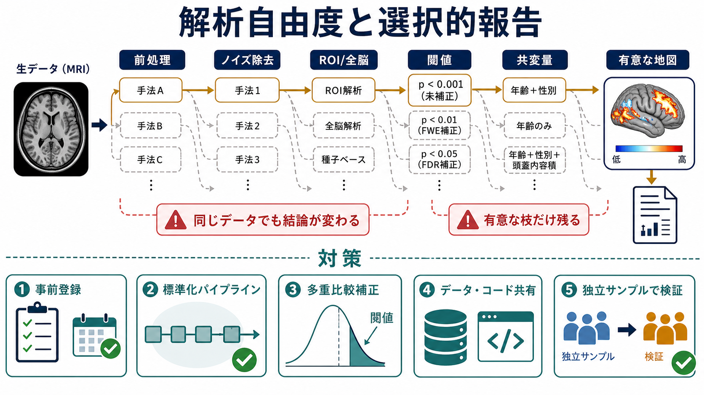
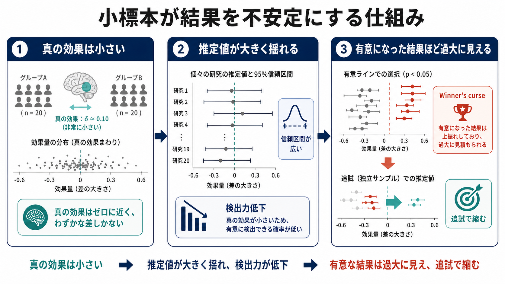

# 脳画像研究の再現性問題とは何か

## 要点

- 脳画像研究の再現性問題とは、ある研究で報告された脳領域・ネットワーク・群差・相関が、独立したデータや別チームの解析で安定して再現されにくい問題である。
- 主な要因は、小標本による低い[[統計的検出力とは何か|統計的検出力]]、前処理・閾値・ROI選択などの解析自由度、陽性結果に偏りやすい選択的報告である[1][2][3]。
- fMRIでは全脳の多数ボクセルを扱うため、多重比較補正、クラスタ推論、頭動・生理ノイズ、共変量選択の影響が大きい[3][4]。
- 近年の多数チーム解析や大規模 brain-wide association studies は、同じデータでも解析選択で結論が揺れうること、安定した個人差関連を調べるには数千人規模が必要になりうることを示した[5][6]。
- 対策は、事前登録、十分な[[サンプルサイズ設計とは何か|サンプルサイズ設計]]、独立サンプルでの検証、データ・コード共有、解析パイプラインの透明化である[7][8]。

## この記事で答える問い

この記事では、[[脳画像とは何を見ているのか|脳画像]]、とくに[[BOLD信号とは何か|BOLD信号]]を用いるfMRI研究で、なぜ「有意な脳活動」や「疾患群と健常群の差」が次の研究で再現されないことがあるのかを整理する。個々の研究者の不正ではなく、研究設計・解析・報告の仕組みが、どのように結果の不安定さを生むのかに焦点を当てる。

## まず結論

脳画像研究の再現性問題は、「脳画像だから特別に信用できない」という話ではない。むしろ、脳画像研究は高次元データ、複雑な前処理、多数の解析選択、しばしば小さい効果量を同時に扱うため、一般的な統計問題が見えやすくなる領域である。

典型的には、サンプルサイズが小さいと真の効果を検出しにくく、有意になった効果だけが論文に残ると、報告された効果量は過大になりやすい[1]。さらに、前処理、平滑化、頭動補正、ROIか全脳か、クラスタ閾値、共変量、除外基準などの選択肢が多いと、同じデータでも結果が変わりうる[2][5]。このうち「見栄えのよい陽性結果」だけが選ばれて報告されると、文献全体が実際より強い証拠を示しているように見える[4]。

## 背景

脳画像研究は、認知課題、安静時ネットワーク、精神疾患、発達、加齢、治療反応などを、非侵襲的に調べる強力な方法である。[[課題fMRIでは何を比較しているのか|課題fMRI]]では条件間のBOLD信号差を、安静時fMRIでは領域間の時系列相関を、構造MRIでは灰白質量や皮質厚などを扱う。

一方で、脳画像データは「1人につき1つの値」ではない。多数のボクセル、時間点、脳領域、ネットワーク指標、行動指標を持つ。解析者は、どの前処理を使うか、どの脳アトラスを使うか、どのノイズを除くか、どの統計閾値を採用するかを決めなければならない。Carp は、fMRI研究には多くの「方法論的な世界」があり、報告された単一の解析結果だけでは、選ばれなかった解析の幅が見えにくいと論じた[2]。

## 基本概念

### 再現性

ここでいう再現性には、少なくとも三つの水準がある。

| 種類 | 何を確認するか | 脳画像研究での例 |
|---|---|---|
| 計算的再現性 | 同じデータとコードから同じ結果が出るか | 解析コード、ソフトウェア版、前処理設定を共有する |
| 解析的頑健性 | 妥当な別解析でも結論が大きく変わらないか | 平滑化幅、共変量、閾値、ROI定義を変えても主要結論が残る |
| 独立再現性 | 別サンプルで同じ方向の効果が得られるか | 別施設・別コホートで同じ群差や相関を確認する |

### 小標本と低検出力

小標本では、真の効果が存在しても検出できない確率が高くなる。さらに重要なのは、低検出力の研究で有意になった結果ほど、偶然に大きく見えた結果が選ばれやすい点である。Button らは、神経科学研究の低い検出力が、効果量の過大推定と再現性低下につながると整理した[1]。

### 解析自由度

解析自由度とは、研究者が合理的に選べる解析上の分岐の多さである。たとえば[[ROI解析と全脳解析は何が違うのか|ROI解析と全脳解析]]、頭動除外基準、空間平滑化幅、クラスタ形成閾値、共変量、脳アトラス、時系列フィルタ、外れ値処理は、いずれも結果に影響しうる。

問題は、選択肢があること自体ではない。問題は、解析方針が事前に固定されず、結果を見ながら選択され、選ばれなかった解析が報告されない場合である。このとき、読者は実際に試された分岐の数を知らないまま、最終的な1枚の統計地図だけを見ることになる。

### 選択的報告

選択的報告とは、有意だった領域、仮説に合ったネットワーク、解釈しやすい結果が優先的に報告されることを指す。David らは、fMRIメタ分析を用いて、小規模研究で報告される活性化焦点の数が不自然に多い可能性を示し、報告バイアスの懸念を提起した[4]。

## 仕組み

### 1. 小標本が効果量を過大に見せる

脳画像研究では、費用、撮像時間、参加者負担、臨床群のリクルート困難さのため、サンプルサイズが限られやすい。小標本で真の効果が小さい場合、推定値は大きく揺れる。そこで有意な結果だけを拾うと、真の効果より大きく見えた結果が残りやすい。これは winner's curse と呼ばれることがある[1]。

この問題は、個人差研究で特に深刻である。Marek らは、脳全体の指標と行動・認知・精神症状などの関連を調べる brain-wide association studies では、安定した推定に数千人規模のサンプルが必要になりうることを示した[6]。これは「小規模研究は無意味」という意味ではないが、探索的研究と確認的研究を区別する必要を示している。

### 2. 多数のボクセルと多重比較が偽陽性を増やす

全脳解析では、数万から数十万のボクセルで統計検定を行う。したがって、未補正の[[p値とは何か|p値]]だけを見れば、偶然に有意な点が多く出る。多重比較補正はこの問題への基本的対策だが、クラスタ推論では空間自己相関などの仮定が成り立つかが重要になる。

Eklund らは、実際の安静時fMRIデータを用いた大規模なシミュレーションで、一部のパラメトリックなクラスタ推論が想定より高い偽陽性率を示しうることを報告した[3]。この研究は、ソフトウェアを使えば自動的に正しい推論になるのではなく、統計手法の仮定と検証が必要であることを示した。

### 3. 同じデータでも解析チームにより結論が変わる

Botvinik-Nezer らは、同じ神経画像データセットを多数の研究チームに解析させ、仮説に対する結論や統計地図がチーム間で大きく変わることを示した[5]。これは、解析者が恣意的であるという単純な話ではない。各チームが妥当と思う前処理・モデル・除外基準・閾値を選んでも、分岐の蓄積によって最終結果が変わりうるということである。

### 4. 陽性結果が文献に残りやすい

小標本、解析自由度、多重比較の問題は、選択的報告と結びつくと文献レベルの歪みになる。探索的に見つけた結果が、あたかも事前仮説の確認であったかのように報告されると、読者は証拠の強さを過大評価しやすい。未発表の陰性結果、報告されなかったROI、試されたが採用されなかった前処理は、通常の論文本文からは見えない。

## 図解

上の1枚目は、解析自由度と選択的報告がどのように結びつくかを示している。前処理、ノイズ除去、ROI/全脳、閾値、共変量という各段階で複数の分岐があり、そのうち有意な統計地図へつながる枝だけが残ると、同じデータからでも結論が強く見える。

2枚目は、小標本による不安定性を示している。真の効果が小さいと、少人数の研究では推定値が大きく揺れる。有意になった結果だけを選ぶと、効果量は上振れしやすく、独立サンプルで追試したときに縮小する。

## 臨床・研究との接続

脳画像研究の再現性問題は、研究知見を臨床へ翻訳するときに重要である。たとえば、うつ病、統合失調症、ADHD、ASDなどで「この脳領域が異常」と報告されても、それが個人診断に使えるとは限らない。多くの脳画像知見は群平均の差や相関であり、個人レベルの診断精度とは別問題である。

研究では、次のような読み方が必要になる。

| 論文で見る点 | 確認したいこと |
|---|---|
| サンプルサイズ | 効果量に対して十分か、探索研究か確認研究か |
| 解析方針 | 事前登録、主要アウトカム、除外基準が明確か |
| 多重比較 | 全脳・ROI・クラスタ推論の補正が妥当か |
| データ品質 | [[頭動補正はfMRIでなぜ重要なのか|頭動補正]]、生理ノイズ、欠損処理が報告されているか |
| 共有性 | [[オープンデータとは何か|データ]]、コード、統計地図、事前計画が共有されているか |
| 独立検証 | 別サンプル、別施設、メタ分析で方向性が一致するか |

Nichols らは、MRI神経画像研究で、解析、報告、アルゴリズム、データ共有のベストプラクティスを整える必要を述べている[7]。Poldrack と Poline も、共有データの利用と再現性には、単なるデータ公開だけでなく、解析の再実行可能性、メタデータ、出版慣行の改善が必要だと論じた[8]。

## よくある誤解

### 誤解1: 再現しないなら、その研究はすべて間違いである

再現性が低いことは、個々の研究がすべて誤りだという意味ではない。小標本研究は、探索的仮説を作る段階では価値がある。ただし、効果量や局在を確定的に読むには、独立検証と累積的証拠が必要である。

### 誤解2: 大規模データなら自動的に正しい

大規模データは推定を安定させるが、測定の質、交絡、解析選択、サンプルの代表性を自動的に解決するわけではない。大規模研究でも、事前仮説、品質管理、透明な解析計画が必要である。

### 誤解3: 事前登録すれば探索はしてはいけない

事前登録は探索を禁止するものではない。確認的解析と探索的解析を区別し、どこまでが事前に決めた仮説で、どこからがデータを見て生まれた仮説かを明確にするための道具である。

### 誤解4: 有意な脳地図は、その領域が心理機能の原因だと示す

fMRIの有意領域は、特定条件でBOLD信号が統計的に異なる場所を示す。心理機能の原因、疾患の本質、個人の診断を直接示すわけではない。[[脳アトラスとは何か|脳アトラス]]や機能局在は解釈の手がかりだが、行動データ、モデル、臨床情報と合わせて読む必要がある。

## 関連ノート

- [[脳画像とは何を見ているのか]]
- [[BOLD信号とは何か]]
- [[課題fMRIでは何を比較しているのか]]
- [[ROI解析と全脳解析は何が違うのか]]
- [[統計的検出力とは何か]]
- [[サンプルサイズ設計とは何か]]
- [[p値とは何か]]
- [[オープンデータとは何か]]
- [[頭動補正はfMRIでなぜ重要なのか]]
- [[脳アトラスとは何か]]

### MOC更新候補

- `content/00_MOC/` 配下の脳・神経科学、脳画像・神経計測、研究方法・統計に関するMOCへ追加候補。
- 並列ジョブとの競合を避けるため、この作業ではMOC本文は更新しない。

## 理解チェック

1. 小標本の研究で有意になった効果量が過大に見えやすいのはなぜか。
2. fMRIの解析自由度には、どのような分岐が含まれるか。
3. 多重比較補正やクラスタ推論が脳画像研究で重要になる理由は何か。
4. 「同じデータでも解析チームにより結論が変わる」という結果は、研究の読み方に何を求めるか。
5. 探索的研究と確認的研究を区別することは、なぜ再現性の改善につながるか。

## 未解決問題

- 精神疾患や認知機能の効果量が小さい場合、実用的な予測モデルに必要なサンプルサイズはどの程度か。
- 多施設データで、スキャナ差、撮像プロトコル差、参加者集団差をどこまで補正できるか。
- 事前登録、データ共有、コード共有を、参加者プライバシーと両立させる最適な運用は何か。
- 脳画像の群レベル知見を、個人レベルの臨床判断へ接続するには、どの程度の外部妥当性が必要か。

## 参考文献

[1] Button, K. S., Ioannidis, J. P. A., Mokrysz, C., Nosek, B. A., Flint, J., Robinson, E. S. J., & Munafò, M. R. (2013). Power failure: why small sample size undermines the reliability of neuroscience. *Nature Reviews Neuroscience*, 14, 365-376. https://doi.org/10.1038/nrn3475

[2] Carp, J. (2012). On the plurality of methodological worlds: estimating the analytic flexibility of fMRI experiments. *Frontiers in Neuroscience*, 6, 149. https://doi.org/10.3389/fnins.2012.00149

[3] Eklund, A., Nichols, T. E., & Knutsson, H. (2016). Cluster failure: why fMRI inferences for spatial extent have inflated false-positive rates. *Proceedings of the National Academy of Sciences*, 113(28), 7900-7905. https://doi.org/10.1073/pnas.1602413113

[4] David, S. P., Ware, J. J., Chu, I. M., Loftus, P. D., Fusar-Poli, P., Radua, J., Munafò, M. R., & Ioannidis, J. P. A. (2013). Potential reporting bias in fMRI studies of the brain. *PLOS ONE*, 8(7), e70104. https://doi.org/10.1371/journal.pone.0070104

[5] Botvinik-Nezer, R., Holzmeister, F., Camerer, C. F., Dreber, A., Huber, J., Johannesson, M., Kirchler, M., Iwanir, R., Mumford, J. A., Adcock, R. A., et al. (2020). Variability in the analysis of a single neuroimaging dataset by many teams. *Nature*, 582, 84-88. https://doi.org/10.1038/s41586-020-2314-9

[6] Marek, S., Tervo-Clemmens, B., Calabro, F. J., Montez, D. F., Kay, B. P., Hatoum, A. S., Donohue, M. R., Foran, W., Miller, R. L., Hendrickson, T. J., et al. (2022). Reproducible brain-wide association studies require thousands of individuals. *Nature*, 603, 654-660. https://doi.org/10.1038/s41586-022-04492-9

[7] Nichols, T. E., Das, S., Eickhoff, S. B., Evans, A. C., Glatard, T., Hanke, M., Kriegeskorte, N., Milham, M. P., Poldrack, R. A., Poline, J.-B., Proal, E., Thirion, B., Van Essen, D. C., White, T., & Yeo, B. T. T. (2017). Best practices in data analysis and sharing in neuroimaging using MRI. *Nature Neuroscience*, 20, 299-303. https://doi.org/10.1038/nn.4500

[8] Poldrack, R. A., & Poline, J.-B. (2015). The publication and reproducibility challenges of shared data. *Trends in Cognitive Sciences*, 19(2), 59-61. https://doi.org/10.1016/j.tics.2014.11.008
