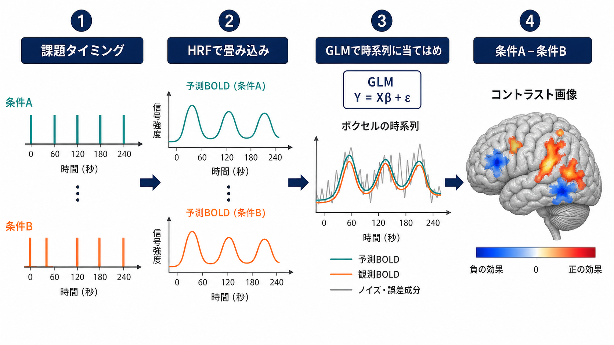
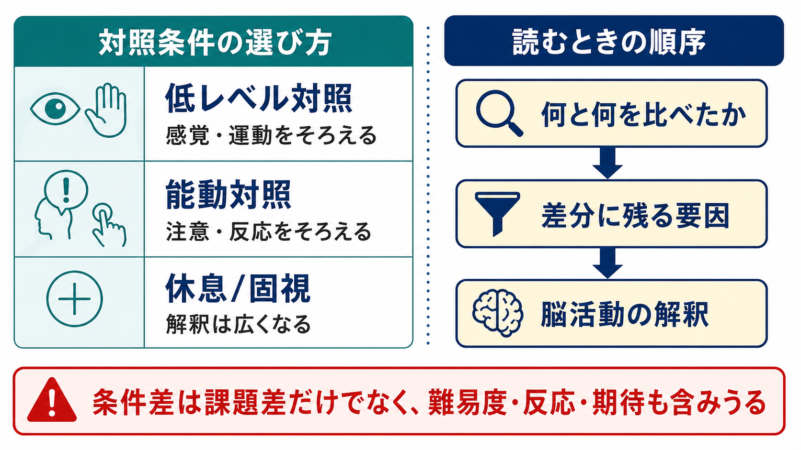

# 課題fMRIでは何を比較しているのか

## 要点

- 課題fMRIは、ある課題中の脳を「そのまま読む」方法ではなく、実験条件と対照条件の差分を調べる方法である。
- 測っている信号は神経発火そのものではなく、血流・血液酸素化に由来するBOLD信号である。
- 解析では、課題タイミングから予測されるBOLD変化を作り、各ボクセルの時系列に一般線形モデル（GLM）を当てはめる。
- 最終的に報告される「活動」は、多くの場合「条件A > 条件B」というコントラストであり、絶対的な脳活動ではない。
- 解釈の質は、対照条件が何をそろえ、何を差分として残すよう設計されたかに強く依存する。

## この記事で答える問い

課題fMRIの論文では、「記憶課題で海馬が活動した」「抑制課題で前頭前野が活動した」といった表現がよく使われる。しかし、その文は厳密には「ある条件を別の条件と比べたとき、BOLD信号が相対的に高かった」という意味である。この記事では、課題fMRIが何と何を比較し、その差分をどのように脳活動として推定しているのかを整理する。

## まず結論

課題fMRIの基本単位は「条件差」である。たとえば、顔画像を見る条件と物体画像を見る条件を比べる、難しい記憶条件と簡単な記憶条件を比べる、反応抑制が必要な試行と単純反応試行を比べる、といった形で設計する。

この比較は、心理学的には「関心のある心的操作だけが差分に残るように条件を組む」試みであり、統計的には「デザイン行列の各列に対応する回帰係数を推定し、その線形結合を検定する」手続きである。SPMの標準的説明でも、fMRI解析はGLMの設計行列を指定し、パラメータを推定し、コントラストベクトルで結果を問い合わせる流れとして定義される[1]。

## 背景

fMRIは、血液中の酸素化ヘモグロビンと脱酸素化ヘモグロビンの磁気的性質の違いを利用して、神経活動に伴う血流・酸素化変化を画像化する。BOLDコントラストの発見により、外因性の造影剤なしに機能的活動を推定できるようになった[2]。

ただし、BOLD信号は神経活動の直接測定ではない。神経活動、局所代謝、血流、血液量、酸素化の結合を介した間接指標である。サル視覚皮質での同時記録研究では、BOLD応答が局所フィールド電位などの局所神経活動と密接に関連することが示された一方、何をどの時間・空間スケールで反映しているかには注意が必要である[3]。

この点は、[[構造MRIは脳の何を測っているのか]] との違いを考えるとわかりやすい。構造MRIが脳の形態や組織コントラストを主に扱うのに対し、課題fMRIは課題に同期して変動するBOLD信号を使って、機能的な条件差を推定する。

## 基本概念

### 実験条件

実験条件は、研究者が知りたい心理過程や課題操作を含む条件である。例として、ワーキングメモリ負荷が高い条件、情動刺激を見る条件、反応を抑制する条件、痛み刺激を受ける条件などがある。

重要なのは、実験条件そのものが「純粋な記憶」「純粋な情動」「純粋な抑制」を表すわけではないことである。課題には刺激の見え方、注意、反応、難易度、期待、不安、運動出力などが同時に含まれる。

### 対照条件

対照条件は、実験条件から差し引きたい要素をできるだけ含ませた条件である。低レベル対照では、視覚刺激や運動反応をそろえる。能動対照では、注意、判断、ボタン押し、課題難易度をできるだけ近づける。休息や固視を対照にする場合は、差分に多くの要素が残りやすく、解釈は広くなる。

つまり、対照条件は単なる「何もしない条件」ではない。むしろ、研究者の仮説を検査可能にするための設計上の要である。

### コントラスト

コントラストとは、条件間の差を数式で指定したものである。単純には「条件A - 条件B」であり、GLMでは各条件の回帰係数に重みをかけた線形結合として表される。古典的な統計的パラメトリックマッピングの枠組みは、機能画像データにGLMを適用し、仮説に対応する統計マップを作る考え方を定式化した[4]。

## 仕組み

課題fMRI解析では、まず課題イベントやブロックのタイミングを記録する。次に、そのタイミングを血行動態応答関数（HRF）で畳み込み、神経活動がBOLD信号としてどのような遅れた波形になるかを予測する。標準的なGLM解析では、この予測波形を説明変数として、各ボクセルの観測BOLD時系列を説明する[5]。

式で書くと、各ボクセルの時系列 \(Y\) を、デザイン行列 \(X\)、回帰係数 \(\beta\)、誤差 \(\varepsilon\) によって次のように表す。

$$
Y = X\beta + \varepsilon
$$

ここで、\(X\) には条件A、条件B、運動パラメータ、ドリフト項などが入る。推定された \(\beta\) は、「その説明変数がBOLD時系列をどれくらい説明するか」を表す量である。最後に、たとえば \([1, -1, 0, 0, ...]\) のようなコントラストを指定すると、「条件Aが条件Bより大きいか」を各ボクセルで検定できる。

## 図解

課題fMRIの読み方は、画像の色だけを見るのではなく、条件設計を読むところから始まる。

同じ「前頭前野の活動」という結果でも、比較対象が休息なのか、単純反応課題なのか、難易度をそろえた能動対照なのかで意味は変わる。休息との差なら「課題全般に関連する活動」が多く含まれやすい。単純反応との差なら「刺激処理やボタン押しを超えた判断・制御」が残りやすい。難易度をそろえた能動対照との差なら、より狭い心理操作に近づく可能性があるが、完全に一要因だけを分離できるとは限らない。

## 臨床・研究との接続

研究では、課題fMRIは認知機能、感情処理、言語、運動、痛み、意思決定などの条件差を調べるために使われる。臨床領域では、術前の言語・運動機能マッピングなど、個別患者の機能局在を補助する目的で使われることがある。ただし、この記事の内容は教育・研究目的の整理であり、個別の診断や治療方針を決めるものではない。

統計的には、GLMは非常に広く使われているが、時系列自己相関、HRFの個人差・領域差、ノイズ、動き、モデル誤指定、多重比較などの問題を伴う。GLMの仮定が崩れると、効果量そのものだけでなく、分散推定や検定統計量にも影響しうる[6]。そのため、課題fMRIの結果は「どの条件差を、どのモデルで、どの前処理・統計閾値で推定したか」と一緒に読む必要がある。

## よくある誤解

### 「赤い場所がその機能の中枢である」

赤い領域は、多くの場合「指定したコントラストでBOLD信号が相対的に高かった領域」である。ある機能に必要十分な中枢であることを単独で示すわけではない。機能局在の解釈には、損傷研究、電気生理、刺激研究、行動データ、再現性のあるメタ分析などとの接続が必要になる。

### 「対照条件を引けば、関心のある心理過程だけが残る」

理想的にはそう設計するが、実際には難易度、注意、反応時間、誤答、疲労、期待、情動などが差分に混ざる。したがって、対照条件の選び方は統計処理の前にある理論的判断である。

### 「脳活動から心の状態をそのまま読める」

課題から脳活動を推定する方向は、一般に順推論である。一方、ある領域が活動したから特定の心理過程が生じたと推論することは逆推論であり、領域の選択性や課題文脈に依存する。Poldrackは、逆推論は演繹的には妥当でなく、特に領域の選択性が弱い場合には慎重に扱うべきだと論じた[7]。

## 関連ノート

- [[構造MRIは脳の何を測っているのか]]
- [[拡散強調画像DWIは何を反映しているのか]]
- [[構造的結合と機能的結合は何が違うのか]]
- [[動的機能的結合とは何か]]
- [[デフォルトモードネットワークとは何か]]

### 今後の作成候補

- BOLD信号
- 一般線形モデル
- 血行動態応答関数
- 安静時fMRIは何を測っているのか
- 多重比較補正

### MOC更新候補

- `content/00_MOC/MOC_脳・神経科学.md`
- `content/00_MOC/MOC_脳画像・神経計測.md`

## 理解チェック

1. 課題fMRIの「活動」は、なぜ絶対的な活動ではなく条件差として読む必要があるのか。
2. 休息条件を対照にした場合、差分にどのような要因が混ざりやすいか。
3. GLMにおけるデザイン行列 \(X\) と回帰係数 \(\beta\) は、それぞれ何を表すか。
4. 「扁桃体が活動したので恐怖が生じた」と断定する推論には、どのような注意が必要か。

## 参考文献

[1] SPM Documentation. *fMRI model specification*. Wellcome Centre for Human Neuroimaging, UCL. https://www.fil.ion.ucl.ac.uk/spm/docs/manual/fmri_spec/fmri_spec/

[2] Ogawa, S., Lee, T. M., Kay, A. R., & Tank, D. W. (1990). Brain magnetic resonance imaging with contrast dependent on blood oxygenation. *Proceedings of the National Academy of Sciences*, 87(24), 9868-9872. https://doi.org/10.1073/pnas.87.24.9868

[3] Logothetis, N. K., Pauls, J., Augath, M., Trinath, T., & Oeltermann, A. (2001). Neurophysiological investigation of the basis of the fMRI signal. *Nature*, 412, 150-157. https://doi.org/10.1038/35084005

[4] Friston, K. J., Holmes, A. P., Worsley, K. J., Poline, J.-P., Frith, C. D., & Frackowiak, R. S. J. (1994). Statistical parametric maps in functional imaging: A general linear approach. *Human Brain Mapping*, 2(4), 189-210. https://doi.org/10.1002/hbm.460020402

[5] Lindquist, M. A. (2008). The statistical analysis of fMRI data. *Statistical Science*, 23(4), 439-464. https://doi.org/10.1214/09-STS282

[6] Monti, M. M. (2011). Statistical analysis of fMRI time-series: A critical review of the GLM approach. *Frontiers in Human Neuroscience*, 5, 28. https://doi.org/10.3389/fnhum.2011.00028

[7] Poldrack, R. A. (2006). Can cognitive processes be inferred from neuroimaging data? *Trends in Cognitive Sciences*, 10(2), 59-63. https://doi.org/10.1016/j.tics.2005.12.004
