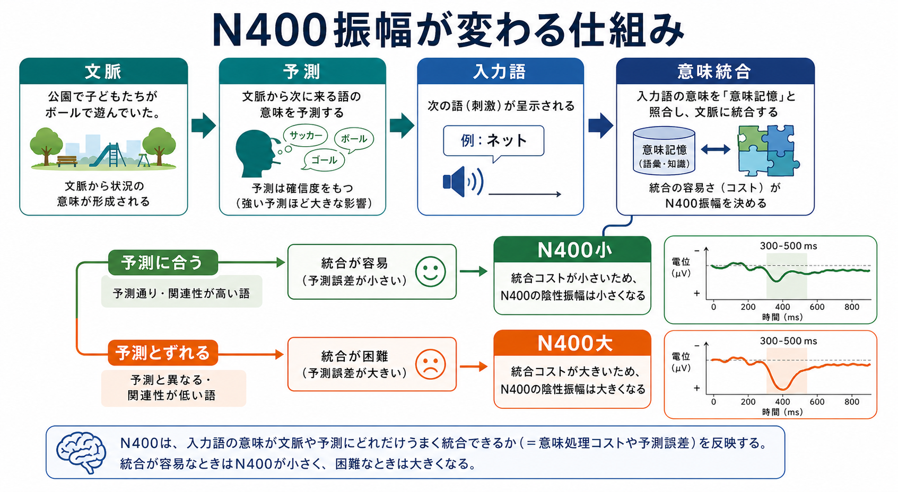
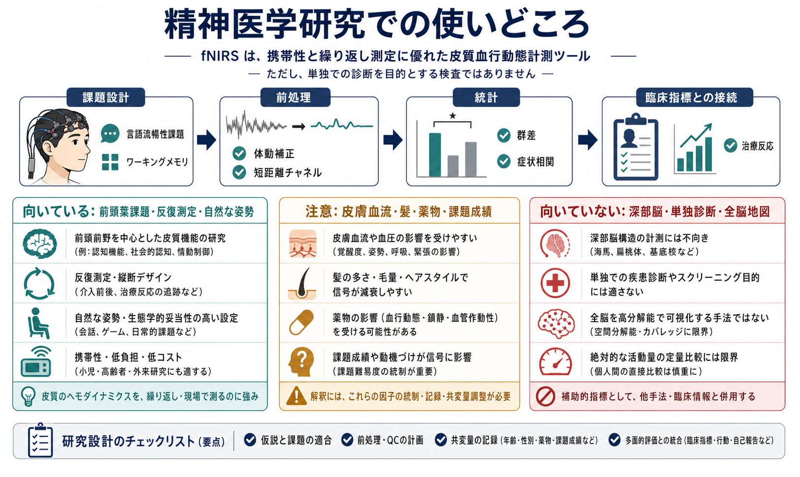
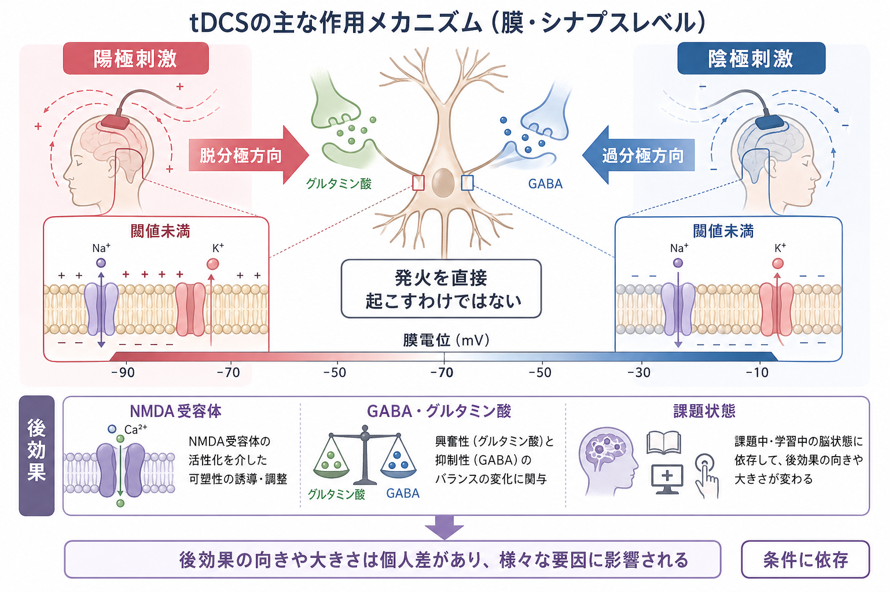

# 近赤外分光法NIRSは何を測っているのか

## 要点

- NIRSは、頭皮上の送光・受光プローブで近赤外光を出し、組織を通って戻ってきた光の強さから、主に酸化ヘモグロビン（HbO）と脱酸化ヘモグロビン（HbR）の変化を推定する方法である [1][2]。
- 機能的NIRS（fNIRS）で「脳活動」と呼ばれる信号は、神経発火そのものではなく、神経活動に伴う局所血流・血液量・酸素化の変化である [2][3]。
- 連続波NIRSの多くは絶対濃度ではなく、修正Beer-Lambert則にもとづく相対濃度変化を扱う [2][3]。
- 低拘束、携帯性、静音性に優れるため、乳幼児、発達研究、臨床集団、対人相互作用、ベッドサイドに近い研究で使いやすい [5][6]。
- 一方で、深部脳よりも浅い皮質に感度が偏り、頭皮血流、体動、プローブ接触、全身性生理変動の影響を受ける。前処理と報告の透明性が重要である [3][4]。

## この記事で答える問い

1. NIRSは頭皮上から何を測っているのか。
2. HbO、HbR、総ヘモグロビンの変化は、どのように神経活動と関係するのか。
3. [[fMRIは神経活動を直接測っているのか]]や[[脳波EEGは何を測っているのか]]と比べて、どこが似ていて、どこが違うのか。
4. 臨床研究や発達研究でNIRSを読むとき、どのような限界に注意すればよいのか。

## まず結論

NIRSは、脳の電気活動を直接測っているわけではない。測っているのは、近赤外光が頭皮、頭蓋骨、脳表近くの組織を通るあいだに、血中ヘモグロビンによってどの程度吸収・散乱されたかである。その吸収の波長依存性を使って、HbOとHbRの濃度変化を推定する [1][2]。

研究で「前頭前野のNIRS反応が低い」「課題中にoxy-Hbが上がった」と言うとき、それは多くの場合、課題や刺激に伴う皮質近傍の血行動態反応を見ている。これは[[BOLD信号とは何か]]と同じく、神経活動に近いが、神経活動そのものではない間接指標である。

## 背景

近赤外光は、生体組織の中を完全には透過しないが、可視光より比較的深く届きやすい波長帯を含む。Jöbsisは1977年に、近赤外光を使って脳や心筋の酸素化・循環状態を非侵襲的にモニターできる可能性を示した [1]。その後、光源、検出器、頭部プローブ配置、解析法が発展し、現在のNIRS/fNIRSは神経科学、発達研究、リハビリテーション、精神医学研究、ベッドサイドモニタリングなどで使われている [2][4]。

NIRSが特に重宝されるのは、測定環境の自由度が高いからである。[[構造MRIは脳の何を測っているのか]]や[[PETは脳の何を測るのか]]のように大型装置や放射性トレーサーを必要とせず、[[脳波EEGは何を測っているのか]]に近い感覚で、比較的自然な姿勢や対人場面でも測定しやすい。ただし、この自由度は「何でも正確に測れる」という意味ではない。測定対象は浅い皮質周辺の血行動態であり、信号には頭皮・頭蓋骨・全身循環の影響が混ざる。

## 基本概念

### NIRSとfNIRS

NIRSは near-infrared spectroscopy、つまり近赤外分光法である。広い意味では、筋、脳、乳房、末梢循環など、組織の酸素化や血液量を光で調べる方法を含む。fNIRSは functional NIRS の略で、課題、刺激、安静時変動、対人相互作用などに伴う脳血行動態の変化を測る用途を指す。

### HbO、HbR、HbT

NIRSでよく出てくる指標は次の3つである。

| 指標 | 意味 | 読み方の注意 |
|---|---|---|
| HbO | 酸化ヘモグロビンの変化 | 神経活動に伴う血流増加で上がりやすいが、頭皮血流にも影響される |
| HbR | 脱酸化ヘモグロビンの変化 | 典型的な賦活では下がりやすい。[[BOLD信号とは何か]]とも関連が深い |
| HbT | HbO + HbRに近い総ヘモグロビン変化 | 局所血液量の変化を反映しやすい |

典型的な課題賦活では、局所の代謝需要が高まり、それを上回る血流増加が起こるため、HbOは増加し、HbRは低下することが多い。ただし、このパターンは課題、年齢、脳部位、血管反応、測定条件、前処理に依存するため、単純な「HbO上昇 = 神経活動増加」とは読まない。

### 相対変化を測る

多くの連続波NIRS装置は、光の飛行時間や散乱係数を完全には分離できない。そのため、絶対的なヘモグロビン濃度ではなく、ベースラインからの相対変化として扱うのが基本である [2][3]。この点は、MRI画像のように見える「場所」よりも、プローブ配置と解析モデルに依存した時系列信号として読む必要がある。

## 仕組み

NIRSの基本は、2つ以上の波長の近赤外光を頭皮上から入れ、数cm離れた検出器で戻ってきた光を測ることである。光は直線的に進むのではなく、皮膚、頭蓋骨、髄液、灰白質などで散乱しながら、バナナ状の感度分布を作る。送受光間距離が成人で約3cm程度なら、脳表近くの皮質信号をある程度含むと考えられるが、浅層組織への感度も大きい。

HbOとHbRは、波長によって光の吸収の仕方が異なる。この差を使い、修正Beer-Lambert則で光強度変化を濃度変化に変換する [2][3]。単純化すれば、次のように考えられる。

$$
\Delta A(\lambda) \approx \varepsilon_{HbO}(\lambda)\Delta[HbO]L + \varepsilon_{HbR}(\lambda)\Delta[HbR]L
$$

ここで、$\Delta A(\lambda)$は波長$\lambda$における吸光度変化、$\varepsilon$は吸光係数、$L$は組織内での実効光路長である。実際には散乱、個人差、年齢差、頭皮・頭蓋骨厚、プローブ接触、髪の影響が入るため、解析では差分、フィルタリング、アーチファクト補正、短距離チャンネルによる浅層信号補正などが使われる [3][4]。

## 図解

上の図を文章で言い換えると、NIRS信号は次の鎖で生じる。

1. 課題や刺激により、局所の神経活動と代謝需要が変わる。
2. 神経血管カップリングにより、血管反応、血流、血液量、酸素化が変わる。
3. HbOとHbRの割合が変わり、近赤外光の吸収が変わる。
4. 検出器で観測される光強度時系列が変わる。
5. 解析により、HbO、HbR、HbTの相対濃度変化として推定される。

この流れの途中には、神経活動以外の要因が入り込む。呼吸、心拍、血圧、皮膚血流、体動、プローブずれ、髪、課題中の発話や顔面筋活動は、いずれもNIRS信号を変えうる。したがって、NIRS研究では「測定した信号」から「脳活動」を読む前に、どの前処理、どの統計モデル、どの対照条件で推定したのかを確認する必要がある [3][4]。

## 臨床・研究との接続

### 発達研究

fNIRSは乳幼児研究と相性がよい。乳児はMRI装置内で静止することが難しく、装置音や拘束の影響も大きい。一方、fNIRSは比較的静かで、座位、抱っこ、自然な視聴覚刺激に近い場面でも使いやすい。そのため、視覚、聴覚、言語、社会的認知、母子相互作用などの発達研究で利用されてきた [5][6]。

ただし、乳幼児では頭部形状、頭皮・頭蓋骨厚、発達段階、睡眠・覚醒状態、動きの多さが信号に影響する。成人と同じプローブ配置や同じ血行動態モデルをそのまま当てはめるのではなく、年齢に応じた光路長、測定部位、アーチファクト処理、統計設計を考える必要がある。

### 臨床・精神医学研究

臨床研究では、うつ病、統合失調症、双極症、発達障害、認知症、リハビリテーション、脳卒中などでfNIRSが使われる。精神医学領域では、前頭前野を中心に、言語流暢性課題や作業記憶課題中のHbO反応を群間比較したり、症状重症度や治療反応との関連を調べたりする研究がある [7][8]。

しかし、臨床応用を読むときは慎重さが必要である。fNIRSは携帯性が高く、患者への負担が比較的小さいという強みを持つが、個人の診断名や治療方針を単独で決める検査ではない。特に精神医学では、課題成績、薬物、睡眠、身体疾患、血管反応、年齢、併存症、前処理手順が結果に影響する。研究で示された群平均差と、個別患者への診断的判断は区別する必要がある [7][8]。

### 他の脳計測との違い

| 方法 | 主に見ているもの | 強み | 注意点 |
|---|---|---|---|
| NIRS/fNIRS | 皮質近傍のHbO/HbR変化 | 低拘束、携帯性、乳幼児・臨床集団で使いやすい | 深部に弱い、頭皮血流と体動に影響される |
| [[fMRIは神経活動を直接測っているのか]] | BOLD信号、血行動態変化 | 全脳の空間分解能が高い | 大型装置、拘束、音、時間分解能の制約 |
| [[脳波EEGは何を測っているのか]] | 頭皮上電位、同期したシナプス活動 | ミリ秒単位の時間分解能 | 空間局在が難しい、筋電・眼電の影響 |
| [[PETは脳の何を測るのか]] | トレーサー分布、代謝、受容体、病理タンパク | 分子過程を測れる | 放射性トレーサー、時間分解能、侵襲性 |

NIRSはEEGのように頭皮上で測りやすく、fMRIのように血行動態を見ている。言い換えると、時間的にはEEGほど速くなく、空間的にはfMRIほど細かくないが、測定しやすい場面が広い。この中間的な位置づけが、NIRSの魅力であり、同時に解釈上の落とし穴でもある。

## よくある誤解

### 誤解1: NIRSは神経発火を直接測っている

NIRSが測るのは光吸収の変化であり、そこから推定されるHbO/HbR変化である。神経活動に伴う血管反応と関係はあるが、電気的な発火やシナプス電流を直接測っているわけではない。

### 誤解2: oxy-Hbが上がれば、その部位が必ず活動したと言える

HbO上昇は課題関連反応の有力な候補だが、頭皮血流、全身性血圧変動、呼吸、体動、発話、プローブ接触でも変わる。HbR、HbT、短距離チャンネル、課題設計、行動指標と合わせて読む必要がある [3][4]。

### 誤解3: NIRSは脳全体を測れる

通常の頭皮上NIRSは、感度が浅い皮質に偏る。海馬、扁桃体、視床、基底核などの深部構造を直接測る用途には向かない。深部機能を論じる場合は、[[構造MRIは脳の何を測っているのか]]、fMRI、PET、計算モデル、行動指標などとの統合が必要である。

### 誤解4: 臨床NIRSは個人診断に直結する

臨床研究で群差や予測可能性が示されても、それだけで個人の診断や治療選択を決められるわけではない。教育・研究目的では、fNIRSを「補助的な神経機能指標」として位置づけ、臨床面接、症状評価、認知課題、他の検査と切り分けて読むのが安全である [7][8]。

## 関連ノート

- [[脳画像とは何を見ているのか]]
- [[fMRIは神経活動を直接測っているのか]]
- [[BOLD信号とは何か]]
- [[脳波EEGは何を測っているのか]]
- [[MEGはEEGと何が違うのか]]
- [[PETは脳の何を測るのか]]

MOC更新候補:

- `content/00_MOC/` 配下の脳画像・神経計測系MOCに、本記事 `[[近赤外分光法NIRSは何を測っているのか]]` を追加する。
- 将来の作成候補: 「神経血管カップリングとは何か」「修正Beer-Lambert則とは何か」「短距離チャンネル補正とは何か」。

## 理解チェック

1. NIRSが直接観測している物理量は、神経発火、電位差、光強度変化、放射性トレーサー分布のどれか。
2. HbOとHbRは、なぜ近赤外光で区別できるのか。
3. fNIRSで「前頭前野活動が低い」と書かれている論文を読むとき、頭皮血流や体動の影響をどのように確認すべきか。
4. 乳幼児研究でfNIRSが使いやすい理由と、乳幼児研究だからこそ注意すべき点を1つずつ挙げる。

## 参考文献

[1] Jöbsis, F. F. (1977). Noninvasive, infrared monitoring of cerebral and myocardial oxygen sufficiency and circulatory parameters. *Science, 198*(4323), 1264-1267. https://doi.org/10.1126/science.929199

[2] Scholkmann, F., Kleiser, S., Metz, A. J., Zimmermann, R., Mata Pavia, J., Wolf, U., & Wolf, M. (2014). A review on continuous wave functional near-infrared spectroscopy and imaging instrumentation and methodology. *NeuroImage, 85*, 6-27. https://doi.org/10.1016/j.neuroimage.2013.05.004

[3] Pinti, P., Scholkmann, F., Hamilton, A., Burgess, P., & Tachtsidis, I. (2019). Current status and issues regarding pre-processing of fNIRS neuroimaging data. *Frontiers in Human Neuroscience, 12*, 505. https://doi.org/10.3389/fnhum.2018.00505

[4] Yücel, M. A., Lühmann, A. v., Scholkmann, F., Gervain, J., Dan, I., Ayaz, H., et al. (2021). Best practices for fNIRS publications. *Neurophotonics, 8*(1), 012101. https://doi.org/10.1117/1.NPh.8.1.012101

[5] Lloyd-Fox, S., Blasi, A., & Elwell, C. E. (2010). Illuminating the developing brain: the past, present and future of functional near infrared spectroscopy. *Neuroscience & Biobehavioral Reviews, 34*(3), 269-284. https://doi.org/10.1016/j.neubiorev.2009.07.008

[6] Blasi, A., Lloyd-Fox, S., Katus, L., & Elwell, C. E. (2019). fNIRS for tracking brain development in the context of global health projects. *Photonics, 6*(3), 89. https://doi.org/10.3390/photonics6030089

[7] Li, R., Hosseini, H., Saggar, M., Balters, S. C., & Reiss, A. L. (2023). Current opinions on the present and future use of functional near-infrared spectroscopy in psychiatry. *Neurophotonics, 10*(1), 013505. https://doi.org/10.1117/1.NPh.10.1.013505

[8] Karna, S., & Verma, R. (2026). Utility of functional near-infrared spectroscopy (fNIRS) in major depressive disorder: A systematic review. *Indian Journal of Psychological Medicine*. https://doi.org/10.1177/02537176261431668

## 未解決問題

- fNIRS信号から頭皮血流と皮質血行動態をどこまで分離できるか。
- 乳幼児、児童、成人、高齢者で、同じ課題反応をどこまで同じモデルで比較できるか。
- 精神医学領域で、群平均差を個人レベルの補助指標へ変換するために、どの標準化と外部検証が必要か。
- EEG、fMRI、PET、行動指標と統合したとき、NIRSが独自に追加する情報は何か。
