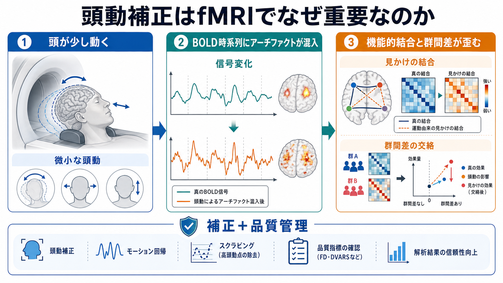
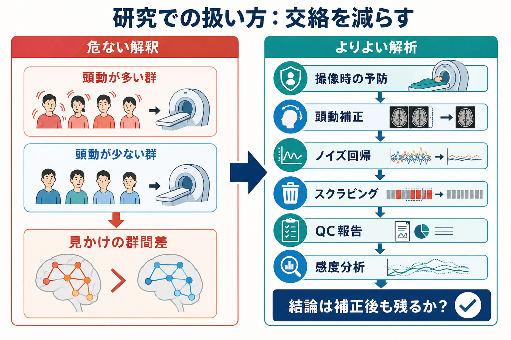

# 頭動補正はfMRIでなぜ重要なのか

## 要点

- fMRIの頭動は、単なる「画像の位置ずれ」ではなく、[[BOLD信号とは何か|BOLD信号]]の強度変化、時系列スパイク、残存する低周波変動を生む。
- 剛体位置合わせは重要な第一歩だが、完全な realignment 後にも運動関連アーチファクトは残りうることが古くから指摘されている [1]。
- 安静時fMRIや[[機能的結合解析とは何か|機能的結合解析]]では、微小な頭動が近距離結合を強く見せ、遠距離結合を弱く見せるなど、系統的な偽相関を作る [2][5]。
- 子ども、高齢者、患者群など、動きやすい集団を扱う研究では、頭動が群間差の原因そのものに見えてしまう危険がある [3][4]。
- 実務上は、撮像時の予防、頭動推定、ノイズ回帰、スクラビング、品質管理、感度分析を組み合わせ、「結論が頭動処理の選択に依存しすぎないか」を確認する [6][7][8]。

## この記事で答える問い

1. fMRIで頭が少し動くと、なぜ信号や結合推定が変わるのか。
2. 頭動補正は、画像をそろえる処理だけで十分なのか。
3. 頭動は、発達・加齢・精神疾患などの群間差研究でどのように交絡するのか。
4. 研究者は、頭動をどのように測り、報告し、補正結果を検証すべきか。

## まず結論

頭動補正が重要なのは、fMRIが「頭の中の活動」だけでなく、「測定中に脳がスキャナ内でどこにあり、どのように動いたか」に強く影響される測定だからである。頭が1 mm未満しか動かなくても、各時点のボクセルが少し違う組織を含むようになり、磁場・励起履歴・スライス取得・補間の影響も加わる。その結果、神経活動とは別の時系列変動がBOLD信号に混入する [1][2]。

とくに[[安静時fMRIは何を測っているのか|安静時fMRI]]では、解析対象がBOLD時系列どうしの相関であるため、頭動による共通ノイズがそのまま「結合」に見えやすい。Powerら、Van Dijkら、Satterthwaiteらの研究は、頭動が機能的結合の推定を系統的に歪め、微妙な群間差を神経学的差異のように見せうることを示した [2][3][4]。

## 背景

fMRIでは、多くの場合、[[BOLD信号とは何か|BOLD]]時系列を使って課題反応や自発的活動の変化を推定する。課題fMRIでは条件間の平均応答差を、安静時fMRIでは領域間の時系列相関を調べる。どちらの場合も、各時点の信号が同じ脳部位から安定して得られていることが前提になる。

しかし実際の被験者は、完全には静止できない。呼吸、嚥下、まばたき、眠気、姿勢の微調整、課題への反応、緊張によって頭部は少しずつ動く。fMRIの空間分解能は数mm程度であり、微小な動きでもボクセル内の組織構成や信号強度が変わる。さらに、動きは画像上の位置だけでなく、磁化の励起履歴やスライスごとの取得タイミングにも影響する [1]。

この問題は、発達研究、加齢研究、精神医学研究でとくに重要である。子ども、認知機能が低下した高齢者、精神疾患・神経疾患をもつ参加者は、対照群より動きやすいことがある。もし患者群が対照群よりよく動くなら、観察された結合差は疾患の神経基盤ではなく、頭動差を反映している可能性がある [3][4]。

## 基本概念

### 頭動

fMRIでいう頭動は、スキャン中の頭部の並進移動と回転を指す。多くの前処理パイプラインでは、各ボリュームを基準画像に剛体変換で位置合わせし、3つの並進量と3つの回転量を推定する。この6つの motion parameters は、後続のノイズ回帰にもよく使われる [1][8]。

### Framewise displacement

Framewise displacement、FDは、ある時点から次の時点までに頭がどれだけ動いたかを1つの値にまとめる品質指標である。FDが高い時点は、時系列にスパイク状のアーチファクトが入りやすい。Powerらは、FDと信号変化を組み合わせて、問題のあるボリュームを検出・除外する発想を広めた [2][5]。

### DVARS

DVARSは、隣接する時点間で全脳ボクセルの信号がどれだけ変化したかを表す指標である。頭動直後には、空間的に広い範囲で信号が同時に変わるため、DVARSが上がりやすい。FDが「動いた量」を表すのに対し、DVARSは「データ上の信号変化」を見る指標である [5][8]。

### 頭動補正とノイズ除去

狭い意味の頭動補正は、各fMRIボリュームの空間的位置合わせを指す。しかし実際の解析では、位置合わせだけでなく、motion parameters の回帰、白質・脳脊髄液・全脳信号などの nuisance regression、スクラビング、ICA系のノイズ除去、品質管理を含む広い意味で使われることが多い [6][7]。

## 仕組み

頭動の影響は、少なくとも4段階で考えられる。

| 段階 | 何が起きるか | 解析への影響 |
|---|---|---|
| 空間的ずれ | 同じボクセルが異なる組織を含む | 局所信号が変わる |
| 補間 | 位置合わせのために画像が再サンプリングされる | 空間的な滑らかさや信号分布が変わる |
| 強度変化 | 動きに伴う磁化履歴・スライス取得・磁場不均一の影響が残る | realignment 後も時系列にアーチファクトが残る |
| 相関への伝播 | 多くのボクセルに似たノイズが入る | 機能的結合が偽に上がる、または下がる |

Fristonらは、運動関連効果が「位置合わせ後にも残る」ことを早い段階で整理した [1]。Powerらの一連の研究は、この残存効果が安静時機能的結合の相関構造を系統的に変えることを示した。頭動由来の信号変化は、動いた瞬間だけでなく、10秒以上続くこともあり、単純な1時点の除外だけでは足りない場合がある [5]。

## 図解

図1は、頭動が「微小な動き」から「BOLD時系列の歪み」、さらに「見かけの機能的結合・群間差」へ広がる流れを示している。重要なのは、頭動の影響が単一ボクセルの小さな誤差に留まらず、ネットワーク解析の結論にまで伝播する点である。

図2は、剛体位置合わせ後にも信号変化が残りうることを示す。位置合わせは必要だが、位置合わせだけで「頭動問題が解決した」と考えるのは危険である。

図3は、研究実務での扱いをまとめたものである。頭動が多い群と少ない群を比較しているだけなら、群間差は神経活動差ではなく頭動差かもしれない。したがって、解析後に「補正後も同じ結論が残るか」を確認する必要がある。

## 臨床・研究との接続

### 発達・加齢研究

発達研究では、年齢が低いほど頭動が多くなりやすい。加齢研究でも、高齢者が若年者より動きやすい場合がある。もし年齢差と頭動差が重なっていれば、発達・老化に伴う機能的結合の変化に見えるものが、実は頭動の差かもしれない [3][4]。

### 精神医学・神経疾患研究

精神疾患や神経疾患の研究では、症状、薬剤、緊張、覚醒度、運動症状がスキャン中の動きに影響しうる。したがって、患者群と対照群の機能的結合差を解釈するときは、群ごとのFD、DVARS、除外ボリューム数、除外被験者数を報告し、頭動を統制した感度分析を行うことが望ましい [6][7]。

### 前処理パイプライン

fMRIPrepのような標準化された前処理パイプラインは、頭動推定、共変量出力、視覚的品質確認を含む透明なワークフローを提供する [8]。ただし、パイプラインを使えば自動的に結論が正しくなるわけではない。研究目的に応じて、どの confound を回帰するか、スクラビング閾値をどう置くか、群間で残存頭動があるかを検討する必要がある。

## よくある誤解

### 誤解1: realignment すれば頭動は消える

realignment は画像の位置ずれを補正するが、運動に伴う信号強度変化や励起履歴の影響までは完全には消せない。運動関連効果は、位置合わせ後にも残ることがある [1][5]。

### 誤解2: 少ししか動いていないなら問題にならない

機能的結合解析では、0.1 mm程度の微小運動であっても、相関構造に系統的な影響を与えうる。問題は動きの大きさだけでなく、動きがいつ起きたか、群間で偏っているか、信号変化として残っているかである [2][3]。

### 誤解3: 頭動を共変量に入れれば十分

群レベルで平均FDを共変量に入れるだけでは、各被験者内の時系列アーチファクトを取り除けないことがある。被験者内でのノイズ回帰、スクラビング、品質閾値、感度分析を組み合わせる必要がある [5][6][7]。

### 誤解4: たくさん補正すればするほどよい

補正を強くしすぎると、自由度が減り、信号も一部失われる。Parkesらは、頭動補正戦略には有効性、信頼性、感度のトレードオフがあることを評価している [7]。目的に応じて、複数の妥当な処理で結論がどれだけ安定するかを見るのが実務的である。

## 関連ノート

- [[fMRIは神経活動を直接測っているのか]]
- [[BOLD信号とは何か]]
- [[安静時fMRIは何を測っているのか]]
- [[機能的結合解析とは何か]]
- [[シードベース解析とは何か]]
- [[独立成分分析ICAはfMRIでどう使われるのか]]

MOC更新候補: `content/00_MOC/` 配下の脳画像・神経計測またはfMRI関連MOCに、本記事 `[[頭動補正はfMRIでなぜ重要なのか]]` を追加する。

今後の作成候補: `[[FDとは何か]]`, `[[DVARSとは何か]]`, `[[スクラビングとは何か]]`, `[[fMRIのノイズ回帰とは何か]]`。

## 理解チェック

1. 頭動補正が「画像をそろえる処理」だけでは不十分な理由を、BOLD時系列の観点から説明できるか。
2. FDとDVARSは、それぞれ何を測る指標か。
3. 患者群が対照群より動きやすい研究で、機能的結合の群間差を解釈するときに何を確認すべきか。
4. 頭動補正を強くすることの利点と欠点を1つずつ挙げられるか。

## 参考文献

[1] Friston, K. J., Williams, S., Howard, R., Frackowiak, R. S. J., & Turner, R. (1996). Movement-related effects in fMRI time-series. *Magnetic Resonance in Medicine*, 35(3), 346-355. https://doi.org/10.1002/mrm.1910350312

[2] Power, J. D., Barnes, K. A., Snyder, A. Z., Schlaggar, B. L., & Petersen, S. E. (2012). Spurious but systematic correlations in functional connectivity MRI networks arise from subject motion. *NeuroImage*, 59(3), 2142-2154. https://doi.org/10.1016/j.neuroimage.2011.10.018

[3] Van Dijk, K. R. A., Sabuncu, M. R., & Buckner, R. L. (2012). The influence of head motion on intrinsic functional connectivity MRI. *NeuroImage*, 59(1), 431-438. https://doi.org/10.1016/j.neuroimage.2011.07.044

[4] Satterthwaite, T. D., Wolf, D. H., Loughead, J., Ruparel, K., Elliott, M. A., Hakonarson, H., Gur, R. C., & Gur, R. E. (2012). Impact of in-scanner head motion on multiple measures of functional connectivity: Relevance for studies of neurodevelopment in youth. *NeuroImage*, 60(1), 623-632. https://doi.org/10.1016/j.neuroimage.2011.12.063

[5] Power, J. D., Mitra, A., Laumann, T. O., Snyder, A. Z., Schlaggar, B. L., & Petersen, S. E. (2014). Methods to detect, characterize, and remove motion artifact in resting state fMRI. *NeuroImage*, 84, 320-341. https://doi.org/10.1016/j.neuroimage.2013.08.048

[6] Ciric, R., Wolf, D. H., Power, J. D., Roalf, D. R., Baum, G. L., Ruparel, K., Shinohara, R. T., Elliott, M. A., Eickhoff, S. B., Davatzikos, C., Gur, R. C., Gur, R. E., Bassett, D. S., & Satterthwaite, T. D. (2017). Benchmarking of participant-level confound regression strategies for the control of motion artifact in studies of functional connectivity. *NeuroImage*, 154, 174-187. https://doi.org/10.1016/j.neuroimage.2017.03.020

[7] Parkes, L., Fulcher, B., Yucel, M., & Fornito, A. (2018). An evaluation of the efficacy, reliability, and sensitivity of motion correction strategies for resting-state functional MRI. *NeuroImage*, 171, 415-436. https://doi.org/10.1016/j.neuroimage.2017.12.073

[8] Esteban, O., Markiewicz, C. J., Blair, R. W., Moodie, C. A., Isik, A. I., Erramuzpe, A., Kent, J. D., Goncalves, M., DuPre, E., Snyder, M., Oya, H., Ghosh, S. S., Wright, J., Durnez, J., Poldrack, R. A., & Gorgolewski, K. J. (2019). fMRIPrep: A robust preprocessing pipeline for functional MRI. *Nature Methods*, 16, 111-116. https://doi.org/10.1038/s41592-018-0235-4

## 未解決問題

- 頭動補正戦略の最適解は、課題fMRI、安静時fMRI、発達研究、臨床群研究で同じとは限らない。
- グローバル信号回帰は頭動由来の広域ノイズを減らしうる一方、負の相関や群差の解釈を変えるため、研究目的に応じた明示的判断が必要である。
- 深層学習や大規模標準パイプラインが進んでも、被験者の撮像時行動、除外基準、残存交絡の報告は省略できない。
