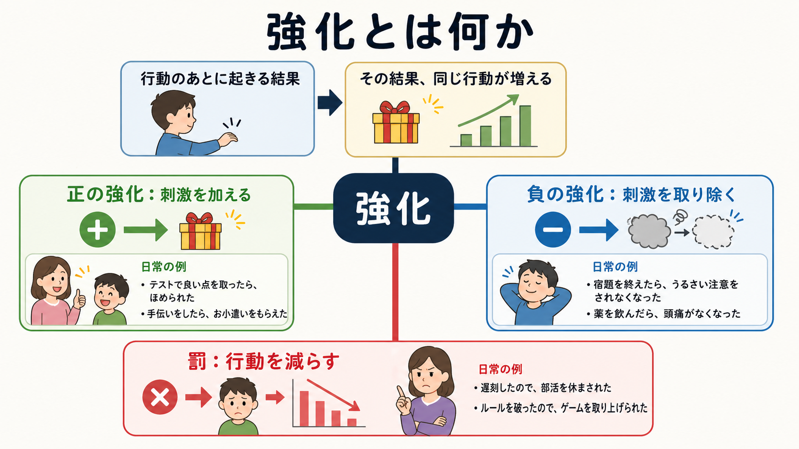
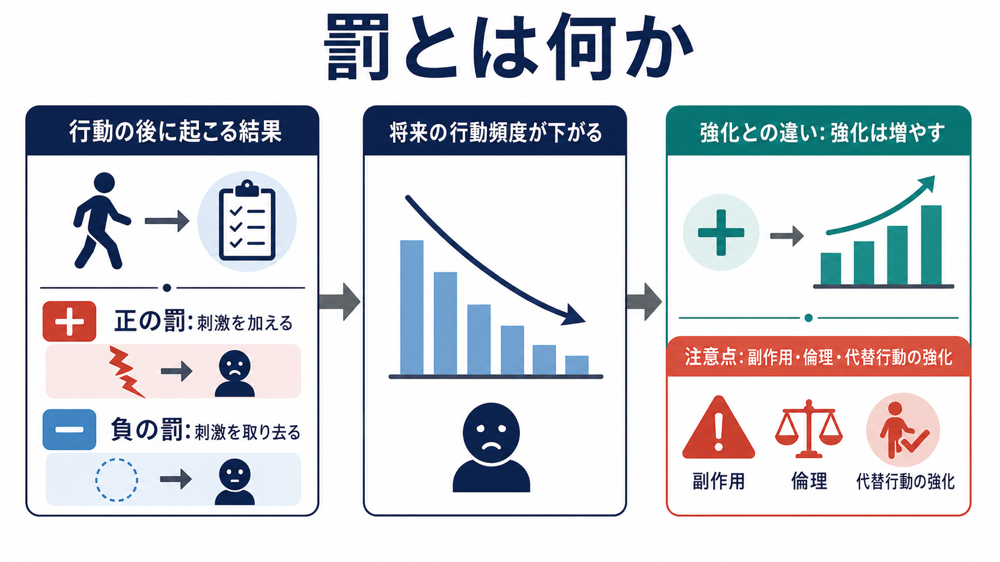
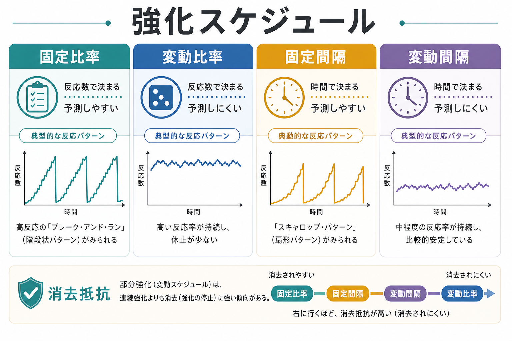

# オペラント条件づけとは何か

## 要点

- オペラント条件づけは、ある行動のあとに起こる結果によって、その行動が将来どれくらい起こりやすくなるかが変わる学習原理である[1][2]。
- 強化は行動の頻度を増やす結果、罰は行動の頻度を減らす結果を指す。ここでいう「正」「負」は、良い・悪いではなく、刺激を加えるか取り除くかを表す。
- 行動は単独で増減するのではなく、先行条件、行動、結果の三項随伴性の中で変化する[2][3]。
- 強化の与え方には、連続強化、固定比率、変動比率、固定間隔、変動間隔などのスケジュールがあり、反応の安定性や消去への抵抗性を変える[4][5]。
- 臨床・教育・リハビリテーションでは有用な枠組みだが、個別の診断や治療指示ではなく、行動と環境の関係を分析する教育・研究上の概念として扱う必要がある[6]。

## この記事で答える問い

この記事では、[[長期記憶とは何か]]や[[シナプス可塑性とは何か]]で扱う学習・記憶の広い枠組みを背景に、次の問いに答える。

1. オペラント条件づけは、古典的条件づけや単なる報酬と何が違うのか。
2. 強化、罰、消去、弁別刺激はどのように関係するのか。
3. 強化スケジュールは、なぜ行動パターンを変えるのか。
4. 研究・臨床・教育で使うとき、どのような限界と倫理的注意があるのか。

## まず結論

オペラント条件づけは、「行動の結果が、次に同じ行動が起こる確率を変える」という学習原理である。たとえば、ある行動のあとに望ましい結果が続けば、その行動は増えやすい。逆に、ある行動のあとに不快な結果が続く、または望ましいものが失われるなら、その行動は減りやすい。

重要なのは、結果が「本人にとって快いか不快か」だけではなく、実際に行動頻度をどう変えたかで定義される点である。ほめたつもりでも行動が増えなければ強化とは言いにくいし、罰したつもりでも行動が減らなければ罰として機能していない。したがって、オペラント条件づけは、内面を無視する理論というより、観察可能な行動、状況、結果の関係を精密に記述する方法として理解するとよい[1][3]。

## 背景

オペラント条件づけの源流には、Thorndike の効果の法則がある。効果の法則は、満足をもたらす結果に続く反応は同じ状況で再び起こりやすくなり、不快な結果に続く反応は起こりにくくなる、という考えである[1]。この発想を、Skinner は実験的行動分析として発展させ、環境に働きかけて結果を生む行動を「オペラント」として扱った[2]。

古典的条件づけが、刺激と刺激の連合により反射的・自動的な反応が変化する学習を扱うのに対し、オペラント条件づけは、行動が環境に作用し、その結果によって将来の行動頻度が変わる学習を扱う。もちろん、実際の行動では両者は分離しきれない。恐怖、不安、報酬期待、注意、身体状態は、行動の起こりやすさを変える。[[PTSDでは恐怖記憶ネットワークに何が起きているのか]]で扱う恐怖条件づけのような刺激反応学習と、結果に基づく行動選択は、現実の臨床・教育場面ではしばしば重なって現れる。

## 基本概念

### オペラント

オペラントとは、環境に働きかけ、何らかの結果を生む行動である。レバーを押す、発言する、スマートフォンを確認する、課題を避ける、助けを求めるなど、行動の形はさまざまである。重要なのは、その行動がどのような状況で起こり、どのような結果を伴い、その後に増えたか減ったかである。

### 強化

強化とは、行動のあとに起こる結果によって、その行動の将来頻度が増えることである。正の強化は、行動のあとに刺激が加わり、行動が増える場合である。負の強化は、行動のあとに嫌悪的刺激が取り除かれ、行動が増える場合である。負の強化は罰ではない。どちらも行動を増やす過程である。

### 罰

罰とは、行動のあとに起こる結果によって、その行動の将来頻度が減ることである。正の罰は、行動のあとに嫌悪的刺激が加わり、行動が減る場合である。負の罰は、行動のあとに望ましい刺激が取り除かれ、行動が減る場合である。罰は短期的に行動を抑えることがあるが、副作用、回避、攻撃、隠蔽、代替行動の未学習などの問題を伴いうるため、応用では慎重な設計が必要である[6]。

### 消去

消去とは、それまで行動を維持していた強化が与えられなくなることで、行動が弱まる過程である。消去は「記憶が消える」ことではなく、特定の状況で特定の行動が強化されにくいことを新たに学ぶ過程として理解する方がよい。消去の初期には、行動が一時的に増える消去バーストが起こることもある。

### 弁別刺激

弁別刺激とは、その行動が強化されやすい状況を知らせる手がかりである。たとえば、ある先生の授業では質問が歓迎されるが、別の場面では無視されるなら、同じ「質問する」という行動でも、状況によって起こりやすさが変わる。行動は「性格」だけで説明されるのではなく、どの環境でどの結果が続くかによって調整される。

## 仕組み

### 三項随伴性で見る

オペラント条件づけの中心は、先行条件、行動、結果の三項随伴性である。先行条件は行動が起こる文脈を作る。行動は環境に働きかける。結果は、その行動が次回以降に起こる確率を変える。この三つを分けて見ると、「なぜその行動が続いているのか」を、本人の意思の強弱だけに還元せずに分析できる[2][3]。

たとえば、子どもが課題中に席を立つ行動を考える。席を立ったあとに難しい課題から離れられるなら、その行動は負の強化で増えるかもしれない。席を立ったあとに大人が強く反応し、その反応が本人にとって注目として機能するなら、正の強化で増えるかもしれない。同じ行動でも、維持している結果は異なりうる。

### 強化スケジュールが行動パターンを変える

強化は、毎回与えられるとは限らない。連続強化では、行動のたびに強化が起こる。部分強化では、ある比率や時間間隔に従って強化が起こる。Ferster と Skinner の強化スケジュール研究は、固定比率、変動比率、固定間隔、変動間隔といった強化の配置が、反応率、休止、安定性、消去抵抗を大きく変えることを示した[4][5]。

固定比率では、一定回数の反応ごとに強化が起こるため、高い反応率と強化後休止が出やすい。変動比率では、必要反応数が変動するため、安定した高頻度の反応が維持されやすい。固定間隔では、一定時間が経つと最初の反応が強化されるため、時間が近づくにつれて反応が増える扇形のパターンが出やすい。変動間隔では、比較的安定した中程度の反応が続きやすい。

### 価値、予測、行動選択とつながる

現代の認知神経科学や機械学習では、オペラント条件づけは強化学習と接続して理解されることが多い。強化学習では、エージェントが環境と相互作用し、報酬や罰に相当する結果から、将来の価値を最大化する行動方策を更新する[7]。これは Skinner 的な行動分析と同一ではないが、「行動、結果、将来の選択確率」という構造を共有している。

神経科学では、報酬予測誤差に似たドパミン信号が、行動価値の更新と関係することが示されてきた[8]。ただし、[[ドパミンは報酬だけの物質なのか]]で整理されるように、ドパミンを単純な快楽物質として扱うのは粗すぎる。ドパミンは、報酬予測、動機づけ、行動の活性化、運動制御、注意喚起にまたがる調節信号であり、オペラント条件づけの全体を単独で説明するものではない。

## 図解

図1は、強化を「行動のあとに起こる結果が、その行動を増やす過程」として整理している。正の強化は刺激を加えること、負の強化は刺激を取り除くことで、どちらも行動頻度を増やす。

図2は、罰を「行動のあとに起こる結果が、その行動を減らす過程」として整理している。罰は強化の反対語として便利だが、応用では副作用や倫理的問題を必ず検討する必要がある。

図3は、強化スケジュールの比較である。行動が「強化されるかどうか」だけでなく、「どのタイミングで、どの規則で強化されるか」が、行動パターンの形を変える。

## 臨床・研究との接続

臨床・教育場面では、オペラント条件づけは「問題行動を罰する技術」ではなく、行動がどのような文脈と結果によって維持されているかを調べる枠組みとして重要である。応用行動分析では、社会的に重要な行動を対象に、強化、消去、弁別刺激、機能的アセスメントなどを用いて、環境と行動の関係を変える[6]。

精神医学や臨床心理学では、回避行動、依存、強迫的行動、活動低下、リハビリテーションへの参加などが、結果による学習と関係する。たとえば、回避行動は不安を一時的に下げるため負の強化で維持されることがある。これは本人の弱さではなく、短期的な苦痛軽減が長期的な問題を維持する学習構造として理解できる。

ADHD の報酬遅延や行動選択を考えるときも、[[ADHDは前頭線条体回路の障害として説明できるのか]]で扱うように、強化のタイミング、遅延、予測可能性が重要になる。[[直接路と間接路は行動選択をどう制御するのか]]のような基底核回路の話と合わせると、オペラント条件づけは、環境レベルの随伴性と神経回路レベルの行動選択をつなぐ入口になる。

ただし、臨床応用では、ここで述べる原理を個別診断や治療指示として使ってはならない。特定の介入が適切かどうかは、本人の発達、権利、苦痛、環境、併存症、家族・学校・職場の条件、専門職の評価を含めて判断される。

## よくある誤解

### 誤解1: 強化はご褒美のことだけである

強化は、ご褒美そのものではなく、行動を増やした結果の機能で定義される。ほめ言葉、食べ物、お金、注目、課題からの解放、痛みの軽減など、何が強化として働くかは状況と個人によって異なる。

### 誤解2: 負の強化は罰である

負の強化は、嫌悪的刺激が取り除かれることで行動が増える過程である。罰は、行動が減る過程である。「負」という語は、刺激を取り除くという意味であり、悪いという意味ではない。

### 誤解3: オペラント条件づけは人間の内面を否定する

オペラント条件づけは、内面が存在しないと主張する必要はない。むしろ、主観的な苦痛、報酬期待、注意、疲労、社会的意味が、どのような状況でどの行動に結びつくかを分析するための道具として使える。ただし、内面の説明だけで行動の維持要因を見落とさないようにする点が重要である。

### 誤解4: 罰を強めれば問題行動は解決する

罰は行動を一時的に抑えることがあるが、望ましい代替行動を教えるとは限らない。さらに、回避、隠蔽、攻撃、関係悪化、倫理的問題を生むことがある。応用では、行動の機能を調べ、代替行動を強化し、環境を調整することが中心になる[6]。

## 関連ノート

既存ノート:

- [[長期記憶とは何か]]
- [[シナプス可塑性とは何か]]
- [[ドパミンは報酬だけの物質なのか]]
- [[ADHDは前頭線条体回路の障害として説明できるのか]]
- [[直接路と間接路は行動選択をどう制御するのか]]
- [[PTSDでは恐怖記憶ネットワークに何が起きているのか]]
- [[認知的柔軟性とは何か]]

関連ノート候補:

- 古典的条件づけとは何か
- 強化学習とは何か
- 報酬予測誤差とは何か
- 応用行動分析とは何か
- 回避行動は不安をどう維持するのか
- 習慣形成とは何か

MOC更新候補:

- `content/00_MOC/MOC｜認知科学・心理学.md` の「学習・行動・動機づけ」周辺に本記事へのリンクを追加する。
- 並列ジョブとの競合を避けるため、このタスクでは MOC 本体は更新しない。

## 理解チェック

1. 強化と罰は、それぞれ何を基準に定義されるか。
2. 正の強化、負の強化、正の罰、負の罰を、良い・悪いではなく「加える / 取り除く」と「増える / 減る」で説明できるか。
3. 三項随伴性では、先行条件、行動、結果のどこを観察するか。
4. 固定比率、変動比率、固定間隔、変動間隔は、行動パターンにどのような違いを生むか。
5. 罰だけに頼る介入には、どのような限界や倫理的問題があるか。

## 参考文献

[1] Thorndike, E. L. (1911). *Animal Intelligence: Experimental Studies*. Macmillan. https://archive.org/details/animalintelligen00thor

[2] Skinner, B. F. (1938). *The Behavior of Organisms: An Experimental Analysis*. Appleton-Century. https://www.bfskinner.org/product/the-behavior-of-organisms-pdf/

[3] Staddon, J. E. R., & Cerutti, D. T. (2003). Operant conditioning. *Annual Review of Psychology, 54*, 115-144. https://doi.org/10.1146/annurev.psych.54.101601.145124

[4] Ferster, C. B., & Skinner, B. F. (1957). *Schedules of Reinforcement*. Appleton-Century-Crofts. https://archive.org/details/schedulesofreinf0000fers

[5] B. F. Skinner Foundation. (n.d.). *Schedules of Reinforcement*. https://www.bfskinner.org/product/schedules-of-reinforcement/

[6] Cooper, J. O., Heron, T. E., & Heward, W. L. (2019). *Applied Behavior Analysis* (3rd ed.). Pearson. https://contextualscience.org/publications/cooper_heron_heward_2019

[7] Sutton, R. S., & Barto, A. G. (2018). *Reinforcement Learning: An Introduction* (2nd ed.). MIT Press. http://incompleteideas.net/book/the-book-2nd.html

[8] Schultz, W., Dayan, P., & Montague, P. R. (1997). A neural substrate of prediction and reward. *Science, 275*(5306), 1593-1599. https://doi.org/10.1126/science.275.5306.1593

## 未解決問題

- 実験室で定義された強化スケジュールを、複雑な社会環境の行動にどこまで一般化できるのか。
- 報酬予測誤差、主観的価値、社会的意味づけ、習慣形成を、単一の行動モデルでどこまで統合できるのか。
- 罰を最小化しながら、本人の権利と生活の質を守る行動支援をどのように設計できるのか。

## 更新ログ

- 2026-04-27: 初稿作成。強化、罰、三項随伴性、強化スケジュール、臨床・研究との接続を整理し、画像3枚と主要参考文献を追加。
