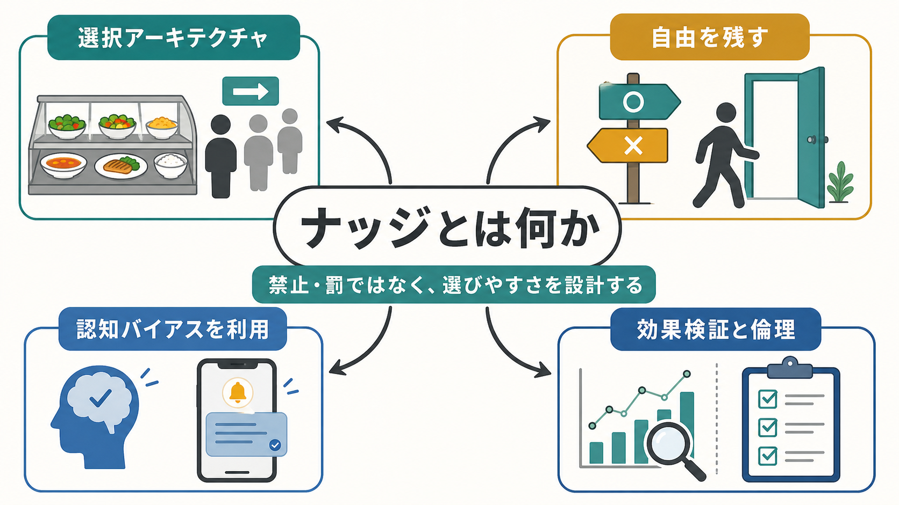
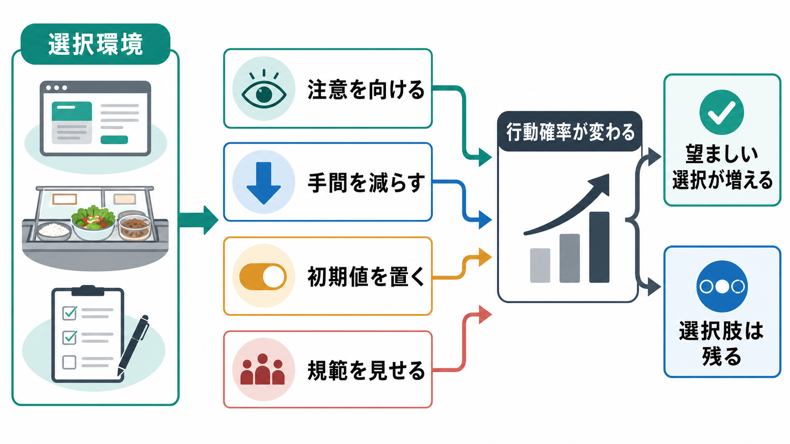

# ナッジとは何か

## 要点

- ナッジとは、選択肢を禁止したり大きな金銭的誘因を与えたりせず、選択環境の設計によって望ましい行動を選びやすくする介入である[1]。
- 典型例は、デフォルト設定、選択肢の並べ方、リマインダー、社会的規範の提示、手続きの簡素化である[2]。
- ナッジは[[認知バイアスとは何か]]や[[ヒューリスティックとは何か]]を「誤り」として取り除くのではなく、[[意思決定とは何か]]が環境に依存することを前提に設計する。
- 効果は平均的には認められるが、領域、技法、測定方法によって大きく変わり、逆効果もありうる[6][7]。
- 研究・実践では、透明性、撤回可能性、公平性、効果測定を含む倫理的な設計が不可欠である[5]。

## この記事で答える問い

この記事では、ナッジを「人を操作する小技」としてではなく、行動科学に基づく選択環境の設計として整理する。中心となる問いは、次の4つである。

1. ナッジは、情報提供、インセンティブ、規制と何が違うのか。
2. なぜ選択肢の並べ方や初期設定だけで行動が変わるのか。
3. ナッジの効果はどの程度信頼できるのか。
4. 臨床・公衆衛生・研究で使うとき、どのような倫理的注意が必要か。

## まず結論

ナッジは、個人の選択を消さずに、望ましい選択が自然に起こりやすいように環境を整える方法である。たとえば、健康的な食品を目に入りやすい場所に置く、臓器提供や年金加入の初期設定を設計する、予約忘れを防ぐリマインダーを送る、といった介入が含まれる。

ただし、ナッジは万能な行動変容技術ではない。構造的な貧困、制度的不利益、強い依存、重い精神症状、長期的な動機づけの問題を、選択画面の工夫だけで解決することはできない。ナッジは、規制、支援、治療、教育、環境整備と組み合わせて使う補助的な設計原理として理解するのがよい。

## 背景

ナッジという概念は、行動経済学と政策設計の接点から広まった。Thaler と Sunstein は、人間が完全情報・無制限の計算能力・安定した選好をもつ合理的主体として常に行動するわけではないことを前提に、自由を残しながら選択をよい方向へ導く「リバタリアン・パターナリズム」を提案した[1]。

この発想の背景には、[[リスク下の意思決定はどのように行われるのか]]、現在バイアス、損失回避、デフォルト効果、社会的影響、注意資源の制約などがある。人は、自分の価値観に反する選択をしたいわけではなくても、時間がない、比較が難しい、選択肢が多すぎる、面倒で先延ばしになる、といった条件で望ましい行動から外れやすい。

政策実務では、MINDSPACE や EAST のようなフレームワークが、行動に影響する要因を整理する道具として使われてきた[3][4]。これらは、単に「人を説得する」よりも、行動が起こる状況そのものを観察し、摩擦や注意の流れを変えることを重視する。

## 基本概念

### ナッジ

ナッジとは、選択肢を閉じず、経済的な損得を大きく変えずに、行動の起こりやすさを変える選択環境の設計である[1]。重要なのは、介入の焦点が「態度を変える説得」だけではなく、「選ぶ場面をどう構成するか」にある点である。

たとえば、同じ選択肢でも、次のような設計で選ばれ方は変わる。

| 設計要素 | 例 | 作用しやすい心理過程 |
|---|---|---|
| デフォルト | 何もしない場合の標準設定 | 現状維持、惰性、推奨のシグナル |
| 目立たせ方 | 健康的選択肢を視線の位置に置く | 注意、可用性 |
| 手間の削減 | 申請フォームを短くする | 認知負荷、摩擦費用 |
| 社会的規範 | 多くの人が実行していることを示す | 同調、規範推論 |
| リマインダー | 予約・服薬・課題提出の通知 | 記憶、先延ばし、[[自己制御とは何か]] |

### 選択アーキテクチャ

選択アーキテクチャとは、選択肢が提示される物理的・社会的・情報的な環境のことである。カフェテリアの配置、オンライン画面、同意書、予約システム、臨床面接の質問順序、研究参加への導線などはすべて選択アーキテクチャである。

選択アーキテクチャが存在しない中立的な選択場面はほとんどない。したがって問題は、「設計するか、しないか」ではなく、「どの価値と根拠に基づいて設計するか」である。

## 仕組み

ナッジは、主に次の経路を通じて行動確率を変える。

### 1. 注意を向ける

人の注意は有限であり、すべての選択肢を均等に評価しているわけではない。目立つ位置、わかりやすいラベル、タイミングのよい通知は、選択肢が検討対象に入る確率を上げる。EAST の「Attractive」「Timely」は、この注意とタイミングの設計を重視する[4]。

### 2. 手間を減らす

望ましい行動に必要な手順が多いほど、実行確率は下がる。フォームの簡素化、予約導線の短縮、ワンクリック登録、必要物品の近接配置は、意志力を強くするのではなく、行動開始の摩擦を減らす。これは[[プロクラステイネーションはなぜ起こるのか]]や[[習慣形成にはどのような条件が必要なのか]]とも関係する。

### 3. 初期値を置く

デフォルトは、選択しないこと自体を一つの選択にする。デフォルト効果のメタ分析では、デフォルトは全体として有意な影響をもつが、領域や意味づけによって効果が変わることが示されている[8]。デフォルトが「専門家の推奨」や「標準的な状態」と解釈される場合、効果が強くなりやすい。

### 4. 規範を見せる

人は、他者が何をしているかを手がかりに行動を調整する。社会的規範の提示は、特に自分の判断に不確実性がある場面で働きやすい。ただし、望ましくない行動が「多くの人に普通に行われている」と伝わると、逆にその行動を正当化する危険がある。

### 5. 行動後のフィードバックを作る

ナッジは一回の選択だけでなく、行動後のフィードバックにも関わる。達成状況の可視化、比較可能な数値、次の小さな行動の提示は、[[強化とは何か]]や[[動機づけとは何か]]と接続する。ただし、外的な表示や報酬だけに依存すると、長期的な自律性や内発的動機づけを損なう可能性もある。

## 図解

ナッジは、政策手段の階段の中では「情報提供」より行動に近く、「規制・禁止」より自由を残す位置にある。倫理的に良いナッジには、少なくとも透明性、撤回しやすさ、公平性、効果測定が必要である[5]。

## 効果はどこまで確かか

ナッジ研究のメタ分析では、選択アーキテクチャ介入は全体として小から中程度の効果をもち、意思決定の構造そのものを変える介入が比較的強い効果を示すと報告されている[6]。一方で、効果量には大きな異質性があり、出版バイアスや領域差も問題になる[6]。

別の定量レビューでは、100本の一次研究、317効果量を整理し、ナッジの効果が技法と文脈に依存すること、すべてのナッジが有効ではないことが示された[7]。したがって、「ナッジは効くか」という問いは粗すぎる。より重要なのは、「どの対象者に、どの場面で、どの行動を、どの測定指標で、どれくらいの期間変えるのか」である。

実践では、次の順序で考えるとよい。

1. 望ましい行動を一つに絞る。
2. 現在の行動が起こる場面を観察する。
3. 摩擦、注意、初期値、規範、タイミングを仮説化する。
4. 小さな介入を設計する。
5. 可能ならランダム化比較や準実験で検証する。
6. 平均効果だけでなく、不利益を受ける集団がないかを見る。

## 臨床・研究との接続

臨床や公衆衛生では、ナッジは診断や治療の代替ではなく、支援へのアクセスや継続を助ける環境設計として使える。たとえば、予約忘れを減らすリマインダー、受診手続きの簡素化、服薬確認の見える化、健康行動の開始を助ける実装意図の促しなどが考えられる。

ただし、精神医学・臨床心理学の文脈では注意が必要である。抑うつ、強迫、依存、不安、認知機能低下、社会的困難がある人に対して、「選びやすくしたのだから選ばない本人の責任だ」と解釈してはならない。行動しやすい環境を作ることと、困難の原因を個人に帰すことは別である。

研究では、ナッジは[[行動活性化とは何か]]、[[遅延割引とは何か]]、[[習慣学習とは何か]]、[[外発的動機づけとは何か]]との接点をもつ。行動の開始、維持、撤退、習慣化を分けて測定すれば、ナッジが短期的な選択だけを変えるのか、長期的な行動パターンも変えるのかを検討できる。

## よくある誤解

### 誤解1: ナッジは洗脳や操作である

ナッジには操作的になりうる危険がある。しかし、すべての選択環境は何らかの形で行動に影響している。倫理的なナッジでは、目的を明示し、選択肢を残し、撤回可能にし、効果と副作用を検証することが求められる[5]。

### 誤解2: ナッジは安いので、制度改革の代わりになる

ナッジは低コストで実装できることが多いが、制度的な問題を置き換えるものではない。たとえば健康格差、貧困、差別、労働環境の問題に対して、個人の選択画面だけを変えても限界がある。ナッジは、構造的介入を補完するものとして位置づけるべきである。

### 誤解3: 効果が出たナッジはどこでも使える

同じデフォルトやリマインダーでも、文化、制度、信頼、対象行動、測定期間によって効果は変わる[6][7]。実装前には、対象集団と現場の文脈を確認し、導入後には効果測定を行う必要がある。

### 誤解4: 自由を残せば倫理的に問題ない

形式的に選択肢が残っていても、情報が隠されている、撤回が難しい、不利益が特定集団に偏る、目的が本人の利益とずれている場合には問題がある。ナッジの倫理は「選べるか」だけでなく、「理解できるか」「拒否できるか」「誰が得をするか」を問う。

## 限界と未解決問題

- 長期効果: 短期の選択変化が、[[習慣形成にはどのような条件が必要なのか]]でいう安定した習慣につながるとは限らない。
- 一般化可能性: 実験室、オンライン、現場介入では効果が異なる可能性がある。
- 分配影響: 平均効果が正でも、認知的・社会的に脆弱な集団へ不利益が集中する場合がある。
- 価値判断: 「望ましい行動」を誰が、どの根拠で決めるのかは、科学だけでは決まらない。
- ダークパターンとの差異: ユーザーの利益ではなく提供者の利益を優先する設計は、ナッジというより操作的な選択アーキテクチャである。

## 関連ノート

- [[意思決定とは何か]]
- [[リスク下の意思決定はどのように行われるのか]]
- [[認知バイアスとは何か]]
- [[ヒューリスティックとは何か]]
- [[自己制御とは何か]]
- [[プロクラステイネーションはなぜ起こるのか]]
- [[習慣形成にはどのような条件が必要なのか]]
- [[動機づけとは何か]]
- [[遅延割引とは何か]]
- [[行動活性化とは何か]]

## MOC更新候補

- `content/00_MOC/MOC｜認知科学・心理学.md`
- `content/00_MOC/MOC｜倫理・哲学・社会.md`

並列生成ジョブとの衝突を避けるため、このノートから MOC 本体への追記は行っていない。

## 理解チェック

1. ナッジとインセンティブの違いは何か。
2. デフォルトが行動に影響する理由を、現状維持、推奨のシグナル、手間の観点から説明できるか。
3. ナッジが逆効果になる場面を一つ挙げられるか。
4. 臨床・公衆衛生でナッジを使うとき、なぜ透明性と撤回可能性が重要なのか。
5. ナッジだけでは扱いにくい構造的問題を一つ挙げられるか。

## 参考文献

[1] Thaler, R. H., & Sunstein, C. R. (2008). *Nudge: Improving Decisions About Health, Wealth, and Happiness*. Yale University Press. https://mitpressbookstore.mit.edu/book/9780300122237 ; Thaler, R. H., & Sunstein, C. R. (2003). Libertarian Paternalism Is Not an Oxymoron. *University of Chicago Law Review*, 70, 1159. https://hls.harvard.edu/bibliography/libertarian-paternalism-is-not-an-oxymoron/

[2] Münscher, R., Vetter, M., & Scheuerle, T. (2016). A Review and Taxonomy of Choice Architecture Techniques. *Journal of Behavioral Decision Making*, 29(5), 511-524. https://doi.org/10.1002/bdm.1897

[3] Dolan, P., Hallsworth, M., Halpern, D., King, D., & Vlaev, I. (2010). *MINDSPACE: Influencing behaviour through public policy*. Institute for Government. https://www.instituteforgovernment.org.uk/publication/report/mindspace ; Dolan, P., Hallsworth, M., Halpern, D., King, D., Metcalfe, R., & Vlaev, I. (2012). Influencing behaviour: The mindspace way. *Journal of Economic Psychology*, 33(1), 264-277. https://doi.org/10.1016/j.joep.2011.10.009

[4] Behavioural Insights Team. (2014/2017). *EAST: Four simple ways to apply behavioural insights*. https://www.bi.team/publications/east-four-simple-ways-to-apply-behavioural-insights/

[5] OECD. (2019). *Tools and Ethics for Applied Behavioural Insights: The BASIC Toolkit*. OECD Publishing. https://doi.org/10.1787/9ea76a8f-en

[6] Mertens, S., Herberz, M., Hahnel, U. J. J., & Brosch, T. (2022). The effectiveness of nudging: A meta-analysis of choice architecture interventions across behavioral domains. *Proceedings of the National Academy of Sciences*, 119(1), e2107346118. https://doi.org/10.1073/pnas.2107346118

[7] Hummel, D., & Maedche, A. (2019). How effective is nudging? A quantitative review on the effect sizes and limits of empirical nudging studies. *Journal of Behavioral and Experimental Economics*, 80, 47-58. https://doi.org/10.1016/j.socec.2019.03.005

[8] Jachimowicz, J. M., Duncan, S., Weber, E. U., & Johnson, E. J. (2019). When and why defaults influence decisions: A meta-analysis of default effects. *Behavioural Public Policy*, 3(2), 159-186. https://doi.org/10.1017/bpp.2018.43
