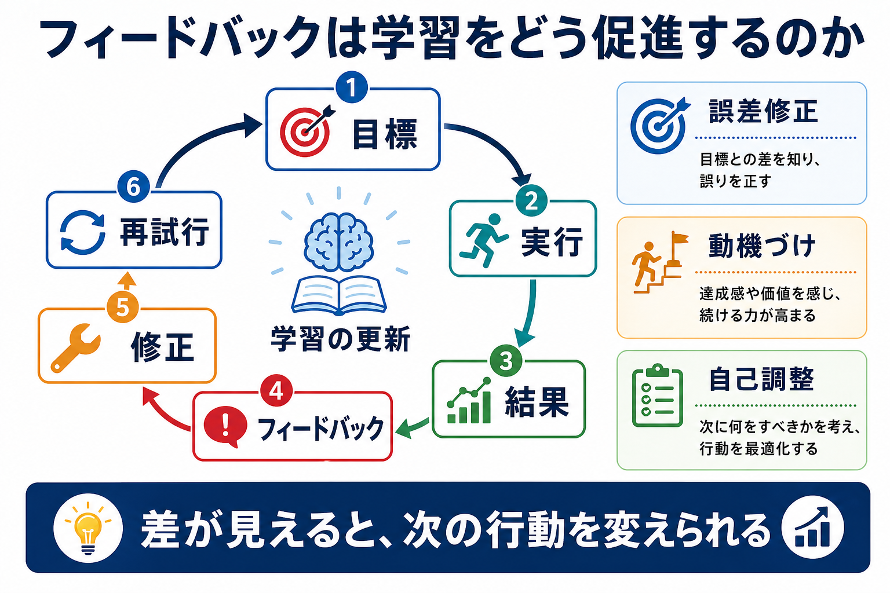
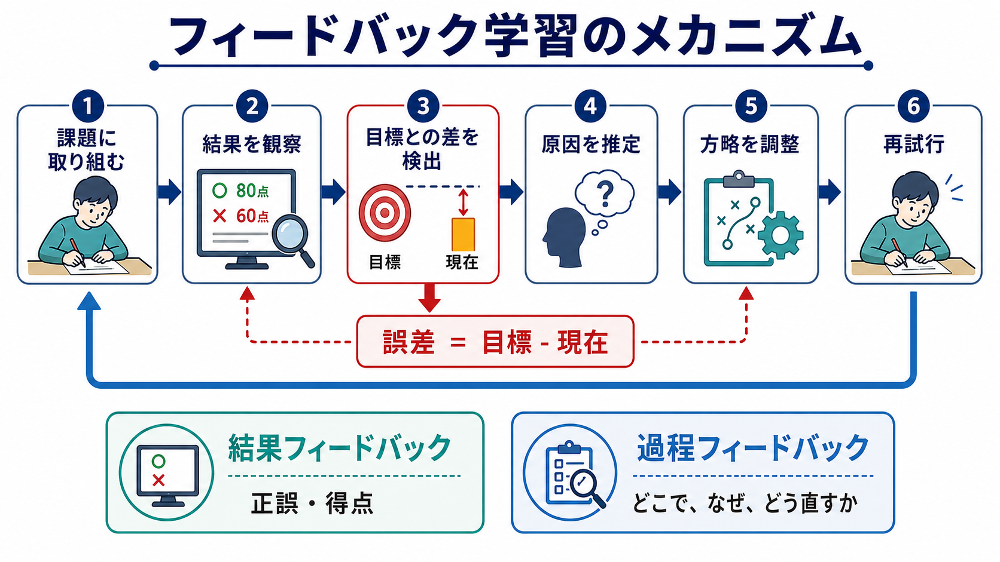
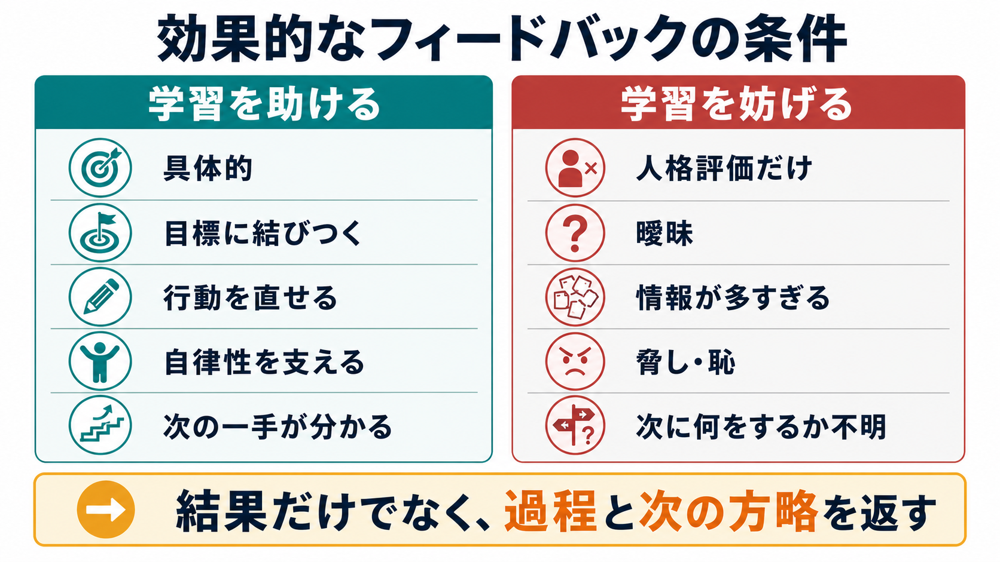

# フィードバックは学習をどう促進するのか

## 要点

- フィードバックは、学習者に「目標と現在の差」「何を変えればよいか」「次にどう進むか」を知らせる情報である。
- 効果は一様ではなく、内容、タイミング、課題、学習者の既有知識、動機づけによって変わる[1][2]。
- 学習を促すフィードバックは、正誤だけでなく、誤りの場所、原因、次の方略を示す[3][4]。
- 人格評価や脅しとして受け取られるフィードバックは、注意を課題から自己防衛へ移し、成績を下げることがある[5]。
- 動機づけの面では、能力を統制する評価よりも、有能感と自律性を支える情報として返すことが重要である[6]。

## この記事で答える問い

1. フィードバックは、なぜ単なる「正解発表」ではないのか。
2. 結果フィードバックと過程フィードバックは何が違うのか。
3. フィードバックは、誤差修正と動機づけをどのように結びつけるのか。
4. よいフィードバックが、自己調整学習や臨床・研究にどう接続するのか。

## まず結論

フィードバックは、学習者が自分の現在位置を知り、目標との差を小さくするための情報である。正誤や点数だけでも役に立つ場合はあるが、それだけでは「なぜ誤ったのか」「次に何を変えるべきか」が分からない。学習を深めるには、課題の目標、現在の反応、誤差、原因、次の行動がつながる必要がある[2][3]。

ただし、フィードバックは常に有益ではない。メタ分析では平均的には学習を促進するが、効果には大きなばらつきがあり、学習者の注意を課題から自己評価へ逸らす介入は逆効果になりうる[1][5]。したがって、「返せばよい」のではなく、「どの情報を、どの時点で、どの水準に向けて返すか」が核心になる。

## 背景

教育場面では、フィードバックはテスト返却、添削、コメント、得点、口頭助言、ピアレビュー、学習アプリの即時表示など、さまざまな形で現れる。共通しているのは、学習者の行為や成果に応答して、その後の思考や行動を変えるための情報を返す点である[3]。

Hattie と Timperley は、効果的なフィードバックを「どこへ向かうのか」「現在どこにいるのか」「次にどう進むのか」という三つの問いに答える情報として整理した[2]。これは [[学習とは何か]] で扱う「経験による比較的持続的な変化」を、より操作可能な形に分解する見方である。

## 基本概念

### 結果フィードバック

結果フィードバックは、正誤、得点、成功・失敗、到達度などを知らせる。これは「いまの反応は目標に近いか」を判断するための最小限の情報である。たとえば、クイズで「不正解」と表示されること、運動でタイムが出ること、実験で予測と観察結果がずれることが含まれる。

結果フィードバックは、誤差の存在を知らせる点で重要だが、それだけでは修正方略が不足しやすい。誤りを見つけても、どの概念を誤解しているのか、どの手順を変えるべきかが分からなければ、次の試行は当て推量になりやすい[3][4]。

### 過程フィードバック

過程フィードバックは、学習者が用いた手順、方略、注意の向け方、誤りの原因に関する情報を返す。たとえば「式の変形は合っているが、条件の読み取りで変数を取り違えている」「結論は妥当だが、根拠の順序を入れ替えると説得力が上がる」といった情報である。

この水準のフィードバックは、[[自己効力感は学習にどう影響するのか]] や [[目標設定は行動をどう変えるのか]] と接続する。本人の価値を評価するのではなく、行動可能な方略を示すため、有能感を保ちながら修正を促しやすい。

### 自己調整フィードバック

自己調整フィードバックは、学習者が自分で目標を確認し、進捗を監視し、方略を選び直す力を支える。Butler と Winne は、フィードバックを自己調整学習の中核に置き、モニタリングが学習者の認知的関与を方向づけると整理した[7]。ここでは、外から与えられるコメントだけでなく、学習者自身が生成する内的フィードバックも重要になる。

## 仕組み

### 1. 誤差を見えるようにする

学習は、現在の予測や行動と、実際の結果とのずれを手がかりに更新される。広い意味では、[[報酬予測誤差とは何か]] で扱う「予測と結果の差」と同じ構造を持つ。教育場面では、目標、評価基準、現在の解答やパフォーマンスが比較可能になると、誤差が見える。

Sadler は形成的評価を、基準と現在の遂行との差を把握し、その差を縮める行為として整理した[8]。この意味で、フィードバックは「情報の返却」ではなく、「差を縮めるための制御信号」として働く。

### 2. 注意を修正可能な場所に向ける

フィードバックは、学習者の注意を向ける装置でもある。「間違いです」だけでは注意の向け先が広すぎる。一方で、「設問の条件」「用語の定義」「例外ケース」「手順の第2段階」など、修正可能な場所を示すと、学習者は探索範囲を絞れる。

Shute のレビューは、形成的フィードバックには非評価的、支援的、タイムリー、具体的であることが望ましいとまとめている[3]。これは、フィードバックが「本人を評価する言葉」ではなく、「課題への再接近を助ける情報」であるべきだという意味である。

### 3. 次の方略を選ばせる

効果的なフィードバックは、単に正解を与えるだけでなく、次の行動を選べるようにする。ヒント、部分的な手がかり、誤概念の指摘、例題、再試行の機会は、学習者が自分で修正を試す余地を残す[3][4]。

この点は [[強化学習とは何か]] とも関連する。強化学習では、結果に応じて行動価値を更新する。しかし人間の学習では、言語的説明、目標、自己評価、社会的意味が加わるため、単純な報酬だけでなく「なぜその行動がよいのか」という方略情報が大きな役割を持つ。

### 4. 動機づけを調整する

フィードバックは、認知だけでなく動機づけにも作用する。成功情報は有能感を高め、失敗情報も「修正可能な方略」と結びつけば再挑戦を支える。一方で、人格評価や恥を与えるコメントは、課題から離れた自己防衛を誘発しやすい[5]。

[[自己決定理論とは何か]] の観点では、フィードバックが自律性と有能感を支える情報として受け取られるか、統制や脅しとして受け取られるかが重要である。外的報酬や評価は条件によって内発的動機づけを弱める可能性があり、本人が「操作されている」と感じるほど学習への関与は浅くなりやすい[6]。

## 図解

| 図 | 示していること | 読み方 |
|---|---|---|
| 図1 | フィードバック学習の全体像 | 目標、実行、結果、フィードバック、修正、再試行が循環する |
| 図2 | 誤差修正のメカニズム | 目標との差が見えることで、原因推定と方略調整が可能になる |
| 図3 | 効果的・非効果的な条件 | 学習を助けるのは、人格評価ではなく、具体的で次の行動に結びつく情報である |

## 臨床・研究との接続

教育研究では、フィードバックは形成的評価、自己調整学習、知識定着、転移、ピアレビュー、学習支援システムの設計に関わる。近年のメタ分析では、フィードバックは平均的には中程度の効果を持つが、フィードバックの種類によって効果が異なることが示されている[1]。このため、単に「コメント量を増やす」よりも、課題水準、過程水準、自己調整水準を区別することが重要になる。

臨床・支援場面では、フィードバックはリハビリテーション、心理教育、行動変容、スキルトレーニング、セルフモニタリングに関わる。ただし、ここでの説明は教育・研究目的であり、個別の診断や治療指示ではない。支援場面では、失敗情報が羞恥や回避を強めないよう、具体的で修正可能な行動に焦点化する必要がある。

## よくある誤解

### 誤解1: 早く返せば必ずよい

即時フィードバックは初学者や単純課題では有益なことがあるが、常に最適とは限らない。複雑な課題では、学習者が自分で探索する時間を持つことも重要である。タイミングは、課題の性質と学習者の段階に依存する[3][4]。

### 誤解2: ほめれば動機づけは上がる

ほめ言葉は支援的に働く場合もあるが、「賢い」「才能がある」のような人格評価は、失敗時の自己防衛を強めることがある。学習に役立つのは、能力の固定的評価よりも、方略、努力の質、改善可能な手がかりに焦点を当てる情報である[5][6]。

### 誤解3: 詳しいほどよい

情報量が多すぎるフィードバックは、学習者の処理容量を超え、何を修正すべきかをかえって分かりにくくする。必要なのは、できるだけ多くの情報ではなく、次の一手を選ぶために十分な情報である[3]。

### 誤解4: フィードバックは教師から学習者へ一方向に与えるもの

フィードバックは、教師、教材、仲間、環境、学習者自身から生じる。自己調整学習では、学習者が自分の理解をモニターし、必要な情報を探し、方略を変える過程そのものがフィードバック循環になる[7]。

## 関連ノート

- [[学習とは何か]]
- [[強化学習とは何か]]
- [[報酬予測誤差とは何か]]
- [[自己決定理論とは何か]]
- [[自己効力感は学習にどう影響するのか]]
- [[内発的動機づけとは何か]]
- [[外発的動機づけとは何か]]
- [[目標設定は行動をどう変えるのか]]

### 関連ノート候補

- 形成的評価とは何か
- 自己調整学習とは何か
- ピアフィードバックとは何か
- 学習方略とは何か
- メタ認知モニタリングとは何か

### MOC更新候補

- `content/00_MOC/` 配下の認知科学・心理学、学習・動機づけ関連 MOC に本記事へのリンクを追加する。
- 並列ジョブとの競合を避けるため、このタスクでは MOC 本体は更新しない。

## 理解チェック

1. 結果フィードバックと過程フィードバックの違いを、自分の学習例で説明できるか。
2. 「正誤だけを知らせる」フィードバックが不十分になりやすいのは、どのような課題か。
3. フィードバックが動機づけを下げるのは、どのような受け取られ方をしたときか。
4. 自己調整学習では、外からのフィードバックと内的フィードバックはどう関係するか。
5. 自分が最近受けたフィードバックを、誤差修正、動機づけ、自己調整の三つに分けて分析できるか。

## 未解決問題

- どの学習段階で、どの粒度のフィードバックが最も効果的かは、課題領域ごとにさらに検討が必要である。
- AIチュータリングや自動採点のフィードバックが、学習者の自律性と自己調整を長期的にどう変えるかは重要な研究課題である。
- 文化、年齢、発達特性、臨床的困難によって、同じフィードバックが異なる意味を持つ可能性がある。

## 参考文献

[1] Wisniewski, B., Zierer, K., & Hattie, J. (2020). The power of feedback revisited: A meta-analysis of educational feedback research. *Frontiers in Psychology, 10*, 3087. https://doi.org/10.3389/fpsyg.2019.03087

[2] Hattie, J., & Timperley, H. (2007). The power of feedback. *Review of Educational Research, 77*(1), 81-112. https://doi.org/10.3102/003465430298487

[3] Shute, V. J. (2008). Focus on formative feedback. *Review of Educational Research, 78*(1), 153-189. https://doi.org/10.3102/0034654307313795

[4] Bangert-Drowns, R. L., Kulik, C.-L. C., Kulik, J. A., & Morgan, M. T. (1991). The instructional effect of feedback in test-like events. *Review of Educational Research, 61*(2), 213-238. https://doi.org/10.3102/00346543061002213

[5] Kluger, A. N., & DeNisi, A. (1996). The effects of feedback interventions on performance: A historical review, a meta-analysis, and a preliminary feedback intervention theory. *Psychological Bulletin, 119*(2), 254-284. https://doi.org/10.1037/0033-2909.119.2.254

[6] Deci, E. L., Koestner, R., & Ryan, R. M. (1999). A meta-analytic review of experiments examining the effects of extrinsic rewards on intrinsic motivation. *Psychological Bulletin, 125*(6), 627-668. https://doi.org/10.1037/0033-2909.125.6.627

[7] Butler, D. L., & Winne, P. H. (1995). Feedback and self-regulated learning: A theoretical synthesis. *Review of Educational Research, 65*(3), 245-281. https://doi.org/10.3102/00346543065003245

[8] Sadler, D. R. (1989). Formative assessment and the design of instructional systems. *Instructional Science, 18*, 119-144. https://doi.org/10.1007/BF00117714
