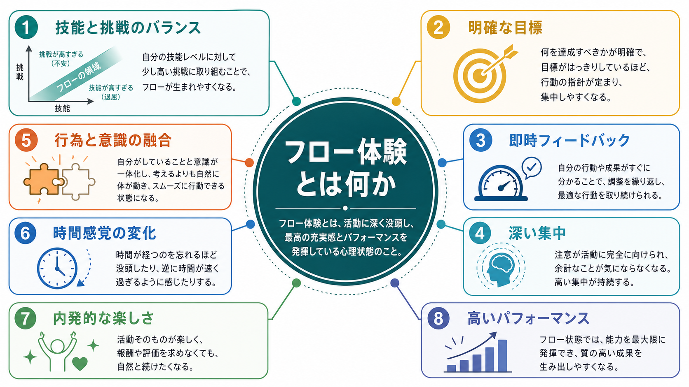
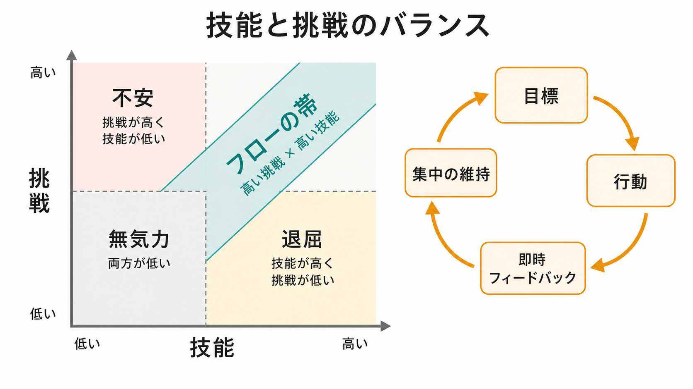
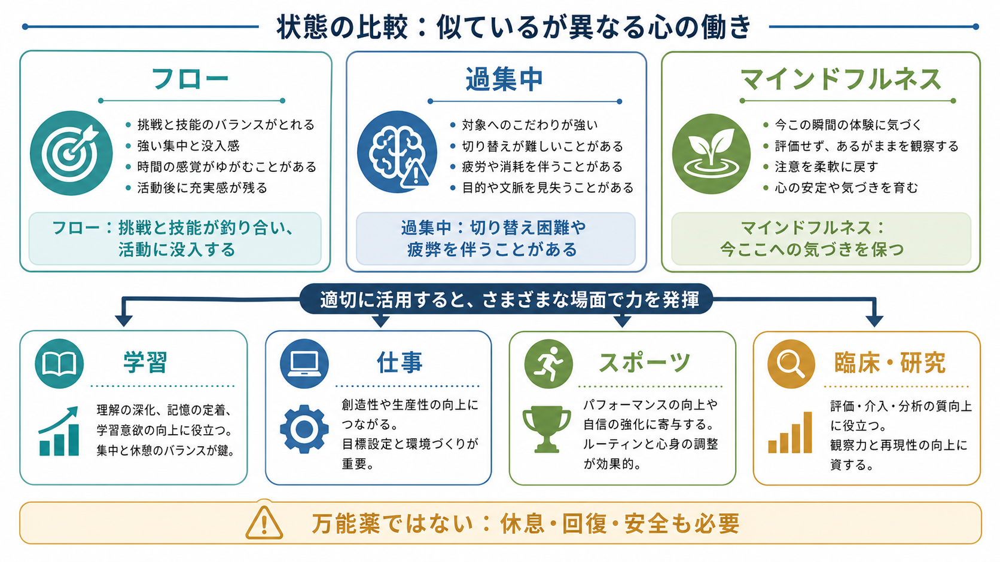

# フロー体験とは何か

## 要点

- フロー体験とは、活動に深く没入し、行為と意識がなめらかに結びつき、時間感覚や自己意識が変化し、高い充実感とパフォーマンスが生じやすい心理状態である [1][2]。
- 最も有名な入口は「技能と挑戦のバランス」である。課題が簡単すぎると退屈になり、難しすぎると不安になりやすい。自分の技能より少し高い挑戦に取り組むと、注意が活動へ集まりやすい [2][3]。
- フローは単なる「楽しい気分」ではない。明確な目標、即時フィードバック、集中を妨げにくい環境、失敗から調整できる余地がそろうと起こりやすい [2][4]。
- 神経科学的には、注意制御、自己参照的思考の低下、報酬系、覚醒水準、青斑核ノルアドレナリン系などとの関連が議論されている。ただし、フロー専用の単一脳部位が見つかったわけではない [5][6]。
- 教育・仕事・スポーツ・リハビリテーション研究で応用されるが、万能薬ではない。休息、回復、安全、社会的条件を無視して「もっと没入せよ」と求める使い方は避ける必要がある [4][8]。

## この記事で答える問い

1. フロー体験とは、どのような心理状態なのか。
2. なぜ技能と挑戦のバランスが重要なのか。
3. フローは集中、内発的動機づけ、マインドフルネス、過集中と何が違うのか。
4. 学習・仕事・スポーツ・臨床研究で、どのように使える概念なのか。

## まず結論

フロー体験は、「自分の技能で何とか届きそうな挑戦」に向かって、明確な目標とフィードバックを手がかりに行動を続けるときに生じやすい没入状態である。楽で受け身な快楽ではなく、活動そのものが報酬になり、注意が課題へ強く結びつく状態と考えると理解しやすい [1][2]。

ただし、フローは「最高の状態をいつでも出せるスイッチ」ではない。個人の技能、課題設計、環境、疲労、文化、測定方法によって変わる。メタ分析では、技能と挑戦のバランスはフローと関連するが、それだけで十分ではなく、明確な目標や統制感も重要であることが示されている [3]。

## 背景

フロー研究は、ミハイ・チクセントミハイが芸術家、登山家、チェスプレイヤー、外科医などの「活動そのものに没頭する経験」を調べたことから広がった。彼は、人が外的報酬だけでなく、活動に深く関わること自体を報酬として感じる状態に注目した [1]。

この視点は、[[内発的動機づけとは何か]]や[[自己決定理論とは何か]]と近い。どちらも「人はなぜ、報酬や罰がなくても学び、試し、熟達しようとするのか」を問う。ただし、自己決定理論が動機づけの質や心理的欲求に焦点を当てるのに対し、フロー理論は活動中の主観的経験、注意、技能と挑戦の関係を中心に扱う。

## 基本概念

### フローの代表的特徴

古典的な整理では、フローには次のような特徴がある [1][2][4]。

| 特徴 | 何が起こっているか |
|---|---|
| 技能と挑戦のバランス | 課題が簡単すぎず、難しすぎず、能力を引き出す水準にある |
| 明確な目標 | 今何をすればよいかが具体的に見えている |
| 即時フィードバック | 行動の結果がすぐ分かり、調整できる |
| 深い集中 | 注意が活動へ集まり、余計な考えが入りにくい |
| 行為と意識の融合 | 「考えてから動く」より、行動が自然につながる感覚がある |
| 自己意識の低下 | 他者評価や自分への過剰な意識が弱まる |
| 時間感覚の変化 | 時間が速く、あるいは遅く感じられる |
| 内発的な楽しさ | 結果だけでなく活動そのものに価値を感じる |

この特徴は、すべてが毎回そろうチェックリストではない。研究によって、前提条件、主観的成分、結果変数の分け方は異なる。近年のレビューでは、フロー研究には定義・測定のばらつきが残っており、比較には注意が必要だと指摘されている [4][8]。

### 技能と挑戦の四象限

フローを理解する最短ルートは、「技能」と「挑戦」を二軸で見ることである。

| 状態 | 典型的な組み合わせ | 起こりやすい経験 |
|---|---|---|
| 無気力 | 挑戦も技能も低い | 関与が弱く、意味や手応えが乏しい |
| 退屈 | 技能は高いが挑戦が低い | 作業が単調で、注意が離れやすい |
| 不安 | 挑戦は高いが技能が低い | 圧倒され、失敗回避に注意が向きやすい |
| フロー | 高い挑戦と高い技能が釣り合う | 集中、没入、統制感、充実感が生じやすい |

ここで重要なのは、フローが「低負荷で楽な状態」ではないことである。むしろ、少し背伸びをする課題に、使える技能を総動員して向かう状態である。[[目標設定は行動をどう変えるのか]]で扱うように、目標が具体的で、進捗が見え、調整可能であるほど、注意は行動へ向かいやすくなる。

## 仕組み

### 1. 課題が注意の向きを決める

明確な目標は、「何を気にすべきか」を決める。たとえば「よい文章を書く」だけでは曖昧だが、「この段落で先行研究と自分の主張の差を説明する」なら、注意の置き場が決まる。フローでは、活動の構造が注意を支える [2]。

この点は[[学習とは何か]]とも関係する。学習は、単に情報を浴びることではなく、予測し、行動し、結果を受け取り、次の行動を調整する過程である。フローが生じやすい課題は、この調整ループが短い。

### 2. フィードバックが行動を調整可能にする

即時フィードバックは、「うまくいっているか」をその場で知らせる。楽器なら音、スポーツなら軌道、プログラミングならテスト結果、臨床訓練なら観察者からの具体的フィードバックがこれに当たる。フィードバックが遅すぎる、曖昧すぎる、人格評価になっている場合、行動調整より不安や防衛が強まりやすい。

この意味で、フローは[[報酬系とは何か]]や[[報酬予測誤差とは何か]]の話とも接続する。行動の結果が予測と少しずれ、そのずれを使って次の行動を改善できるとき、活動は探索と熟達の循環に入りやすい。

### 3. 覚醒水準は高すぎても低すぎてもよくない

神経科学的には、フローは単純なリラックスでも過剰覚醒でもない。van der Linden らは、青斑核ノルアドレナリン系が、課題への関与と離脱の調整に関わる可能性を論じている。フローは中程度の覚醒、強い課題関与、低い自己参照的思考と関連するという見方である [5]。

別のシステマティックレビューでは、フローの神経基盤研究はまだ少なく、EEG、fMRI、fNIRS、tDCS などの方法もばらつくと整理されている [6]。したがって、「フローは前頭葉が止まる」「ドーパミンだけで説明できる」といった単純化は避けた方がよい。

### 4. フローは内発的だが、外的条件にも左右される

フローは活動そのものが楽しいという意味で内発的な性質をもつ。しかし、外的条件と無関係ではない。課題の難易度、時間の余裕、騒音、評価のされ方、失敗の許容度、支援者の関わり方が、フローを起こしやすくも壊しやすくもする [4][8]。

そのため実践では、「本人のやる気が足りない」と解釈するより、課題設計を見直す方が有効である。難しすぎるなら足場かけを入れる。簡単すぎるなら制約や目標を追加する。結果が見えないならフィードバックを短くする。これは[[強化学習とは何か]]で扱う、行動と結果のループを設計する発想に近い。

## 図解

図1は、フローを構成する代表的要素を概念地図として示している。中心にあるのは「活動への深い没頭」であり、それを支える入口として、技能と挑戦のバランス、明確な目標、即時フィードバックがある。

図2は、技能と挑戦の組み合わせを示している。フローは「高い挑戦 × 高い技能」の一点ではなく、技能の伸びに応じて挑戦も少しずつ上がっていく帯として捉えると実践しやすい。

図3は、フローを過集中やマインドフルネスと比較し、学習・仕事・スポーツ・臨床研究への接続をまとめたものである。

## 臨床・研究との接続

教育では、フローは学習者が課題へ能動的に関わる条件を考える手がかりになる。重要なのは「楽しい教材を与える」ことだけではない。学習者の現在の技能に合った挑戦、失敗しても調整できるフィードバック、短い達成単位、意味のある目標を設計することである [3][4]。

仕事やスポーツでは、フローはパフォーマンス、創造性、熟達感と関連して論じられる。ただし、フローが高いほど常に健康的とは限らない。休息が不足し、過剰な成果圧力の中で没入が求められると、消耗や依存的使用につながる可能性がある。近年の研究書では、フローの肯定的側面だけでなく、過剰没入や文脈依存性も扱われている [8]。

臨床・リハビリテーション研究では、フローは活動参加、自己効力感、意味ある行為、回復への関与を考える補助概念になりうる。ただし、個別の診断や治療指示として「フローに入ればよい」と断定してはならない。症状、疲労、疼痛、睡眠、薬物療法、生活環境、対人関係などが活動参加を左右するため、フローは研究・教育目的の補助概念として慎重に使う必要がある。

## よくある誤解

### 誤解1: フローは「楽にできる状態」である

フローは、楽に流される状態ではない。技能を使い切るような挑戦に向かうため、主観的には努力していないように感じても、課題への関与は高い。簡単すぎる課題は、むしろ退屈を生みやすい [2][3]。

### 誤解2: フローは集中力が強い人だけに起こる

個人差はあるが、フローは性格だけで決まらない。課題の明確さ、フィードバック、難易度、環境、支援が大きい。したがって「集中できない人」と決めつけるより、課題構造を調整する方が実践的である [4]。

### 誤解3: フローは過集中と同じである

過集中は、切り替え困難、疲労、生活上の支障を伴うことがある。フローは没入を含むが、活動後に充実感が残り、目標やフィードバックに沿って調整できる点が重要である。両者は似て見える場合があるが、同一視しない方がよい。

### 誤解4: 脳内メカニズムはもう解明済みである

フローの神経相関は研究されているが、まだ発展途上である。EEG 研究では前頭部シータや前頭中心部アルファの組み合わせが報告され、レビューでは報酬系、自己参照ネットワーク、注意制御系、覚醒調整系が議論されている [5][6][7]。しかし、単一の「フロー中枢」があるわけではない。

## 関連ノート

- [[動機づけとは何か]]
- [[内発的動機づけとは何か]]
- [[自己決定理論とは何か]]
- [[目標設定は行動をどう変えるのか]]
- [[学習とは何か]]
- [[報酬系とは何か]]
- [[報酬予測誤差とは何か]]
- [[強化学習とは何か]]
- [[自己効力感は学習にどう影響するのか]]

MOC更新候補: `content/00_MOC/MOC｜認知科学・心理学.md`

## 理解チェック

1. フロー体験が起こりやすい課題は、「簡単な課題」ではなくどのような課題か。
2. 明確な目標と即時フィードバックは、フローにおいてどのような役割をもつか。
3. フローと過集中を区別するとき、どのような点を見るとよいか。
4. フローの神経科学的説明で、単純化しすぎてはいけない点は何か。

## 参考文献

[1] Nakamura, J., & Csikszentmihalyi, M. (2002). The Concept of Flow. In C. R. Snyder & S. J. Lopez (Eds.), *Handbook of Positive Psychology* (pp. 89-105). Oxford University Press. https://doi.org/10.1093/oso/9780195135336.003.0007

[2] Nakamura, J., & Csikszentmihalyi, M. (2020). The Experience of Flow: Theory and Research. In *The Oxford Handbook of Positive Psychology* (3rd ed., pp. 279-296). Oxford University Press. https://doi.org/10.1093/oxfordhb/9780199396511.013.16

[3] Fong, C. J., Zaleski, D. J., & Leach, J. K. (2015). The challenge-skill balance and antecedents of flow: A meta-analytic investigation. *The Journal of Positive Psychology, 10*(5), 425-446. https://doi.org/10.1080/17439760.2014.967799

[4] Peifer, C., Wolters, G., Harmat, L., Heutte, J., Tan, J., Freire, T., Tavares, D., Fonte, C., Andersen, F. O., van den Hout, J., Simlesa, M., Pola, L., Ceja, L., & Triberti, S. (2022). A Scoping Review of Flow Research. *Frontiers in Psychology, 13*, 815665. https://doi.org/10.3389/fpsyg.2022.815665

[5] van der Linden, D., Tops, M., & Bakker, A. B. (2021). The Neuroscience of the Flow State: Involvement of the Locus Coeruleus Norepinephrine System. *Frontiers in Psychology, 12*, 645498. https://doi.org/10.3389/fpsyg.2021.645498

[6] Alameda, C., Sanabria, D., & Ciria, L. F. (2022). The brain in flow: A systematic review on the neural basis of the flow state. *Cortex, 154*, 348-364. https://doi.org/10.1016/j.cortex.2022.06.005

[7] Katahira, K., Yamazaki, Y., Yamaoka, C., Ozaki, H., Nakagawa, S., & Nagata, N. (2018). EEG Correlates of the Flow State: A Combination of Increased Frontal Theta and Moderate Frontocentral Alpha Rhythm in the Mental Arithmetic Task. *Frontiers in Psychology, 9*, 300. https://doi.org/10.3389/fpsyg.2018.00300

[8] Peifer, C., & Engeser, S. (Eds.). (2021). *Advances in Flow Research* (2nd ed.). Springer. https://doi.org/10.1007/978-3-030-53468-4

## 未解決問題

- フローの定義と測定尺度は研究間でばらつくため、研究結果を比較するときにどの構成要素を測っているのかを確認する必要がある。
- フローとパフォーマンス、ウェルビーイング、学習成果の因果関係は、相関研究だけでは判断しにくい。実験研究と縦断研究の蓄積が必要である。
- フローの神経基盤は、注意、報酬、覚醒、自己参照的思考の複数システムが関わる可能性が高く、単一メカニズムへの還元はまだ難しい。
- 臨床・教育実践では、フローを本人の努力不足の説明に使わず、課題設計、支援、休息、安全を含めた環境調整として扱う必要がある。
