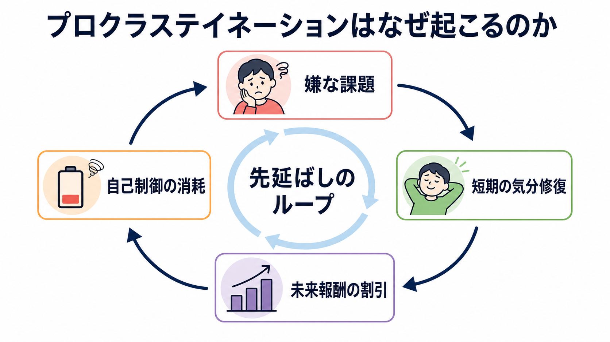
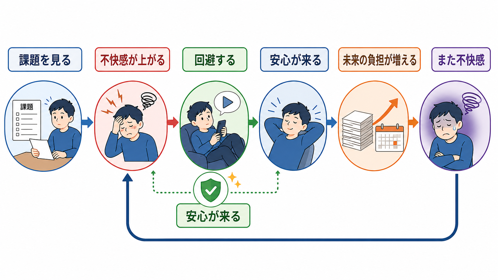
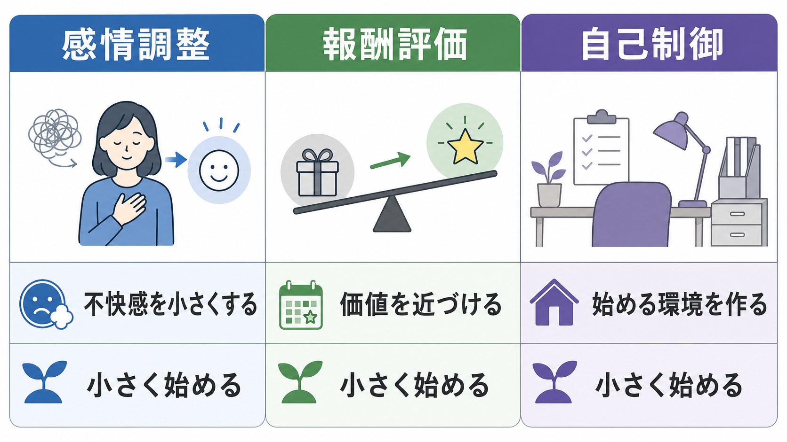

# プロクラステイネーションはなぜ起こるのか

## 要点

- プロクラステイネーションは、単なる怠惰ではなく「やるつもりがあり、遅らせると不利になると分かっているのに遅らせる」自己制御の失敗である [1]。
- 中核には、課題から生じる不快感をすぐ下げたいという短期的な感情調整がある [2]。
- 報酬評価の面では、遠い成果や将来の損失が現在の気分回復より小さく見積もられやすい [1][3]。
- 行動としては、回避によって安心が得られるため、[[回避学習とは何か]]や負の強化に近いループで維持される。
- 臨床・支援では、根性論よりも、課題の不快感を下げ、報酬を近づけ、始める環境を設計する方が実用的である [6]。

## この記事で答える問い

この記事では、プロクラステイネーションを「意思が弱いから起こる」と片づけず、次の問いとして扱う。

1. なぜ不利になると分かっていても、目先の回避を選ぶのか。
2. 感情調整、報酬評価、[[自己制御とは何か]]はどのように絡むのか。
3. 学習・臨床・研究では、どのような支援や測定につながるのか。

## まず結論

プロクラステイネーションは、「未来の自分に損失を送ることで、現在の自分の気分を守る」行動として理解すると分かりやすい。嫌な課題を見ると、不安、退屈、自己評価への脅威、失敗予期が上がる。別の活動へ逃げると、その不快感はすぐに下がる。この即時の安心が強化子になり、次に同じ種類の課題を見たときにも回避が起こりやすくなる [2][4]。

一方で、締切、成績、信頼、健康、睡眠、仕事の質といったコストは、遅れてから現れる。したがって先延ばしは、短期的には「気分を楽にする行動」として働き、長期的にはストレスや負担を増やす自己敗北的な行動になる [4][5]。

## 背景

Steel のメタ分析レビューは、プロクラステイネーションを「意図した行為を自発的に遅らせ、その遅れによって悪い結果になると予期している状態」と定義し、自己制御失敗の代表例として整理した [1]。このレビューでは、課題嫌悪、課題までの遅延、自己効力感、衝動性、誠実性の低さ、注意散漫、組織化の低さが重要な関連要因として示されている [1]。

ここで重要なのは、先延ばしが「やりたくないことをしない」という単純な問題ではない点である。本人はしばしば「やるべきだ」と分かっている。にもかかわらず、課題を始める瞬間に、失敗への不安、退屈さ、面倒さ、完璧にできない感覚、評価される怖さが立ち上がる。つまり、プロクラステイネーションは[[情動と認知は分けられるのか]]という問題とも関係する。

## 基本概念

### 怠惰ではなく時間をまたぐ葛藤

怠惰という言葉は、能力や人格の欠如として問題を固定してしまう。しかし研究上のプロクラステイネーションは、現在の感情、未来の結果、行動選択の葛藤として扱われる。現在の自分にとっては、課題を避けることで気分が改善する。未来の自分にとっては、締切が近づき、選択肢が狭まり、ストレスが増える [2]。

この時間をまたぐ葛藤は、[[時間認知とは何か]]や[[意思決定とは何か]]の問題でもある。未来の報酬や損失は、現在の快・不快より心理的に遠い。だから「後で困る」と理解していても、「今この不快感を下げる」選択が強くなる。

### 感情調整としての先延ばし

Sirois と Pychyl は、プロクラステイネーションを短期的な気分修復の優先として説明した [2]。課題が嫌悪的に感じられると、人は課題そのものよりも、課題によって生じた感情を処理しようとする。SNSを見る、別の雑務をする、寝る、調べ物を続ける、といった行動は、課題解決ではなく不快感の低減として機能する。

この観点では、先延ばしの直接の報酬は「遊び」ではなく「安心」である。回避によって不安や退屈が下がるため、その行動は[[価値学習とは何か]]の対象になる。負の感情が消えること自体が報酬として働く。

## 仕組み

### 1. 課題嫌悪が入口になる

先延ばしされやすい課題は、単に難しい課題ではなく、嫌悪的に感じられる課題である。課題嫌悪には、退屈、曖昧さ、失敗可能性、評価への脅威、完璧主義的基準、必要な手順の多さが含まれる。Steel のレビューでも、課題嫌悪は一貫した関連要因として扱われている [1]。

### 2. 未来の価値が割り引かれる

時間的動機づけ理論では、動機づけは期待、価値、衝動性、遅延の関数として整理される [1][3]。単純化すれば、成功できそうで、価値が高く、すぐ結果が返ってくる行動ほど選ばれやすい。逆に、成果が遠く、報酬が曖昧で、失敗可能性が高く、今は不快な課題は選ばれにくい。

たとえば、論文を書くことの価値は高い。しかし完成という報酬は遠く、最初の1行を書く不快感は近い。スマートフォンを見る報酬は小さいが、即時で確実である。この「小さくても近い報酬」が、「大きいが遠い報酬」を一時的に上回る。

### 3. 自己制御は課題の前で消費される

プロクラステイネーションは、[[実行機能とは何か]]や[[自己制御とは何か]]と深く関係する。行動開始には、注意を保つ、誘惑を抑える、手順を分解する、失敗しても続ける、といった制御が必要である。衝動性が高い、環境に誘惑が多い、睡眠不足やストレスがある、課題が曖昧であると、制御負荷は高くなる。

ここで「やる気が出たら始める」という戦略は弱い。やる気が必要な構造のままだと、課題の入口で毎回強い制御を要求される。支援上は、やる気を待つよりも、入口を小さくし、誘惑を遠ざけ、開始手順を外部化する方が有効である。

### 4. 回避が学習される

課題を避けると、短期的には不安や嫌悪感が下がる。これは[[回避学習とは何か]]の観点からみると、回避行動が負の強化を受ける構造である。先延ばしが習慣化すると、「課題を見る → 不快 → 避ける → 安心」という系列が速く自動化される。

ただし、未来の負担は蓄積する。Tice と Baumeister の縦断研究では、先延ばし傾向のある学生は学期前半にはストレスや病気が少ないように見えるが、学期後半にはストレスや健康問題が増え、成績も低下した [4]。短期の得と長期の損が分離していることが、この行動を分かりにくくしている。

## 図解

次の3つのレバーで見ると、介入点が整理しやすい。

| 観点 | 起こっていること | 実用的な介入点 |
|---|---|---|
| 感情調整 | 課題が不安・退屈・自己評価への脅威を引き起こす | 課題を小分けにする、最初の5分だけにする、自己批判を減らす |
| 報酬評価 | 未来の成果より現在の安心が大きく見える | 進捗を可視化する、即時の小報酬を置く、締切を近づける |
| 自己制御 | 注意・抑制・計画に負荷がかかる | 誘惑を遠ざける、作業場所を固定する、次の一手を前日に書く |

## 臨床・研究との接続

プロクラステイネーションは正式な精神疾患名ではないが、強い苦痛、学業・仕事の障害、睡眠不足、ストレス、自己批判と結びつくことがある。縦断研究では、慢性的な先延ばしが高いストレスを介して健康問題と関連することが示されている [5]。したがって、教育・職場・臨床の文脈では、「本人の性格の問題」と断定せず、ストレス、環境、課題設計、実行機能、併存する不安・抑うつ・ADHD特性などを含めて考える必要がある。

インターネット認知行動療法のランダム化比較試験では、先延ばし困難に対するガイド付き・非ガイド付きセルフヘルプが待機群より改善を示した [6]。ただし、これは個別診断や治療指示ではなく、研究で示された一般的な知見である。強い生活障害や精神症状がある場合は、専門家への相談が適切である。

神経科学的には、先延ばしは単一の「先延ばし中枢」で説明されるものではない。報酬評価には[[ドパミンは報酬だけの物質なのか]]や[[報酬予測誤差とは何か]]に関わるシステムが、感情制御には[[前頭前野は情動制御にどう関わるのか]]が、行動開始には前頭前野・線条体・注意制御が関係する。ADHD特性がある場合には、[[ADHDは前頭線条体回路の障害として説明できるのか]]のような実行機能・報酬遅延の問題とも接続する。

## よくある誤解

### 「締切直前の方が集中できる」は適応的なのか

締切直前に集中できることはある。しかしそれは、締切によって報酬と損失が急に近づき、覚醒水準が上がった結果かもしれない。常にこの方法に頼ると、睡眠、質、余裕、他者との調整が犠牲になりやすい。

### 「自分を責めれば直る」のか

自己批判は一時的に危機感を上げるが、課題に伴う不快感も増やす。Sirois の研究では、先延ばし傾向は低いセルフコンパッションと高いストレスに関連し、セルフコンパッションがストレスとの関係を媒介する可能性が示された [7]。甘やかしではなく、課題に戻れる感情状態を作ることが重要である。

### 「計画を立てれば十分」なのか

計画は必要だが、計画だけでは不十分である。問題は、計画を見た瞬間の不快感、即時報酬への誘惑、開始時の制御負荷にある。したがって、計画は「何をするか」だけでなく、「どこで、いつ、最初に何を開くか」まで具体化する必要がある。

## 関連ノート

- [[自己制御とは何か]]
- [[実行機能とは何か]]
- [[意思決定とは何か]]
- [[時間認知とは何か]]
- [[価値学習とは何か]]
- [[回避学習とは何か]]
- [[内発的動機づけとは何か]]
- [[報酬予測誤差とは何か]]
- [[前頭前野は情動制御にどう関わるのか]]
- [[ADHDは前頭線条体回路の障害として説明できるのか]]

## MOC更新候補

- `content/00_MOC/MOC｜キャリア・学習法.md`
- 認知科学・心理学系のMOCが統合ジョブで更新される場合は、学習・動機づけ、自己制御、実行機能、意思決定の周辺ノートとして追加候補。

## 理解チェック

1. プロクラステイネーションが「短期的には合理的に感じられる」のはなぜか。
2. 感情調整としての先延ばしと、報酬評価としての先延ばしはどう違うか。
3. 先延ばしを減らすとき、「やる気を出す」より先に変えられる環境要因は何か。
4. 先延ばしが健康やストレスと結びつく経路には何があるか。

## 未解決問題

- 感情調整、報酬割引、実行機能のどれが主要因かは、個人・課題・文脈によって異なる。
- 先延ばしの介入研究は増えているが、長期効果、臨床群、職場・学校での実装研究はさらに必要である。
- スマートフォン、リモートワーク、常時接続環境が先延ばしの報酬構造をどう変えているかは、現代的な研究課題である [8]。

## 参考文献

[1] Steel, P. (2007). The nature of procrastination: A meta-analytic and theoretical review of quintessential self-regulatory failure. *Psychological Bulletin, 133*(1), 65-94. https://doi.org/10.1037/0033-2909.133.1.65

[2] Sirois, F. M., & Pychyl, T. A. (2013). Procrastination and the priority of short-term mood regulation: Consequences for future self. *Social and Personality Psychology Compass, 7*(2), 115-127. https://doi.org/10.1111/spc3.12011

[3] Steel, P., & Konig, C. J. (2006). Integrating theories of motivation. *Academy of Management Review, 31*(4), 889-913. https://doi.org/10.2307/20159257

[4] Tice, D. M., & Baumeister, R. F. (1997). Longitudinal study of procrastination, performance, stress, and health: The costs and benefits of dawdling. *Psychological Science, 8*(6), 454-458. https://doi.org/10.1111/j.1467-9280.1997.tb00460.x

[5] Sirois, F. M., Stride, C. B., & Pychyl, T. A. (2023). Procrastination and health: A longitudinal test of the roles of stress and health behaviours. *British Journal of Health Psychology, 28*(3), 860-875. https://doi.org/10.1111/bjhp.12658

[6] Rozental, A., Forsell, E., Svensson, A., Andersson, G., & Carlbring, P. (2015). Internet-based cognitive-behavior therapy for procrastination: A randomized controlled trial. *Journal of Consulting and Clinical Psychology, 83*(4), 808-824. https://doi.org/10.1037/ccp0000023

[7] Sirois, F. M. (2014). Procrastination and stress: Exploring the role of self-compassion. *Self and Identity, 13*(2), 128-145. https://doi.org/10.1080/15298868.2013.763404

[8] Sirois, F. M. (2023). Procrastination and stress: A conceptual review of why context matters. *International Journal of Environmental Research and Public Health, 20*(6), 5031. https://doi.org/10.3390/ijerph20065031
