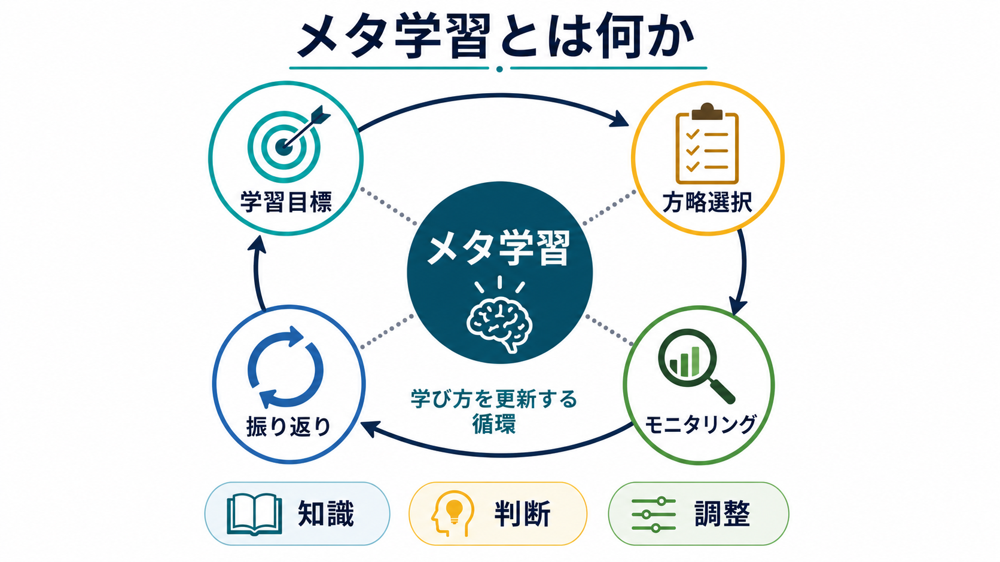
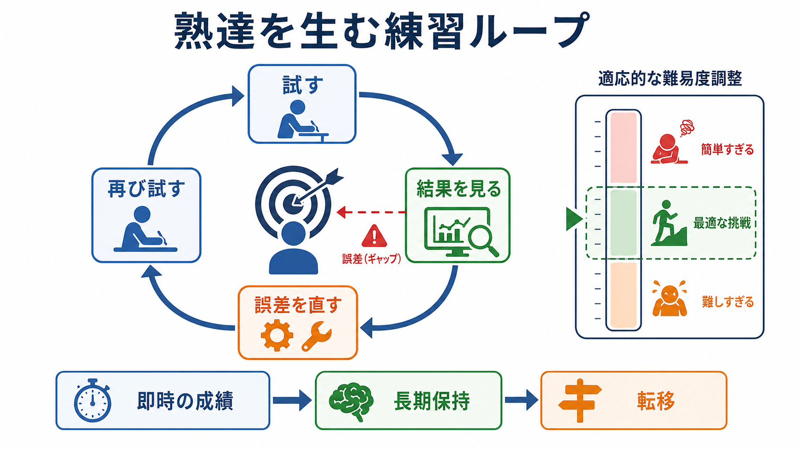
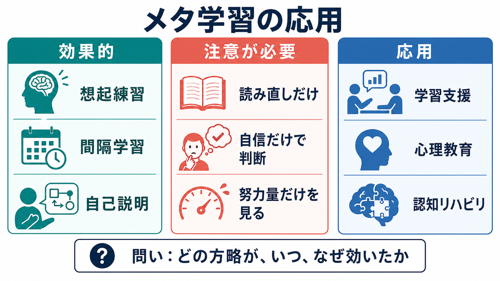

# メタ学習とは何か

## 要点

- メタ学習とは、単に多く学ぶことではなく、「自分はどの条件で、どの方略を使うと、どのように学べるのか」を観察し、学び方そのものを更新する能力である。
- 中核には、[[メタ認知とは何か|メタ認知]]、自己調整学習、学習方略、動機づけ、感情調整がある。自己調整学習の主要モデルでは、学習は「見通し、実行、モニタリング、振り返り」の循環として扱われる[1][2]。
- 効果的なメタ学習は、「理解した気がする」という主観だけでなく、想起できるか、転移できるか、時間をおいて保持されるかを手がかりにする[3][4]。
- 臨床・支援場面では、個人に診断や治療を指示する概念ではなく、学習支援、心理教育、認知リハビリテーションで「自分の認知特性に合う方略を見つける」ための枠組みとして使える[7][8]。

## この記事で答える問い

1. メタ学習は、[[学習とは何か|学習]]やメタ認知と何が違うのか。
2. どのような仕組みで「学び方」が改善されるのか。
3. 効果的な学習方略を選ぶには、何を観察すればよいのか。
4. 教育・臨床・研究では、どのような注意点があるのか。

## まず結論

メタ学習は、「学習内容」ではなく「学習のしかた」を対象にした学習である。たとえば英単語を覚えることは学習だが、「自分は読み直しよりもテスト形式の想起練習で保持がよくなる」「短時間を毎日分けた方が、直前の長時間学習よりも忘れにくい」と気づき、次回の計画を変えることはメタ学習である。

この意味で、メタ学習は[[メタ認知とは何か|メタ認知]]と重なるが、同一ではない。メタ認知は「自分の認知を知り、監視し、制御すること」に広く関わる。メタ学習はそのうち、学習課題において方略選択、進捗判断、誤差検出、方略更新へ向かう側面を強調する。自己調整学習の研究では、この循環は、目標設定、方略使用、自己観察、自己評価、次の計画の調整として整理されてきた[1][2]。

## 背景

学習を「努力量」だけで説明すると、なぜ同じ時間をかけても成果が違うのかを説明しにくい。教育心理学では、学習者が自分の理解状態をどの程度正確に見積もれるか、課題に合った方略を選べるか、結果を見て方略を修正できるかが重要だと考えられてきた[1][5]。

Flavell の古典的整理では、メタ認知は、認知についての知識と認知のモニタリングを含む領域として提案された[5]。その後、自己調整学習の研究は、学習者が目標、方略、動機づけ、感情、環境を調整しながら学ぶ過程を扱うようになった[1][2]。したがって、メタ学習は「頭のよさ」や「学習意欲」の別名ではなく、観察可能で訓練可能な方略調整の能力として捉える方が実用的である。

## 基本概念

### 学習とメタ学習

[[学習とは何か|学習]]は、経験によって知識、技能、行動、予測が比較的持続的に変化する過程である。メタ学習は、その変化を生み出す方法を学ぶ過程である。内容レベルでは「何を覚えたか」が問われる。メタレベルでは「どの条件で覚えやすかったか」「どの手がかりは当てになったか」「次回は何を変えるべきか」が問われる。

### メタ認知

メタ認知は、自分の記憶、理解、注意、問題解決を対象化する働きである[5]。メタ学習では、メタ認知は主に二つの形で現れる。第一に、自分がどの程度理解しているかを見積もるモニタリングである。第二に、その見積もりにもとづいて方略や時間配分を変えるコントロールである[6]。

### 自己調整学習

自己調整学習は、学習者が認知、動機づけ、行動、環境を能動的に調整する過程である[1][2]。Zimmerman の循環モデルでは、学習はおおまかに、事前の見通し、遂行中の自己制御、事後の自己省察として説明される[1]。メタ学習は、この循環から「次にどう学ぶか」という更新を取り出して見る概念である。

### 学習方略

方略には、読み直し、要約、下線引き、想起練習、分散学習、自己説明、交互練習などがある。レビュー研究では、想起練習と分散学習は比較的強い効果が見込まれる一方、下線引きや単なる読み直しは、使い方によっては理解した感覚を高めても長期保持を十分に支えないことがある[3]。メタ学習では、一般論を覚えるだけでなく、「この課題、この時期、この学習者にとって何が機能したか」を検証する。

## 仕組み

メタ学習の最小単位は、予測、実行、結果、誤差、更新のループである。

1. 予測: どの方略が効きそうか、どれくらい時間が必要かを見積もる。
2. 実行: 実際に方略を使う。
3. 結果: テスト、説明、課題遂行、時間をおいた再生などで結果を見る。
4. 誤差検出: 予測と結果のずれを確認する。
5. 更新: 次の目標、方略、時間配分、環境調整を変える。

このループで重要なのは、主観的な流暢性と実際の保持を分けることである。学習直後に「わかりやすい」と感じる教材や、何度も読み返して見慣れた情報は、理解できたという感覚を生みやすい。しかし、あとで何も見ずに説明できるか、別の問題に使えるか、時間をおいて思い出せるかは別問題である[3][4]。

## 図解

図1は、メタ学習を「学習目標、方略選択、モニタリング、振り返り」の循環として示している。学び方を更新するには、知識を増やすだけでなく、現在の判断が妥当かを確かめ、次の調整に結びつける必要がある。

図2は、メタ学習を「試す、結果を見る、誤差を直す、再び試す」という循環として示している。中心にあるのは、学習者が自分の目標と現在地のずれを見つけ、次の行動を調整することだ。右側の難易度調整は、簡単すぎる課題でも難しすぎる課題でもメタ学習が起こりにくいことを表す。

図3は、実践上の区別を示している。想起練習、間隔学習、自己説明は、長期保持や理解を支えやすい方略として扱われる。一方で、読み直しだけ、自信だけで判断すること、努力量だけを見ることは、メタ学習の手がかりとしては不十分になりやすい[3][4]。

## 臨床・研究との接続

教育場面では、メタ学習は「学習者に自分で考えさせる」という抽象的な助言ではなく、記録、予測、確認、振り返りを具体化する支援として設計できる。たとえば、学習前に「今回の方略」と「予想得点」を書き、学習後に「実際の想起率」と「次に変える点」を比べるだけでも、主観的な自信と実際の成績のずれに気づきやすくなる。

研究では、自己報告だけに頼ると、学習者が実際にどの方略を使ったか、いつモニタリングしたかを取り違える可能性がある。Veenman らは、メタ認知を測るには、質問紙、行動指標、発話プロトコル、課題成績などを区別して扱う必要があると論じている[6]。これは、メタ学習を「よい態度」ではなく、測定と介入の対象として扱うために重要である。

臨床・リハビリテーションとの接続では、メタ学習は認知機能の弱さを本人の努力不足に還元するための概念ではない。統合失調症などに対する認知リメディエーション研究では、認知訓練は認知成績や機能改善に小から中程度の効果を示すが、機能改善には補助的なリハビリテーションや方略的支援が関わると報告されている[8]。したがって、臨床応用では「もっと頑張る」ではなく、課題の難易度、フィードバック、環境、支援者との振り返りを含めて設計する必要がある。

## よくある誤解

### 誤解1: メタ学習は勉強法の一覧を覚えること

勉強法を知ることは出発点にすぎない。メタ学習の中心は、方略の名前を増やすことではなく、方略と結果の関係を観察して、自分の次の行動を変えることである。

### 誤解2: 自信があれば学べている

自信は重要だが、理解や保持の正確な指標とは限らない。[[自己効力感は学習にどう影響するのか|自己効力感]]は挑戦や持続を支える一方、過信は復習不足や難易度の過小評価につながることがある。自信は、想起テストや説明可能性と組み合わせて読む必要がある[4]。

### 誤解3: 努力量が多いほどメタ学習できている

努力量は大切だが、努力の向きがずれていることもある。長時間の読み直しで「見慣れた」感覚が増えても、想起や転移が改善しない場合がある[3]。メタ学習では、時間だけでなく、方略、間隔、難易度、フィードバックの質を見る。

### 誤解4: メタ学習はすべて個人の責任である

メタ学習は個人内の能力だけでなく、課題設計、評価方法、教師や支援者からのフィードバック、学習環境に左右される。自己調整学習の研究でも、認知だけでなく動機づけ、感情、文脈が重要な構成要素として扱われる[2]。

## 関連ノート

- [[メタ認知とは何か]]
- [[学習とは何か]]
- [[自己効力感は学習にどう影響するのか]]
- [[目標設定は行動をどう変えるのか]]
- [[強化学習とは何か]]
- [[探索と活用のジレンマとは何か]]

MOC更新候補: `content/00_MOC/` 配下の認知科学・心理学系 MOC、学習・動機づけ系 MOC がある場合に追加する。

今後の作成候補: 自己調整学習とは何か、想起練習とは何か、間隔学習とは何か、学習方略とは何か。

## 理解チェック

1. ある学習者が「読み直すと安心するが、翌日の小テストで思い出せない」と気づいた。この気づきをメタ学習につなげるには、次に何を記録すればよいか。
2. 「自信」と「実際の理解」がずれる場面には、どのようなものがあるか。
3. 想起練習や間隔学習が有効だとしても、すべての課題で同じように使えばよいとは限らない。なぜか。
4. メタ学習を個人の努力不足に還元しないためには、どのような環境要因を見る必要があるか。

## 未解決問題

- メタ学習の改善が、どの程度まで課題を越えて転移するのかは、課題領域や発達段階によって異なる可能性がある。
- 自己報告、行動ログ、成績、発話データが示す「メタ学習」は一致しない場合がある。測定方法の違いを明示する必要がある[6]。
- 臨床応用では、認知機能、疲労、不安、睡眠、環境調整、支援資源を含めた設計が必要であり、一般的な学習法をそのまま個別支援に当てはめることはできない。

## 参考文献

[1] Zimmerman, B. J. (2002). Becoming a self-regulated learner: An overview. *Theory Into Practice, 41*(2), 64-70. https://doi.org/10.1207/S15430421TIP4102_2

[2] Panadero, E. (2017). A review of self-regulated learning: Six models and four directions for research. *Frontiers in Psychology, 8*, 422. https://doi.org/10.3389/fpsyg.2017.00422

[3] Dunlosky, J., Rawson, K. A., Marsh, E. J., Nathan, M. J., & Willingham, D. T. (2013). Improving students' learning with effective learning techniques: Promising directions from cognitive and educational psychology. *Psychological Science in the Public Interest, 14*(1), 4-58. https://doi.org/10.1177/1529100612453266

[4] Kornell, N., & Bjork, R. A. (2007). The promise and perils of self-regulated study. *Psychonomic Bulletin & Review, 14*(2), 219-224. https://doi.org/10.3758/BF03194055

[5] Flavell, J. H. (1979). Metacognition and cognitive monitoring: A new area of cognitive-developmental inquiry. *American Psychologist, 34*(10), 906-911. https://doi.org/10.1037/0003-066X.34.10.906

[6] Veenman, M. V. J., Van Hout-Wolters, B. H. A. M., & Afflerbach, P. (2006). Metacognition and learning: Conceptual and methodological considerations. *Metacognition and Learning, 1*, 3-14. https://doi.org/10.1007/s11409-006-6893-0

[7] National Academies of Sciences, Engineering, and Medicine. (2018). *How People Learn II: Learners, Contexts, and Cultures*. The National Academies Press. https://doi.org/10.17226/24783

[8] Wykes, T., Huddy, V., Cellard, C., McGurk, S. R., & Czobor, P. (2011). A meta-analysis of cognitive remediation for schizophrenia: Methodology and effect sizes. *American Journal of Psychiatry, 168*(5), 472-485. https://doi.org/10.1176/appi.ajp.2010.10060855
