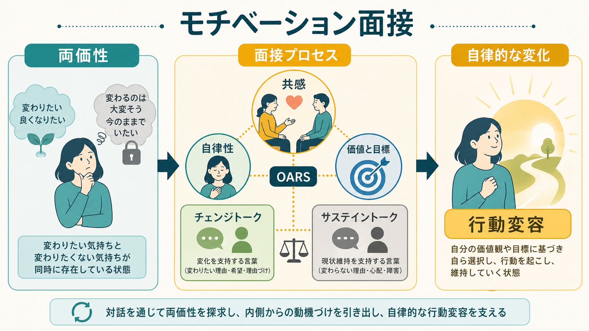
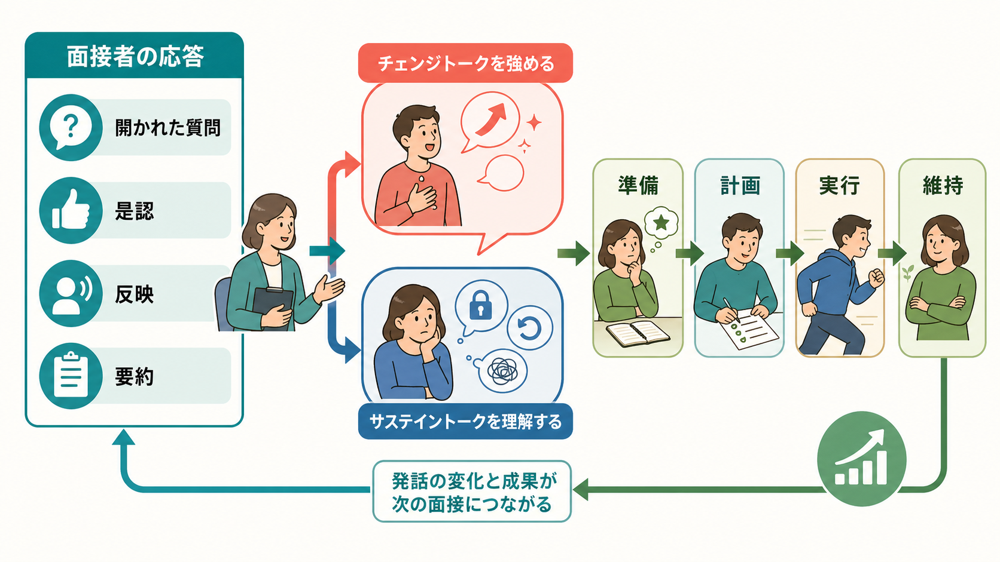
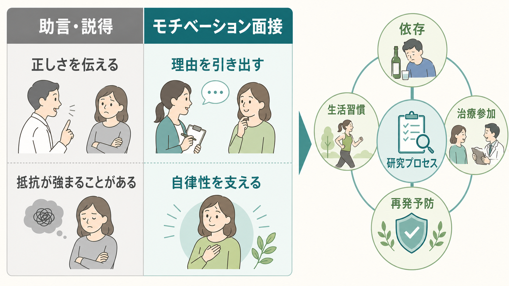

# モチベーション面接は行動変容をどう支えるのか

## 要点

- モチベーション面接（motivational interviewing; MI）は、説得で相手を押す技法ではなく、本人の価値・目標・懸念から変化の理由を引き出す協働的な面接スタイルである [1][2]。
- 中心にあるのは、変わりたい気持ちと変わりたくない気持ちが同時に存在する「両価性」である。MI は両価性を欠陥ではなく、行動変容の自然な出発点として扱う [1]。
- 機序としては、共感的な関係性と、チェンジトークを引き出し強める技術的成分が重視される [2][3]。
- 効果研究では、医療・依存・健康行動などで有用性が示される一方、対象行動、介入強度、比較条件によって効果の大きさは変わる [6][7]。
- MI は個別診断や治療指示ではなく、教育・研究・臨床実践を理解するための枠組みとして読むのが適切である。

## この記事で答える問い

この記事では、[[行動変容はどのように起こるのか]]という大きな問いの中で、モチベーション面接が何を変えているのかを整理する。具体的には、次の問いに答える。

1. MI はなぜ「正しい助言」だけでは動かない場面で役に立つのか。
2. 両価性、チェンジトーク、サステイントークは何を意味するのか。
3. MI は[[自己決定理論とは何か]]や[[内発的動機づけとは何か]]とどう接続するのか。
4. 研究上、どこまで有効性が確かめられており、どこに限界があるのか。

## まず結論

モチベーション面接は、行動変容を「相手を納得させること」ではなく、「本人がすでに持っている価値、心配、希望、理由を会話の中で明確にすること」として扱う。面接者は、開かれた質問、是認、反映、要約を用いて、本人の語りを丁寧に聴き返す。すると、本人は「変わるべき理由を外から言われる」のではなく、「自分がなぜ変わりたいのか」を自分の言葉で述べやすくなる [1][2]。

このとき重要なのは、サステイントークを消すことではない。現状維持の理由、心配、障害を理解しながら、チェンジトークが出てきたときにそれを深める。MI は、抵抗を力で押し返すよりも、会話の方向を少しずつ変え、本人の自律性を損なわずに準備、計画、実行へ橋をかける方法である [3][5]。

## 背景

健康行動、依存、服薬、リハビリテーション、学習、生活習慣では、「何が望ましいか」を知っていても行動が変わらないことが多い。これは知識不足だけの問題ではない。短期的な快適さ、失敗への不安、周囲の圧力、習慣、報酬、自己効力感、価値観の葛藤が重なるからである。したがって、行動変容の支援では、情報提供だけでなく、本人がその行動を自分の問題として扱えるようになる過程が重要になる。

MI はもともと依存症領域で発展したが、現在は医療、保健、心理支援、教育、司法、福祉など広い領域で応用されている。SAMHSA の TIP 35 では、動機づけを固定した性格特性ではなく、対話、環境、支援関係の中で変化する動的過程として扱う [1]。この見方は、[[動機づけとは何か]]を「強さ」だけでなく「方向づけ」と「質」から捉える視点に近い。

## 基本概念

### 両価性

両価性とは、同じ行動について「変わりたい」と「変わりたくない」が同時に存在する状態である。たとえば、飲酒を減らしたい人が、健康への心配を語りながらも、飲酒がストレス対処や人間関係の一部になっていると感じることがある。この矛盾は非合理性ではなく、人が複数の価値と報酬の間で調整していることの表れである。

MI では、両価性を早く解決しようとして説得するのではなく、両側の言葉を聴き分ける。現状維持の理由を十分に理解したうえで、本人自身の変化の理由、必要性、能力、願望、コミットメントが語られる場面を丁寧に広げていく [1][2]。

### チェンジトークとサステイントーク

チェンジトークとは、変化を支持する本人の発話である。「このままではまずい」「子どもと過ごす時間を増やしたい」「少しなら始められそうだ」といった言葉が含まれる。サステイントークとは、現状維持を支持する発話である。「今は無理だ」「これが唯一の息抜きだ」「失敗したら余計につらい」といった言葉である。

重要なのは、チェンジトークを面接者が代わりに言うのではなく、本人が自分の言葉として言うことである。MI の理論では、面接者の応答がクライエントの発話を変え、その発話の変化が行動変容の近位メカニズムになると考えられている [2][3]。

### OARS

OARS は、開かれた質問、是認、反映、要約の頭文字である。これは技法の一覧というより、会話の姿勢を行動として表す道具である。

| 技法 | 役割 | 例 |
|---|---|---|
| 開かれた質問 | 本人の見方を広げる | 「変えたいと思う理由はどこにありますか」 |
| 是認 | 努力・価値・強みを言語化する | 「ここまで考えてきたこと自体が大事な一歩です」 |
| 反映 | 発話の意味を聴き返す | 「健康は気になるけれど、今の対処法を手放すのも不安なのですね」 |
| 要約 | 複数の発話を整理する | 「変えたい理由と、続けている理由の両方がはっきりしてきました」 |

## 仕組み

### 1. 関係性の成分

MI の第一の成分は、共感、受容、協働、尊重である。ここでの共感は、相手に同意することではない。相手の経験が、その人の文脈ではどのように成り立っているのかを理解しようとする姿勢である。Miller と Rose は、MI の作用機序を、関係性の成分と技術的成分の組み合わせとして整理している [2]。

関係性が弱いと、同じ助言でも「評価された」「操作された」と受け取られやすい。逆に、本人の自律性が守られていると、難しい情報や不快なフィードバックも、自分で検討する余地が生まれる。これは[[自己決定理論とは何か]]でいう自律性支援と重なる [5]。

### 2. 技術的成分

第二の成分は、チェンジトークを引き出し、深め、要約し、計画へ結びつける技術である。MI では、面接者が変化の理由を大量に述べるほどよいわけではない。むしろ、本人が発した変化の理由を反映し、具体化し、本人の価値とつなげることが重視される。

Apodaca と Longabaugh のレビューは、MI の機序研究では、面接者の MI 一貫性、クライエントのチェンジトーク、コミットメント言語などが重要な候補として扱われてきたことを整理している [3]。Magill らの研究でも、面接内の発話が変化計画の完了と関係することが検討されている [4]。

### 3. WHY から HOW への移行

MI で難しいのは、動機づけを高める会話から、実際の計画へ移るタイミングである。早すぎる計画化は押しつけになり、遅すぎると行動への橋がかからない。Resnicow と McMaster は、MI を自律性支援と関連づけながら、なぜ変わるのかという WHY の会話から、どう変わるのかという HOW の会話へ移る枠組みを示している [5]。

ここで重要なのは、計画も本人の所有物であることだ。面接者は「次はこれをしてください」と指示するよりも、「どの選択肢なら現実的ですか」「最初の一歩は何にしますか」「障害が出たときはどう戻れますか」と問い、[[目標設定は行動をどう変えるのか]]や[[習慣形成にはどのような条件が必要なのか]]で扱う実行設計へ接続する。

## 図解

3 枚の図は、MI の全体像、会話内メカニズム、助言・説得との違いを示している。図だけで理解すると、「チェンジトークを増やせばよい」と単純化しやすいが、実際にはサステイントークを尊重して聴くことも同じくらい重要である。現状維持の理由を否定しないからこそ、本人は変化の理由も安全に検討できる。

## 臨床・研究との接続

医療場面でのシステマティックレビューとメタ分析では、MI は多様な健康関連アウトカムで小から中程度の効果を示す一方、効果は介入の質、比較条件、アウトカムの種類によって異なる [6]。禁煙に関する Cochrane レビューでは、MI が禁煙を支援する可能性が検討されているが、効果の確実性や介入強度の解釈には注意が必要である [7]。

したがって、MI は万能な「やる気を出させる方法」ではない。効果を考えるには、誰が、どの訓練を受け、どの対象者に、どの時間・頻度で、どのアウトカムを目標に行ったのかを見る必要がある。また、依存や精神疾患、身体疾患が関わる場合、MI は専門的評価、医学的治療、心理社会的支援と組み合わせて位置づけるべきであり、単独で診断や治療方針を決めるものではない。

研究上の面白さは、MI が「面接者が何を言ったか」だけでなく、「その応答がクライエントの発話をどう変えたか」を測定対象にする点にある。これは、心理療法研究におけるプロセス研究、会話分析、自然言語処理、臨床訓練評価とも接続しやすい。

## よくある誤解

### 誤解1: MI は相手をうまく説得する技術である

MI は説得の包装ではない。本人の自律性を尊重し、変化の理由を本人の言葉として引き出す方法である。操作的に使うと、MI の中心である協働性と自律性支援が失われる。

### 誤解2: 助言してはいけない

MI は情報提供を禁じていない。重要なのは、許可を取り、相手の理解を確認し、中立的に情報を提供し、その情報を本人がどう受け取るかを尋ねることである [1][5]。

### 誤解3: サステイントークは止めるべきである

サステイントークは抵抗の証拠ではなく、本人にとって現状維持がどのような機能を持つかを示す情報である。急いで否定すると、防衛や反発が強まることがある。まず理解し、そのうえで変化の理由が出てくる余地を作る。

### 誤解4: MI は短時間なら誰でも同じようにできる

OARS は覚えやすいが、熟練には訓練、フィードバック、逐語記録や録音に基づく振り返りが必要である。MI らしい言葉を使っていても、実際には説得や評価になっていることがある。

## 関連ノート

既存ノート:

- [[行動変容はどのように起こるのか]]
- [[動機づけとは何か]]
- [[内発的動機づけとは何か]]
- [[外発的動機づけとは何か]]
- [[自己決定理論とは何か]]
- [[自己効力感は学習にどう影響するのか]]
- [[目標設定は行動をどう変えるのか]]
- [[習慣形成にはどのような条件が必要なのか]]
- [[行動活性化とは何か]]

今後の作成候補:

- チェンジトークとは何か
- サステイントークとは何か
- OARS とは何か
- 臨床面接における自律性支援とは何か

MOC 更新候補:

- `content/00_MOC/` 配下の認知科学・心理学、行動変容、臨床心理学関連 MOC に追加する。
- 並列実行時の衝突を避けるため、このタスクでは MOC 本体を更新しない。

## 理解チェック

1. 両価性を「抵抗」ではなく「変化の出発点」と見ると、面接者の応答はどう変わるか。
2. チェンジトークとサステイントークを、それぞれ自分の言葉で説明できるか。
3. OARS のうち、反映と要約はどのようにチェンジトークを強めるか。
4. MI と[[自己決定理論とは何か]]は、どの点で接続し、どの点で同一ではないか。
5. MI の効果研究を読むとき、対象行動、比較条件、介入者の訓練を確認する必要があるのはなぜか。

## 参考文献

[1] Substance Abuse and Mental Health Services Administration. (2019). *Enhancing Motivation for Change in Substance Use Disorder Treatment: Updated 2019* (Treatment Improvement Protocol Series, No. 35). Rockville, MD: SAMHSA. https://www.ncbi.nlm.nih.gov/books/NBK571071/

[2] Miller, W. R., & Rose, G. S. (2009). Toward a theory of motivational interviewing. *American Psychologist, 64*(6), 527-537. https://doi.org/10.1037/a0016830

[3] Apodaca, T. R., & Longabaugh, R. (2009). Mechanisms of change in motivational interviewing: A review and preliminary evaluation of the evidence. *Addiction, 104*(5), 705-715. https://doi.org/10.1111/j.1360-0443.2009.02527.x

[4] Magill, M., Apodaca, T. R., Barnett, N. P., & Monti, P. M. (2010). The route to change: Within-session predictors of change plan completion in a motivational interview. *Journal of Substance Abuse Treatment, 38*(3), 299-305. https://doi.org/10.1016/j.jsat.2009.12.001

[5] Resnicow, K., & McMaster, F. (2012). Motivational interviewing: Moving from why to how with autonomy support. *International Journal of Behavioral Nutrition and Physical Activity, 9*, 19. https://doi.org/10.1186/1479-5868-9-19

[6] Lundahl, B., Moleni, T., Burke, B. L., Butters, R., Tollefson, D., Butler, C., & Rollnick, S. (2013). Motivational interviewing in medical care settings: A systematic review and meta-analysis of randomized controlled trials. *Patient Education and Counseling, 93*(2), 157-168. https://doi.org/10.1016/j.pec.2013.07.012

[7] Lindson, N., Thompson, T. P., Ferrey, A., Lambert, J. D., & Aveyard, P. (2019). Motivational interviewing for smoking cessation. *Cochrane Database of Systematic Reviews, 2019*(7), CD006936. https://doi.org/10.1002/14651858.CD006936.pub4

[8] Ryan, R. M., & Deci, E. L. (2000). Self-determination theory and the facilitation of intrinsic motivation, social development, and well-being. *American Psychologist, 55*(1), 68-78. https://doi.org/10.1037/0003-066X.55.1.68

## 未解決問題

- チェンジトークの量、強度、タイミングのうち、どれが行動変容を最もよく予測するのかは、対象領域によって異なる可能性がある。
- MI の訓練効果を、面接者の自己報告ではなく、録音・逐語・アウトカムでどこまで精密に評価できるかが課題である。
- 文化、言語、権力関係、制度的制約が、自律性支援としての MI の受け取られ方にどう影響するかは、さらに検討が必要である。
